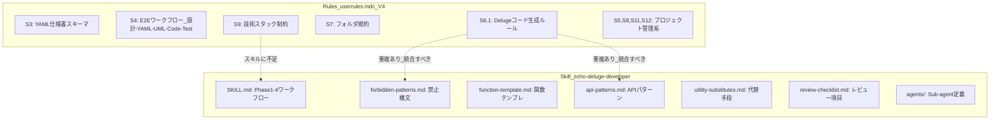

# Deluge スキル改善計画

## 現状分析

### Rules と Skill の役割分担（現状）

### 問題点

1. **Rules の S6.1（コード生成ルール）に、スキル側に反映されていない実践的知識がある**
  - `sendmail` の `from` にはリテラルのみ使用可（変数不可）-- これは forbidden-patterns にはあるが Rules にも記述
  - `invokeUrl[...].toString()` のパターン
  - Deluge に `sleep`/`wait` がない制約と対処法
  - 定数の外部化（`zoho.crm.getOrgVariable` への移行指針）
  - YAML ステップ ID をコードコメントにトレースする規約
2. **Rules の S9（技術スタック制約）がスキルに含まれていない**
  - API レート制限への対処
  - 実行時間制限の意識
  - プラットフォーム制約の一覧
3. **スキルが「YAML 仕様書からコードを生成する」フローを知らない**
  - Rules S3 の YAML スキーマ理解
  - YAML の `steps` → Deluge コードの変換規約

---

## 改善方針

**原則**: Rules はプロジェクトプロセス管理に特化させ、Deluge の技術的ナレッジはスキルに集約する。

### 1. スキルに追加する内容（Rules S6.1 + S9 から抽出）

新規リファレンスファイルを作成:

`**references/deluge/platform-constraints.md`**（新規）

- Deluge に存在しない機能（sleep/wait、真のマルチスレッド等）
- API レート制限（invokeurl 回数制限、同時実行数）
- 実行時間制限（ワークフロー/ボタン/スケジュールごと）
- sendmail の制約（from はリテラルのみ）
- ファイル操作の制約

`**references/deluge/yaml-to-code.md`**（新規）

- YAML 仕様書（S3スキーマ）からの変換規約
- `steps[].id` をコードコメントにマッピングする方法
- `branching_logic` → if-else 構造への変換
- `error_handling` → try-catch パターンへの変換
- `hardcoded_elements` → `zoho.crm.getOrgVariable` への外部化パターン

### 2. 既存ファイルの強化

`**references/deluge/forbidden-patterns.md**` に追加:

- `sendmail` の `from` に変数を使うのは禁止（既にあるが、Rules からの追加例で補強）
- invokeurl の `parameters` は `.toString()` 必須の明記

`**references/shared/review-checklist.md**` に追加:

- YAML ステップ ID のトレーサビリティ確認
- 定数外部化（hardcoded elements）の確認
- プラットフォーム制約違反のチェック

### 3. SKILL.md の Phase 1 に YAML 対応を追加

現在の Phase 1（要件整理）に以下を追加:

- 「YAML 仕様書が提供された場合」の分岐
- YAML の `steps` から成功基準を自動抽出するガイダンス
- `references/deluge/yaml-to-code.md` への参照

### 4. agents/script-writer.md の更新

- 新規リファレンス（`platform-constraints.md`, `yaml-to-code.md`）を参照リソースに追加
- YAML ステップ ID をコメントに含める指示を追加

---

## 重複 V4.2 ルールについて

Settings 画面の「User」タブに **「Cursor AI User Rules V4.2 – プロジェクト構造対応版」が2つ** 表示されている件:

- **片方を削除して問題ない**（内容が同一であれば重複は不要）
- 削除方法: Cursor Settings → Rules, Skills, Subagents → 「User」タブ → 該当ルールをクリック → 削除
- 残す1つが正常に動作することを確認後、もう片方を消す

また、現在 `.cursor/rules/userrules.mdc` にある V4（YAML-Centric）は、フロントマターが `alwaysApply: false` になっており、自動適用されていない点にも注意。必要に応じて `alwaysApply: true` に変更するか、V4.2 との統合を検討する。

---

## ファイル変更一覧

| 操作   | ファイル                                                                                           | 内容                                 |
| ---- | ---------------------------------------------------------------------------------------------- | ---------------------------------- |
| 新規作成 | `C:\Users\user\.claude\skills\zoho-deluge-developer\references\deluge\platform-constraints.md` | プラットフォーム制約集                        |
| 新規作成 | `C:\Users\user\.claude\skills\zoho-deluge-developer\references\deluge\yaml-to-code.md`         | YAML→Deluge変換規約                    |
| 編集   | `C:\Users\user\.claude\skills\zoho-deluge-developer\SKILL.md`                                  | Phase 1 に YAML 対応分岐を追加、参照リソース一覧を更新 |
| 編集   | `C:\Users\user\.claude\skills\zoho-deluge-developer\agents\script-writer.md`                   | 新規リファレンスへの参照追加                     |
| 編集   | `C:\Users\user\.claude\skills\zoho-deluge-developer\references\shared\review-checklist.md`     | トレーサビリティ・外部化・制約チェック追加              |
| 編集   | `C:\Users\user\.claude\skills\zoho-deluge-developer\references\deluge\forbidden-patterns.md`   | 軽微な補強                              |
| 手動   | Cursor Settings → User Rules                                                                   | V4.2 の重複を1つ削除                      |

