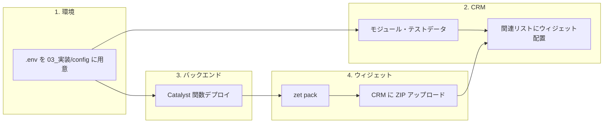

# demo3 環境向け .env 配置とマッチングウィジェット導入計画

## 1. .env の置き場所・形式（結論）

**スキルで対応する:** **zoho-api-access** スキルに従い、.env の形式・変数名を統一する。

- **置き場所:** 既存の **[03_実装/config/.env](開発試作/CRM-AI-Matching-PoC/03_実装/config/)** のまま（新規フォルダ不要）。demo3 用の値はここに記載する。
- **変数名・形式:** スキルで定義されている **ZOHO_CLIENT_ID / ZOHO_CLIENT_SECRET / ZOHO_ORG_ID / ZOHO_DC** の4値（＋本PoC用に OPENAI_*, PINECONE_*）を使用。スキルに合わせれば、他プロジェクトやツール（例: zoho-api.mjs）との一貫性が保てる。
- [setup_crm_modules.py](開発試作/CRM-AI-Matching-PoC/02_テスト/scripts/setup_crm_modules.py) は現状 `ZOHO_ACCOUNTS_URL` / `ZOHO_API_DOMAIN` を任意で読んでいるが、未設定時は `https://accounts.zoho.jp` / `https://www.zohoapis.jp` を使用。**ZOHO_DC=jp** を入れればスキルと同じDC運用になる（必要ならスクリプト側で DC から URL を導出する改修も可能）。

---

## 2. .env に必要な変数（demo3 用・zoho-api-access スキル準拠）

**zoho-api-access** スキルで定義されている .env テンプレートに合わせる。


| 変数名                  | 用途                       | 備考                 |
| -------------------- | ------------------------ | ------------------ |
| `ZOHO_CLIENT_ID`     | OAuth Client Credentials | スキル「.env テンプレート」参照 |
| `ZOHO_CLIENT_SECRET` | 同上                       | 同上                 |
| `ZOHO_ORG_ID`        | 組織ID（soid）               | demo3: 90001202404 |
| `ZOHO_DC`            | データセンター                  | jp（小文字）            |
| `OPENAI_API_KEY`     | マッチング理由生成                | 本PoC用・既存のまま        |
| `PINECONE`_*         | ベクトル検索                   | 本PoC用・既存のまま        |


`ZOHO_ACCOUNTS_URL` / `ZOHO_API_DOMAIN` はスキルでは ZOHO_DC から導出するため、未設定でよい（setup_crm_modules.py の既定値で jp として動作）。

**実施内容:**

- [03_実装/config/.env.example](開発試作/CRM-AI-Matching-PoC/03_実装/config/.env.example) に、スキルと揃えて `ZOHO_CLIENT_ID` / `ZOHO_CLIENT_SECRET` / `ZOHO_DC` を追加する。
- 実際の値は **リポジトリにコミットせず**、ローカルの `03_実装/config/.env` にのみ記載する。

---

## 3. テスト用タブ・項目の設定（進行手順）

「テスト用タブ・項目」= CRM の **JobSeekers / Jobs モジュール** と **関連リストウィジェット** の設定と理解した。

### 3.1 モジュール・フィールド・テストデータ

- **方法A（推奨）:** `.env` に demo3 の Client ID / Client Secret / 組織ID を設定したうえで、以下を実行する。

```powershell
  cd "開発試作\CRM-AI-Matching-PoC\02_テスト\scripts"
  python setup_crm_modules.py
  

```

- JobSeekers・Jobs モジュールが無ければ作成し、テストレコード（求職者3件・求人3件）を投入する。
- **方法B:** [setup-guide.md](開発試作/CRM-AI-Matching-PoC/01_計画/setup-guide.md) の「2. CRMモジュール作成（GUI）」に従い、手動でモジュールとフィールド（API名: Name, Skills, Experience_Years 等）を作成し、必要なら手動でテストデータを登録する。

### 3.2 関連リスト（タブ）の設定

- **設定 > カスタマイズ > モジュールとフィールド > JobSeekers**  
  - 関連リスト > 新しい関連リスト（ウィジェット）  
  - ウィジェット: AI Matching Widget、関連リスト名: **おすすめ求人**
- **同様に Jobs**  
  - 関連リスト名: **おすすめ候補者**

これで「テスト用タブ・項目」が揃う。

---

## 4. demo 環境への進行手順（整理）

全体の流れを次の順で整理する。




| 順                                                                                                                                                                               | 作業                                                                                                      | 参照・メモ |
| ------------------------------------------------------------------------------------------------------------------------------------------------------------------------------- | ------------------------------------------------------------------------------------------------------- | ----- |
| 1                                                                                                                                                                               | **.env 作成**                                                                                             |       |
| `03_実装/config/.env` に Client ID / Client Secret / 組織ID（90001202404）および OpenAI / Pinecone を記載                                                                                    | .env.example をコピーして編集。シークレットはコミットしない                                                                    |       |
| 2                                                                                                                                                                               | **CRM モジュール・テストデータ**                                                                                    |       |
| `02_テスト/scripts/setup_crm_modules.py` を実行、または GUI で手動作成                                                                                                                         | 上記「3. テスト用タブ・項目」                                                                                        |       |
| 3                                                                                                                                                                               | **Catalyst 関数**                                                                                         |       |
| demo3 用 Catalyst プロジェクトで関数をデプロイし、環境変数に .env 相当（OPENAI_*, PINECONE_*）を設定                                                                                                         | [setup-guide.md](開発試作/CRM-AI-Matching-PoC/01_計画/setup-guide.md) セクション 3。ZIP アップロードまたは `catalyst deploy` |       |
| 4                                                                                                                                                                               | **ウィジェットの API URL**                                                                                     |       |
| [02_テスト/crm-widget/app/js/main.js](開発試作/CRM-AI-Matching-PoC/02_テスト/crm-widget/app/js/main.js) の `CONFIG.SEARCH_URL` を、demo3 でデプロイした Catalyst 関数の URL に変更。`MOCK_MODE: false` に変更 | 現在は開発環境の URL と MOCK_MODE: true                                                                          |       |
| 5                                                                                                                                                                               | **ウィジェット パック・アップロード**                                                                                   |       |
| `02_テスト/crm-widget` で `zet pack` し、生成された ZIP を CRM（demo3）の「ウィジェットを作成」からアップロード                                                                                                   | setup-guide セクション 4.3–4.4                                                                               |       |
| 6                                                                                                                                                                               | **関連リストに配置**                                                                                            |       |
| JobSeekers / Jobs の関連リストに「AI Matching Widget」を追加（おすすめ求人 / おすすめ候補者）                                                                                                              | 上記「3.2」                                                                                                 |       |


---

## 5. ドキュメントの更新案

- **zoho-api-access スキル**を .env の一次参照とする。置き場所は本プロジェクトでは `03_実装/config/.env`。
- **[01_計画/setup-guide.md](開発試作/CRM-AI-Matching-PoC/01_計画/setup-guide.md)**  
  - 「1.2 事前準備」に「.env は zoho-api-access スキルのテンプレートに従い、`03_実装/config/.env` に配置」と追記。
- **[03_実装/config/.env.example](開発試作/CRM-AI-Matching-PoC/03_実装/config/.env.example)**  
  - スキル準拠で `ZOHO_CLIENT_ID` / `ZOHO_CLIENT_SECRET` / `ZOHO_ORG_ID` / `ZOHO_DC` を追加（スキル「.env テンプレート（シンプル構成）」を流用可）。

---

## 6. セキュリティ注意

- Client Secret は **チャット履歴やドキュメントに残さない**。手元の `03_実装/config/.env` にのみ記載する。
- `.env` は既に .gitignore 対象のため、コミットされないことを確認すればよい。

---

## まとめ


| 項目            | 内容                                                                                                                            |
| ------------- | ----------------------------------------------------------------------------------------------------------------------------- |
| .env の置き場所・形式 | **03_実装/config/.env**（既存のまま）。変数名・形式は **zoho-api-access スキル**に準拠（ZOHO_CLIENT_ID / ZOHO_CLIENT_SECRET / ZOHO_ORG_ID / ZOHO_DC）。 |
| テスト用タブ・項目     | setup_crm_modules.py 実行で JobSeekers/Jobs とテストデータ作成 → CRM で関連リスト「おすすめ求人」「おすすめ候補者」を追加                                           |
| demo 進行手順     | .env 作成 → CRM モジュール・データ → Catalyst デプロイ → ウィジェット CONFIG 更新 → zet pack → アップロード → 関連リスト配置                                      |


この方針で進めれば、demo3 にマッチングウィジェットを入れるまでの一連の流れが再現可能になる。