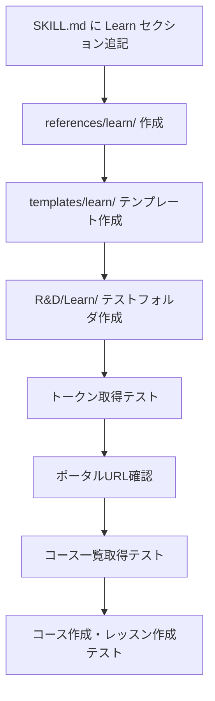

# Zoho Learn スキル増設 & 実装テスト計画

## 作業全体像

## Phase 1: スキル増設

### 1-1. `SKILL.md` への追記

- **ファイル**: `C:\Users\user\.claude\skills\zoho-setup\SKILL.md`
- サービス別自動化戦略テーブルに `Zoho Learn` 行を追加
- 「サービス別リファレンス参照」セクションに Zoho Learn エントリ追加
- 「セットアップ手順」セクションに Learn の手順追加
- 注意事項リストに Learn 固有の制約を追記
- トリガーキーワードに `Zoho Learn`, `LMS API`, `コース作成API` 等を追加

### 1-2. `references/learn/api-reference.md` 新規作成

全エンドポイント一覧（添付 SKILL.md の内容を整理）:

- Base URL（DCごと）
- OAuthスコープ一覧
- LMS API: コース・レッスン・メンバー・レポート・問題バンク
- KB API: 未公開エンドポイント（推定パターン）
- エラーコード表

### 1-3. `references/learn/workflow.md` 新規作成

- 認証フロー（Client Credentials で soid: `ZohoLearn.{ORG_ID}` を試す）
- LMS セットアップフロー（ポータル確認→コース作成→レッスン→メンバー登録）
- KB セットアップ（未公開API注意事項・DevTools調査手順）
- CRM連携パターン（Deluge コード例）

### 1-4. `templates/learn/zoho-learn-api.mjs` 新規作成

- `zoho-auth.js` パターンと統一した Node.js ヘルパー
- `.env` の `ZOHO_DATA_CENTER` キー（`ZOHO_DC` と別名）を両方サポート
- `getLearnPortalUrl()` で JPポータルURL を自動検出
- コース一覧・作成・レッスン作成・メンバー追加の関数を実装

## Phase 2: 実装テスト

### テスト配置場所

`c:\Users\user\Desktop\kotarosan\03_Internal\02_R&D\Learn\`

### 実行スクリプト構成

- `zoho-learn-test.mjs` — メインテストスクリプト
- `package.json` — `node-fetch`, `dotenv`

### テストシナリオ（順序あり）

1. **Step 1**: トークン取得（`soid: ZohoLearn.{ORG_ID}`, scope: `ZohoLearn.course.READ`）
2. **Step 2**: コース一覧 `GET /portal/<portalUrl>/course` — ポータルURL を `.env` か実行時に確認
3. **Step 3**: コース作成 `POST /portal/<portalUrl>/course`（テスト用コース）
4. **Step 4**: レッスン作成 `POST /portal/<portalUrl>/course/<id>/lesson`
5. **Step 5**: コースレポート `GET /portal/<portalUrl>/course/<id>/status`

## 重要な技術的注意点

- `.env` の変数名が `ZOHO_DATA_CENTER`（`ZOHO_DC` でなく）→ パース時に両方対応
- Zoho Learn の JP ベースURL: `https://learn.zoho.jp/learn/api/v1/`
- ポータルURL は `learn.zoho.jp` にアクセスして画面から確認するか、テスト実行時に尋ねる
- Client Credentials Flow での `ZohoLearn.`* スコープ取得が可能かどうかは実機で検証（テスト Step 1 で確認）
- KB API（記事・マニュアル・スペース）は公式未公開のため、テストはLMS系APIのみ対象

## 変更ファイル一覧

- **追記**: `C:\Users\user\.claude\skills\zoho-setup\SKILL.md`
- **新規**: `C:\Users\user\.claude\skills\zoho-setup\references\learn\api-reference.md`
- **新規**: `C:\Users\user\.claude\skills\zoho-setup\references\learn\workflow.md`
- **新規**: `C:\Users\user\.claude\skills\zoho-setup\templates\learn\zoho-learn-api.mjs`
- **新規**: `c:\Users\user\Desktop\kotarosan\03_Internal\02_R&D\Learn\package.json`
- **新規**: `c:\Users\user\Desktop\kotarosan\03_Internal\02_R&D\Learn\zoho-learn-test.mjs`

