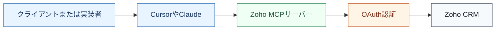
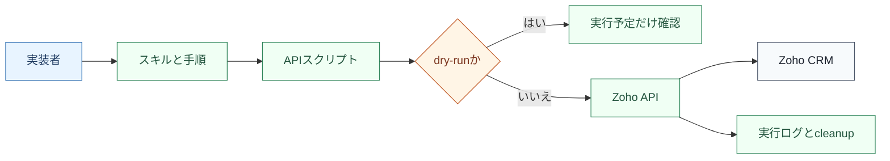
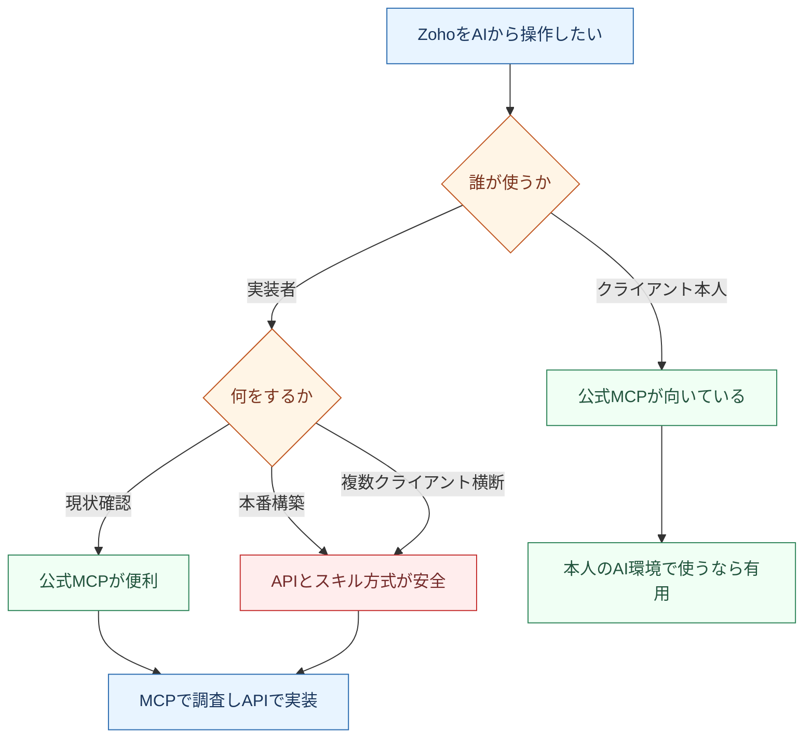
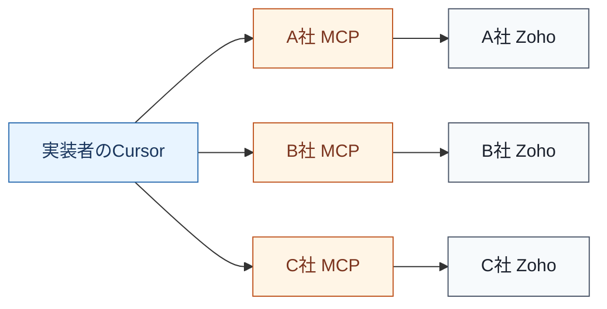
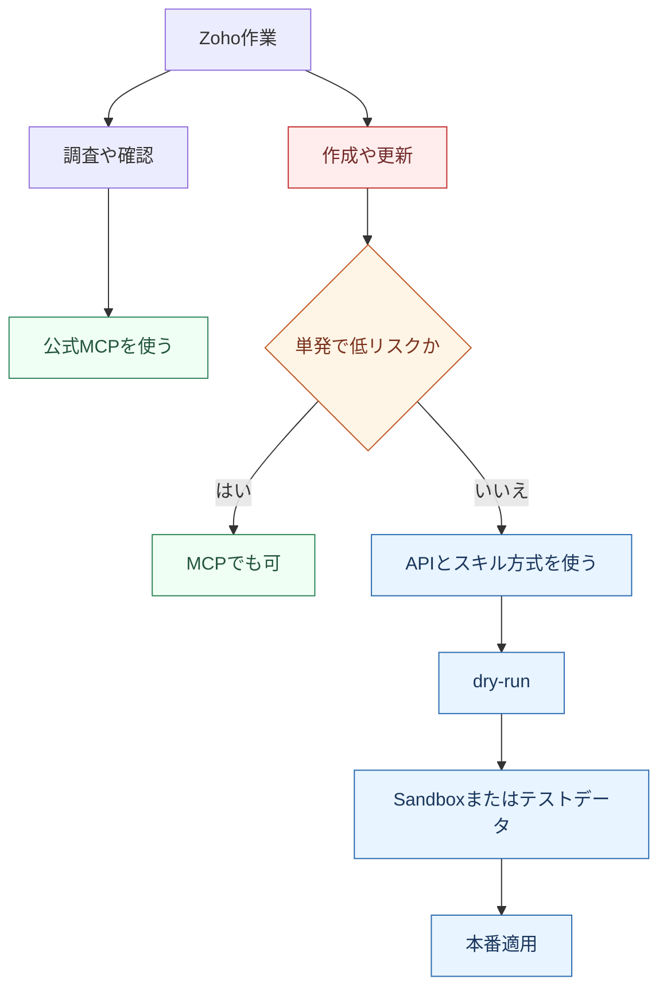

# Zoho公式MCP vs 現行API経由 比較レポート

作成日: 2026-04-27
対象: CursorからZoho CRMへアクセスする方法の比較
目的: Zoho公式MCPを実務で使うべきか、現行のAPI/スキル方式と比較して判断する

## 先に結論

Zoho公式MCPは、**クライアント本人が自分のAIツールからZohoを触る用途**や、**実装者がCRMの現状を軽く調査する用途**にはかなり有用です。実機でも、MCPサーバー作成、Cursor接続、OAuth、読み取り、短命レコードの作成と削除まで通りました。

一方で、**実装者が複数クライアントの環境をCursorで横断して構築する主軸**としては、現行のAPI/スキル方式の方が安全です。理由は、クライアントごとにMCPサーバーURLとOAuth認証が必要になり、誤接続や誤書き込みのリスクが上がるためです。また、公式MCPには現行APIハーネスのようなdry-runがありません。

推奨方針は、**公式MCPは読み取り調査と軽作業に使い、本番構築・検証・納品作業は現行API/スキル方式を継続する**です。

## 何を比較したか

今回比較したのは、次の2つです。

| 方式 | ざっくり言うと | 主な利用者 |
|---|---|---|
| Zoho公式MCP | Zohoが用意したAI接続口をCursorやClaudeにつなぐ方法 | クライアント本人、AI利用者、軽い調査をする実装者 |
| 現行API/スキル方式 | スキルやスクリプトでAPIリクエスト手順を固定して実行する方法 | 実装者、保守担当、納品作業者 |

## 仕組みの違い

### Zoho公式MCPの仕組み

ポイント:

- Zoho MCPコンソールでサーバーを作る。
- CursorやClaudeにMCP URLを登録する。
- 利用時にOAuthで認証する。
- AIがMCPツールを選んでZoho CRMを操作する。

### 現行API/スキル方式の仕組み

ポイント:

- 実装手順をスキルやスクリプトに固定する。
- 書き込み前にdry-runできる。
- SandboxやOrg IDを明示的に切り替えられる。
- 実行ログとcleanupを設計しやすい。

## 実機検証結果

### 公式MCPで確認できたこと

| 検証項目 | 結果 | 補足 |
|---|---:|---|
| Zoho MCPコンソールへのアクセス | 成功 | `mcp.zoho.jp` にログイン済み状態で到達 |
| 公式MCPサーバー作成 | 成功 | `CRM-Data-Metadata` と `Contact-Hub` を作成 |
| Cursor向け接続設定 | 成功 | `npx mcp-remote ... --transport http-only` 形式 |
| OAuth認証 | 成功 | `Authorization on Demand` で認証 |
| ツール一覧取得 | 成功 | `CRM-Data-Metadata` は15ツール |
| モジュール一覧取得 | 成功 | 103モジュール取得 |
| Leads項目一覧取得 | 成功 | 69項目取得 |
| Leads件数取得 | 成功 | 件数取得成功 |
| 短命Contact作成 | 成功 | テスト用レコードのみ作成 |
| 短命Contact削除 | 成功 | 削除後の残骸検索は0件 |

### 注意点

- `CRM-Data-Metadata` は読み取りだけでなく `createRecords` / `updateRecord` / `upsertRecords` も含む。
- ただし `CRM-Data-Metadata` には `deleteRecords` がないため、作成したものを同じMCPサーバー内で削除できない。
- `Contact-Hub` には `createRecords` と `deleteRecords` があり、作成から削除までの安全な往復検証ができた。
- テンプレートごとに使えるツールが違うため、作成前にTools一覧を見る必要がある。

## 非エンジニア向けの見方

要するに、MCPは「AIからZohoを直接触れる入口」として便利です。ただし、実装者が複数社の環境を扱う場合は、入口が便利な分だけ、どの会社のZohoにつながっているかを間違えない管理が重要になります。

## 実装者視点で使いづらい点

### 1. クライアントごとに認証が必要

公式MCPは、基本的にMCPサーバーURLとOAuth認証がセットです。複数クライアントを持つ実装者が使う場合、クライアントごとに接続先を分ける必要があります。

この状態になると、実装者側では次のリスクが出ます。

- 接続先を取り違える。
- CursorのMCP一覧が増えて管理しづらい。
- OAuthの有効期限や再認証で作業が止まる。
- 顧客ごとの権限管理を別途ルール化する必要がある。
- MCP URLがパスワード相当なので、共有・保管・削除の運用が必要になる。

### 2. dry-runがない

公式MCPは便利ですが、実行すると基本的にZohoに反映されます。現行API方式のように「書き込まずに、どんなリクエストになるかだけ確認する」dry-runがありません。

これは本番構築では大きな差です。

### 3. モデルの判断に依存する

MCPは、AIがツール一覧を見て「どのツールを呼ぶか」を判断します。簡単な読み取りでは問題ありませんが、複数ステップのCRM構築では、モデルの推論力に依存します。

安価なモデルでは、次のようなミスが起きやすいです。

- 作成ツールはあるが削除ツールがないサーバーで書き込みを始める。
- 本番とSandboxを取り違える。
- cleanup前提のない作業を進める。
- ツール名が似ているものを選び間違える。

## 比較表

| 観点 | Zoho公式MCP | 現行API/スキル方式 | 判断 |
|---|---|---|---|
| 初期調査 | モジュール・項目・件数をすぐ見られる | スクリプト実行が必要 | MCPが便利 |
| 非エンジニア利用 | 自然言語で使いやすい | 実装者向け | MCPが便利 |
| クライアント本人の利用 | 自分のAIに接続して使える | 不向き | MCPが便利 |
| 複数クライアント管理 | 認証とURLが増えて煩雑 | Org IDやenvで切替可能 | API/スキルが安全 |
| 本番構築 | dry-runなしで危険 | dry-runとログ化が可能 | API/スキルが安全 |
| 再現性 | AIのツール選択に依存 | 手順を固定できる | API/スキルが安全 |
| cleanup | テンプレート依存 | 自前で設計可能 | API/スキルが安全 |
| 権限管理 | OAuthでユーザー権限に追従 | Client Credentialsで明示制御 | 用途次第 |
| 運用負荷 | 顧客ごとに接続管理が必要 | スクリプト管理が必要 | 実装者はAPI/スキルが楽 |
| 安価モデル適性 | 複雑作業は不安 | 手順固定で安定しやすい | API/スキルが安全 |

## 推奨する使い分け

推奨:

- **クライアント本人が自分のAIからZohoを見る**: 公式MCP
- **実装者が現状調査をする**: 公式MCP
- **実装者が本番構築する**: 現行API/スキル方式
- **複数クライアントを横断して作業する**: 現行API/スキル方式
- **MCPで書き込みをする場合**: Sandboxまたは短命テストデータに限定
