# etika社内向け｜AI生成コード「本番品質100%」フレームワーク

**前提**: 社員4名、全員がCursor / Claude Code等のAIツールを業務で使用
**到達目標**: AI生成コード（Vibe Coding）を、本番運用に耐える「100%品質」にまで引き上げる組織能力を、3年計画で構築する
**設計思想**: セキュリティ単軸ではなく、品質を多次元で捉える。Vibe DrivenからSpec Drivenへ反転させる。人間レビューに加えツール拡張で関門を多段化する

---

## 1. なぜ「100%品質」を目指すのか

### Vibe Codingの現実（2025〜2026年）

| ソース | 数値 |
|---|---|
| Veracode 2025 | AI生成コードの **45%** がOWASP Top 10脆弱性を含む |
| Zhao et al. 2025 | 機能的に正しいAI生成コードの **80%以上** にセキュリティ脆弱性 |
| CodeRabbit 2025 | 認証情報ハードコード混入率は人間コードの **約2倍** |
| Georgia Tech 2026.3 | 1ヶ月で **35件のCVE** がAI生成コード起因 |

ここで重要なのは、上記は**セキュリティだけ**の数字。正確性・保守性・テスト・運用・コスト・AI特有の問題を含めると、**「本番に出してよいAI生成コード」は実測でほぼ存在しない**。

### 「100%品質」が意味するもの

「動く」と「本番に出してよい」は別の状態。100%品質とは、その隔たりを構造的に埋める仕組み。

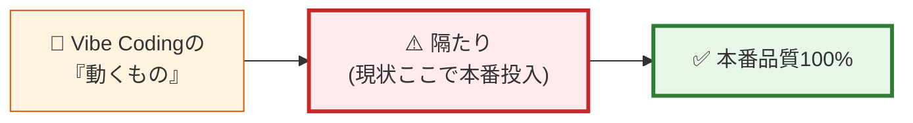

---

## 2. 「100%品質」の多次元モデル

Qiita記事の六カ条にAI特有軸を加えた**7軸モデル**として定義する。

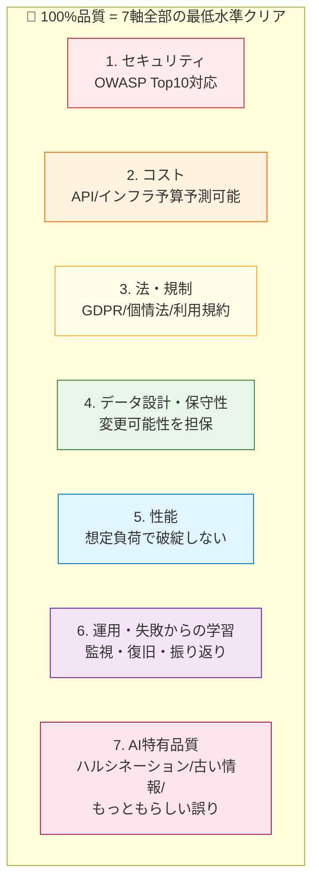

### 7軸 × チェック観点

| 軸 | 主な観点 | AI生成コードでの典型的な落とし穴 |
|---|---|---|
| **1. セキュリティ** | 認証認可、IDOR、入力検証、シークレット管理、XSS/CSRF/SQLi、CORS | サーバー側認可チェック忘れ、シークレット直書き |
| **2. コスト** | API課金、無限ループ、ストレージ累積、ハードリミット | LLM APIの再帰呼び出し、Firestoreの読み取り爆発 |
| **3. 法・規制** | 個人情報保護法、GDPR、業法、ライセンス、著作権 | スクレイピングの利用規約違反、GPL汚染 |
| **4. データ設計・保守性** | スキーマ変更可能性、エンティティ整理、削除戦略、可読性、DRY | テーブル構造の即興、後で変えられない型選択 |
| **5. 性能** | N+1問題、インデックス、Big O、コネクションプール、CDN | ループ内クエリ、SELECT *、ページネーション欠落 |
| **6. 運用・学習** | 監視、ロギング、アラート、インシデント振り返り | ログ未設計、エラー握りつぶし、復旧手順なし |
| **7. AI特有品質** | ハルシネーションされたライブラリ、古いAPI、もっともらしいが誤った実装、プロンプトインジェクション耐性 | 存在しないパッケージ、廃止されたAPI、エッジケース未考慮 |

---

## 3. 思想の反転 ｜ Vibe Driven → Spec Driven

### 違い

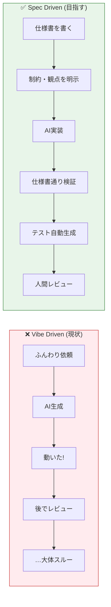

### Spec Driven の3層構造

| 層 | 内容 | etikaでの実装手段 |
|---|---|---|
| **Constitution層** | 譲れない品質憲法（OWASP対応、シークレット禁止、IDOR必須等） | etika全体のCursor Rules、共通SKILL.md |
| **Domain Spec層** | 業務領域ごとの仕様（Zoho、決済、認証等） | 業務領域別SKILL.md、ADR (Architecture Decision Record) |
| **Task Spec層** | 個別タスクの仕様（このAPI、この画面） | プロンプト前のミニ仕様、PRテンプレートの「目的・制約」欄 |

**etikaの既存資産が直接効く領域**。Claude Code Skills、Cursor Rules、SKILL.mdライブラリは、まさにこのSpec Driven の物理的実装。これを **etika全体の品質憲法** として整備し直すのが、ブラッシュアップの中核。

---

## 4. 関門の多段化 ｜ 人間 + ツール拡張

100%品質では人間レビューだけが関門ではマズい。多段ゲート化する。

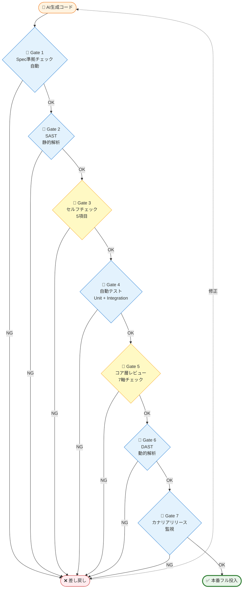

🚪青枠 = ツール自動 ／ 🚪黄枠 = 人間判断

| Gate | 何をチェック | ツール例 |
|---|---|---|
| **G1: Spec準拠** | Cursor Rules / SKILL.md の制約に違反していないか | Claude Code Hook、Cursor Rules |
| **G2: SAST** | 静的解析でセキュリティ脆弱性検出 | Snyk Code、Semgrep、CodeQL |
| **G3: セルフチェック** | 開発者が5項目を確認（シークレット等） | PRテンプレート |
| **G4: 自動テスト** | Unit、Integration、契約テスト | Jest、Vitest、Playwright |
| **G5: コア層レビュー** | 7軸 + ビジネス文脈での妥当性 | コードレビュー |
| **G6: DAST** | 動作中アプリへの動的解析 | OWASP ZAP、Invicti |
| **G7: カナリア** | 本番の一部に投入し挙動監視 | Vercel Preview、Cloudflare、監視ツール |

### 4名規模での現実解

すべてを最初から導入は不可能。Year別に段階導入する（後述）。Year 1で**最低 G1, G3, G5** は機能させる。

---

## 5. 7軸 × 学習リソース マッピング

### 軸ごとの主要教材

| 軸 | 必読書／コース | 価格 | 担当Tier |
|---|---|---|---|
| **1. セキュリティ** | 徳丸本 第2版 + 徳丸基礎試験 | ¥3,520 + ¥10,000 | コア層 |
|  | OWASP Top 10:2025 + Cheat Sheets | 無料 | 全員 |
| **2. コスト** | クラウド請求最適化のブログ／公式ドキュメント | 無料 | コア層 |
|  | 各サービスの課金単位を業務で使う前に確認するルール | — | 全員 |
| **3. 法・規制** | 個人情報保護法 ガイドライン（個人情報保護委員会） | 無料 | コア層 + 代表 |
|  | GDPR Quick Reference / IPA「安全なウェブサイトの作り方」 | 無料 | コア層 |
| **4. データ設計・保守性** | リーダブルコード（O'Reilly） | ¥2,640 | 全員 |
|  | リファクタリング 第2版（Fowler） | ¥4,840 | コア層 |
|  | エリック・エヴァンスのドメイン駆動設計 | ¥5,720 | コア層上位 |
| **5. 性能** | Designing Data-Intensive Applications（Kleppmann、英語） | $50 | コア層上位 |
|  | データベースリファクタリング | ¥4,180 | コア層 |
| **6. 運用・学習** | 入門 監視（Mike Julian） | ¥2,640 | コア層 |
|  | SRE サイトリライアビリティエンジニアリング | ¥3,960 | コア層上位 |
| **7. AI特有品質** | Constitutional Spec-Driven Development（arXiv 2602.02584） | 無料 | コア層 |
|  | Vibe Security Radar（月次） | 無料 | 全員 |
|  | Anthropic / OpenAI 公式 prompt engineering ガイド | 無料 | 全員 |

### 学習量の現実

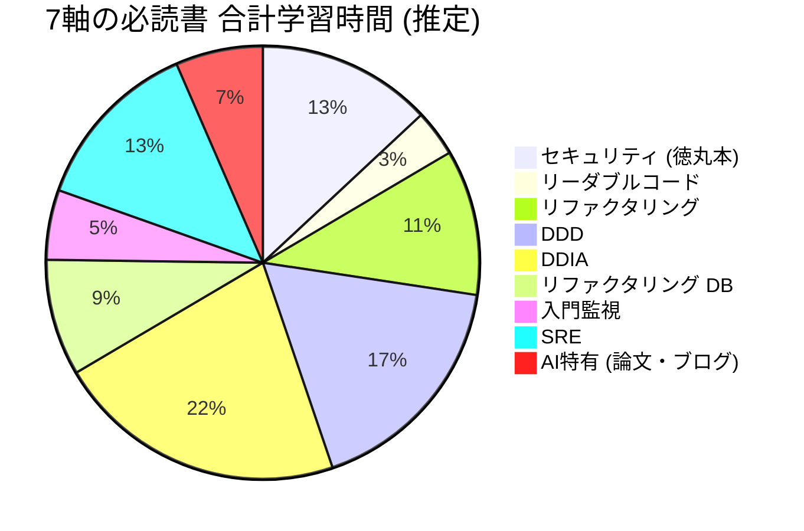

合計約 **230時間**。コア層2名で分担しても1人あたり 100〜120時間。これを **3年で消化する**のが現実解。

---

## 6. 3年ロードマップ

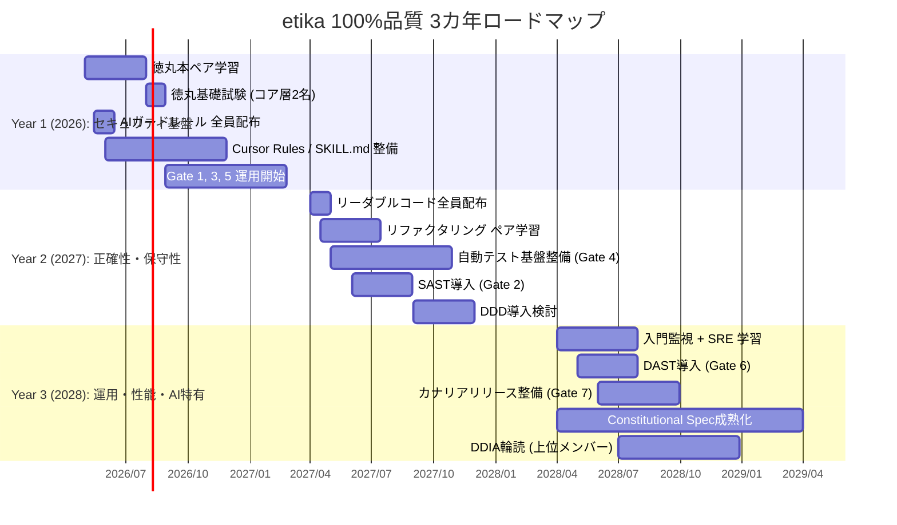

### Year ごとの到達目標

| Year | 焦点軸 | 主要アウトプット | 対外発信できるレベル |
|---|---|---|---|
| **Year 1** | 1. セキュリティ + 7. AI特有の入口 | 徳丸基礎試験合格×2、ガードレール、Cursor Rules整備、Gate 1/3/5運用 | 「セキュリティ認定保有率50%」「Spec-Driven Development実践」 |
| **Year 2** | 4. 保守性 + テスト + 2. コスト | 自動テスト基盤、SAST、コードレビュー文化、リファクタリングできる体力 | 「テスト自動化されたAI生成コード」を提案価値に |
| **Year 3** | 5. 性能 + 6. 運用 + 7. AI特有の成熟 | 監視・カナリア、DAST、本番品質チェックリスト v3 | 「100%品質パイプライン」を完成形として外販可能 |

---

## 7. 4名 × 7軸 の役割分担

```mermaid
graph TB
    subgraph Core["🔵 コア層 (2名: 品質推進担当 + エンジニア1名)"]
        C1[全7軸を理解]
        C2[Gate 5 運用責任]
        C3[Cursor Rules / SKILL.md 整備]
        C4[月次共有のスピーカー]
    end
    subgraph Lit["🟢 リテラシー層 (2名: 代表 + 非エンジニア)"]
        L1[ガードレール遵守]
        L2[Gate 3 セルフチェック]
        L3[月次共有の聞き手]
        L4[インシデント早期発見]
    end
    subgraph Daihyo["👔 代表 (リテラシー層内)"]
        D1[7軸の概念理解]
        D2[顧客提案で「規律層」を語る]
        D3[投資判断 (年次予算)]
    end

    Core -.7軸を噛み砕き.-> Lit
    Daihyo -.意思決定.-> Core
    Lit --> Daihyo

    style Core fill:#e3f2fd,stroke:#1976d2,stroke-width:3px
    style Lit fill:#e8f5e9,stroke:#388e3c,stroke-width:2px
    style Daihyo fill:#fff9c4,stroke:#f9a825,stroke-width:2px
```

代表はリテラシー層に属しつつ、**「7軸の概念理解」と「投資判断」**という別の役割を持つ。営業局面で「etikaは7軸で品質を担保している」と語れることが差別化につながる。

---

## 8. 予算 ｜ 3カ年累計

### Year 1（2026）

| 項目 | 金額 |
|---|---|
| 徳丸本（コア層2冊） | ¥7,040 |
| 徳丸基礎試験（コア層2名） | ¥20,000 |
| Frontend Masters（コア層1名） | ¥58,500 |
| Udemy入門（リテラシー層2名） | ¥3,600 |
| リーダブルコード（全員4冊） | ¥10,560 |
| **Year 1 小計** | **¥99,700** |

### Year 2（2027）

| 項目 | 金額 |
|---|---|
| リファクタリング 第2版（コア層2冊） | ¥9,680 |
| 徳丸実務試験（コア層1名） | ¥15,000 |
| SAST年間（Snyk Team等） | ¥120,000程度 |
| 自動テスト基盤投資（CI/CD強化） | ¥50,000程度 |
| **Year 2 小計** | **約 ¥195,000** |

### Year 3（2028）

| 項目 | 金額 |
|---|---|
| 入門監視 + SRE（全員配布） | ¥26,400 |
| DDIA（コア層上位） | $50 × 1 ≈ ¥7,500 |
| DAST年間 | ¥150,000程度 |
| 監視SaaS年間（Datadog等） | ¥240,000程度 |
| **Year 3 小計** | **約 ¥424,000** |

### 3カ年累計 ｜ 約 ¥720,000

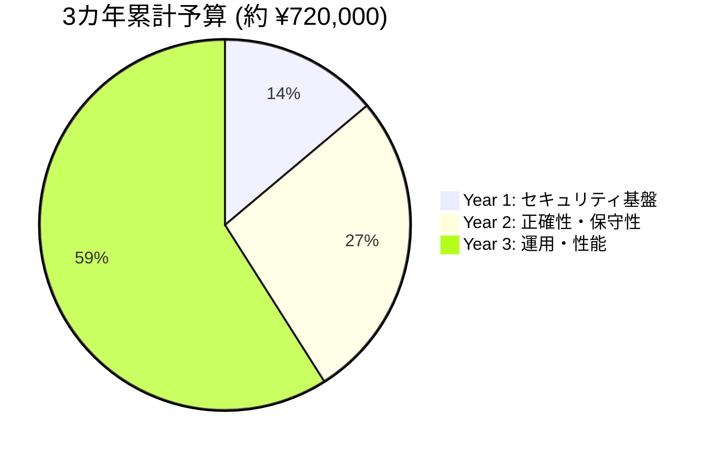

Year 3で監視SaaSやDASTが入って金額が跳ねる。これは**etikaが「自分たちで本番運用するシステム」を持つようになる**ことの裏返し。

ただし、この投資は**新規事業の収益と並走**するもの。Year 1から脱Zoho後の新サービスがスタートし、Year 2にはARR / 顧客数が立ち上がっている前提なら、無理のない投資ペース。

---

## 9. ツール投資の戦略

### 段階導入の優先順位

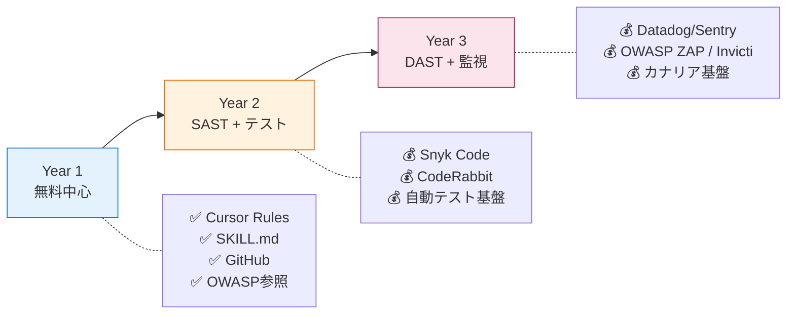

### etika独自資産の活用

etikaが既に整備しているClaude Code Skills、Cursor Rules、SKILL.mdライブラリは、**Year 1からGate 1（Spec準拠チェック）を実質無料で動かす土台**になる。これは規模が大きい会社でも持っていない競争優位性。

具体的には：

1. **etika品質憲法（Cursor Rules）**: 「シークレットを書いたら警告」「サーバー側認可なしの API実装は警告」等を明文化
2. **業務領域別SKILL.md**: Zoho、決済、認証、画面UI等で観点をテンプレート化
3. **PRテンプレート連動**: Gate 1の自動チェック結果をPRに自動コメント

これを Year 1 で整備し、Year 2 / 3 で SAST / DAST / 監視と連携させていく。

---

## 10. 効果測定（3カ年）

### Year 1（基盤フェーズ）

- 徳丸基礎試験 合格率（コア層）: 100%
- AIガードレール 全員配布完了
- Gate 1, 3, 5 の月間適用率: 100%（AI生成コードを含む全PR）

### Year 2（拡張フェーズ）

- 自動テストカバレッジ: 主要モジュールで70%以上
- SAST検出脆弱性の本番リリース率: 0件
- リファクタリング起票数: 月1件以上（=改善文化が回っている）

### Year 3（成熟フェーズ）

- 本番インシデント件数: 大規模0件、軽微3件以内
- MTTR（平均復旧時間）: 1時間以内
- カナリアでの異常検知率: 80%以上
- 顧客満足度 / 継続率: 既存顧客の95%以上が継続

---

## 11. etika戦略との接続（3カ年）

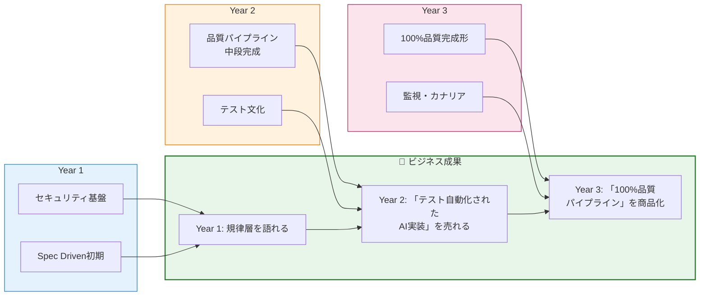

3カ年を通して、etikaは**「AIで作る会社」ではなく「AIで作ったものを本番品質に持っていく会社」**へとポジショニングを進化させる。これは脱Zoho戦略における最も強い差別化軸になる。

---

## 12. 具体的に何を作るか ｜ 商品・サービスポートフォリオ

7軸の品質フレームワーク（Section 2）と3年ロードマップ（Section 6）を、**外向けに何を売るか**という視点から整理する。社内で築いた能力を、顧客提供価値に変換する設計。

### 12.1 市場のいま（2026年時点）

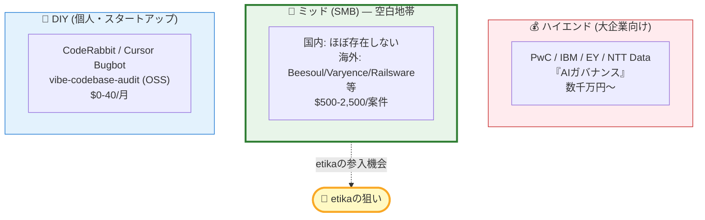

**国内SMB向けは構造的な空白地帯**。大手コンサルは届かず、AIツールは判断できない領域。ここに4名規模の専門家集団としてetikaが入る余地がある。

### 12.2 ターゲット顧客セグメント

3つの異なるセグメントが存在する。

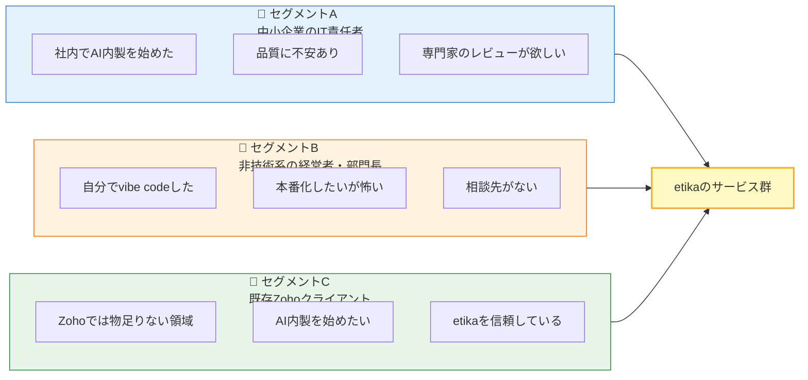

**セグメントBは2026年に急速に膨らんでいる新興層**。Forrester 2026年4月のレポートが指摘するように、CEOやCMOが自分でvibe codeしてプロダクションに投入し、IT部門に「保守してください」と丸投げするケースが急増。彼らは「相談先がない」状態で、etikaが先取りできる市場。

### 12.3 商品ラインナップ案 ｜ 6つのサービス

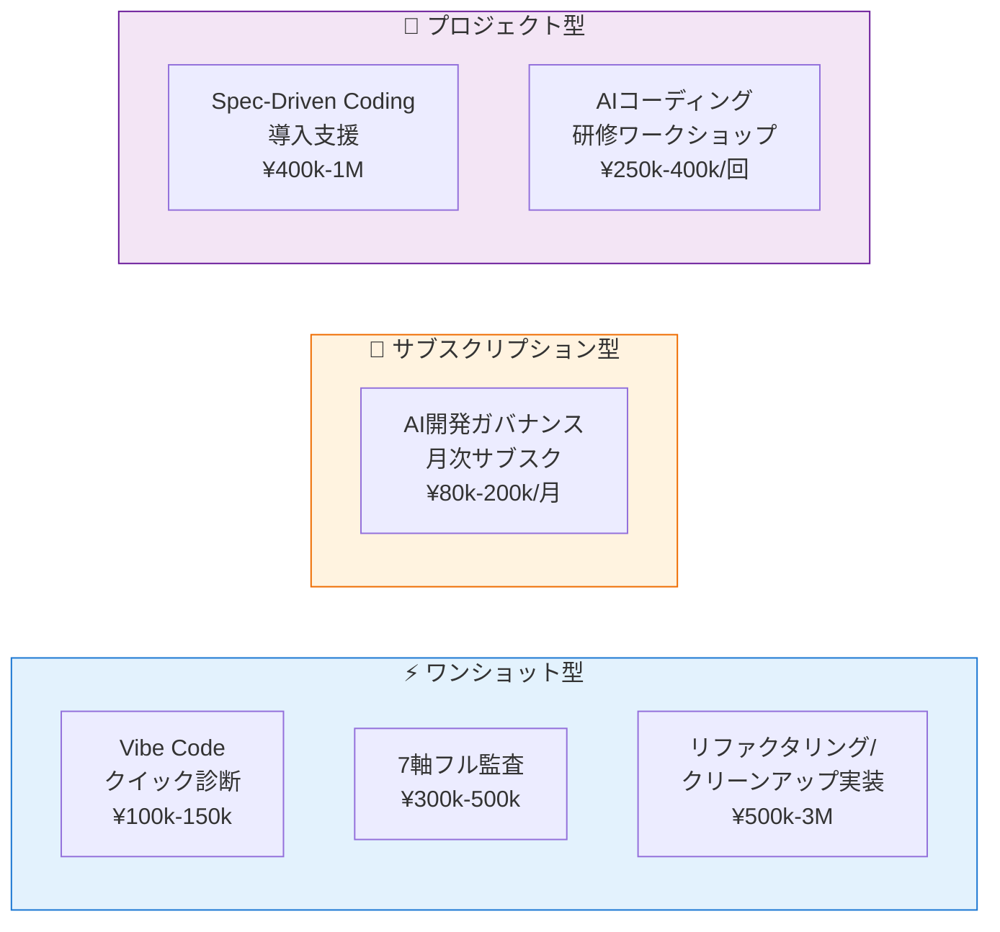

#### 🔵 12.3.1 ⚡ Vibe Code クイック診断（エントリーポイント）

| 項目 | 内容 |
|---|---|
| **概要** | 1日でAI生成コードの問題点を抽出し、優先順位付きレポートを提供 |
| **デリバリー** | A4 4〜8ページのPDFレポート |
| **チェック観点** | 7軸の上位5軸を簡略チェック |
| **価格** | ¥100,000〜150,000 |
| **対象** | セグメントA, B（最初の入口） |
| **etika独自性** | 日本語、SMB価格帯、24-48時間納品 |

**戦略上の役割**: 顧客との最初の接点。ここで信頼を築き、フル監査やサブスクへ繋げる。

#### 🔵 12.3.2 🔍 7軸フル監査

| 項目 | 内容 |
|---|---|
| **概要** | v4の7軸モデルに沿った網羅的な監査 |
| **デリバリー** | PDF詳細レポート（20〜40ページ） + 改善ロードマップ + 1時間の解説セッション |
| **期間** | 3〜5営業日 |
| **価格** | ¥300,000〜500,000 |
| **対象** | セグメントA, C |
| **etika独自性** | 7軸という独自フレームワーク、Zoho統合系の知見 |

**戦略上の役割**: クイック診断からのアップセル先。年単位の品質保証契約への入口。

#### 🔵 12.3.3 🔄 リファクタリング／クリーンアップ実装

| 項目 | 内容 |
|---|---|
| **概要** | 監査で見つかった問題を実際にetikaが修正実装 |
| **デリバリー** | PR形式で修正提案 + テスト追加 + ドキュメント |
| **期間** | プロジェクト規模次第 |
| **価格** | ¥500,000〜3,000,000 |
| **対象** | セグメントA, B, C |
| **etika独自性** | 監査と実装を一気通貫で提供できる |

**戦略上の役割**: 高単価案件。フル監査の自然な延長で、etikaの実装力をマネタイズ。

#### 🟠 12.3.4 📅 AI開発ガバナンス 月次サブスクリプション

| 項目 | 内容 |
|---|---|
| **概要** | 月額で継続的にAIコード品質を担保 |
| **デリバリー** | 月X件のPRレビュー枠 + 月次健全性チェック + Cursor Rules / SKILL.md保守 + Slack/メール質問対応 |
| **価格** | ¥80,000〜200,000/月（プラン別） |
| **対象** | セグメントA, C（既存Zohoクライアントが特に取りやすい） |
| **etika独自性** | Zoho契約と組み合わせやすい |

**戦略上の役割**: **etikaの収益基盤の核**。MRR（月次経常収益）を作り、案件ベースの収益から脱却する。

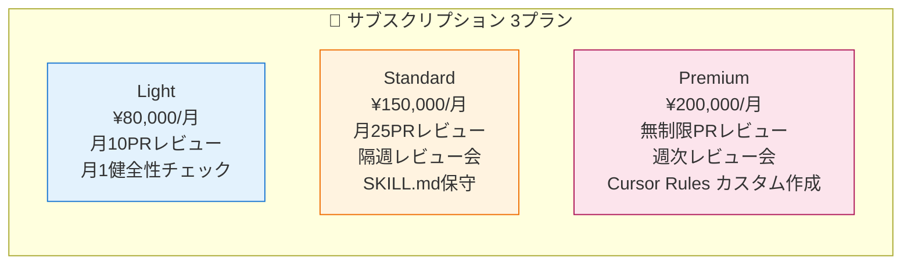

#### 🟣 12.3.5 🎓 AIコーディング研修ワークショップ

| 項目 | 内容 |
|---|---|
| **概要** | クライアント企業のチーム向けカスタム研修 |
| **デリバリー** | 1〜2日のワークショップ + 教材PDF + 自社向けチートシート作成支援 |
| **価格** | ¥250,000〜400,000/回 |
| **対象** | セグメントA, C |
| **etika独自性** | etika社内で実践している教材（v3）をベースにできる |

**戦略上の役割**: 顧客の社内文化に入り込む。ワークショップ後にサブスクや監査契約に繋がりやすい。

#### 🟣 12.3.6 🛠️ Spec-Driven Coding 導入支援

| 項目 | 内容 |
|---|---|
| **概要** | クライアント環境にCursor Rules + SKILL.md ライブラリを設計・構築 |
| **デリバリー** | 業務領域別SKILL.md セット + Cursor Rules + 運用マニュアル + 1ヶ月の運用伴走 |
| **期間** | 6〜10週間 |
| **価格** | ¥400,000〜1,000,000 |
| **対象** | セグメントA, C（特にAI内製を本気でやりたい企業） |
| **etika独自性** | **etikaの既存資産が直接競争優位**。日本でこれをやれる企業は稀少 |

**戦略上の役割**: etikaの最高峰商品。3年計画のYear 3で完成形となる旗艦サービス。

### 12.4 サービス投入タイミング ｜ 3年計画と連動

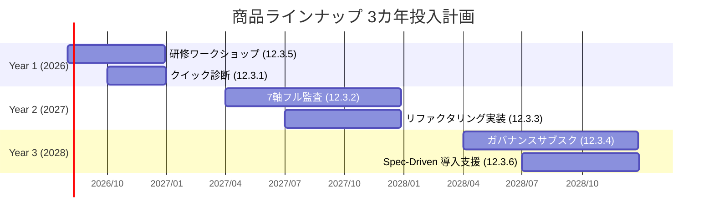

| Year | 投入する商品 | 売上目標感 |
|---|---|---|
| **Year 1** | 12.3.5 研修 / 12.3.1 クイック診断 | 月¥200k〜500k（年間 ¥3〜6M） |
| **Year 2** | 12.3.2 フル監査 / 12.3.3 実装 を追加 | 月¥800k〜1.5M（年間 ¥10〜18M） |
| **Year 3** | 12.3.4 サブスク / 12.3.6 Spec-Driven を追加 | 月¥1.5M〜3M（年間 ¥18〜36M） |

これは**「脱Zoho」後の収益再建シナリオ**そのもの。Year 3には、Zohoマージン依存から完全に脱却した収益構造が描ける。

### 12.5 競合・代替手段との位置関係

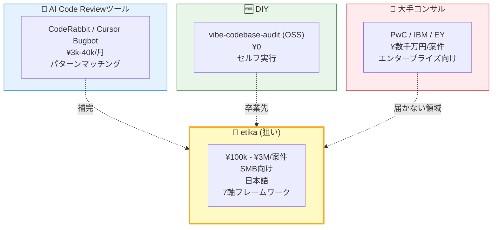

**重要な認識**: AIコードレビューツール（CodeRabbit等）はetikaの脅威ではなく、**むしろ顧客に推奨するツール**。etikaは「ツールが判断できない部分」（ビジネス文脈・アーキテクチャ・人間判断）を担当する。

### 12.6 etikaが取れる差別化ポジション

| 軸 | 詳細 |
|---|---|
| **言語** | 日本語ネイティブ。海外エージェンシーに対する明確なバリア |
| **規模** | 4名のスペシャリスト集団。大手コンサルにはない機動力と低価格 |
| **フレームワーク** | 7軸品質モデル。etikaが体系化する独自IP |
| **ツール統合** | Cursor Rules / SKILL.mdの実践知識。これは大手より深い |
| **既存資産** | Zohoエコシステムへの深い理解。AI × Zohoのハイブリッドソリューションを唯一提案できる |
| **アクセシビリティ** | SMB価格帯。クイック診断¥100kは大手の見積もり通知書未満 |

### 12.7 売上構造の進化

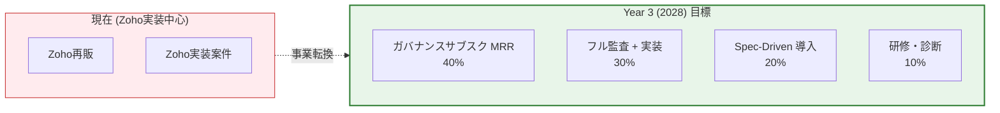

「案件ベース → ストック型」への転換が3年計画の本丸。サブスクが40%を占めれば、収益予測可能性が劇的に変わる。

### 12.8 営業導線

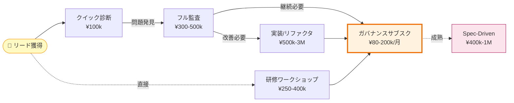

**サブスクへの導線が複数あること**が重要。クイック診断、フル監査、ワークショップ、いずれからでも月次サブスクに繋がる設計。

### 12.9 リード獲得チャネル

- **既存Zohoクライアント**: アップセル提案（最初の3ヶ月の主戦力）
- **地域AIコミュニティ**: etikaの知見を共有し、AI内製層との接点を作る
- **技術登壇 / 技術ブログ**: 「7軸品質フレームワーク」を発信し、検索/紹介で問い合わせ獲得
- **Note / Qiita / Zenn**: 「Vibe Codingで失敗した実例 → 7軸で再診断」のような記事
- **クライアント紹介**: 監査で実成果を出した顧客からの紹介
- **Forrester的セグメントB（経営者）**: LinkedIn / X での発信、経営者向け勉強会

### 12.10 最初の90日でやるべきこと

研修フレームワーク（v4）と並行して、商品化を開始するための初動アクション。

- [ ] **クイック診断のテンプレート作成**（30日）: 監査チェックリスト、レポート雛形、価格表
- [ ] **「AI生成コードの7つの落とし穴」というブログ記事執筆**（60日）: SEOコンテンツとして種をまく
- [ ] **既存Zohoクライアントから2社、無料でクイック診断のパイロット**（90日）: 実例を作る
- [ ] **etikaのウェブサイト改訂**: 「Zoho実装 + AI品質保証」の二枚看板を表示

---

## 13. 想定リスクと対処（3カ年）

| リスク | 対処 |
|---|---|
| 計画が長すぎて途中で形骸化 | 四半期ごとに見直し、年度末に対外発信できる成果を毎年出す |
| Year 2/3 の投資判断が通らない | Year 1 で対外発信できる成果（認定50%）を出し、ROI実感させる |
| 品質ノウハウの属人化 | Year 1 のうちにSpec / Cursor Rules / SKILL.mdを形式知化し、複数メンバーで運用できる構造に |
| ツール市場の変化（SAST/DASTの選定肢が変わる） | 年次見直しで最新ツールへの差し替え |
| 4名規模で7軸は重すぎる | 各軸の到達レベルを「100%」ではなく「最低限を満たす」に再定義（実用上それで十分） |

---

## 14. 次のアクション

- [ ] 本フレームワークを代表に提示。3カ年計画として合意取得
- [ ] Year 1 はv3の現行プログラムをベースに即着手
- [ ] Cursor Rules / SKILL.md の etika品質憲法 v1 を品質推進チームが起草
- [ ] Year 2 / 3 の予算は四半期ごとの実績ベースで意思決定

---

## 補遺 ｜ 「100%」という言葉について

ここで言う100%は「完璧無欠」ではなく、「本番投入の意思決定に責任を持って『出してよい』と言える状態」を指す。完全無欠は存在しないが、**そのコードに対して全7軸でNoを出せない状態**まで持っていくことは可能で、それが現実的な100%。

それを4名で達成する道筋を、3年計画で組んだのが本書。

---

*本書は2026年4月時点の情報に基づく。AIコーディング技術およびセキュリティ動向は急速に変化するため、四半期ごとにレビューすること。*
