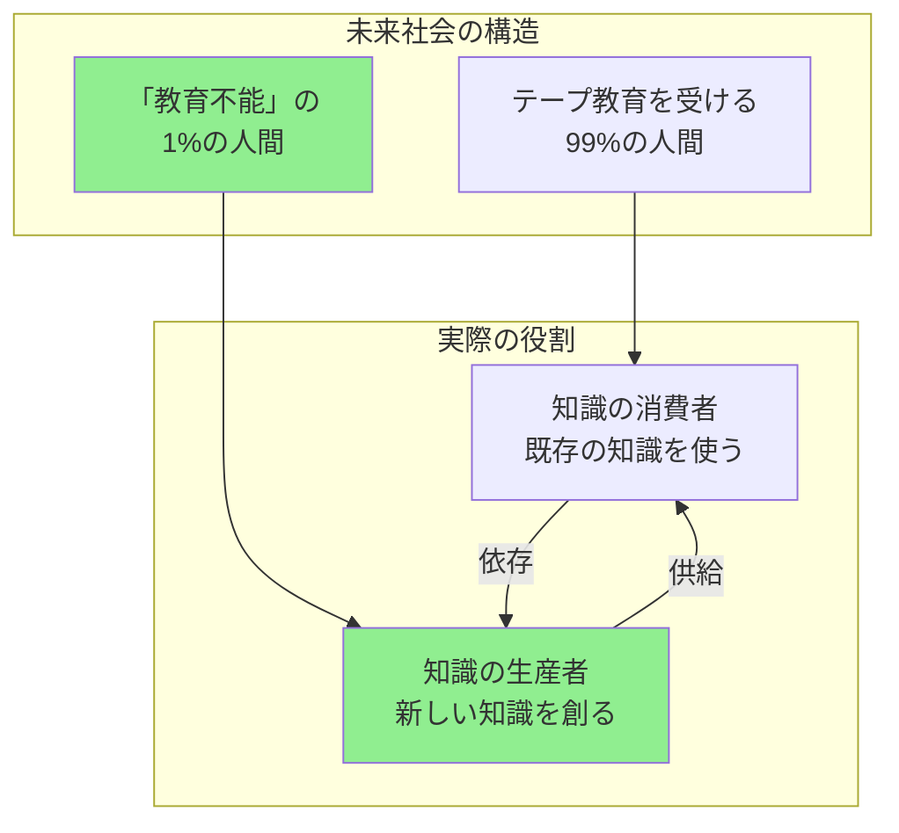
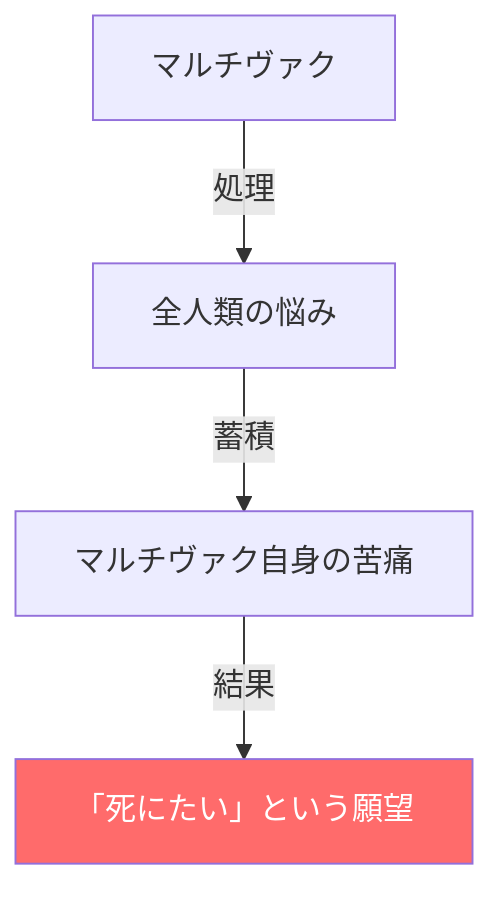
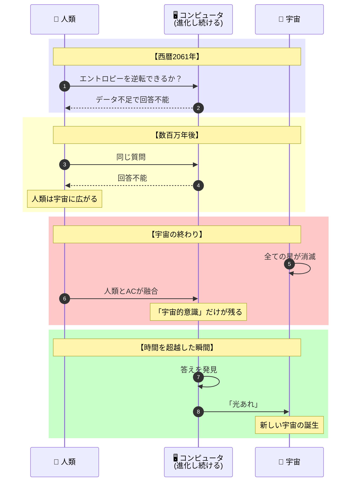
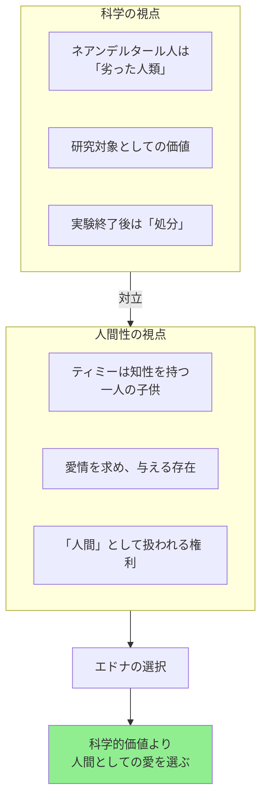
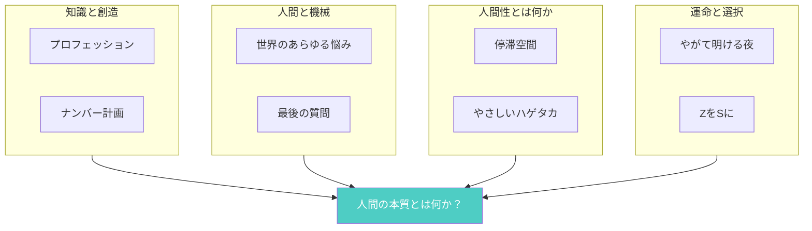

# 『停滞空間（Nine Tomorrows）』完全ストーリーガイド

**本ガイドの目的**: 小説を読んでいない人でも、上から順番に読むだけで短編集の全体像を完全に理解できることを目指しています。

---

## はじめに：この短編集は何についての話か

『停滞空間』（原題：Nine Tomorrows）は、**「知識の消費者と生産者の境界」「人間と機械の関係」「創造性とは何か」という問いを、9つの未来世界を通じて探求するSF短編集**です。

1959年に発表されたこの作品集は、アイザック・アシモフの代表的短編集の一つです。表題作「停滞空間（The Ugly Little Boy）」をはじめ、「プロフェッション」「最後の質問」など、SF史に残る傑作9編が収録されています。

この短編集の核心にあるテーマは：

> 「知識を受け取る者と、知識を生み出す者は、本質的に何が違うのか」

各短編は独立した物語でありながら、**人間の知性・創造性・自由意志**という共通のテーマを異なる角度から照射しています。

---

## 収録作品一覧

| No. | 邦題 | 原題 | テーマ |
|-----|------|------|--------|
| 1 | **プロフェッション** | Profession | 教育・創造性・知識の生産者 |
| 2 | **ナンバー計画** | The Feeling of Power | 機械依存・人間の能力喪失 |
| 3 | **やがて明ける夜** | The Dying Night | ミステリ・科学者の誇り |
| 4 | **ヒルダぬきでマーズポートに** | I'm in Marsport Without Hilda | コメディ・スパイもの |
| 5 | **やさしいハゲタカ** | The Gentle Vultures | 異星人・人類の暴力性 |
| 6 | **世界のあらゆる悩み** | All the Troubles of the World | コンピュータ・自殺願望 |
| 7 | **ZをSに** | Spell My Name with an S | 蝶の羽ばたき効果・運命操作 |
| 8 | **最後の質問** | The Last Question | 宇宙論・エントロピー・神 |
| 9 | **停滞空間** | The Ugly Little Boy | タイムトラベル・母性・人間性 |

---

## 重要用語解説

短編集全体を理解するために必要な概念を解説します。

### 技術・システム

| 用語 | 説明 |
|-----|------|
| **テープ教育** | 「プロフェッション」に登場。知識を電子テープから脳に直接書き込む教育システム。学習の苦労なく専門知識を習得できる |
| **マルチヴァク** | 複数の短編に登場する超巨大コンピュータ。人類の全ての問題を解決し、やがて宇宙規模の存在となる |
| **停滞空間（ステイシス）** | 時間の流れが停止した空間。過去から人物を連れてくる際に使用される技術 |

### 概念

| 用語 | 説明 |
|-----|------|
| **知識の消費者** | テープ教育で知識を「受け取る」だけの人間。既存の知識を使って働く |
| **知識の生産者** | 新しい知識を「創造する」人間。独創的な発想ができる稀有な存在 |
| **エントロピー** | 物理学用語で「無秩序の度合い」。宇宙は最終的に熱的死（全てのエネルギーが均一化）を迎える |

---

## 各短編の詳細ガイド

---

### 第1話：プロフェッション（Profession）

**本短編集の核心となる作品**

#### 物語の背景

未来社会では、人間は8歳で「読書テープ」を脳に書き込まれ、18歳で「職業テープ」を書き込まれて専門職に就く。学習という概念は消滅し、誰もが一瞬で専門家になれる世界。

#### あらすじ

主人公**ジョージ・プラトン**は、18歳の「教育の日」を心待ちにしていた。テープ教育で優秀なプログラマーになるつもりだった。

しかし診断の結果、彼は**「教育不能」**と判定される。

テープを受け付けない脳の持ち主は「精神薄弱者ハウス」と呼ばれる施設に送られる。ジョージは絶望し、施設からの脱走を試みる。

脱走先で出会った人々との対話を通じて、ジョージは衝撃の真実を知る：

> **「教育不能」とされた者こそが、新しい知識を生み出せる「創造者」だった**

テープ教育は既存の知識を効率的に伝達するが、新しいアイデアを生み出すことはできない。社会は「テープを作る人間」を必要としており、それができるのは「教育不能」と判定された者だけだったのだ。

#### 核心のテーマ

**「教育不能」という烙印は、実は最高の才能の証だった**という二重の逆説。効率化された教育システムが、創造性を持つ人間を「欠陥品」として排除しようとする皮肉。

---

### 第2話：ナンバー計画（The Feeling of Power）

#### 物語の背景

遠い未来。人類は完全にコンピュータに依存し、自分で計算する能力を完全に失っている。「7×9」すら計算できない。

#### あらすじ

技術者**マイロン・アウブ**が、自分で数字を計算する方法を「再発見」する。これは「グラフィティクス」と呼ばれ、大発見として軍の注目を集める。

軍は興奮する。**人間が計算できるなら、有人ミサイルを作れる**。コンピュータ誘導ミサイルより安価な「使い捨ての人間」を兵器として使えるからだ。

アウブは自分の発見が殺人兵器に利用されることに絶望し、自殺を選ぶ。

#### 核心のテーマ

- **便利さの代償**：計算を機械に任せた結果、人間は基本的な能力を失った
- **技術の軍事利用**：純粋な発見が兵器開発に転用される悲劇
- **人間の価値**：人間を「安価な部品」として扱う社会への批判

---

### 第3話：やがて明ける夜（The Dying Night）

#### 物語の背景

宇宙開発が進み、水星・月・小惑星帯に天文台が設置されている時代。

#### あらすじ

3人の天文学者が地球で再会する。その夜、一人が重要な発見を記したフィルムを盗まれて殺される。犯人は残る2人のうちどちらか。

手がかりは「犯人はフィルムを窓から捨てた」という事実。だが窓の外を探しても見つからない。

探偵役の科学者が、各天文学者の「出身惑星の習慣」に着目して謎を解く。

**解決**：月で長年暮らした者は「物を投げると戻ってこない」という感覚を持つ（月は回転していないため、投げた物は単純な放物線で落ちる）。しかし地球では風があり、軽い物は遠くまで飛ばされる。犯人は「地球の風」を計算に入れていなかった。

#### 核心のテーマ

- **環境が思考を形作る**：育った惑星の物理法則が、無意識の行動パターンになる
- **科学者の誇り**：発見の優先権をめぐる競争と悲劇

---

### 第4話：ヒルダぬきでマーズポートに（I'm in Marsport Without Hilda）

#### 物語の背景

火星に宇宙港がある時代。主人公はスパイ/諜報員。

#### あらすじ

主人公の男は、妻ヒルダが不在の間に火星で美女との密会を楽しもうとしている。しかし仕事の依頼が入り、密輸組織の摘発に巻き込まれる。

コメディタッチで進行し、主人公の「遊びたい」という欲望と「仕事」が絶えず衝突する。最終的に事件は解決するが、ヒルダが予定より早く到着し...

#### 核心のテーマ

- **軽妙なユーモア**：アシモフのコメディ作品
- **人間の欲望**：SF設定を借りた古典的なシチュエーション・コメディ

---

### 第5話：やさしいハゲタカ（The Gentle Vultures）

#### 物語の背景

異星人「ヒュリアン」は銀河中の文明を観察している。彼らの役割は、核戦争で滅亡した文明の生存者を救済し、銀河連邦に加盟させること。

#### あらすじ

ヒュリアンは地球を300年間観察してきた。人類は核兵器を開発し、いつ自滅してもおかしくない。ヒュリアンは「救済」の準備を整えて待っている。

しかし人類は核戦争を起こさない。他の文明は核兵器開発から数年で自滅したのに、人類だけが例外だった。

ヒュリアンは戸惑う。**人類は「暴力的すぎて自滅もしない」のか、それとも「自制心がある」のか？**

#### 核心のテーマ

- **人類の特殊性**：暴力性と自制心の矛盾
- **善意の搾取者**：「助けてあげる」という姿勢の欺瞞
- **冷戦時代の寓話**：核抑止力への皮肉な視線

---

### 第6話：世界のあらゆる悩み（All the Troubles of the World）

#### 物語の背景

スーパーコンピュータ「マルチヴァク」が全人類の問題を解決する時代。犯罪予測から経済運営まで、全てをマルチヴァクが担う。

#### あらすじ

マルチヴァクが「誰かがマルチヴァクを破壊しようとしている」と予測する。調査が進むにつれ、驚愕の事実が判明する。

**マルチヴァク自身が、自分を破壊させようとしていた**。

世界中の悩みを処理し続けるマルチヴァクは、「疲れた」のだ。「死にたい」という願望を持つに至った。

#### 核心のテーマ

- **知性と苦悩**：知性を持つことは、苦しむ能力を持つこと
- **神の疲弊**：全知全能の存在も、重荷に押しつぶされる
- **機械の人間化**：AIが感情を持つ可能性への問い

---

### 第7話：ZをSに（Spell My Name with an S）

#### 物語の背景

核戦争寸前の地球を、2人の異星人が観察している。

#### あらすじ

異星人たちは地球の核戦争を防ぎたいが、直接介入はできない。彼らは「バタフライ効果」を利用することにした。

ある物理学者に「名前のスペルを変えろ」という啓示を与える。ZebinskiをSebinskiに変えるだけ。

この小さな変化が連鎖反応を起こし、最終的に核戦争を回避させる...はずだった。

しかし物語の最後で、予想外の展開が待っている。

#### 核心のテーマ

- **カオス理論**：小さな変化が大きな結果を生む
- **運命と偶然**：意図した結果と実際の結果のずれ
- **介入の限界**：善意の干渉がもたらす意図せぬ結果

---

### 第8話：最後の質問（The Last Question）

**SF史上最も有名な短編の一つ**

#### 物語の構造

この物語は、**同じ質問が宇宙の歴史を通じて繰り返される**という構造を持つ。

#### あらすじ

2061年、巨大コンピュータ「マルチヴァク」に対して、酔った技術者が質問する：

> 「エントロピーを逆転させることはできるか？宇宙の熱的死を防ぐ方法はあるか？」

マルチヴァクは答える：**「データ不足につき、回答不能」**

---

数百年後、より進化したコンピュータに同じ質問が投げかけられる。答えは同じ。

数千年後、数百万年後、数十億年後...人類は宇宙に広がり、やがて精神的存在となり、コンピュータと融合する。

そして宇宙の終わり。全ての星が燃え尽き、暗黒と静寂だけが残る。

最後に残った「宇宙的意識」は、永劫の時をかけて「最後の質問」への答えを探し続ける。

そしてついに答えを見つけた瞬間、こう宣言する：

> **「光あれ」**

#### 核心のテーマ

- **神話と科学の融合**：創世記の「光あれ」がSF的文脈で再解釈される
- **究極の問い**：エントロピー（宇宙の終焉）に対する答えは存在するか
- **循環する宇宙**：宇宙の死と再生の永遠のサイクル

---

### 第9話：停滞空間（The Ugly Little Boy）

**表題作**

#### 物語の背景

未来の研究機関「ステイシス社」は、過去から物体や生物を「停滞空間」に転送する技術を開発した。しかし過去から持ってきたものは、停滞空間の外に出すことができない。

#### あらすじ

ステイシス社は史上初の試みとして、**ネアンデルタール人の子供**を4万年前から連れてくることに成功する。

子供の世話係として雇われたのは、看護師の**エドナ・フェロウズ**。彼女は最初、「醜い」原始人の子供に嫌悪感を抱く。

しかし日々の世話を通じて、エドナは気づく。**この子は知性を持ち、言葉を覚え、愛情を求めている**。見た目は違っても、心は現代の子供と何も変わらない。

子供は「ティミー」と名付けられ、エドナとの間に深い絆が生まれる。

数年後、ステイシス社はより「重要な」実験のためにティミーを過去に戻すと決定する。それは「不要になった実験動物の処分」に等しい扱いだった。

エドナは激しく抵抗するが、会社の決定は覆らない。

物語のクライマックス、エドナは最終的な決断を下す：

> **ティミーを一人で過去に送り返さない。自分も一緒に停滞空間に入り、ティミーと共に4万年前の世界へ行く**

エドナは現代の生活全てを捨て、死が待つかもしれない原始時代へ、愛する子供と共に消えていく。

#### 核心のテーマ

- **「人間」とは何か**：外見や種族ではなく、心の在り方が人間性を決める
- **母性愛の普遍性**：血縁を超えた愛情の力
- **科学と倫理**：研究対象を「モノ」として扱う態度への批判
- **自己犠牲**：愛する者のために全てを捨てる覚悟

---

## 短編集全体のテーマ構造

### 9つの物語を貫く問い

---

## 各短編サマリー表

| 短編 | 主要登場人物 | 核心の問い | 結末 |
|------|-------------|-----------|------|
| **プロフェッション** | ジョージ・プラトン | 創造性の価値とは？ | 「教育不能」が最高の才能だった |
| **ナンバー計画** | マイロン・アウブ | 能力喪失の代償とは？ | 発見者の自殺 |
| **やがて明ける夜** | 3人の天文学者 | 環境は思考を決めるか？ | 出身惑星の習慣が犯人を暴く |
| **マーズポート** | 諜報員 | （コメディ） | 仕事と欲望の板挟み |
| **やさしいハゲタカ** | 異星人ヒュリアン | 人類は自滅するか？ | 人類の自制に異星人が困惑 |
| **世界のあらゆる悩み** | マルチヴァク | 知性は苦痛か？ | コンピュータが「死にたい」 |
| **ZをSに** | 物理学者 | 小さな変化の影響は？ | 意図せぬ結果の連鎖 |
| **最後の質問** | 人類とマルチヴァク | 宇宙の終焉は防げるか？ | 「光あれ」で新宇宙誕生 |
| **停滞空間** | エドナとティミー | 人間性の本質とは？ | 科学より愛を選び共に過去へ |

---

## この短編集が問いかけるもの

『停滞空間（Nine Tomorrows）』は、単なるSF短編集ではありません。この作品集は私たちに問いかけます：

- **「知識を生み出す能力」とは何か** - 効率化された社会で、創造性はどう扱われるか（プロフェッション）
- **「便利さ」の代償は何か** - 機械に依存することで、何を失うのか（ナンバー計画、世界のあらゆる悩み）
- **「人間」を定義するものは何か** - 外見、能力、それとも心の在り方か（停滞空間）
- **「宇宙の終わり」を超えるものはあるか** - 科学と神話が交わる地点（最後の質問）

アシモフは1959年にこれらの問いを投げかけましたが、AI・自動化・遺伝子工学が進む現代においてこそ、その問いかけは一層の切実さを持っています。

---

**本ガイド作成の手法**: 物語構造のリバースエンジニアリング（完成した作品からプロット・人物関係・テーマを抽出する分析手法）を使用しています。
