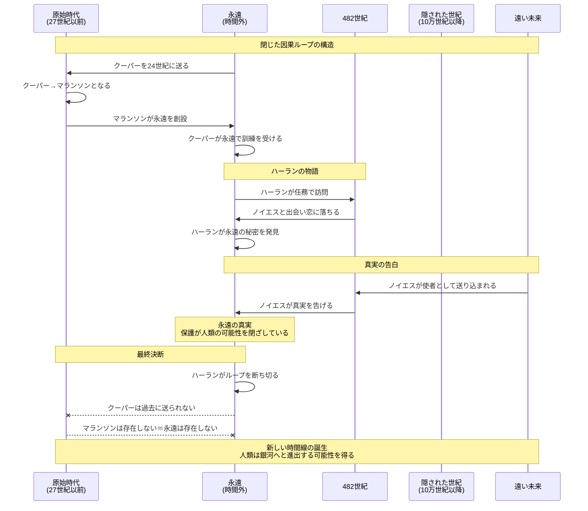
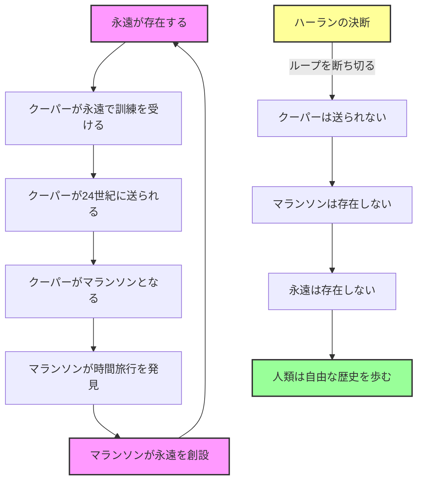

# 永遠の終り - 完全ストーリーガイド

## ドキュメント情報

| 項目 | 内容 |
|------|------|
| **書名** | 永遠の終り（The End of Eternity） |
| **著者** | アイザック・アシモフ（Isaac Asimov） |
| **訳者** | 深町眞理子 |
| **出版社** | 早川書房（ハヤカワ文庫SF） |
| **原著出版年** | 1955年 |
| **日本語版出版年** | 1977年 |
| **ページ数** | 339ページ |
| **ジャンル** | タイムトラベルSF、哲学的SF |
| **本ガイド作成日** | 2026年1月31日 |

---

## はじめに

『永遠の終り』は、SF界の巨匠アイザック・アシモフが1955年に発表した時間SF小説である。単なるタイムトラベル冒険譚ではなく、決定論と自由意志、功利主義的統治の倫理的限界、そして「管理された幸福」と「自由な苦悩」という二項対立を、時間操作という装置を通じて描き出した哲学的傑作である。

本書は、後のロバート・A・ハインラインやフィリップ・K・ディック、さらにはクリストファー・ノーランの映画作品群に至るまで、時間パラドックスを扱う作品の原型となった。特にブートストラップ・パラドックス（自己原因的ループ）を物語の核心に据えた点で、SF史上の画期的作品として位置づけられる。

また、アシモフの代表作「ファウンデーション」シリーズとの接続点を持ち、永遠が消滅することで人類が銀河帝国を築く道が開かれるという設定は、アシモフ宇宙の隠された起源譚としても読むことができる。

---

## 登場人物紹介

### 主要登場人物

| 名前 | 役職・立場 | 概要 | 物語での役割 |
|------|------------|------|--------------|
| **アンドリュー・ハーラン** | 技術者（テクニシャン） | 永遠の職員。計算士が算出した「最小必要変更」を実行する役割を担う。自らの仕事を「外科医」になぞらえ、誇りを持っている | 主人公。禁じられた恋に落ち、永遠の秘密を知り、最終的に人類の運命を選択する |
| **ノイエス・ランベント** | 482世紀の女性 | ハーランが恋に落ちる女性。表向きは一般市民だが、実は遠い未来からの使者 | ヒロイン。ハーランを導き、永遠の真実を告げる。人類の可能性を取り戻すための鍵となる |
| **ブリンズリー・シェリダン・クーパー** | ハーランの弟子 | 永遠で訓練を受ける若者。実は永遠の創設者となる運命を持つ | 閉じた因果ループの中心人物。過去に送られてヴィクター・マランソンとなる |
| **ヴィクター・マランソン** | 永遠の創設者 | 24世紀に時間旅行の理論を発見したとされる伝説的人物 | 実はクーパーの別名。永遠を創設するために未来から送り込まれた |

### 組織と階級

| 階級・役職 | 役割 | 備考 |
|------------|------|------|
| **永遠者（エターナル）** | 永遠の構成員全般 | 時間の外側で生活し、人類史を監視・管理する |
| **計算士（コンピュータ）** | 変更の計算担当 | 人類史の改変に必要な計算を行い、最小必要変更を算出する |
| **技術者（テクニシャン）** | 変更の実行担当 | 計算士の指示に基づき、現実改変を実行する。ハーランの役職 |
| **社会学者（ソシオロジスト）** | 社会分析担当 | 各世紀の社会構造を分析し、変更の影響を予測する |
| **観察者（オブザーバー）** | 情報収集担当 | 各世紀に潜入し、情報を収集する |

---

## 重要用語解説

### 組織・制度関連

| 用語 | 英語表記 | 解説 |
|------|----------|------|
| **永遠（エタニティ）** | Eternity | 時間の外側に存在する組織。27世紀から10万世紀以上にわたる人類史を監視し、介入によって現実を改変する。時間軸上のあらゆる地点にアクセス可能 |
| **最小必要変更（MNC）** | Minimum Necessary Change | 永遠が行う現実改変の原則。最小限の介入で最大の効果（人類の苦痛削減）を得ることを目指す |
| **現実（リアリティ）** | Reality | 永遠によって管理・改変される通常の時間軸。永遠者にとっての「外の世界」 |

### 時間・空間関連

| 用語 | 英語表記 | 解説 |
|------|----------|------|
| **世紀（センチュリー）** | Century | 永遠が管理する時間の単位。27世紀から10万世紀以上にわたる |
| **時間井戸** | Time Well | 永遠と各世紀を結ぶ通路。永遠者はこれを通じて任意の世紀に移動できる |
| **原始時代** | Primitive Era | 永遠成立以前の時代（27世紀以前）。永遠の直接的介入が及ばない |
| **隠された世紀** | Hidden Centuries | 永遠がアクセスできない未来の時代。10万世紀以降とされる |

### 概念・理論関連

| 用語 | 解説 |
|------|------|
| **閉じた因果ループ** | 原因と結果が循環する時間構造。永遠の創設自体がこのループによって成立している |
| **ブートストラップ・パラドックス** | 自己原因的ループ。情報や人物が時間を遡って自らの原因となる状態 |
| **善意の全体主義** | 永遠の統治形態を表す概念。人類の幸福を心から願いながら、その善意によって可能性を閉ざしてしまう |

---

## ストーリー詳細

### 第一部：永遠の世界

#### 序章：時間の外側

物語は、時間の外側に存在する組織「永遠」の内部から始まる。27世紀から10万世紀以上にわたる人類史を監視するこの巨大組織は、「最小必要変更」と呼ばれる介入によって現実を改変し続けている。戦争を未然に防ぎ、疫病の流行を阻止し、技術的災害を回避する。それが永遠の使命であった。

主人公アンドリュー・ハーランは「技術者（テクニシャン）」として、計算士たちが算出した変更を実行する役割を担っている。彼は自らの仕事を「外科医」になぞらえる。人類史という巨大な患者に対し、最小限の切開で最大の効果を得る。それが彼の誇りであり、存在意義であった。

#### 永遠の日常

永遠者たちは時間の外側で生活している。彼らは通常の時間の流れから切り離され、老いることもなく、各世紀を自由に行き来する。しかしその代償として、彼らは「現実」の住人たちと真の関係を結ぶことを禁じられていた。

ハーランは有能な技術者として認められていたが、同時に孤独な存在でもあった。技術者という役職は、他の永遠者たちから一種の畏怖と忌避の対象とされていた。彼らは変更を「実行する」者であり、その手は人類史の血で汚れていると見なされていたのだ。

### 第二部：禁じられた恋

#### 482世紀での出会い

ある任務で482世紀を訪れたハーランは、そこでノイエス・ランベントという女性と出会う。彼女は482世紀の上流階級に属する美しい女性であり、ハーランは瞬く間に彼女に心を奪われる。

永遠の規則は明確だった。永遠者と「現実」の住人との間の恋愛関係は固く禁じられている。しかしハーランは、生まれて初めて経験する感情の激しさに抗うことができなかった。彼は規則を破り、ノイエスとの関係を深めていく。

#### 愛のための反逆

やがてハーランは、482世紀に対する「現実変更」が計画されていることを知る。その変更が実行されれば、ノイエスの存在自体が消えてしまう可能性があった。彼女を守るため、ハーランは永遠への反逆を決意する。

彼は計算士たちの目を欺き、変更計画を妨害しようと画策する。しかしその過程で、彼は永遠の最も深い秘密に触れることになる。

### 第三部：永遠の秘密

#### マランソンの正体

ハーランの調査は、永遠の創設者ヴィクター・マランソンの謎へと行き着く。公式の歴史によれば、マランソンは24世紀に時間旅行の理論を独力で発見し、永遠を創設した天才科学者とされていた。

しかしハーランが発見した真実は衝撃的なものだった。マランソンは24世紀の人物ではなかった。彼は未来から送り込まれた人物。より正確には、ハーラン自身の弟子であるブリンズリー・シェリダン・クーパーその人だったのだ。

#### 閉じた因果ループ

永遠は、自らを創設するために自らを創設した。クーパーは永遠で訓練を受け、過去に送り込まれてマランソンとなり、時間旅行を「発見」し、永遠を創設する。その永遠でクーパーが訓練を受け、再び過去に送り込まれる。この完璧な因果ループこそが、永遠の存在を支える土台であった。

この発見は、ハーランに永遠の本質についての疑問を抱かせる。自己原因的に存在する組織に、正当性はあるのか。そもそも、永遠の行っている「人類の保護」は本当に正しいのか。

### 第四部：真実の告白

#### ノイエスの正体

物語は最大の転換点を迎える。ノイエス・ランベントは、実は遠い未来からの使者であった。彼女は永遠が存在できない時代。「隠された世紀」のさらに向こうからやって来た人物だったのだ。

彼女がハーランに告げた真実は、永遠の存在意義を根底から覆すものだった。

#### 「保護」という呪い

永遠による「保護」は、人類から宇宙進出への意志を奪っていた。永遠は危険を排除し、リスクを最小化し、人類を安全に保ってきた。しかしまさにその「保護」によって、人類は銀河への進出という可能性を永久に失っていたのだ。

ノイエスの時代の人々は、永遠が存在しない別の時間線を知っていた。その時間線では、人類は危険と失敗を経験しながらも、やがて銀河全体に広がっていった。しかし永遠が存在する時間線では、人類は地球という揺りかごの中に閉じ込められ、やがて静かに滅亡する運命にあった。

### 第五部：永遠の終焉

#### 究極の選択

ハーランは究極の選択を迫られる。永遠を存続させ、人類を「安全」に保つか。それとも永遠を終わらせ、不確実だが可能性に満ちた歴史を選ぶか。

永遠の技術者たちは、人類を愛していた。だからこそ彼らは、人類から失敗する自由を、傷つく自由を、そして宇宙へと飛び立つ自由を奪った。彼らの善意は疑いようがなかった。しかしその善意こそが、人類の可能性を閉ざしていたのだ。

#### 最終決断

ハーランは永遠を終わらせることを選ぶ。彼はクーパーを過去に送る計画を妨害し、閉じた因果ループを断ち切る。マランソンが存在しなければ、永遠も存在しない。永遠が存在しなければ、人類は保護されないが、同時に可能性を閉ざされることもない。

それは管理された安全よりも危険な自由を選ぶ決断だった。人類が傷つき、失敗し、苦しむ可能性のある未来。しかし同時に、人類が成長し、挑戦し、銀河へと羽ばたく可能性のある未来。

ハーランとノイエスは、新しく生まれる時間線の中で共に生きることを選ぶ。永遠は終わり、人類の本当の歴史が始まる。

---

## 最終結論

『永遠の終り』は、時間旅行SFの傑作であると同時に、人類の自由と可能性についての深い思索を含む哲学的寓話である。

### 物語のテーマ

1. **決定論と自由意志**: 閉じた因果ループの中で、真の自由な選択は可能なのか
2. **功利主義の限界**: 「最大多数の最大幸福」を追求することの倫理的問題
3. **保護と成長の矛盾**: 安全を守ることと可能性を開くことは両立するのか
4. **善意の危険性**: 正しいと確信する権力がいかに危険でありうるか

### 現代への示唆

アシモフは1955年に、AIによる意思決定支援、ビッグデータによる行動予測、アルゴリズムによる最適化が日常となる時代を予見していたかのようである。「永遠」はもはやSFの中だけの存在ではない。本書は、技術的可能性の時代における人間の自由とは何かを問い続けている。

### 結びの言葉

永遠の終わりは、人類の新しい始まりである。管理された安全を捨て、不確実な自由を選んだハーランの決断は、すべての時代の人間に問いかける。あなたは安全を選ぶか、それとも可能性を選ぶか。

---

## 物語の構造図解

### 時間軸と登場人物の関係

### 因果ループの構造

---

## 章別サマリー表

| 部 | 章 | 主な出来事 | 重要人物 | キーワード |
|----|----|------------|----------|------------|
| **第一部** | 序章 | 永遠の世界観と組織構造の紹介 | ハーラン | 永遠、技術者、最小必要変更 |
| | 永遠の日常 | ハーランの職務と孤独な立場 | ハーラン | 時間井戸、現実変更 |
| **第二部** | 482世紀での出会い | ノイエスとの運命的な出会い | ハーラン、ノイエス | 禁じられた恋、規則違反 |
| | 愛のための反逆 | ノイエスを守るための反逆を決意 | ハーラン、ノイエス | 現実変更、妨害計画 |
| **第三部** | マランソンの正体 | 永遠の創設者の真実を発見 | ハーラン、クーパー | マランソン、ブートストラップ |
| | 閉じた因果ループ | 永遠の自己原因的構造を理解 | ハーラン | 因果ループ、正当性 |
| **第四部** | ノイエスの正体 | ノイエスが未来からの使者と判明 | ノイエス、ハーラン | 隠された世紀、使者 |
| | 「保護」という呪い | 永遠の保護が人類を滅ぼすと知る | ノイエス、ハーラン | 宇宙進出、可能性の喪失 |
| **第五部** | 究極の選択 | 永遠の存続か終焉かの選択 | ハーラン | 安全vs自由、決断 |
| | 最終決断 | 永遠を終わらせる決断と実行 | ハーラン、ノイエス | 因果ループの断絶、新しい始まり |

---

## この物語が問いかけるもの

### 1. 自由と安全のトレードオフ

永遠の失敗は、人類が「保護」と「可能性」を同時に持つことの難しさを示唆する。安全を追求すれば挑戦の機会が失われ、挑戦を許せばリスクが生じる。これは本当に二者択一なのか、それとも別の道があるのか。

**現代への問い**: パンデミック対策、AI規制、気候変動対策など、現代社会でも「安全」と「自由」のバランスは常に問われている。過剰な保護は成長を阻害し、過剰な自由はリスクを招く。どこに均衡点を見出すべきか。

### 2. 閉じた因果律における責任

マランソン＝クーパーのループにおいて、永遠を創設した「責任」は誰に帰属するのか。自己原因的存在に対して、通常の因果的責任論は適用可能なのか。

**哲学的示唆**: 時間のループがなくとも、社会制度や文化は自己強化的な側面を持つ。「いつからこうなったのか」と問うことが無意味になるような構造の中で、変革は可能なのか。

### 3. 「より良い未来」の判断者

ノイエスたちの介入もまた、永遠と同様に「より良い未来」のための操作ではないのか。「正しい介入」と「誤った介入」を区別する基準は何か。永遠を終わらせることは本当に「正しい」選択だったのか。

**倫理的ジレンマ**: 未来を知る者が過去に介入する権利はあるのか。たとえ善意からであっても、他者の運命を操作することは許されるのか。

### 4. 技術の放棄という選択

一度獲得した技術を意図的に放棄することは可能か。また、そのような放棄は倫理的に正当化されうるか。永遠を終わらせることは、時間旅行という技術そのものを放棄することを意味する。

**技術と社会**: 核兵器、遺伝子操作、AIなど、人類は「使わない」という選択を迫られる技術に直面している。技術の存在自体が変化をもたらす中で、「なかったこと」にする選択は現実的なのか。

### 5. 善意の限界

永遠の技術者たちは人類を愛していた。だからこそ彼らは人類の可能性を閉ざした。「善意」は行動の正当化に十分な根拠となるのか。

**現代への警告**: テクノロジー企業の「ユーザーのため」、政府の「国民のため」、専門家の「社会のため」。善意を掲げる権力は、まさにその善意ゆえに批判を免れようとする。しかし善意は結果を保証しない。

---

### 結語

『永遠の終り』は、1955年に書かれながら、70年後の現代に驚くほど鋭い問いを投げかけ続けている。AIによる最適化、ビッグデータによる予測、アルゴリズムによる意思決定支援が日常となった今、「永遠」はもはやSFの中だけの存在ではない。

ハーランの選択は、管理された安全よりも危険な自由を選ぶ人間精神の宣言であった。それは同時に、可能性を閉ざす「保護」を拒否し、失敗する権利、傷つく権利、そして成長する権利を取り戻す選択でもあった。

私たちもまた、日々同様の選択を迫られている。便利さと引き換えにプライバシーを差し出すとき、安全と引き換えに自由を制限するとき、効率と引き換えに多様性を捨てるとき。永遠の終わりは、そのような選択の先に何があるのかを問い続けている。

---

*本ガイドは書籍『永遠の終り』（アイザック・アシモフ著、深町眞理子訳、早川書房）の内容に基づいて作成されています。詳細については原著をご参照ください。*
