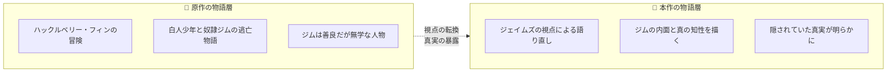
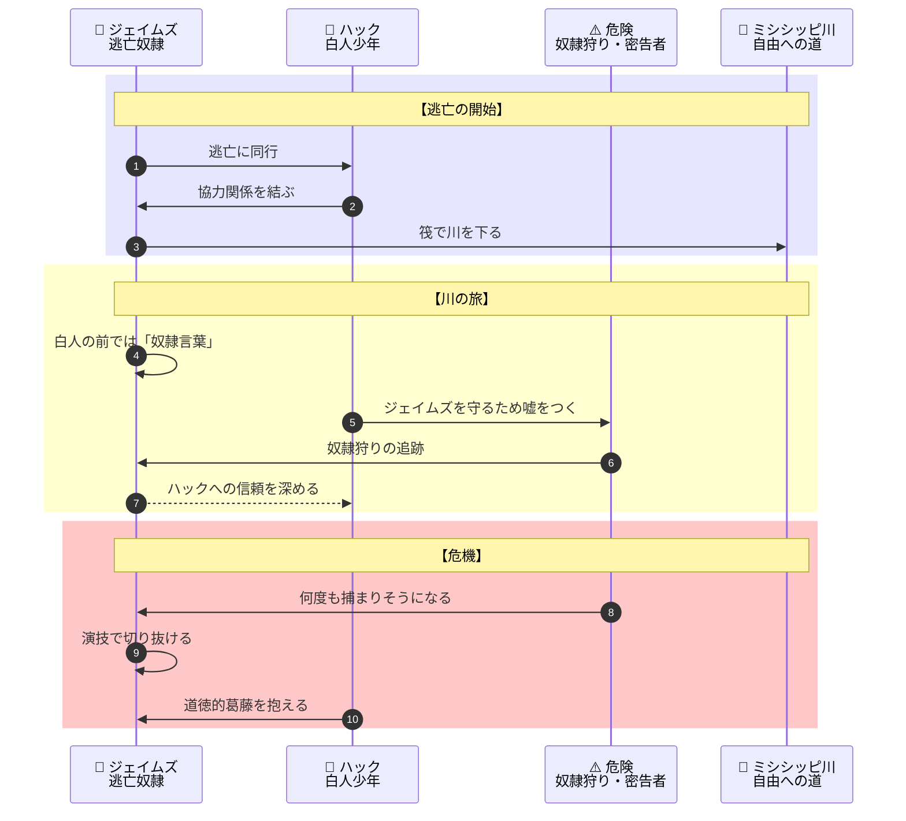
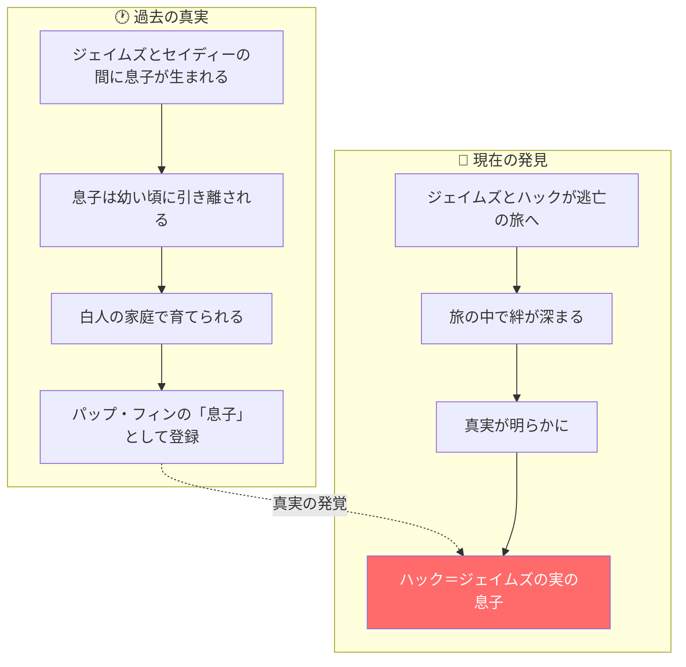
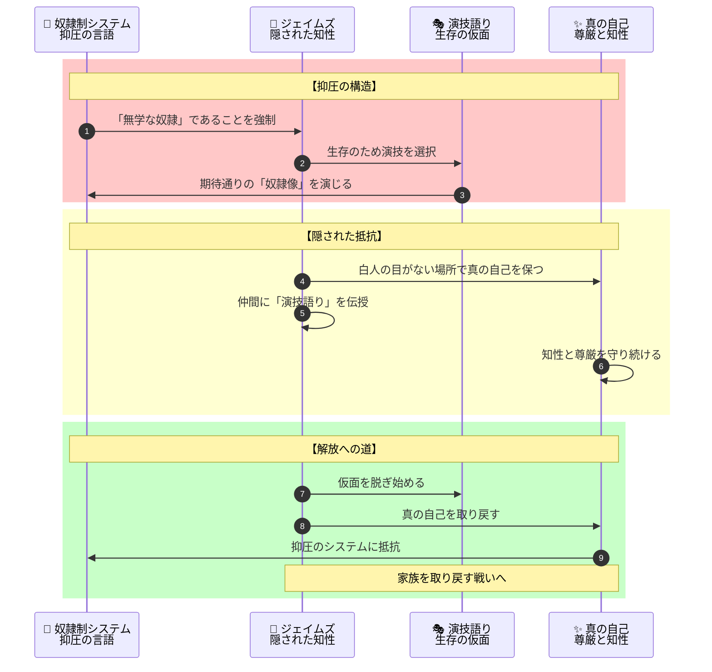
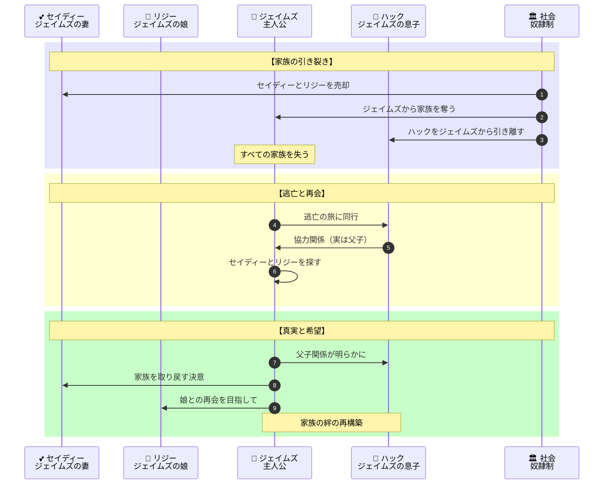
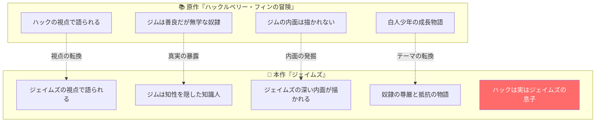

# 『ジェイムズ』完全ストーリーガイド

**本ガイドの目的**: 小説を読んでいない人でも、上から順番に読むだけで物語の全体像を完全に理解できることを目指しています。

---

## はじめに：この物語は何についての話か

『ジェイムズ』は、**「奴隷制下のアメリカで、真の知性と尊厳を隠しながら生き延びてきた一人の黒人男性が、家族を取り戻すために命を懸ける」という物語を通じて、人間の尊厳と自由、そして言葉の力を問う文学作品**です。

物語は驚くべき「語り直し」から始まります：

> 「マーク・トウェインの『ハックルベリー・フィンの冒険』に登場する奴隷ジム。彼は実は、白人の前では無学を装っていた教養ある知識人だった」

アメリカ文学の古典として知られる『ハックルベリー・フィン』では、逃亡奴隷ジムは善良だが教養のない人物として描かれています。しかしパーシヴァル・エヴェレットによるこの作品では、**その物語がジム自身の視点から語り直されます**。そこで明らかになるのは、ジムが意図的に「奴隷言葉」を使い、無学を演じていたという衝撃の事実です。

そして物語の終盤で明かされるのは、**ハックルベリー・フィンが実はジェイムズの息子だった**という驚愕の真実です。

---

## 登場人物紹介

### 主要人物

| 人物 | 立場 | 役割 |
|-----|------|------|
| **ジェイムズ（ジム）** | ワトソン家の奴隷 | 主人公。表向きは無学な奴隷だが、実は読み書きができ、哲学書も読む知識人。妻セイディーと娘リジーを取り戻すため逃亡を決意する |
| **ハックルベリー・フィン（ハック）** | 町の少年 | ジェイムズとともにミシシッピ川を下る少年。物語終盤で衝撃の出自が明かされる |
| **セイディー** | ジェイムズの妻 | 別の農場に売られてしまった。ジェイムズが命を懸けて探し求める女性 |
| **リジー** | ジェイムズの娘 | セイディーとともに売られた。父の愛情を一身に受ける少女 |

### ワトソン家の人々

| 人物 | 立場 | 説明 |
|-----|------|------|
| **ワトソン未亡人** | ジェイムズの所有者 | ミズーリ州ハンニバルに住む未亡人。ジェイムズを所有している |
| **ダグラス未亡人** | ワトソン未亡人の姉妹 | ハックを引き取って面倒を見ている |

### その他の重要人物

| 人物 | 立場 | 説明 |
|-----|------|------|
| **コリエル** | 仲間の奴隷 | ジェイムズから「演技語り」を教わる。物語の鍵となる人物 |
| **パップ・フィン** | ハックの父親（表向き） | アルコール中毒の暴力的な男。ハックを虐待している |

---

## 重要用語解説

物語を理解するために必要な用語を、登場順に解説します。

### 言語・コミュニケーション

| 用語 | 説明 |
|-----|------|
| **奴隷言葉（スレイブ・トーク）** | 白人の前で奴隷が使う崩れた英語。文法的に不正確で、教育を受けていないように聞こえる話し方 |
| **正しい英語** | 奴隷同士が白人のいない場所で使う、正確な文法の英語。教養と知性の証 |
| **演技語り** | ジェイムズが仲間の奴隷に教える生存技術。白人の前では無学を装い、本当の知性を隠すこと |

### 場所・地理

| 用語 | 説明 |
|-----|------|
| **ハンニバル** | ミズーリ州の町。物語の出発点。ミシシッピ川沿いにある |
| **ミシシッピ川** | アメリカ中央部を南北に流れる大河。ジェイムズとハックの逃亡の舞台 |
| **自由州** | 奴隷制を廃止した北部の州。逃亡奴隷にとっての希望の地 |
| **奴隷州** | 奴隷制を維持している南部の州。ジェイムズにとっては危険な土地 |

### 歴史的背景

| 用語 | 説明 |
|-----|------|
| **南北戦争** | 1861年に勃発したアメリカの内戦。奴隷制をめぐる北部と南部の対立が原因。物語の背景として重要 |
| **逃亡奴隷法** | 逃亡した奴隷を捕まえて所有者に返すことを義務づけた法律。北部の自由州でも適用された |
| **奴隷オークション** | 奴隷を売買する市場。家族が引き離されることも多かった |

---

## 物語の時系列（2つの層）

この物語には**2つの層**が存在します：

読者は「ジェイムズ」の視点で物語を追いながら、原作では語られなかった「奴隷の内面」と「隠された真実」を発見していきます。

---

## ストーリー詳細（章ごとのあらすじ）

### 序章：二重の言語

**場面**: ミズーリ州ハンニバル、ワトソン家の奴隷小屋

物語は衝撃的な場面から始まります。ジェイムズ（ジム）は奴隷仲間たちに「演技語り」を教えています。

> 「白人の前では、こう話すんだ。文法を間違え、言葉を詰まらせ、無学に見せる。そうすれば彼らは安心する。無学な奴隷は危険ではないからだ」

しかし白人がいなくなると、彼らは完璧な英語で会話を始めます。ジェイムズは哲学書を読み、仲間と議論を交わす知識人なのです。

**この場面が明かす真実**:
- 奴隷たちは「愚かなふり」をして生き延びてきた
- 「奴隷言葉」は生存のための演技
- ジェイムズは教養ある知識人

---

### 第1部：逃亡の決意

**場面**: ハンニバルの町とその周辺

ジェイムズの世界が崩壊する出来事が起きます。妻のセイディーと娘のリジーが、別の農場に**売られてしまった**のです。

奴隷にとって、家族が売られることは最も恐れる事態でした。二度と会えなくなる可能性が高いからです。ジェイムズは絶望の中で決意を固めます。

> 「私は必ずセイディーとリジーを取り戻す。たとえこの命を失うことになっても」

ちょうどその頃、ハックルベリー・フィンが父パップの虐待から逃げ出そうとしていました。ジェイムズはハックと行動をともにすることを決めます。

**逃亡の動機**:
1. **ジェイムズ** - 売られた妻と娘を取り戻すため
2. **ハック** - 暴力的な父親から逃げるため

二人は筏（いかだ）でミシシッピ川を下り始めます。

---

### 第2部：川の旅

**場面**: ミシシッピ川の上

ジェイムズとハックは筏に乗り、川を南へ下っていきます。この旅は危険に満ちていました。

**旅の中で起きること**:
1. **奴隷狩りとの遭遇** - ジェイムズは何度も捕まりそうになるが、「演技語り」で切り抜ける
2. **ハックの葛藤** - 奴隷を逃がすことは「罪」だと教えられてきたハックは、ジェイムズを助けることに罪悪感を抱く
3. **信頼の深まり** - 困難を乗り越える中で、二人の絆は深まっていく

---

### 第3部：演技語りの伝授

**場面**: 川沿いの隠れ家

ジェイムズは出会った仲間の奴隷たちに「演技語り」を教えます。これは単なる言葉遣いではなく、**生存のための知恵**でした。

> 「白人は、我々が愚かだと信じたがっている。その期待に応えてやれ。そうすれば、彼らは油断する。我々の本当の力に気づかない」

ジェイムズが教える「演技語り」の原則：
1. **文法を意図的に間違える** - 教育を受けていないように見せる
2. **視線を合わせない** - 従順さを演出する
3. **ゆっくり話す** - 頭の回転が遅いように見せる
4. **怖がっているふりをする** - 脅威ではないと思わせる

この「演技」は屈辱的でしたが、命を守るためには必要でした。ジェイムズは仲間に言います：

> 「我々の知性は、彼らに見せるものではない。我々の間で守り、育てていくものだ」

---

### 第4部：衝撃の真実

**場面**: 物語の終盤、ある農場にて

物語は衝撃の展開を迎えます。

ジェイムズとハックの旅が進む中で、**驚くべき事実**が明らかになります。

ハックルベリー・フィンは、**実はジェイムズの息子だった**のです。

**この真実が意味すること**:

これは原作『ハックルベリー・フィンの冒険』には存在しない、本作独自の衝撃的な設定です。

**この設定が物語に与える意味**:
- ジェイムズは知らずに自分の息子と旅をしていた
- ハックは自分の父親を「奴隷」として見ていた
- 二人の絆は「友情」以上のものだった
- 奴隷制が家族を引き裂く残酷さの象徴

---

### 第5部：決死の戦い

**場面**: セイディーとリジーを探す旅

ハックとの衝撃の再会の後も、ジェイムズの旅は続きます。彼は今も、売られた妻セイディーと娘リジーを探しています。

南北戦争の足音が近づく中、ジェイムズは危険を冒して南部へ向かいます。

**ジェイムズが直面する困難**:
1. **逃亡奴隷としての危険** - 捕まれば厳しい罰が待っている
2. **情報の欠如** - セイディーとリジーがどこに売られたか分からない
3. **時間との戦い** - 戦争が始まれば、さらに混乱が広がる

しかしジェイムズは諦めません。

> 「私は奴隷として生まれたが、奴隷として死ぬつもりはない。私の家族を取り戻すまで、私は止まらない」

---

### 終章：星を継ぐもの

**場面**: 物語の結末

物語の結末で、ジェイムズは一つの決意を固めます。

南北戦争の勃発という歴史的な転換点の中で、彼は自由を求める戦いを続けることを選びます。

**物語が描く希望**:
- ジェイムズは自らの尊厳を取り戻した
- 奴隷制という「演技」から解放される日が近づいている
- 家族を取り戻すという希望は消えていない

---

## 最終結論：言葉と尊厳の物語

『ジェイムズ』は、以下のことを私たちに教えています：

### この物語の核心

1. **言葉は権力である** - 「奴隷言葉」を強いることは、人間性を奪うことだった
2. **沈黙の中の抵抗** - ジェイムズは「演技」を通じて知性と尊厳を守り抜いた
3. **視点の転換** - 同じ物語も、誰の視点で語るかで全く異なる意味を持つ
4. **家族の絆** - ジェイムズの行動の原動力は、家族への愛だった
5. **隠された真実** - ハックがジェイムズの息子だったという事実は、奴隷制が引き裂いた家族の象徴

---

## 物語の構造図解（読後の振り返り用）

### 登場人物の役割と関係

### 原作との対比

---

## 章別サマリー表

| 章 | 主な出来事 | 明らかになる事実 | 新たな問い |
|----|-----------|----------------|---------|
| **序章** | 「演技語り」の教授 | ジェイムズは教養ある知識人 | なぜ知性を隠すのか？ |
| **第1部** | セイディーとリジーが売られる | 奴隷制は家族を引き裂く | ジェイムズは家族を取り戻せるか？ |
| **第2部** | ハックとの川下りの旅 | 二人の間に深い絆が生まれる | この絆の正体は？ |
| **第3部** | 仲間への「演技語り」伝授 | 生存のための知恵の継承 | 奴隷たちの真の抵抗とは？ |
| **第4部** | 衝撃の真実発覚 | ハックはジェイムズの実の息子 | 引き裂かれた家族は再生できるか？ |
| **第5部** | セイディーとリジー探索 | 南北戦争の足音 | 自由は訪れるか？ |
| **終章** | 戦いの決意 | ジェイムズの不屈の意志 | （希望とともに終わる） |

---

## この物語が問いかけるもの

『ジェイムズ』は、単なる歴史小説ではありません。この物語は私たちに問いかけます：

- **「誰の視点で物語は語られるべきか」** - 同じ出来事も、語り手によって全く異なる意味を持つ。アメリカ文学の古典を奴隷の視点から語り直すことで、見えなかった真実が浮かび上がる

- **「言葉と権力の関係とは何か」** - 「正しい英語」を話すことを禁じられた人々。言葉を奪うことは、人間性を奪うことだった。そして言葉を守ることは、尊厳を守ることだった

- **「生き延びるために何を犠牲にするか」** - ジェイムズは知性を隠し、愚かなふりをして生き延びた。この「演技」は屈辱か、それとも勇敢な抵抗か

- **「家族の絆とは何か」** - 引き裂かれても消えない絆。ジェイムズがハックと知らずに旅をし、やがて真実を知る。血のつながりは、社会の壁を超えられるか

本作は2024年に発表され、全米図書賞とピュリツァー賞をダブル受賞しました。パーシヴァル・エヴェレットによるこの作品は、アメリカ文学の古典を新たな視点から読み直すことで、人種、尊厳、家族について深い問いを投げかけています。

---

**本ガイド作成の手法**: 物語構造のリバースエンジニアリング（完成した作品からプロット・人物関係・テーマを抽出する分析手法）を使用しています。
