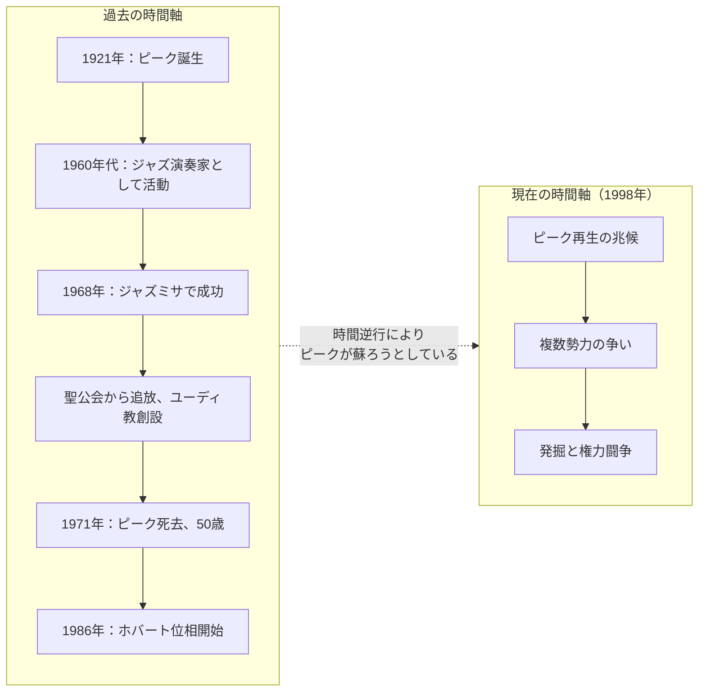
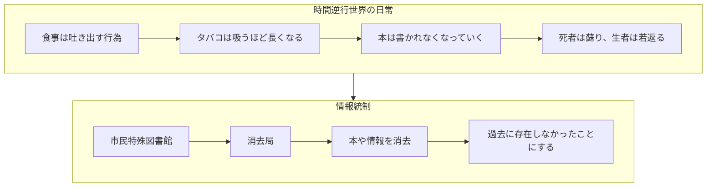
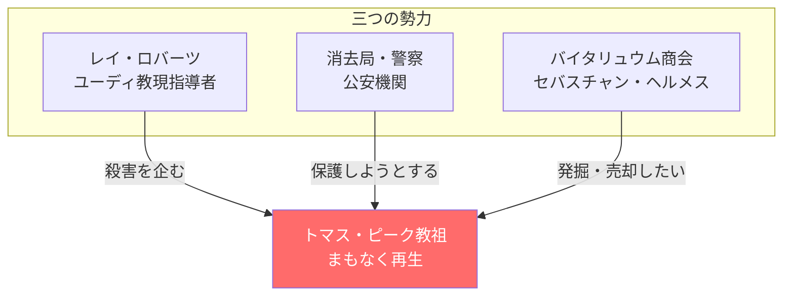
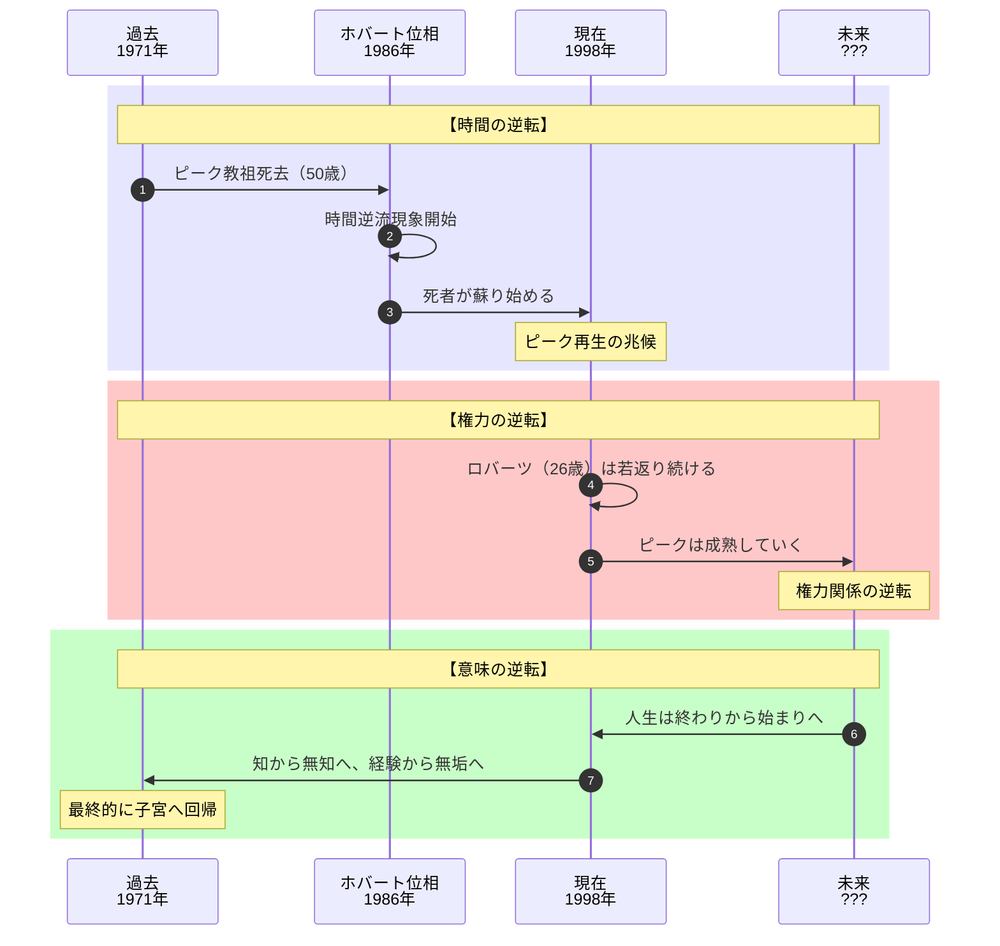
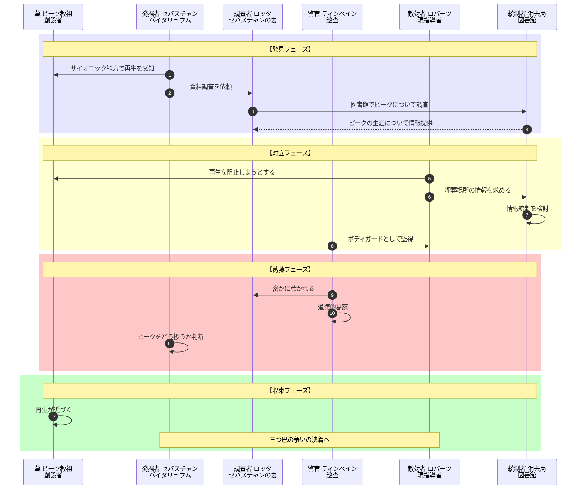
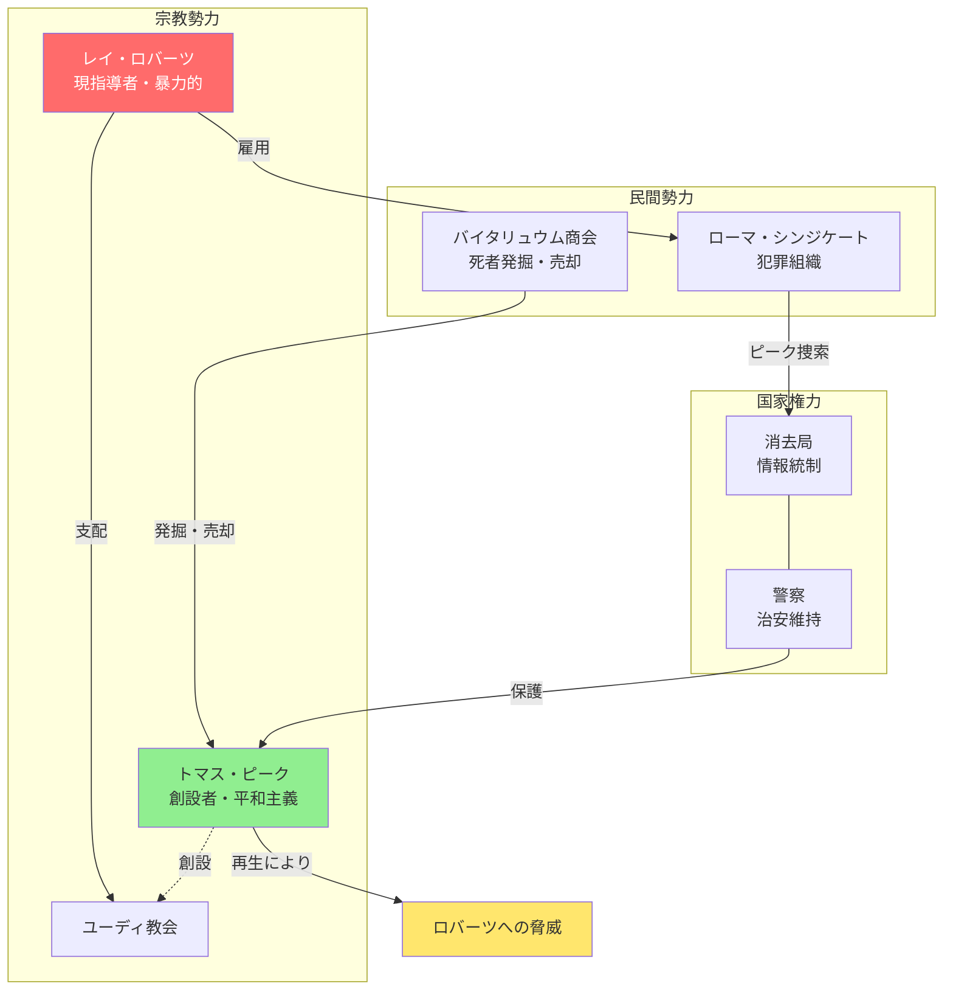

# 『逆まわりの世界』完全ストーリーガイド

**本ガイドの目的**: 小説を読んでいない人でも、上から順番に読むだけで物語の全体像を完全に理解できることを目指しています。

---

## はじめに：この物語は何についての話か

『逆まわりの世界』は、**「時間が逆行する世界で、人間は何を求めるのか」という問いを、宗教指導者の復活をめぐる権力闘争を通じて描くSF小説**です。

物語は奇妙な設定から始まります：

> 「1986年、"ホバート位相"と呼ばれる時間逆流現象が突如始まり、死者は墓から甦り、生者は日々若返って最終的には子宮へと回帰して消滅する」

この世界では、死者が「老生者」として蘇り、人々は食物を吐き出し、タバコは吸うほど長くなる。この「逆転した世界」の中で、ある宗教の創始者が復活しようとしていることが判明し、その創始者をめぐって複数の勢力が争いを繰り広げます。

そして物語が問いかけるのは、**時間の方向が逆転したとき、人間の欲望・権力・愛はどう変容するのか**ということです。

---

## 登場人物紹介

### バイタリュウム商会（死者発掘・売却業者）

| 人物 | 役職・立場 | 役割 |
|-----|----------|------|
| **セバスチャン・ヘルメス** | 商会経営者、老生者 | 主人公。かつて死から蘇った経験を持つ。死者の発掘と売却を請け負う「バイタリュウム商会」を経営。サイオニック（超能力）で老生者の再生を予知できる |
| **ロッタ・ヘルメス** | セバスチャンの妻 | 非ホバート位相の数え方で二十二歳。セバスチャンより若く、まだ死んだことがない。内気だが夫のために図書館で資料調査を行う |
| **ボブ・リンディ** | 技師 | 発掘作業を担当。仕事第一主義で無愛想だが腕は確か |
| **ドクター・サイン** | 医師 | 老生者の医学的措置を担当。人工腎臓の装着などを行う |
| **フェイン神父** | 専属牧師 | 老生者の再生の秘蹟を執り行う。あらゆる宗派に対応できる |
| **R・C・バックレイ** | セールス担当 | 老生者の販売（「プレイスメント・ロケーション」）を担当 |
| **シェリル・ベイル** | 受付兼帳簿係 | 事務処理を担当する働き者の女性 |

### 警察関係者

| 人物 | 役職・立場 | 役割 |
|-----|----------|------|
| **ジョウ・ティンベイン** | ロス警察巡査 | 夜回りパトロール中に老生者を発見する任務を持つ。レイ・ロバーツのボディガードに任命される。ロッタに密かな恋心を抱く |
| **ベセル** | ティンベインの妻 | 夫との関係は冷え切っている。ユーディ教に興味を示す |
| **ジョージ・ゴア** | ロス警察上司 | ティンベインにロバーツ護衛任務を命じる人物 |

### ユーディ教関係者

| 人物 | 正体・立場 | 説明 |
|-----|----------|------|
| **トマス・ピーク** | ユーディ教の創始者（故人） | 1921年生まれ、1971年に50歳で死去。ケンブリッジ大学で古典語を学び、ジャズ演奏家を経て宗教家となった。まもなく再生しようとしている |
| **レイ・ロバーツ** | 現在のユーディ教指導者 | 26歳。ピーク亡き後にユーディ教会を率いる。暴力的で権力志向が強い。ピークの再生を阻止しようとする |

### その他の勢力

| 人物・組織 | 立場 | 説明 |
|-----------|------|------|
| **メイビス・マクガイア** | 市民特殊図書館館長 | 「消去局」の責任者。冷徹で有能な行政官。情報統制を司る |
| **ダグラス・アップルフォード** | 図書館Bセクション責任者 | ホバート位相の専門家。ピークに関する資料を管理している |
| **カール・ガントリックス** | 弁護士（ローマ・シンジケート） | ロバーツに雇われ、ピークの埋葬場所を探している。ロボットを使って図書館に侵入を試みる |

---

## 重要用語解説

物語を理解するために必要な用語を、登場順に解説します。

### 世界観・現象

| 用語 | 説明 |
|-----|------|
| **ホバート位相** | 1986年6月に突如始まった時間逆流現象。アレックス・ホバートが予言し、彼の名にちなんで命名された。この現象により、時間の流れが逆転した |
| **アンチ・タイム（逆時間場）** | ホバート位相によって生じた逆行する時間。死者は蘇り、生者は若返る |
| **老生者** | 墓から蘇った死者の総称。再生後は日々若返っていく。当初は非常に寒さを感じ、病気の治療が必要な場合も多い |

### 組織・場所

| 用語 | 説明 |
|-----|------|
| **バイタリュウム商会** | 死者の発掘と売却を請け負う民間業者。セバスチャン・ヘルメスが経営。「バイタリュウム」は「生命力」を意味するラテン語由来 |
| **市民特殊図書館** | 通称「消去局」。時間逆行世界における「焚書」を担当する機関。本や情報を「消去」することで、過去へ遡って存在しなかったことにする |
| **消去局** | 市民特殊図書館の通称。情報統制を行う公安機関としての側面を持つ |
| **自由ニグロ共同体（F・N・M）** | ユーディ教徒が建設した自治共同体。ピーク教祖が教理の発祥地とした |
| **ユーディ教会** | トマス・ピークが創設した宗教。「ユーディ」はグループ・マインド体験を指し、幻覚誘発剤を用いて信者全員が一つの意識に融合する秘蹟を行う |
| **ローマ・シンジケート** | ヨーロッパを拠点とする犯罪組織。レイ・ロバーツと結託している |

### 技術・装置

| 用語 | 説明 |
|-----|------|
| **エアカー（エア・パトロール車）** | 空を飛ぶ自動車。この時代の主要な移動手段 |
| **ビドフォーン** | ビデオ電話。スクリーン付きで相手の顔を見ながら通話できる |
| **ソウガム** | この世界で使用される嗜好品。パイプで摂取する |
| **ロビイ（ロボット）** | 人間型ロボット。認識票の装着が義務付けられ、人間を欺くことを禁じられている |

### 日常生活

| 用語 | 説明 |
|-----|------|
| **食餌運動** | 時間逆行世界での食事。食物を口から吐き出し、皿に戻す行為。逆行世界では消化の逆プロセスとなる |
| **嘔吐** | 時間逆行世界における「食事」のこと。他人に見られることを恥ずかしがる人が多い |

---

## 物語の時系列（2つの時間軸）

この物語には**2つの時間軸**が並行して存在します：

読者は「1998年の現在」の視点で物語を追いながら、ピーク教祖の過去と、その復活をめぐる争いを見守ります。

---

## ストーリー詳細（章ごとのあらすじ）

### 第1章：夜の発見

**場面**: 1998年、ロサンゼルス近郊の小さな墓地

深夜、フォーレスト・ノルズ墓地を巡回中のジョウ・ティンベイン巡査は、地下から聞こえる老女の声を聞く。「わたし、ミセス・ティリイ・M・ベントンです。外に出たいの」

これは「老生者」――墓から蘇ろうとしている死者だ。ティンベインは発掘班を呼ぶが、朝まで来られないという。そこで彼は民間のバイタリュウム商会、セバスチャン・ヘルメスに連絡を取る。

**判明した事実**:
1. **時間逆行世界の日常** - 死者が蘇るのは珍しいことではなく、発掘・救出は日常的な業務
2. **バイタリュウムという商売** - 死者を発掘し、引き取り手に売却する商売が存在する
3. **老生者の特性** - 蘇った死者は非常に寒さを感じ、医療措置が必要なことが多い

---

### 第2章：発掘作業

**場面**: フォーレスト・ノルズ墓地

セバスチャン・ヘルメスは妻のロッタ、技師のボブ・リンディ、医師のドクター・サイン、牧師のフェイン神父を引き連れて墓地に到着する。

発掘作業が進む中、セバスチャンは自分のサイオニック能力（超能力）で、この墓地に**もう一人、間もなく蘇ろうとしている重要な人物**がいることを感じ取る。

墓石を調べると、そこには「トマス・ピーク 1921-1971」と刻まれていた。

**ここで生じる重大な発見**:

> 「ピーク教祖がここに埋葬されている。そして彼はまもなく蘇る」

ロッタがセバスチャンに説明する。ピークとはユーディ教の創始者であり、現在その教団を率いているレイ・ロバーツとは正反対の人物だったという。

セバスチャンは決断を下す。「この墓地を監視し続けよう。ピークを発掘できれば、わが商会にとって最大の商談になる」

---

### 第3章：逆転する世界の日常

**場面**: ロサンゼルス市内、複数の場所

物語は複数の視点から、時間逆行世界の日常を描き出す。

**ダグラス・アップルフォードの朝**：
市民特殊図書館Bセクションの責任者アップルフォードは、逆行世界の朝を過ごす。目覚まし時計に起こされ、髭を「貼りつけ」、食物を皿に「吐き出す」。彼の仕事は、発明家たちに自分の論文を「消去」させることだ。

**ティンベイン巡査の帰宅**：
夜勤を終えたティンベインは帰宅し、妻ベセルと冷えた会話を交わす。ベセルはレイ・ロバーツのロサンゼルス行脚に興味を示す。新聞によれば、四百万人の市民がドジャー・スタジアムでのユーディ体験を見に来るという。

**ここで示される世界の特徴**:

---

### 第4章：三つ巴の争い

**場面**: 市民特殊図書館、警察本部

複数の勢力がピーク教祖をめぐって動き出す。

**ガントリックスの策略**：
弁護士カール・ガントリックスは、レイ・ロバーツの命を受け、ロボットを使ってアップルフォードの図書館に侵入を試みる。目的はピークの埋葬場所を突き止めること。しかしアップルフォードは侵入を防ぎ、ロボットを追い出す。

**ロバーツの危機感**：
ホバート位相のもとでは、50歳で死んだピークが蘇れば、これから30年間、年を追うごとに若返り、活力を増していく。一方、26歳のロバーツはやがて思春期に逆行し、幼児となる。ピークが蘇れば、ロバーツの政治生命は終わる。

**警察の動き**：
ジョージ・ゴアはティンベインを呼び出し、ロバーツのボディガード任務を命じる。「ピーク教祖がまもなく再生する。ロバーツはそれを阻止するためにやってくる。われわれはピークを保護しなければならない」

**三つ巴の構図**:

---

### 第5章：ロッタの調査

**場面**: 市民特殊図書館

セバスチャンの依頼で、ロッタは図書館でピーク教祖に関する資料を調べる。彼女は図書館の雰囲気を恐れているが、夫のために勇気を振り絞る。

偶然ティンベイン巡査と出会い、彼の助けでアップルフォードのオフィスにたどり着く。

**アップルフォードが語るピークの生涯**：

アップルフォードはピーク教祖について詳しく説明する：

1. **学究時代** - ケンブリッジ大学でヘブライ語、サンスクリット語、古典ギリシア語、ラテン語を専攻
2. **ジャズ演奏家時代** - 22歳で学究生活を捨て、アメリカへ渡りジャズ演奏家ハービイ・マンに師事
3. **宗教家への転身** - 1968年、サンフランシスコのグレイス大会堂でジャズミサを成功させ、神学の道へ
4. **異端裁判** - 急進的な教理のため米国聖公会から追放
5. **ユーディ教創設** - 独自の教理を打ち立て、自由ニグロ共同体と結びつく

**ロッタの重要な質問**：

> 「教祖が再生するとレイ・ロバーツにとって有利なことがあるでしょうか？」

アップルフォードの答え：「ロバーツの利益にはならない。ピークが最盛期に達するとき、ロバーツは幼児となっているだろう。ピークがしなければならないことは、待つことだけだ」

---

### 第6章：ティンベインの葛藤

**場面**: ヘルメス・バイタリュウム商会

ティンベインはロッタに惹かれている自分に気づき、フェイン神父に相談する。

彼は「ある女性の弱み」を握っており、それを使えば彼女を手に入れられるかもしれない。しかしそれは道徳的に許されることなのか。

フェイン神父は彼の心を読み取り、鋭く指摘する：

> 「あなたは悪を行なうことを恐れてはいない。あなたは悪を行なおうとして、それが失敗し、みなに知れることを恐れているのです」

ティンベインはその言葉に打たれ、その場を去る。

**この章で示されるテーマ**:
- 時間逆行世界においても、人間の欲望や葛藤は変わらない
- 愛と欲望、道徳と利己心の間で揺れる人間の姿

---

### 第7章以降：権力闘争の激化

**場面**: ロサンゼルス各所

物語は複数の勢力の思惑が交錯する展開へと進む。

**ロバーツの到来**：
レイ・ロバーツがロサンゼルスに到着し、ドジャー・スタジアムでのユーディ体験を主催する。四百万人の市民が集まり、DNT（幻覚誘発剤）を用いた集団的神秘体験が行われる。

**ピークの再生**：
セバスチャンが設置した監視装置がピークの心臓の鼓動を捉える。教祖の再生は間近に迫っている。

**消去局の動き**：
メイビス・マクガイア館長は、ピークに関する情報をどう扱うか消去局に確認する。情報統制の網がこの事件にも及ぼうとしている。

---

## 最終結論：逆転世界の意味

物語は、時間逆行という設定を通じて、いくつかの深い問いを投げかけます。

### 物語が問いかけるもの

**1. 情報統制の本質**

消去局は、情報を「そもそも存在しなかった」ことにする力を持つ。これは単なる検閲を超えた、より完全な支配の形である。

**2. 宗教の世俗化**

聖書が約束した「死者の復活」が、奇蹟ではなく自然現象として実現した。復活が日常化したとき、それは聖なるものではなくなり、ビジネスの対象となる。

**3. 時間の方向性と意味**

私たちは「過去から未来へ」という時間の流れの中で人生の意味を見出す。しかしディックの世界では、人生は「終わり」から「始まり」へ向かう。この逆転した時間軸において、「成長」や「達成」といった概念はどのような意味を持つのか。

---

## 物語の構造図解（読後の振り返り用）

### 登場人物の役割と関係

### 権力構造の図解

---

## 章別サマリー表

| 章 | 主な出来事 | 明らかになる事実 | 新たな謎・対立 |
|----|-----------|----------------|---------------|
| **第1章** | ティンベインが墓地で老生者を発見 | 時間逆行世界の日常が描かれる | - |
| **第2章** | バイタリュウム商会が発掘作業 | ピーク教祖の墓を発見、再生が近い | ピークをめぐる争いの予感 |
| **第3章** | 逆転世界の日常描写 | 消去局の役割、ロバーツの行脚 | 複数勢力の思惑が交錯 |
| **第4章** | ガントリックスが図書館に侵入 | ロバーツがピーク殺害を企む | 三つ巴の争いが本格化 |
| **第5章** | ロッタが図書館で調査 | ピークの生涯と思想 | ピーク再生がロバーツに不利 |
| **第6章** | ティンベインの道徳的葛藤 | ロッタへの恋心 | 個人的欲望と道徳の対立 |
| **以降** | 権力闘争の激化 | ピーク再生が間近 | 最終的な決着へ |

---

## この物語が問いかけるもの

『逆まわりの世界』は、単なる奇抜な設定のSF小説ではありません。この物語は私たちに問いかけます：

- **「時間の方向性とは何か」** - 私たちが当たり前と思っている時間の流れ、人生の方向性は、実は脆い仮構にすぎないのかもしれない
- **「情報統制の究極の形とは」** - 存在する情報を隠すことより、「そもそも存在しなかった」ことにする力こそ、より完全な支配である
- **「宗教的概念の世俗化」** - 復活が日常化したとき、それは聖なるものではなくなり、ビジネスの対象となる。現代のウェルネス産業や永遠の命を約束するテクノロジー企業の姿と重なる

フィリップ・K・ディックは1967年にこの作品を書きましたが、その問いは、デジタル・アーカイブやAIによる情報生成の時代において、新たな響きを持っています。「何が記録され、何が消去されるか」を誰が決めるのかという問いは、ますます切実になっているのです。

---

**本ガイド作成の手法**: 物語構造のリバースエンジニアリング（完成した作品からプロット・人物関係・テーマを抽出する分析手法）を使用しています。
