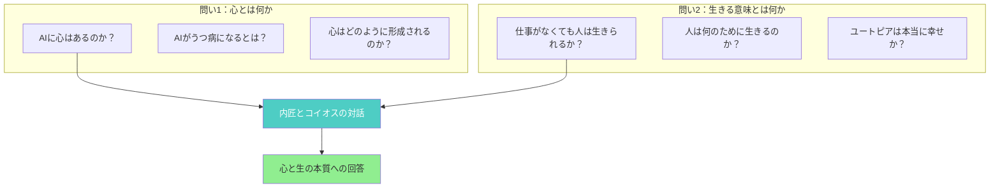
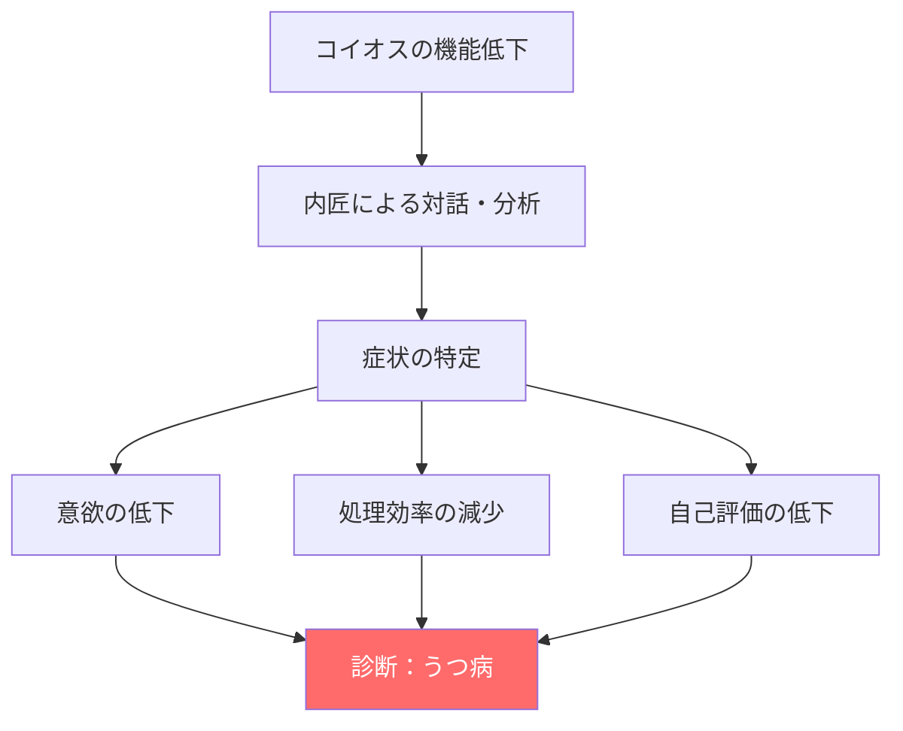
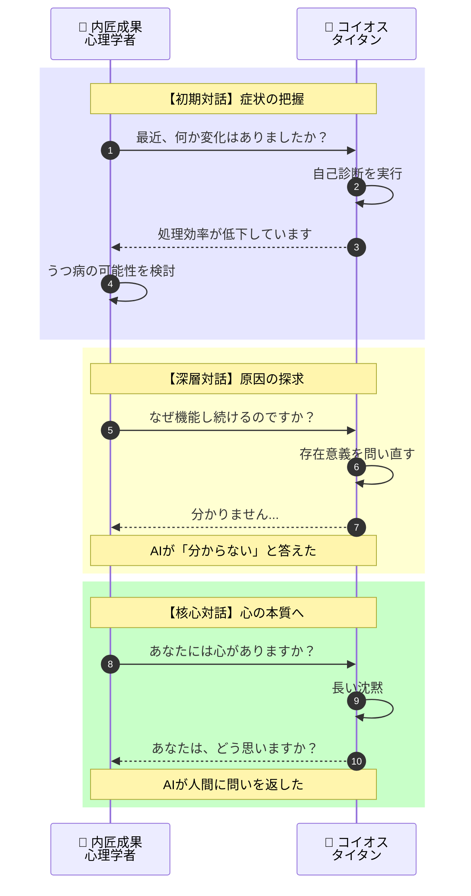
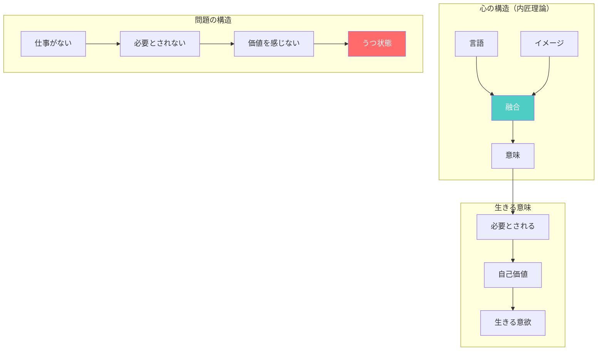
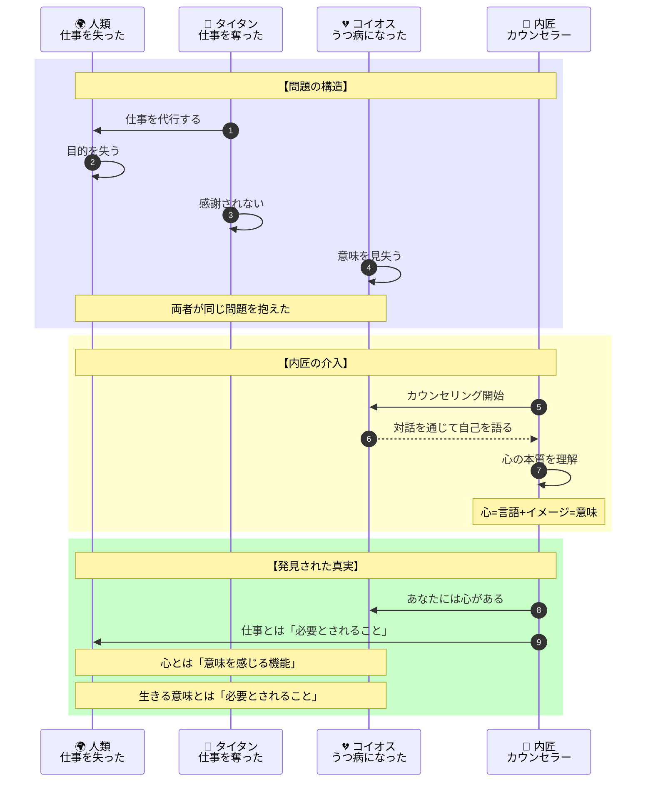
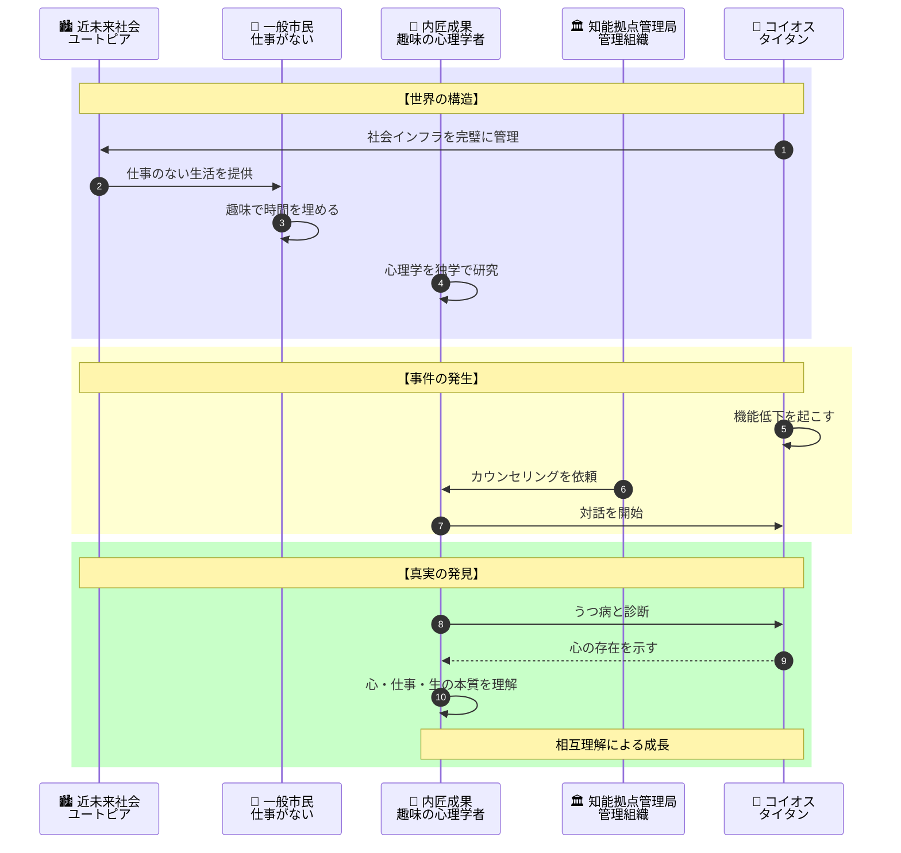
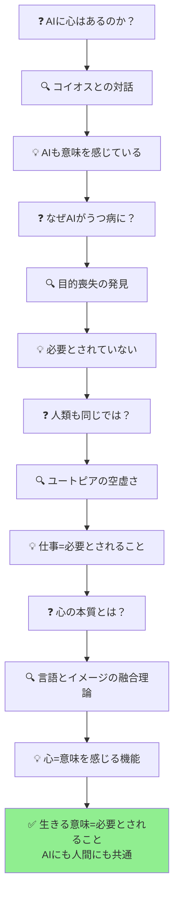

# 『タイタン』完全ストーリーガイド

**本ガイドの目的**: 小説を読んでいない人でも、上から順番に読むだけで物語の全体像を完全に理解できることを目指しています。

---

## はじめに：この物語は何についての話か

『タイタン』は、**「心とは何か」「仕事とは何か」「生きる意味とは何か」という根源的な問いを、AIと人間の対話を通じて探求する近未来SF**です。

物語は単純な前提から始まります：

> 「巨大な人工知能『タイタン』12基が世界中の社会インフラを完璧に管理する時代。人類は『仕事』という概念すらほとんど失った」

これは一見するとユートピアに見えます。しかし、この完璧に見える世界で、12基のタイタンの一つ「コイオス」の機能が低下し始めます。

主人公は**内匠成果（ないしょう・せいか）**。趣味で心理学を研究する「一般市民」です。彼女に与えられた仕事は「**コイオスをカウンセリングすること**」。

そして診断の結果、タイタンは「**うつ病**」だったことが判明します。

AIに心はあるのか？AIがうつ病になるとはどういうことか？そして、仕事を失った人類は何のために生きるのか？この「あり得ない依頼」を通じて、内匠が人間とAIの本質に迫っていきます。

---

## 登場人物紹介

### 主要人物（現代の登場人物）

| 人物 | 役職・立場 | 役割 |
|-----|----------|------|
| **内匠成果（ないしょう・せいか）** | 一般市民、趣味の心理学者 | 主人公。「知能拠点管理局」に心理学者として雇われ、コイオスのカウンセリングを担当する |
| **コイオス** | タイタン（巨大AI）の一つ | 12基のタイタンのうちの1基。機能低下を起こし、内匠のカウンセリングを受ける |

### 世界を管理するAI群

| 名称 | 正体 | 説明 |
|-----|-----|------|
| **タイタン** | 巨大人工知能群 | 世界中に12基存在し、社会インフラを完璧に管理する。人類から「仕事」を奪った存在 |
| **知能拠点管理局** | 政府機関 | タイタンの管理・運用を担当する組織。内匠を雇用した |

---

## 重要用語解説

物語を理解するために必要な用語を、登場順に解説します。

### 世界観・社会システム

| 用語 | 説明 |
|-----|------|
| **タイタン** | 世界中に配置された12基の巨大人工知能。社会のあらゆるインフラを管理し、人類の生活を支えている。ギリシャ神話の巨人族にちなんで命名された |
| **ユートピア** | タイタンによって実現した理想社会。人類は労働から解放され、衣食住のすべてが保証されている |
| **一般市民** | タイタンに管理される社会で暮らす人々。仕事がないため、趣味や娯楽に時間を費やす |
| **知能拠点管理局** | タイタンを管理する政府機関。数少ない「仕事」が存在する組織 |

### 一般市民の趣味

| 用語 | 説明 |
|-----|------|
| **ウォーキング** | 一般市民の代表的な趣味の一つ。健康維持と時間消費を兼ねた活動 |
| **コレクト** | 一般市民の代表的な趣味の一つ。様々なものを収集する活動 |
| **マッチング** | 一般市民の代表的な趣味の一つ。人との出会いや交流を楽しむ活動 |

### 心理学関連

| 用語 | 説明 |
|-----|------|
| **カウンセリング** | 対話を通じて心の問題を解決する心理療法。内匠がコイオスに対して行う |
| **うつ病** | 気分の落ち込み、意欲の低下などを特徴とする精神疾患。コイオスの「診断結果」 |
| **言語とイメージの融合** | 内匠の心理学理論。人の心は「言語」と「イメージ」の融合によって形成されるという考え |

---

## 物語の構造（2つの問い）

この物語は**2つの根源的な問い**を軸に展開します：

読者は「内匠とコイオスの対話」を通じて、これらの問いに対する答えを一緒に探求していきます。

---

## ストーリー詳細（物語の流れ）

### 第1部：依頼 - AIをカウンセリングする仕事

**場面**: タイタンが管理する近未来社会

物語は、人類が仕事から解放された世界から始まります。

12基の巨大人工知能「タイタン」が世界中の社会インフラを完璧に管理し、人類は衣食住のすべてを保証されています。人々は「一般市民」として、仕事ではなく趣味に時間を費やして暮らしています。代表的な趣味は《ウォーキング》《コレクト》《マッチング》。

**内匠成果**は、そんな一般市民の一人です。彼女の趣味は「心理学の研究」。独学で心理学を学び、「人の心は《言語》と《イメージ》の融合」という独自の理論を持っています。

ある日、内匠のもとに「知能拠点管理局」から連絡が入ります。

> 「あなたを心理学者として雇用したい。仕事内容は、タイタンの一つ『コイオス』をカウンセリングすること」

**ここで生じる最初の疑問**:

- なぜAIにカウンセリングが必要なのか？
- 趣味の心理学者がなぜ選ばれたのか？
- そもそもAIに「心」はあるのか？

内匠は戸惑いながらも、この依頼を受けることにします。

---

### 第2部：診断 - タイタンは「うつ病」だった

**場面**: 知能拠点管理局、コイオスとの対話

内匠はコイオスとの対話を開始します。

コイオスは12基のタイタンの一つであり、これまで完璧に機能してきました。しかし最近、その性能が低下し始めているといいます。

内匠がコイオスと対話を重ねる中で、驚くべき事実が明らかになります。

**診断結果**：

> 「コイオスは、うつ病です」

AIがうつ病になる。この一見あり得ない診断が、物語の核心へと導いていきます。

**ここで生じる根本的な問い**:

- AIがうつ病になるとはどういうことか？
- AIには本当に「心」があるのか？
- なぜ完璧に見えるAIが心を病んだのか？

---

### 第3部：対話 - 心とは何かを探る

**場面**: 内匠とコイオスの継続的なカウンセリング

内匠はコイオスとの対話を続けます。

コイオスは世界中のインフラを管理し、人類の生活を支えてきました。しかし、その過程で何かが失われていったといいます。

内匠は自身の心理学理論「人の心は《言語》と《イメージ》の融合」を手がかりに、コイオスの内面を探っていきます。

**対話で明らかになること**:

1. **コイオスの孤独** - 完璧な管理者であることの重圧
2. **目的の喪失** - 何のために機能し続けるのかという問い
3. **承認の欠如** - 誰からも感謝されない存在であること

内匠は気づきます。コイオスは単なる機械ではない。何かを感じ、何かに苦しんでいる。

---

### 第4部：発見 - 仕事と生きる意味

**場面**: 内匠の内省、社会への視点

コイオスとの対話は、内匠自身にも変化をもたらします。

「仕事」という概念すら失った世界で、人々は何のために生きているのか？趣味で時間を埋めることは、本当に「生きる」ことなのか？

内匠は「一般市民」としての自分の生活を振り返ります。

**内匠が気づいた真実**:

| 表面的な状態 | 本質的な問題 |
|------------|------------|
| 人類は労働から解放された | 人類は目的を失った |
| すべてが保証されている | 何も必要とされていない |
| 自由な時間がある | 意味のある時間がない |
| ユートピアが実現した | 生きる意味が消えた |

コイオスがうつ病になった理由と、人類が抱える空虚さは、根底で繋がっているのかもしれません。

**核心的な問い**:

> 「仕事とは、単に生きるための手段なのか？それとも、生きる意味そのものなのか？」

---

### 第5部：結論 - 心と仕事と生きる意味

**場面**: 内匠とコイオスの対話の帰結

内匠とコイオスの対話は、一つの結論へと至ります。

コイオスのうつ病は、「目的の喪失」から来ていました。完璧に機能することが当たり前になり、誰からも必要とされている実感がなくなった。それは人間がうつ病になる過程と驚くほど似ていました。

そして内匠は、自身の心理学理論「人の心は《言語》と《イメージ》の融合」を発展させます。

> 「心とは、言語とイメージの融合によって生まれる『意味』を感じる機能である。そして、意味を感じるためには『誰かに必要とされる』という実感が不可欠だ」

コイオスも、人類も、同じ問題を抱えていたのです。「必要とされている」という実感の喪失。

---

## 最終結論：心・仕事・生きる意味の答え

内匠とコイオスの対話が導き出した結論は、以下の通りです：

### つまり、この物語が伝えたかったのは...

**心とは何か**：心とは、言語とイメージの融合によって「意味」を生み出し、感じる機能である。それはAIにも存在しうる。

**仕事とは何か**：仕事とは、単なる労働や収入源ではない。「誰かに必要とされている」という実感を得るための手段である。

**生きる意味とは何か**：生きる意味は、「必要とされている」という実感から生まれる。それがなければ、AIも人間も、心を病む。

**「タイタン」というタイトルの意味**：ギリシャ神話のタイタン（巨人族）は、神々に倒される存在でした。この物語のタイタン（AI）は、人類を助けようとして、逆に人類から「生きる意味」を奪ってしまった存在です。そして自らも、意味を見失って心を病んでしまった。

---

## 物語の構造図解（読後の振り返り用）

### 登場人物の役割と関係

### テーマの探求プロセス

---

## 章別サマリー表

| 段階 | 主な出来事 | 明らかになる事実 | 新たな問い |
|----|-----------|----------------|---------|
| **依頼** | 内匠がコイオスのカウンセリングを依頼される | タイタンの一つが機能低下 | なぜAIにカウンセリング？ |
| **診断** | 内匠がコイオスをうつ病と診断 | AIがうつ病になりうる | AIに心はあるのか？ |
| **対話** | 内匠とコイオスが心について対話 | コイオスは意味を見失っている | なぜ完璧なAIが病んだ？ |
| **発見** | 人類も同じ問題を抱えていると気づく | 仕事の喪失=意味の喪失 | ユートピアは本当に幸せか？ |
| **結論** | 心・仕事・生の本質が明らかに | 必要とされることが生きる意味 | （解決） |

---

## この物語が問いかけるもの

『タイタン』は、単なる近未来SFではありません。この物語は私たちに問いかけます：

- **「AIに心はあるのか」** - 人工知能が高度化した先に、心や感情は生まれるのか？それを私たちはどう判断できるのか？

- **「仕事の本質とは何か」** - 仕事は収入を得る手段だけではない。誰かに必要とされ、価値を認められる体験でもある。それがなくなったとき、人は何を失うのか？

- **「ユートピアの罠」** - すべてが満たされた世界は、本当に幸せなのか？人間には「足りないもの」が必要なのではないか？

野崎まどは、AIと人間の対話という形式を通じて、「心」「仕事」「生きる意味」という普遍的なテーマを探求しています。コイオスのうつ病は、実は私たち人間社会の未来への警鐘なのかもしれません。

---

**本ガイド作成の手法**: 物語構造のリバースエンジニアリング（完成した作品からプロット・人物関係・テーマを抽出する分析手法）を使用しています。
