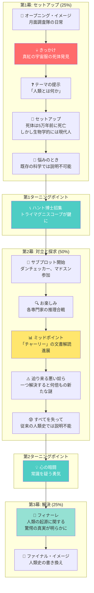
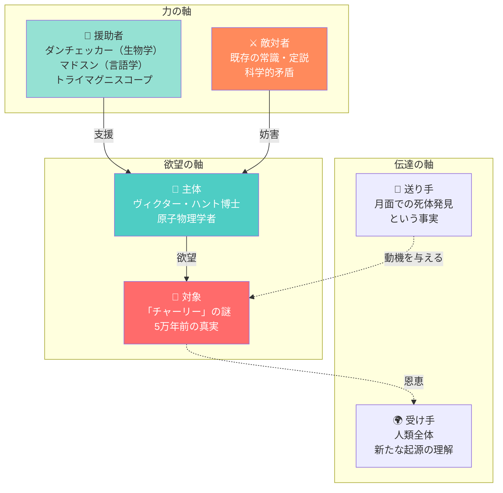
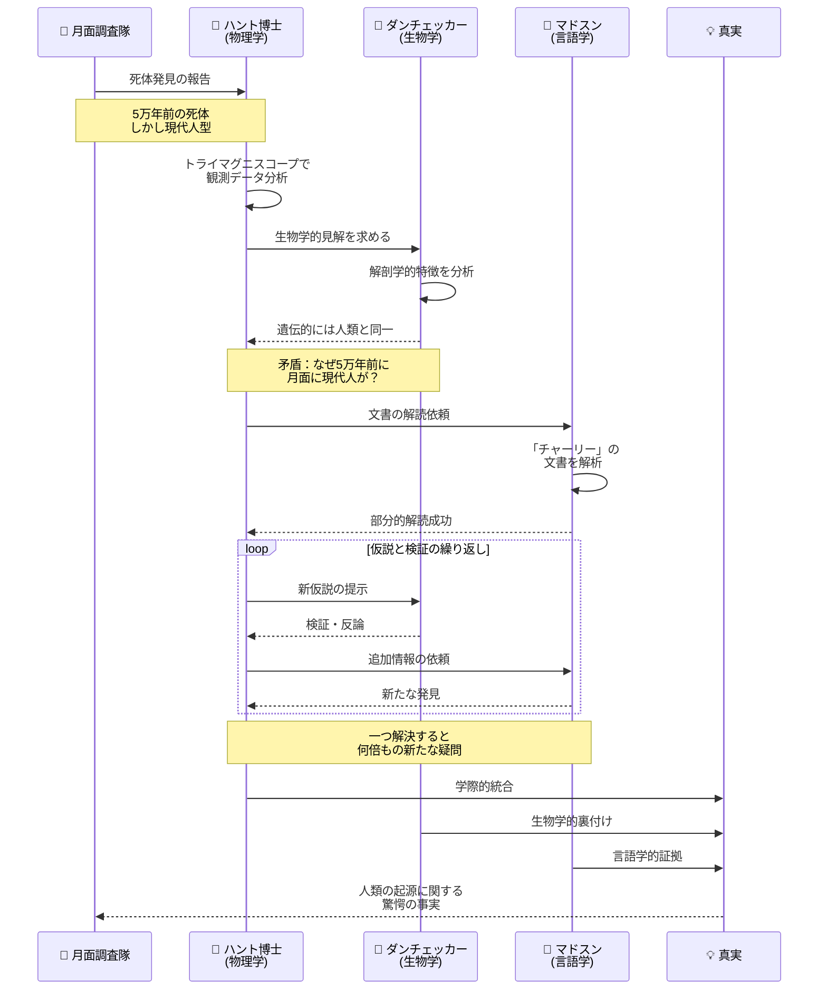
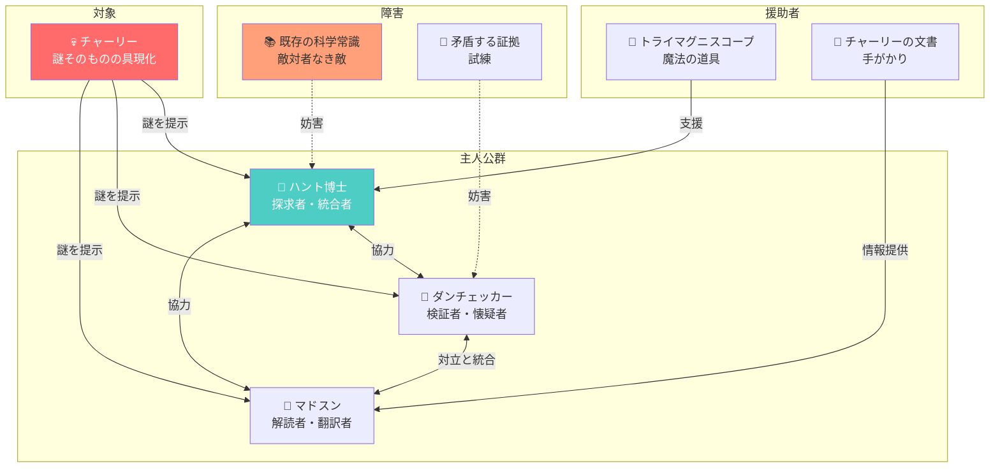
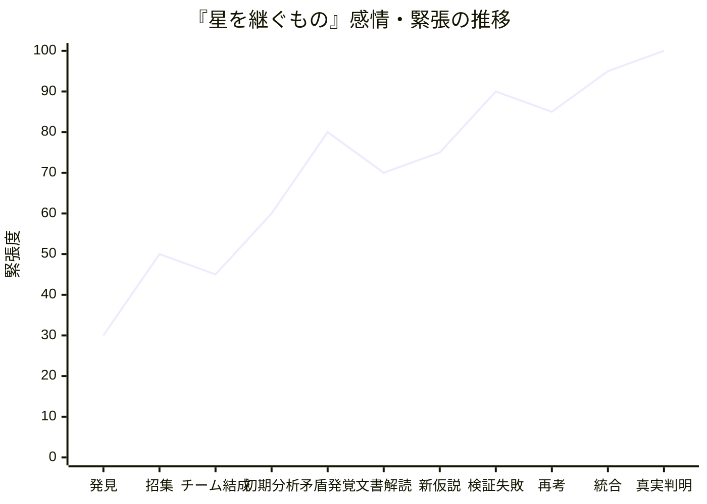
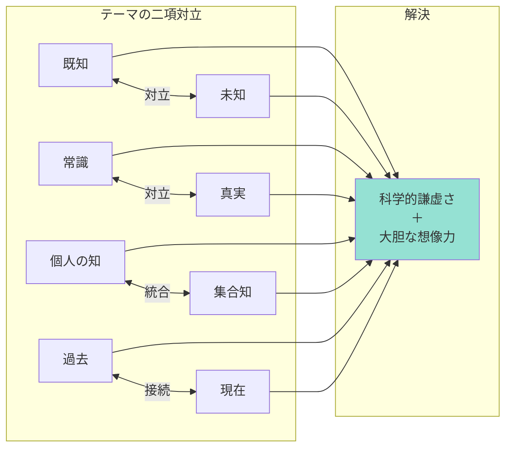

# 『星を継ぐもの』物語構造分析

## 1. プロット構造（Save the Cat 15ビート風）

---

## 2. 登場人物関係図（グレマスのアクタンモデル）

---

## 3. 科学的推理のシーケンス（専門家の協働プロセス）

---

## 4. 謎の階層構造（バルトの謎のコード風）

```mermaid
flowchart LR
    subgraph MYSTERY1["第1層の謎"]
        M1A[❓ 死体は誰か？]
        M1B[🔍 調査: どの基地にも所属なし]
        M1C[💀 発見: 世界のいかなる人間でもない]
    end
    
    subgraph MYSTERY2["第2層の謎"]
        M2A[❓ なぜ5万年前に死亡？]
        M2B[🔍 調査: 科学的年代測定]
        M2C[🧬 発見: しかし生物学的には現代人]
    end
    
    subgraph MYSTERY3["第3層の謎"]
        M3A[❓ なぜ月面にいた？]
        M3B[🔍 調査: 文書解読・技術分析]
        M3C[📜 発見: 高度な宇宙技術の痕跡]
    end
    
    subgraph MYSTERY4["最深層の謎"]
        M4A[❓ 人類の起源とは？]
        M4B[🔍 調査: 全証拠の統合]
        M4C[🌟 発見: 驚愕の真実]
    end
    
    M1A --> M1B --> M1C
    M1C -.->|新たな疑問| M2A
    M2A --> M2B --> M2C
    M2C -.->|新たな疑問| M3A
    M3A --> M3B --> M3C
    M3C -.->|新たな疑問| M4A
    M4A --> M4B --> M4C
    
    style M1C fill:#ffcccb
    style M2C fill:#ffcccb
    style M3C fill:#ffcccb
    style M4C fill:#90EE90
```

---

## 5. キャラクターの機能分類（プロップ風）

---

## 6. 物語の感情曲線（Story Grid風）

---

## 7. テーマの構造（二項対立）

---

## 分析まとめ

| フレームワーク | 『星を継ぐもの』での適用 | 可視化の効果 |
|--------------|----------------------|-------------|
| Save the Cat 15ビート | ミステリ型プロットの構造把握 | 物語の転換点が明確に |
| グレマスのアクタンモデル | 「敵」が概念（常識）である特殊性 | 力学構造の理解 |
| シーケンス図 | 学際的協働プロセスの可視化 | 知の統合過程が見える |
| バルトの謎のコード | 謎の入れ子構造 | 読者の興味維持の仕組み |
| プロップの機能分類 | 人物の「役割」としての機能 | キャラクターの必然性 |
| 感情曲線 | 知的興奮の波 | ペーシングの分析 |

### 本作の構造的特徴

1. **敵対者なき物語**: 通常のアクタンモデルでは「敵対者」は人物だが、本作では「既存の常識」という概念が敵
2. **集合主人公**: ハント一人ではなく、専門家チーム全体が主人公機能を分担
3. **逆向きのミステリ**: 「これから何が起こるか」ではなく「過去に何が起きたか」を追う
4. **階層的謎構造**: 一つ解くと新たな謎が生まれる入れ子構造がページターナー効果を生む