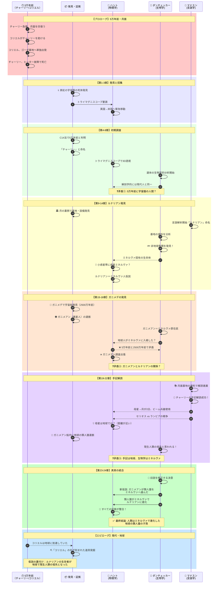
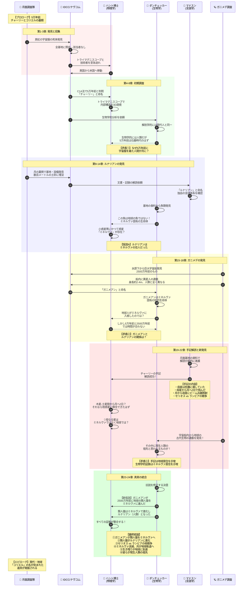
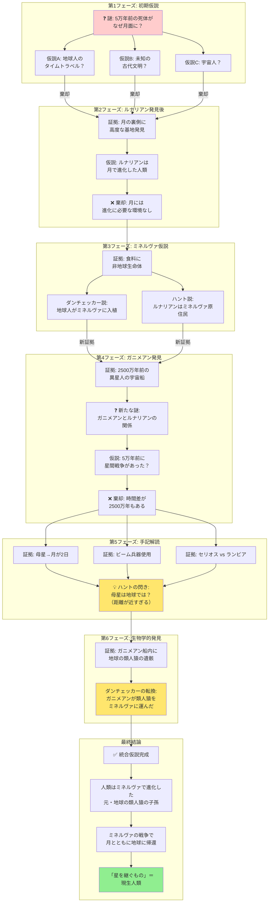
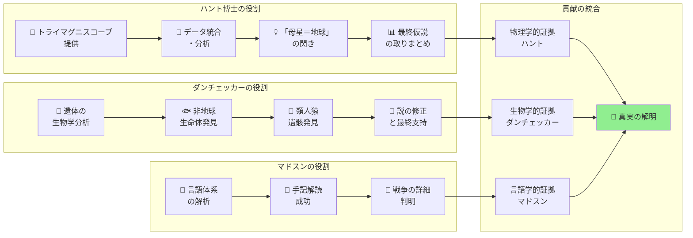
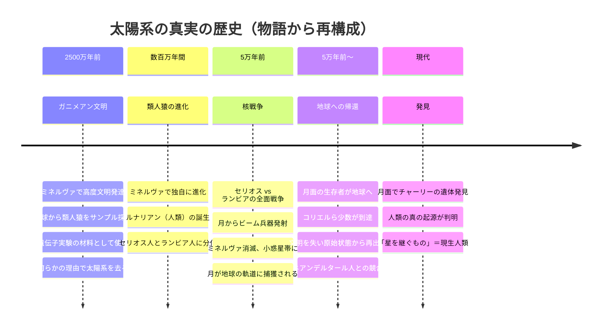

# 『星を継ぐもの』物語構造分析【完全版・ネタバレあり】

## 作品情報
- **構成**: プロローグ ＋ 24章 ＋ エピローグ
- **著者**: ジェイムズ・P・ホーガン
- **分析目的**: 物語のリバースエンジニアリング・スキル化のためのサンプル

---

## 1. 全体スイムレーン図（章展開×登場人物の動き）

---

## 2. 詳細シーケンス図（調査プロセスの時系列）

---

## 3. 仮説の変遷図（科学的推理のプロセス）

---

## 4. 章別サマリー表

| 章 | 主な出来事 | 新たな証拠/発見 | 仮説の変化 |
|----|-----------|----------------|-----------|
| **プロローグ** | チャーリーとコリエルが月面で苦闘 | - | （謎の提示） |
| **1-3章** | ハント博士招集、死体発見の報告 | 5万年前の死体、真紅の宇宙服 | 不可能な謎の認識 |
| **4-8章** | 初期調査、生物学的分析 | 解剖学的に現代人と同一 | 時間的矛盾の確認 |
| **9-14章** | 月の裏側探査 | 基地発見、非地球魚類 | 「ルナリアン」命名、ミネルヴァ仮説 |
| **15-18章** | ガニメデ調査 | 2500万年前の宇宙船、ガニメアン | 時間差の矛盾発覚 |
| **19-22章** | 手記解読 | 母星→月2日、ビーム兵器、戦争 | 母星＝地球説の浮上 |
| **23-24章** | 仮説の統合 | 船内の類人猿遺骸 | 最終仮説の完成 |
| **エピローグ** | 地球でコリエルの道具発見 | - | 仮説の裏付け |

---

## 5. 登場人物スイムレーン（役割と貢献）

---

## 6. 物語の「真実」タイムライン（作中で明かされる太陽系の歴史）

---

## 7. スキル化のための抽出パターン

### 物語から自動抽出すべき要素

| 要素 | 『星を継ぐもの』での例 | 抽出方法 |
|-----|----------------------|---------|
| **登場人物** | ハント、ダンチェッカー、マドスン、チャーリー | 固有名詞＋役割記述 |
| **専門分野** | 物理学、生物学、言語学 | 人物紹介時の記述 |
| **謎/問い** | 5万年前の死体はなぜ月に？ | 疑問文、矛盾の記述 |
| **証拠/発見** | 非地球魚類、ガニメアン宇宙船 | 「発見」「判明」等の動詞 |
| **仮説** | ミネルヴァ入植説、地球起源説 | 「〜ではないか」「仮説」 |
| **仮説の棄却** | 時間差の矛盾で棄却 | 「しかし」「矛盾」 |
| **最終結論** | 人類はミネルヴァで進化した | 終盤の断定的記述 |

### 図表タイプの選択基準

| 物語の特徴 | 推奨図表 |
|-----------|---------|
| 複数専門家の協働 | **スイムレーン図** |
| 時系列の展開 | **シーケンス図** |
| 仮説の変遷 | **フローチャート** |
| 人物関係 | **ER図** |
| 感情/緊張の推移 | **XYチャート** |
| 歴史の再構成 | **タイムライン** |

---

## まとめ：スキルへの応用ポイント

1. **章構成の把握**: プロローグ＋本編＋エピローグの3部構成を認識
2. **スイムレーン図**: 複数の視点（人物・チーム）を並行追跡
3. **シーケンス図**: 対話・発見・推論のやり取りを時系列で可視化
4. **仮説変遷図**: 科学的推理小説に特有の「仮説→検証→棄却→新仮説」サイクル
5. **真実のタイムライン**: 作中で明かされる「過去の真実」を再構成