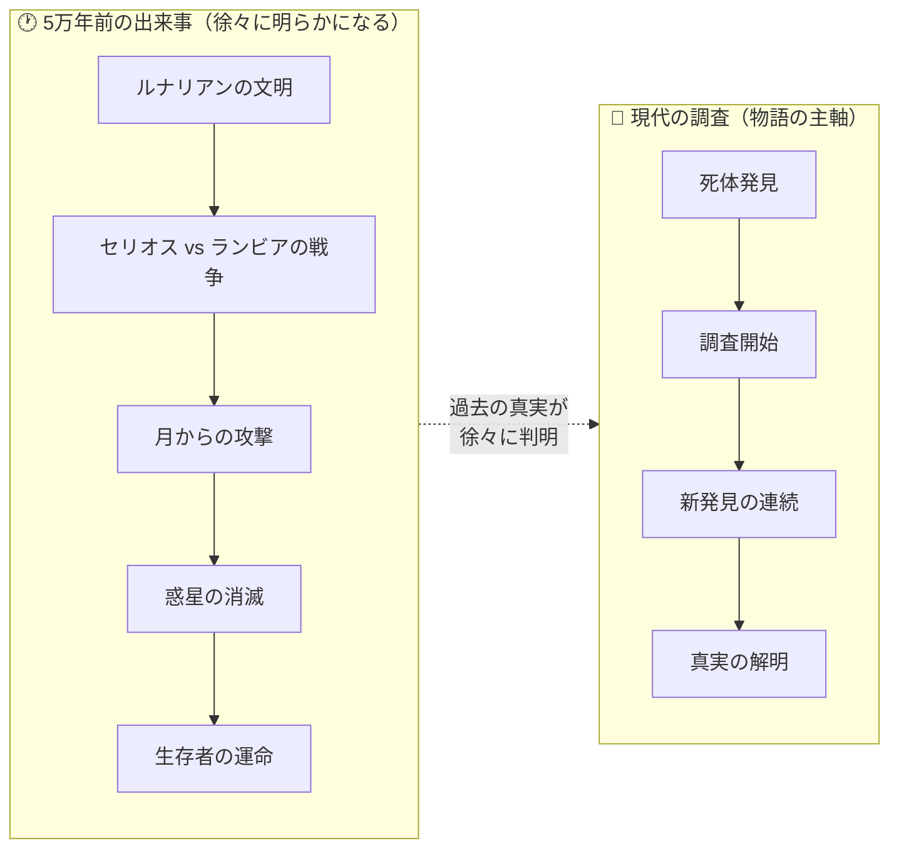
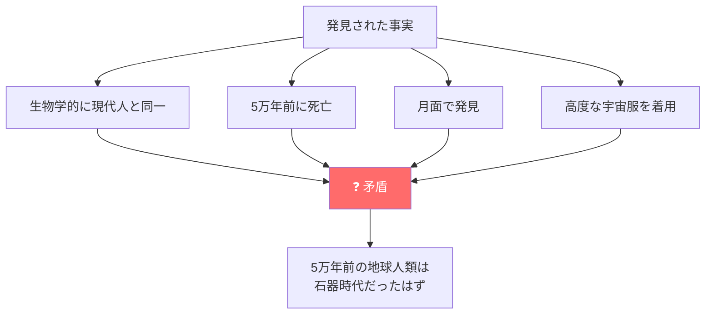
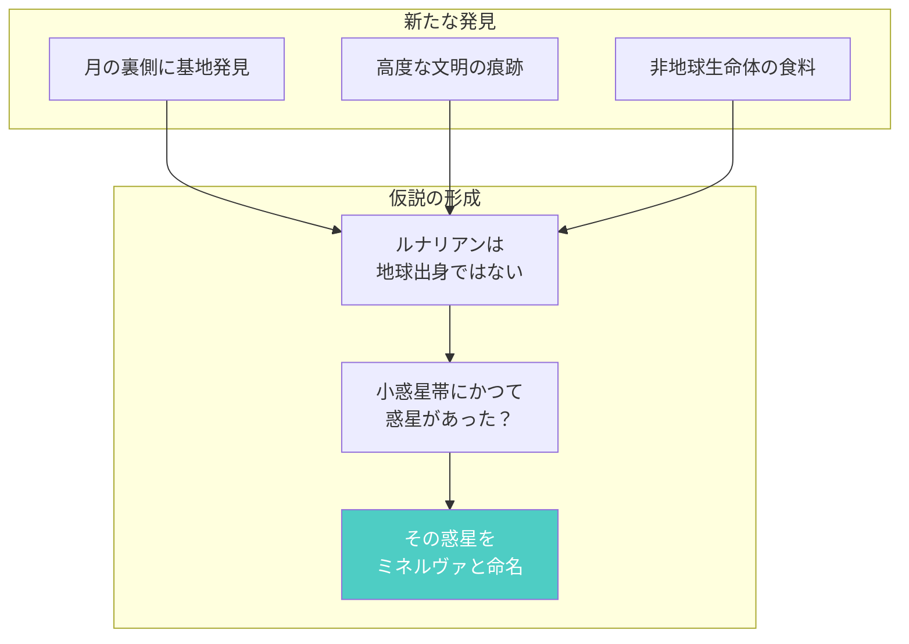
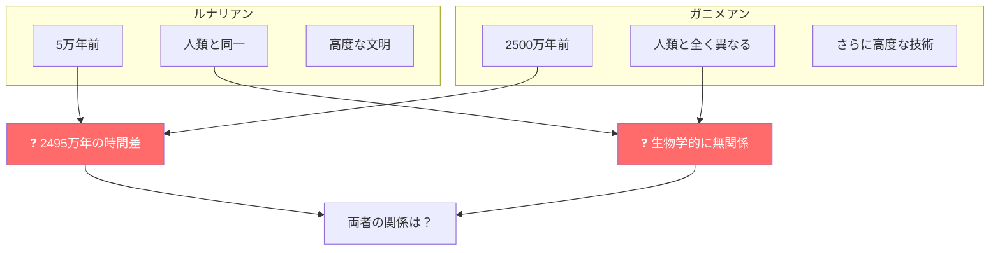
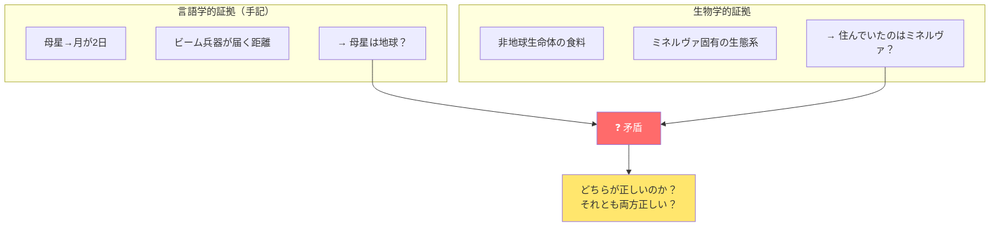
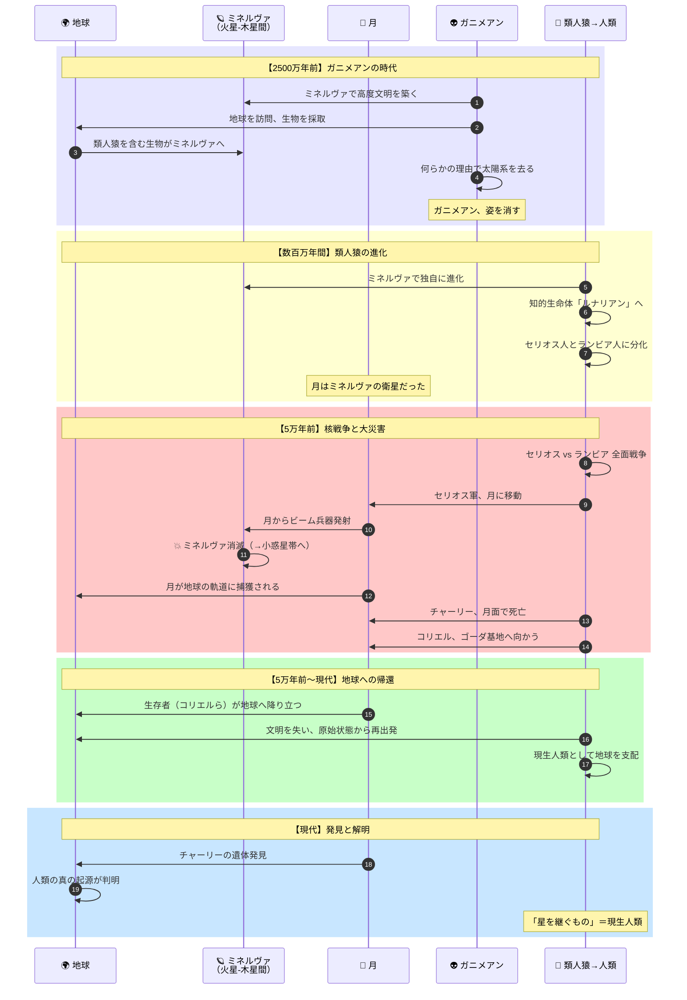
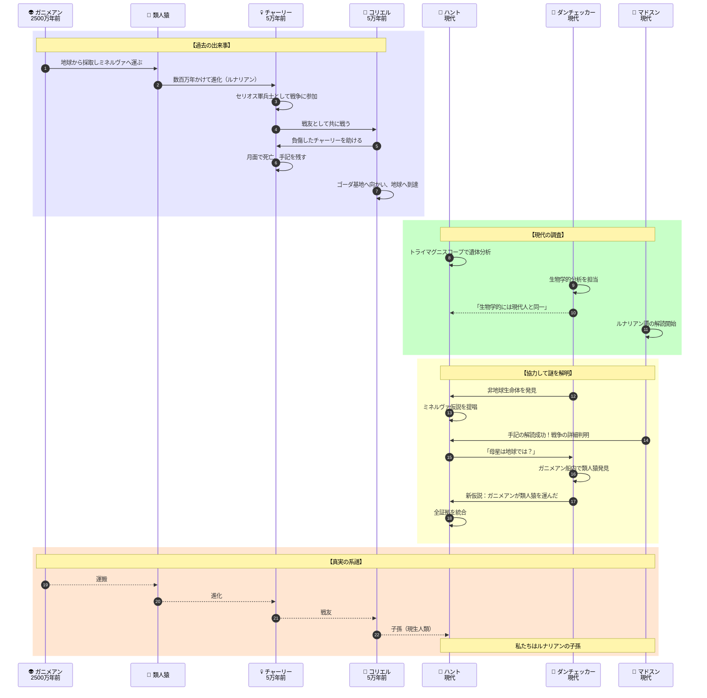
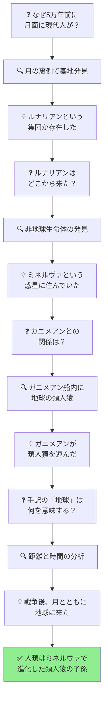

# 『星を継ぐもの』完全ストーリーガイド

**本ガイドの目的**: 小説を読んでいない人でも、上から順番に読むだけで物語の全体像を完全に理解できることを目指しています。

---

## はじめに：この物語は何についての話か

『星を継ぐもの』は、**「人類はどこから来たのか」という謎を科学者たちが解き明かしていくSFミステリ**です。

物語は単純な一文から始まります：

> 「月面で真紅の宇宙服を着た死体が発見された。調査の結果、それは5万年以上前に死亡していた」

5万年前といえば、地球ではネアンデルタール人やクロマニョン人が石器を使っていた時代。なぜそんな時代に、宇宙服を着た「現代人と生物学的に同じ人間」が月にいたのか？この「あり得ない謎」を、物理学者・生物学者・言語学者たちがチームで解明していきます。

そして最終的に明らかになるのは、**人類の起源に関する驚愕の真実**です。

---

## 登場人物紹介

### 現代の調査チーム（2027年頃）

| 人物 | 役職・専門 | 役割 |
|-----|----------|------|
| **ヴィクター・ハント** | 原子物理学者 | 主人公。「トライマグニスコープ」という物体内部を透視できる装置の発明者。各分野の情報を統合し、最終的な仮説を導く |
| **クリスチャン・ダンチェッカー** | 生物学者 | 遺体や生物サンプルを分析。当初は保守的な仮説を主張するが、証拠に基づいて柔軟に考えを修正できる科学者 |
| **ドン・マドスン** | 言語学者 | 発見された文書や手記の解読を担当。言語解析から重要な事実を明らかにする |
| **グレッグ・コールドウェル** | 国連宇宙軍本部長 | ハントを調査チームにスカウトした人物。プロジェクト全体を統括 |

### 5万年前の人物（物語の「謎」の中心）

| 人物 | 正体 | 説明 |
|-----|-----|------|
| **チャーリー** | ルナリアンの兵士 | 月面で発見された死体につけられた愛称。真紅の宇宙服を着ており、手記を所持していた。本名は物語終盤まで不明 |
| **コリエル** | チャーリーの戦友 | チャーリーの手記に登場する人物。「巨人」と呼ばれている。チャーリーを助けて基地へ向かった |

---

## 重要用語解説

物語を理解するために必要な用語を、登場順に解説します。

### 場所・天体

| 用語 | 説明 |
|-----|------|
| **月面** | 物語の発端となる場所。2027年頃、人類は月に複数の基地を建設し調査活動を行っている |
| **ガニメデ** | 木星の衛星。物語中盤で重要な発見がある場所 |
| **ミネルヴァ** | かつて火星と木星の間に存在したとされる惑星。現在は小惑星帯となっている。物語の核心に関わる |
| **ゴーダ基地** | チャーリーの手記に登場する月面の軍事基地。チャーリーとコリエルが目指した場所 |

### 種族・集団

| 用語 | 説明 |
|-----|------|
| **ルナリアン** | 月面で発見されたチャーリーのような人々の総称。「月の人」という意味で調査チームが命名。生物学的には現代人と同一だが、5万年前に高度な文明を持っていた |
| **ガニメアン** | ガニメデで発見された異星人。身長約2.4メートルの大柄な種族で、人類とは全く異なる外見。2500万年前に存在した |
| **セリオス人** | ルナリアンの一派。チャーリーが属していた勢力 |
| **ランビア人** | ルナリアンの一派。セリオス人と敵対し、核戦争を行った |

### 技術・装置

| 用語 | 説明 |
|-----|------|
| **トライマグニスコープ** | ハント博士が発明した装置。ニュートリノ・ビームで物体内部を詳細に3D透視できる。チャーリーの遺体分析に使用された |
| **アニヒレーター** | ルナリアンが使用した殲滅兵器。ビーム攻撃が可能 |

---

## 物語の時系列（2つの時間軸）

この物語には**2つの時間軸**が並行して存在します：

読者は「現代の調査チーム」の視点で物語を追いながら、5万年前に何が起きたのかを一緒に解き明かしていきます。

---

## ストーリー詳細（章ごとのあらすじ）

### プロローグ：5万年前、月面にて

物語は謎めいたシーンから始まります。

**場面**: 荒涼とした月面。一人の男が負傷し、苦しみながら歩いている。

彼は戦闘で傷を負い、体が言うことを聞かない。宇宙服のヒーターも故障しかけている。彼が目指しているのは「ゴーダ基地」という場所だ。そこに生存者がいるかもしれない。

そこへ仲間の「コリエル」が現れる。手記の中で「巨人」と呼ばれるコリエルは、まだ元気だ。コリエルは負傷した男を助け、こう言う：

> 「ここで休んでいろ。俺がゴーダから救援隊を呼んでくる」

コリエルは単独でゴーダ基地へ向かった。負傷した男は洞窟で待つことにしたが、やがて寒さで意識が遠のいていく...

**この時点での謎**:
- この男は誰なのか？
- 「コリエル」とは何者か？なぜ「巨人」と呼ばれるのか？
- 彼らはなぜ月面で戦っていたのか？
- ゴーダ基地とは何か？

これらの謎は、物語が進むにつれて徐々に明らかになっていきます。

---

### 第1〜3章：発見と招集

**場面**: 2027年頃の地球とアメリカ

月面調査隊から驚くべき報告が入る。**真紅の宇宙服を着た人間の死体**が発見されたのだ。

すぐに各国の月面基地に照会が行われるが、行方不明者は誰もいない。世界中のどの記録にも該当者がいない。いったいこの死体は誰なのか？

この謎を解明するため、イギリスのメタダイン社で働く**ヴィクター・ハント博士**に緊急の招集がかかる。彼が発明した「トライマグニスコープ」という装置が、死体の内部構造を詳細に分析できるからだ。

ハントは同僚のロブ・グレイとともに、装置を携えてアメリカへ向かう。

---

### 第4〜8章：衝撃の分析結果

**場面**: アメリカの研究施設

地球に運ばれた死体の分析が始まる。生物学者の**ダンチェッカー**が解剖学的な調査を担当する。

**判明した事実**:
1. **生物学的には現代人と同一** - DNAも骨格も、現代のホモ・サピエンスと区別がつかない
2. **死亡時期は5万年以上前** - 炭素14年代測定法（C14法）による結果
3. **高度な技術の痕跡** - 宇宙服は現代の技術に匹敵するか、それ以上

この死体は「**チャーリー**」と名付けられた。

**ここで生じる根本的な矛盾**:

5万年前の地球では、人類はまだ石器時代だった。洞窟に住み、毛皮を着ていた時代だ。なぜそんな時代に、宇宙服を着た「現代人と同じ人間」が月にいたのか？

科学者たちは頭を抱える。既存のどんな理論でも、この矛盾を説明できない。

---

### 第9〜14章：月の裏側の秘密

**場面**: 月面（裏側）と地球の研究施設

月面調査がさらに進むと、**月の裏側**で驚くべき発見がある。

数百メートルの土砂に埋もれた状態で、**大規模な基地や設備の跡**が次々と見つかったのだ。これは明らかに高度な文明の痕跡だった。

言語学者の**マドスン**がチームに加わり、発見された文書の解読を開始する。彼らはこの謎の人類集団を「**ルナリアン**」（月の人）と名付けた。

一方、ダンチェッカーは基地で発見された**食料サンプル**を分析する。その中に魚のような生物が含まれていたが、調べてみると驚くべきことが分かった。

> 「この魚は、地球のどの魚とも違う。地球の生態系には存在しない生命体だ」

これはつまり、ルナリアンは**地球以外の場所で暮らしていた**ことを示唆している。

ハントは各種の証拠を検討し、一つの仮説を立てる：

> 「現在の小惑星帯の位置に、かつて惑星が存在したのではないか。そこにルナリアンは住んでいた」

この仮説上の惑星は「**ミネルヴァ**」と名付けられた。

---

### 第15〜18章：ガニメデの異星人

**場面**: 木星の衛星ガニメデ

物語は新たな展開を迎える。

木星の衛星**ガニメデ**の氷原の下から、**巨大な宇宙船の残骸**が発見されたのだ。しかもその宇宙船は、なんと**2500万年前**のものだった。

さらに衝撃的なのは、宇宙船の中で発見された**遺骸**だった。

その生命体は身長約2.4メートル。人類とは全く異なる外見で、明らかに**異星人**だった。この種族は発見場所にちなんで「**ガニメアン**」と名付けられた。

**ここで新たな矛盾が生じる**:

- ルナリアン（チャーリーたち）：**5万年前**、人類と生物学的に同一
- ガニメアン：**2500万年前**、人類とは全く異なる異星人

この2つの種族はどういう関係なのか？

ダンチェッカーは一つの仮説を提唱する：

> 「ガニメアンこそがミネルヴァの原住民で、ルナリアンは地球からミネルヴァに入植した人類の子孫ではないか」

つまり、地球人がミネルヴァに移住し、そこでガニメアンと出会い、やがて対立して戦争になった...という説だ。

しかしハントはこの説に納得できない。5万年前と2500万年前では、**時間差が大きすぎる**のだ。

ハントとダンチェッカーは直接ガニメデへ向かい、調査を続けることにする。

---

### 第19〜22章：チャーリーの手記

**場面**: ガニメデと地球（並行して進行）

マドスンの言語学チームに大きな進展があった。月面基地から発見された追加資料のおかげで、ルナリアン語の解読が**劇的に進んだ**のだ。

そしてついに、**チャーリーが所持していた手記**の内容が明らかになる。

**手記から判明した事実**:

1. **チャーリーの本名と所属**
   - 彼はセリオス軍の兵士だった
   - 母星では「セリオス」と「ランビア」という二大勢力が戦争状態にあった

2. **戦争の経緯**
   - 母星は危機的状況にあった
   - セリオス軍は月に移動し、月面から母星の敵（ランビア）に向けて**ビーム兵器（アニヒレーター）を発射**した
   - 作戦は成功したが、その後も月面での戦闘は続いた

3. **プロローグの場面の真相**
   - チャーリーとコリエルは、援軍を呼ぶためにゴーダ基地を目指していた
   - チャーリーは途中で力尽きた
   - コリエルは単独でゴーダ基地へ向かった

4. **重要な距離と時間の情報**
   - 母星から月まで**わずか2日**で移動した
   - 月から母星へビーム兵器を照射できる距離だった

**ここでハントは重大な矛盾に気づく**：

> 「待てよ。もしミネルヴァ（木星と土星の間）から月まで2日で来られるなら、他の惑星にも簡単に移住できたはずだ。なぜそうしなかった？」
> 
> 「そして、そんな長距離をビーム兵器で正確に狙うのは物理的に不可能だ。距離が遠すぎる」

この矛盾から、ハントは**衝撃的な仮説**に至る：

> 💡「チャーリーたちの母星は、ミネルヴァではなく**地球**だったのではないか？」

地球から月までなら2日は妥当だし、ビーム兵器の照射も可能だ。

---

しかし、この仮説は生物学的証拠と矛盾する。

同じ頃、ガニメデで調査を続けていたダンチェッカーは、ガニメアンの宇宙船内から**地球の古代生物のサンプル**を発見する。

その中に、**現生人類の祖先と思われる類人猿の遺骸**が含まれていた。

つまり、ガニメアンは2500万年前に地球から生物を**採取していた**のだ。

**2つの証拠が矛盾している**：

| 証拠の種類 | 示唆する内容 |
|-----------|-------------|
| チャーリーの手記 | 母星は地球（距離が近い） |
| 生物学的証拠 | ルナリアンはミネルヴァに住んでいた |

---

### 第23〜24章：真実の解明

**場面**: 研究施設

すべての証拠を前に、科学者たちは最終的な仮説の構築に挑む。

ダンチェッカーは、自分の従来の説を**修正する決断**をする。新たな証拠を無視することは、科学者として許されない。

彼は新しい仮説を提唱する：

> 「ガニメアンは2500万年前、地球から類人猿を含む様々な生物をミネルヴァに運んだ。
> 
> その類人猿がミネルヴァで独自に進化し、やがて知的生命体となった。それがルナリアンだ」

この仮説なら、**すべての証拠が矛盾なく説明できる**：

1. ✅ ルナリアンが生物学的に地球人と同じ理由 → 元は地球の類人猿だから
2. ✅ ルナリアンがミネルヴァの生態系の中で暮らしていた理由 → ミネルヴァで進化したから
3. ✅ ガニメアンの宇宙船に地球の生物がいた理由 → ガニメアンが地球から運んだから
4. ✅ 5万年前と2500万年前の時間差 → ガニメアンは去り、類人猿が進化する時間があった

**では、チャーリーの手記の「母星は地球」という証拠はどう説明する？**

ハントはさらに推論を進める：

> 「チャーリーたちにとっての『母星』は、確かに地球だった。
> 
> なぜなら、彼らはミネルヴァの戦争の後、**月とともに地球に来た**からだ」

---

## 最終結論：人類の真の起源

科学者たちがたどり着いた結論は、以下の通りです：

### つまり、現生人類とは...

私たち現生人類は、**ミネルヴァで進化したルナリアンの子孫**です。

元をたどれば地球の類人猿ですが、ガニメアンによってミネルヴァに運ばれ、そこで人類へと進化しました。5万年前の核戦争でミネルヴァが消滅した後、わずかな生存者が月とともに地球に「帰還」し、文明を失いながらも生き延びて、現在の人類となったのです。

**「星を継ぐもの」とは、私たち人類のこと**なのです。

---

### エピローグ：最後の証拠

物語の最後、地球の発掘現場で一つの道具が発見されます。

その道具には、**「コリエル」という名前が刻まれていました**。

プロローグでチャーリーを助け、ゴーダ基地へ向かったコリエル。彼は**地球にたどり着いていた**のです。

そして彼こそが、現生人類の祖先の一人だったのかもしれません。

---

## 物語の構造図解（読後の振り返り用）

### 登場人物の役割と関係

### 謎の解明プロセス

---

## 章別サマリー表

| 章 | 主な出来事 | 明らかになる事実 | 新たな謎 |
|----|-----------|----------------|---------|
| **プロローグ** | 負傷した男とコリエルが月面で苦闘 | （後に判明する伏線） | この男は誰？コリエルとは？ |
| **1-3章** | ハント博士が招集される | 月面で真紅の宇宙服の死体発見 | この死体は誰？ |
| **4-8章** | 遺体の分析 | 5万年前に死亡、生物学的に現代人 | なぜ5万年前に月に？ |
| **9-14章** | 月の裏側を調査 | 基地発見、非地球生命体 | ルナリアンの故郷は？ |
| **15-18章** | ガニメデ調査 | 2500万年前の異星人発見 | ガニメアンとルナリアンの関係は？ |
| **19-22章** | 手記の解読 | 戦争の詳細、母星が近い | 手記と生物学的証拠の矛盾 |
| **23-24章** | 仮説の統合 | 人類の真の起源 | （解決） |
| **エピローグ** | コリエルの道具発見 | コリエルは地球に到達していた | - |

---

## この物語が問いかけるもの

『星を継ぐもの』は、単なるSFミステリではありません。この物語は私たちに問いかけます：

- **「人類とは何か」** - 私たちを人類たらしめているものは何か？
- **「科学的思考とは何か」** - 証拠に基づいて仮説を立て、検証し、修正していく営み
- **「常識を疑う勇気」** - 「あり得ない」と思われる事実に直面したとき、常識の方を修正できるか

物語の科学者たちは、既存の理論では説明できない事実に直面し、理論そのものを修正する勇気を持ちました。その姿勢こそが、科学を前進させる原動力なのです。

---

**本ガイド作成の手法**: 物語構造のリバースエンジニアリング（完成した作品からプロット・人物関係・テーマを抽出する分析手法）を使用しています。