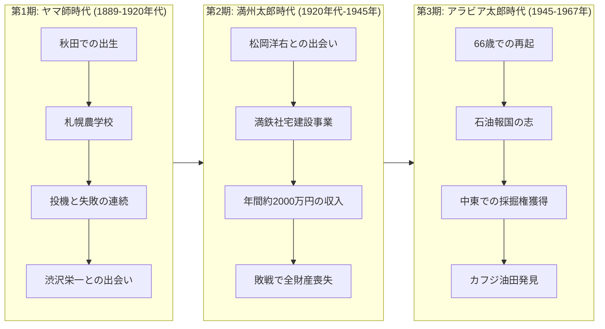
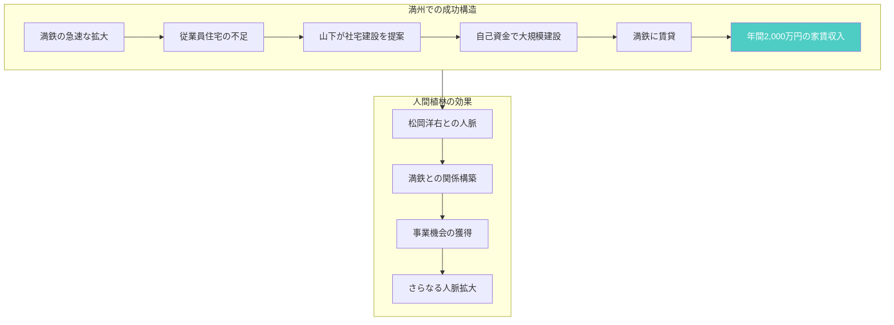
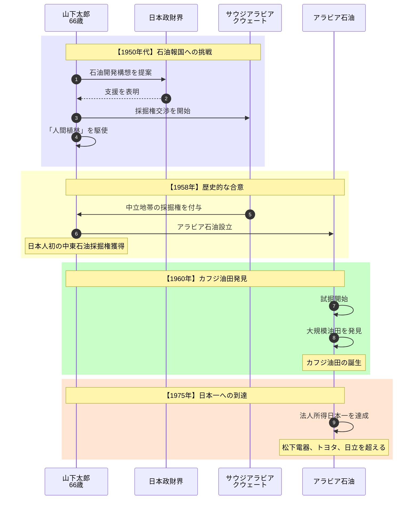
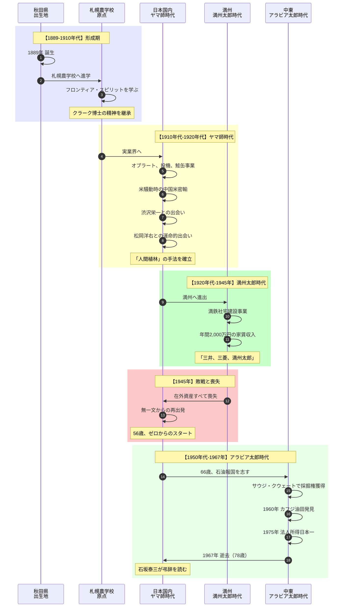
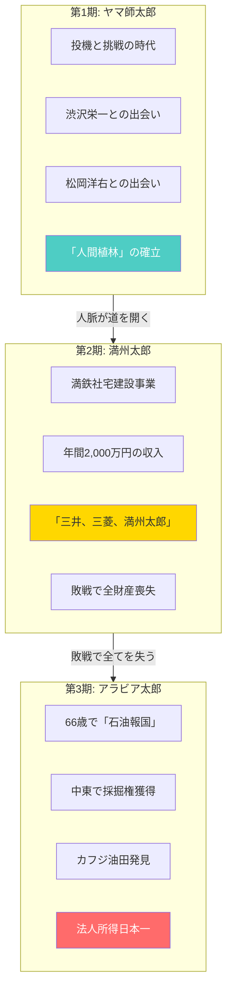
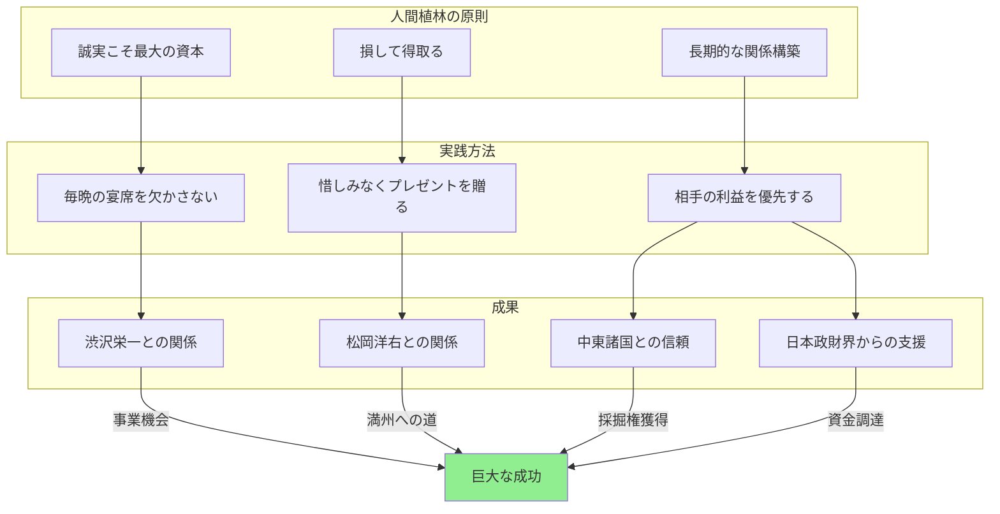

# 『ヤマ師 山下太郎のすべて』完全人物ガイド

**本ガイドの目的**: 本書を読んでいない人でも、上から順番に読むだけで山下太郎という人物の生涯と業績を完全に理解できることを目指しています。

---

## はじめに：この人物は何を成し遂げたのか

『ヤマ師 山下太郎のすべて』は、**「無一文から日本一の法人所得を達成した実業家」の76年の生涯を追うノンフィクション評伝**です。

物語は単純な事実から始まります：

> 「1975年、アラビア石油は法人所得で松下電器産業、トヨタ自動車、日立製作所を押さえて日本一となった。その創業者が山下太郎である」

明治・大正・昭和を駆け抜け、三度の「異名」を持った男。「ヤマ師太郎」から「満州太郎」へ、そして「アラビア太郎」へ。敗戦で全財産を失いながらも、66歳で「石油報国」を志し、中東で日本人初の石油採掘権を獲得した。

この「あり得ない復活劇」を、本書は丹念に追跡していきます。

そして最終的に明らかになるのは、**「人間植林」と呼ばれる独自の人脈構築術と、「損して得取る」大局観こそが、彼の成功の源泉だった**ということです。

---

## 登場人物紹介

### 山下太郎とその周辺

| 人物 | 役職・立場 | 役割 |
|-----|----------|------|
| **山下太郎** | 実業家（1889-1967） | 本書の主人公。秋田県出身。「ヤマ師太郎」「満州太郎」「アラビア太郎」と異名を変遷させながら、最終的にアラビア石油を創業 |
| **渋沢栄一** | 実業家・「日本資本主義の父」 | 山下の才覚を認め、ビジネスの道を拓く。「人間植林」の原点となる出会い |
| **松岡洋右** | 外交官・政治家 | 山下と運命的な出会いを果たす。後の満州事業への道を開く重要人物 |

### 時代を彩る人々

| 人物 | 役職・立場 | 説明 |
|-----|----------|------|
| **石坂泰三** | 経団連会長 | 山下の葬儀で弔辞を読む。財界の重鎮として山下を評価 |
| **クラーク博士** | 札幌農学校教頭 | 「Boys, be ambitious」の言葉で知られる。山下のフロンティア・スピリットの源泉 |

---

## 重要用語解説

物語を理解するために必要な用語を、登場順に解説します。

### 異名・呼称

| 用語 | 説明 |
|-----|------|
| **ヤマ師太郎** | 山下の最初の異名。投機的な事業で成功と失敗を繰り返した時代を象徴する呼称 |
| **満州太郎** | 満鉄社宅建設事業で巨額の富を築いた時代の異名。「三井、三菱、満州太郎」と並び称された |
| **アラビア太郎** | 中東で石油採掘権を獲得した晩年の異名。山下の集大成を象徴する |

### 経営哲学・人脈術

| 用語 | 説明 |
|-----|------|
| **人間植林** | 山下独自の人脈構築術。毎晩の宴席、プレゼント魔としての振る舞いなど、長期的な人間関係への投資を指す |
| **フロンティア・スピリット** | クラーク博士から受け継いだ開拓者精神。既存の枠にとらわれず、新領域を切り拓く姿勢 |
| **損して得取る** | 山下の経営哲学。目先の利益より長期的な関係構築を重視する大局観 |
| **誠実こそ最大の資本** | 山下の信条。信頼関係の構築が最大の財産であるという考え方 |

### 事業・組織

| 用語 | 説明 |
|-----|------|
| **満鉄（南満州鉄道）** | 日本が満州で経営した鉄道会社。山下は社宅建設事業で巨額の富を得た |
| **アラビア石油** | 山下が創業した石油会社。サウジアラビア・クウェートで採掘権を獲得。1975年に法人所得日本一を達成 |
| **カフジ油田** | 1960年に発見された油田。アラビア石油の主力油田となる |

### 場所・時代

| 用語 | 説明 |
|-----|------|
| **札幌農学校** | 現在の北海道大学の前身。クラーク博士が教鞭をとり、フロンティア・スピリットを説いた |
| **満州** | 現在の中国東北部。日本が傀儡国家「満州国」を建国した地域。山下の第二の活躍の舞台 |
| **中立地帯** | サウジアラビアとクウェートの国境地帯。石油採掘権が設定された場所 |

---

## 山下太郎の生涯（3つの時代）

この人物の生涯には**3つの時代**が存在します：

読者は山下太郎の人生を時系列で追いながら、彼がいかにして逆境を乗り越え、日本一の実業家となったかを見ていきます。

---

## 生涯詳細（章ごとの解説）

### 序章「大志を抱け」：原点としてのフロンティア・スピリット

**時代**: 1889年〜1910年代

山下太郎は1889年、秋田県に生まれました。

彼の人生を決定づけたのは、**札幌農学校**への進学でした。この学校では、かつてクラーク博士が「Boys, be ambitious!（少年よ、大志を抱け）」と説いた精神が脈々と受け継がれていました。

山下はここで**フロンティア・スピリット**を学びます。既存の枠にとらわれず、未開拓の領域に挑戦する姿勢。この精神が、後の彼のすべての事業の原動力となりました。

> 「独創性こそが成功の鍵である」

この時期に培われた開拓者精神は、後に「ヤマ師」「満州太郎」「アラビア太郎」へと変貌していく山下の、一貫した核となります。

---

### 第1章「ヤマ師誕生」：投機と人脈の青年時代

**時代**: 1910年代〜1920年代

社会に出た山下は、次々と事業に挑戦します。

**主な事業と経緯**：

1. **山元オブラート** - 最初の事業。薬を包むオブラート製造に参入
2. **硫安・ブリキ投機** - 投機的な商売に手を出し、成功と失敗を経験
3. **鮭缶ビジネス** - 缶詰事業への参入
4. **米騒動時の中国米密輸** - 1918年の米騒動の際、中国から米を密輸入する事業を展開

これらの事業は成功と失敗が入り混じり、山下は「**ヤマ師太郎**」と呼ばれるようになります。「ヤマ師」とは、投機的で山っ気のある商売人を指す言葉です。

**運命的な出会い**：

この時期、山下は二人の重要人物と出会います。

| 人物 | 出会いの意義 |
|-----|-------------|
| **渋沢栄一** | 「日本資本主義の父」と呼ばれる大実業家。山下の才覚を認め、正統なビジネスの世界への道を開く |
| **松岡洋右** | 後の外務大臣。この出会いが、山下の満州進出の伏線となる |

山下はこの時期から「**人間植林**」の手法を確立していきます。毎晩の宴席を欠かさず、惜しみなくプレゼントを贈り、長期的な人間関係を構築していきました。

**ここで形成された信条**：

> 「誠実こそ最大の資本」

目先の利益より、信頼関係の構築を重視する。この姿勢が、後の巨大な成功の土台となります。

---

### 第2章「満州太郎」：帝国の辺境での大成功

**時代**: 1920年代〜1945年

松岡洋右との縁をきっかけに、山下は満州へと進出します。

**満鉄社宅建設事業**：

南満州鉄道（満鉄）は、満州における日本の経済活動の中核でした。急速に拡大する満鉄には、大量の従業員が必要であり、その従業員のための住宅が不足していました。

山下はこの需要に目をつけます。自ら資金を調達し、満鉄従業員のための社宅を大規模に建設。それを満鉄に賃貸するビジネスモデルを構築しました。

**驚異的な収益**：

| 指標 | 数値 |
|-----|------|
| 年間家賃収入 | 約2,000万円 |
| 現在価値換算 | 約1,479億円相当 |

この巨額の収益により、山下は「**三井、三菱、満州太郎**」と並び称されるほどの存在となりました。

**敗戦と喪失**：

しかし1945年、日本の敗戦により状況は一変します。

満州は中国に返還され、山下が築いた**在外資産はすべて喪失**しました。一夜にして、彼は無一文となったのです。

> 「満州太郎」の栄光は、敗戦とともに消え去った

56歳にして、山下は再びゼロからのスタートを強いられます。

---

### 第3章「アラビア太郎」：66歳からの再起

**時代**: 1945年〜1967年

敗戦後、山下は長い雌伏の時を過ごします。しかし彼の野心は消えていませんでした。

**「石油報国」の志**：

66歳になった山下は、新たな挑戦を決意します。それは**中東での石油開発**でした。

当時、日本は石油のほぼ全量を輸入に頼っていました。しかし、その採掘権はほとんどが欧米のメジャー石油会社（セブンシスターズ）に握られていました。日本が自前の石油を確保することは、国家的な悲願でした。

山下は「石油報国」を掲げ、中東への挑戦を開始します。

**不可能への挑戦**：

66歳という高齢。敗戦国・日本の実業家。欧米メジャーが支配する石油業界。すべてが不利な条件でした。

しかし山下には、長年培ってきた「人間植林」の成果がありました。

| 強み | 効果 |
|-----|------|
| 中東諸国との信頼関係構築 | 欧米とは異なるアプローチで交渉 |
| 「損して得取る」の姿勢 | 長期的な関係を重視した条件提示 |
| 豊富な人脈 | 日本政財界からの支援獲得 |

**歴史的な成功**：

山下の粘り強い交渉は実を結びます。

サウジアラビアとクウェートの**中立地帯**で、日本人として初めて石油採掘権を獲得。**アラビア石油株式会社**を設立しました。

そして**1960年、カフジ油田を発見**。

この油田は商業的に大成功し、アラビア石油は急成長を遂げます。

**1975年、アラビア石油は法人所得で日本一**を達成。松下電器産業、トヨタ自動車、日立製作所を押さえての快挙でした。

「ヤマ師太郎」と蔑まれた男が、「アラビア太郎」として日本経済史に名を刻んだ瞬間でした。

---

### エピローグ「青山葬儀所」：巨星、墜つ

**時代**: 1967年

1967年、山下太郎は78歳で逝去しました。

葬儀は東京・青山葬儀所で執り行われ、経団連会長の**石坂泰三**が弔辞を読みました。

財界の頂点に立つ人物が弔辞を読むという事実が、山下太郎という人物の到達点を物語っています。

**その後のアラビア石油**：

| 年 | 出来事 |
|-----|------|
| 1967年 | 山下太郎逝去 |
| 1975年 | 法人所得日本一を達成 |
| 2000年 | サウジアラビア側の採掘権が期限切れ、更新されず |
| 2003年 | クウェート側の採掘権も失う |
| 2012年 | 石油開発事業から完全撤退 |

山下が築いたアラビア石油は、2012年に石油開発事業から完全撤退しました。しかし、彼が切り拓いた「日本人による中東石油開発」という道は、日本のエネルギー政策に大きな影響を与えました。

---

## 山下太郎の生涯図解（全体像）

### 人生の時系列

### 異名の変遷と達成

---

## 章別サマリー表

| 章 | 時代 | 主な出来事 | 獲得したもの | 失ったもの |
|----|------|-----------|-------------|-----------|
| **序章** | 1889-1910年代 | 秋田での誕生、札幌農学校 | フロンティア・スピリット | - |
| **第1章** | 1910年代-1920年代 | 投機事業、渋沢・松岡との出会い | 「人間植林」の手法、人脈 | 事業での損失 |
| **第2章** | 1920年代-1945年 | 満鉄社宅建設、巨額の富 | 年間2,000万円、「満州太郎」の異名 | 敗戦で全財産喪失 |
| **第3章** | 1950年代-1967年 | 石油報国、カフジ油田発見 | 法人所得日本一、「アラビア太郎」の異名 | - |
| **エピローグ** | 1967年 | 逝去、石坂泰三の弔辞 | 日本経済史への名 | - |

---

## 山下太郎の成功法則

### 「人間植林」の実践

山下太郎の成功の核心は、**「人間植林」**と呼ばれる独自の人脈構築術にありました。

### フロンティア・スピリット

札幌農学校で培った**フロンティア・スピリット**は、山下の生涯を貫く精神でした。

- **既存の枠にとらわれない**: 「ヤマ師」と呼ばれても新しい事業に挑戦
- **未開拓の領域へ挑む**: 満州進出、中東石油開発
- **独創性を重視する**: 他者がやらないことに価値を見出す

### 「損して得取る」大局観

山下は常に**長期的な視点**で物事を判断しました。

| 短期的な損 | 長期的な得 |
|-----------|-----------|
| 宴席での散財 | 信頼できる人脈の形成 |
| プレゼントへの投資 | 困ったときに助けてくれる関係 |
| 相手に有利な条件提示 | 長期的なパートナーシップ |

この姿勢が、66歳からの再起を可能にしました。

---

## この人物が問いかけるもの

『ヤマ師 山下太郎のすべて』は、単なる成功者の伝記ではありません。この評伝は私たちに問いかけます：

- **「逆境は終わりではない」** - 56歳で全財産を失った男が、66歳で世界に挑戦し、日本一を達成した
- **「人間関係は最大の資産」** - 「人間植林」という手法は、現代のネットワーキングにも通じる普遍的な知恵
- **「大志を抱け」** - クラーク博士の言葉は、明治から昭和を駆け抜けた一人の男の人生で実証された

山下太郎の生涯は、「あきらめない」ことの力を示しています。ヤマ師と蔑まれ、敗戦で全てを失い、高齢で再出発を強いられても、彼は最後まで挑戦し続けました。

その姿勢こそが、「星を継ぐもの」ならぬ「夢を継ぐもの」としての山下太郎の真価なのです。

---

**本ガイド作成の手法**: 評伝のリバースエンジニアリング（完成した作品から人物の軌跡・業績・思想を抽出する分析手法）を使用しています。

**出典**: 深澤献『ヤマ師 山下太郎のすべて』（ダイヤモンド社、2025年）
