# 『喪失と悲嘆の心理臨床学』完全理論ガイド

**本ガイドの目的**: 本書を読んでいない人でも、上から順番に読むだけで理論の全体像を完全に理解できることを目指しています。

---

## はじめに：この本は何についての理論か

『喪失と悲嘆の心理臨床学』は、**「人は大切な人を失ったとき、どのように悲しみ、どのように回復していくのか」という問いに、心理臨床の立場から答えを提示する学術書**です。

本書の核心的な主張はシンプルです：

> 「悲嘆からの回復とは、故人を忘れることではない。故人との関係を新たな形で継続しながら、現実世界に適応していくことである」

著者・山本力は、フロイト以来の古典的な悲嘆理論（「故人への心的エネルギーを撤去せよ」）を批判的に検討し、「継続する絆（continuing bonds）」という現代的視点から、独自の「喪失様態モデル」と「統合的モーニングワーク」概念を提唱しています。

本書は、喪失体験のカウンセリングに携わる臨床家のみならず、悲嘆の本質を理解したいすべての人に向けられています。

---

## 主要概念・用語解説

理論を理解するために必要な用語を、重要度順に解説します。

### 基礎概念

| 用語 | 説明 |
|-----|------|
| **悲嘆（grief）** | 喪失に対する情緒的反応の総体。悲しみ、怒り、罪悪感、不安など多様な感情を含む |
| **喪（mourning）** | 悲嘆を表現し、処理していく心理的・社会的プロセス全体 |
| **脱カセクシス（decathexis）** | フロイトの用語。故人に向けていた心的エネルギー（リビドー）を撤去し、新たな対象に向け直すこと。本書では批判的に検討される |
| **継続する絆（continuing bonds）** | Klass, Silverman, Nickman（1996）らが提唱した概念。悲嘆からの回復は故人との絆を断ち切ることではなく、新たな形で絆を維持し続けることを含む |

### 著者独自の概念

| 用語 | 説明 |
|-----|------|
| **喪失様態（mode of loss experience）** | 喪失体験の「様式」を類型化した著者独自のモデル。予期の様態（A）、剥奪の様態（B）、補償の様態（C）の3類型がある |
| **統合的モーニングワーク** | 悲嘆の作業（グリーフワーク）と現実の作業（リアリティワーク）を統合した、著者独自の悲嘆処理プロセス概念 |
| **アベイラビリティ（availability）** | 愛着対象が「利用可能である」という感覚。可視性・接近性・応答性の3要素から構成される |

### 関連理論の概念

| 用語 | 説明 |
|-----|------|
| **二重過程モデル（DPM）** | ストローベとシュットが提唱した悲嘆理論。喪失志向と回復志向の間を揺れ動く（oscillation）プロセスとして悲嘆を捉える |
| **喪の作業（Trauerarbeit）** | フロイトが「悲哀とメランコリー」（1917）で提唱した概念。故人の思い出を一つずつ検討し、心的エネルギーを撤去していく作業 |

---

## 理論の全体構造

本書の理論構造は、以下の3層から構成されています。

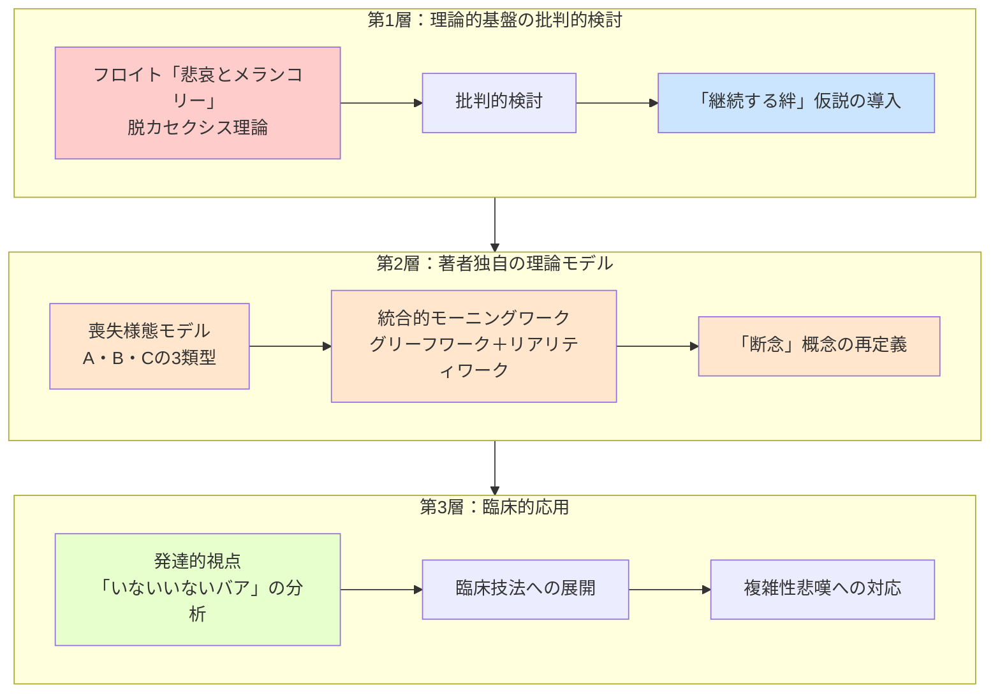

---

## 第1部：理論的基盤の批判的検討

### フロイトの「悲哀とメランコリー」（1917）

本書の出発点は、フロイトの古典的悲嘆理論への批判的検討です。

**フロイトの主張（脱カセクシス理論）:**

フロイトは「悲哀とメランコリー」において、悲嘆からの回復を以下のように説明しました：

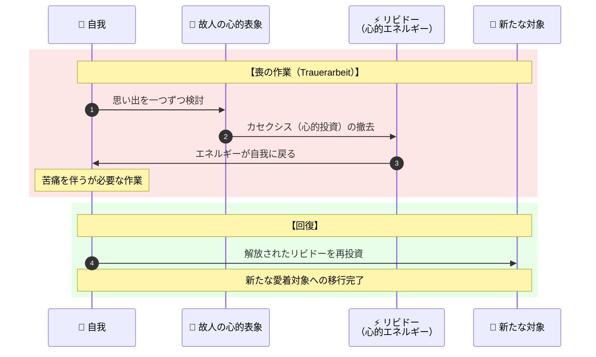

**フロイト理論の問題点:**

| 問題点 | 詳細 |
|--------|------|
| **経験的根拠の欠如** | 「脱カセクシス」が実際に起こることを示す実証研究がない |
| **文化的偏り** | 西洋近代の個人主義的価値観に基づいており、故人との絆を維持する文化的実践を病理視する傾向がある |
| **臨床的不適合** | 実際の悲嘆者は故人を「忘れる」のではなく、異なる形で関係を続けている |

### 「継続する絆」仮説の登場

1996年、Klass, Silverman, Nickmanらが編集した『Continuing Bonds』は、悲嘆研究のパラダイムシフトをもたらしました。

**継続する絆仮説の核心:**

> 「健全な悲嘆からの回復は、故人との絆を断ち切ることではない。むしろ、故人との関係を内在化し、新たな形で継続することを含む」

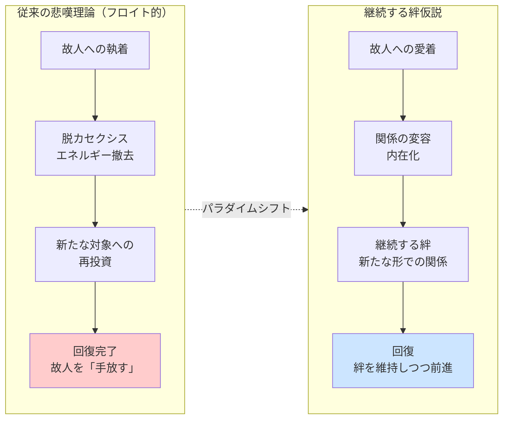

---

## 第2部：喪失様態モデル

### 3つの喪失様態（mode of loss experience）

著者・山本力は、喪失体験を3つの「様態」として類型化しました。各様態には固有の心理的課題が対応します。

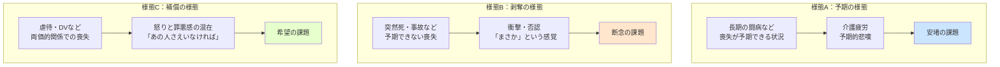

### 各様態の詳細

| 様態 | 喪失の特徴 | 典型的な感情 | 心理的課題 | 課題の内容 |
|------|-----------|-------------|-----------|-----------|
| **A：予期の様態** | 長期療養後の死別など、喪失が事前に予期できる | 予期的悲嘆、介護疲労、そして死後の「安堵」 | **安堵の課題** | 「安堵してしまう自分」への罪悪感を乗り越え、安堵を許容する |
| **B：剥奪の様態** | 突然死、事故死など、予期なく「奪われる」体験 | 衝撃、否認、怒り、「なぜ」という問い | **断念の課題** | 故人に託していた欲求・期待・夢を断念する（後述） |
| **C：補償の様態** | 虐待者・DV加害者など、両価的関係の相手との死別 | 怒りと罪悪感の混在、「やっと自由になった」という安堵と罪悪感 | **希望の課題** | 故人なしでも幸福になれるという「希望」を許容する |

### 「断念」概念の再定義

本書の重要な貢献の一つは、**「断念」概念の再定義**です。

**従来の理解:**
> 断念 = 故人そのものを諦める、故人との絆を断ち切る

**本書の再定義:**
> 断念 = 故人に託していた**自己愛的な欲求、期待や夢**を断念する

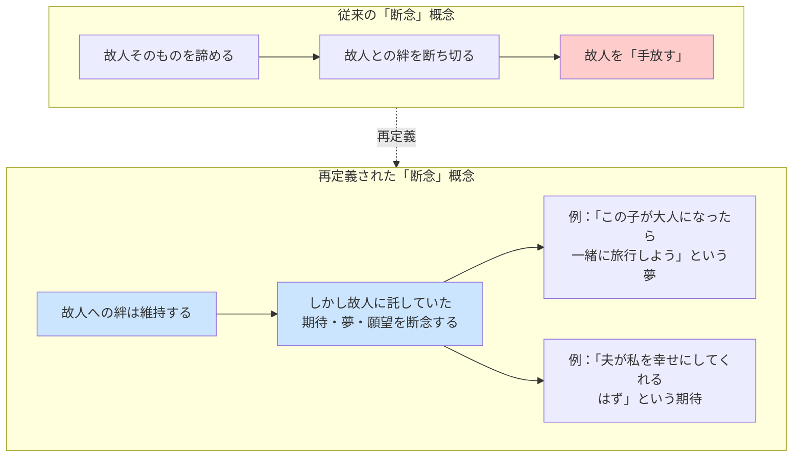

**断念すべきものの例:**

| 故人との関係 | 断念すべき「期待・夢」の例 |
|-------------|------------------------|
| 親との死別 | 「いつか認めてもらえるはず」という期待 |
| 配偶者との死別 | 「一緒に老後を過ごす」という夢 |
| 子どもとの死別 | 「成長を見届ける」という期待 |
| 友人との死別 | 「また一緒に笑い合える」という願望 |

---

## 第3部：統合的モーニングワーク

### 二つの作業の統合

著者は、悲嘆の処理には**二つの方向性を持つ作業**が必要だと主張します。

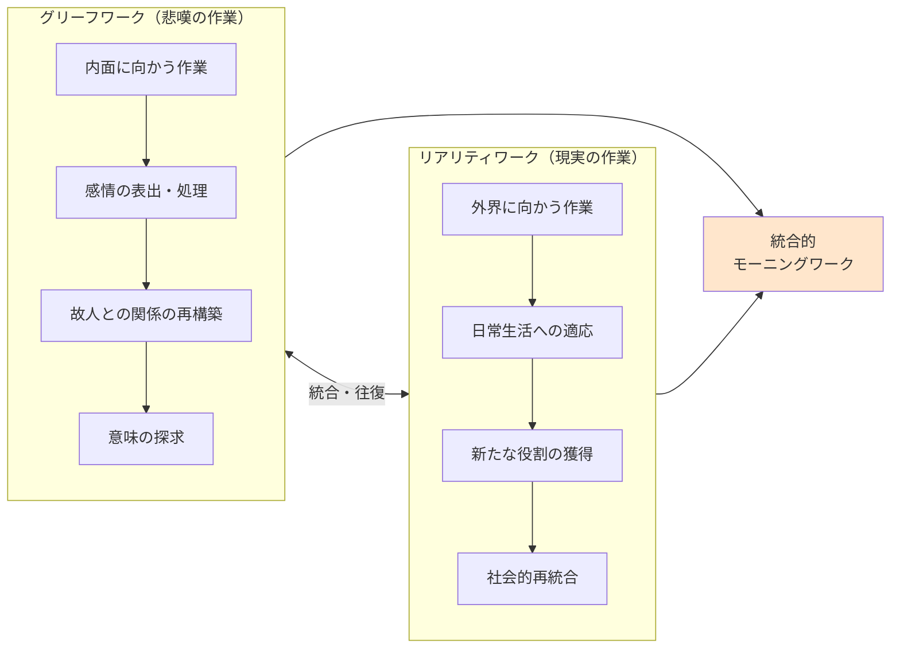

### ストローベとシュットの「二重過程モデル」との関連

著者の「統合的モーニングワーク」は、ストローベとシュット（Stroebe & Schut）の**二重過程モデル（Dual Process Model: DPM）**と理論的に近い関係にあります。

**二重過程モデルの概要:**

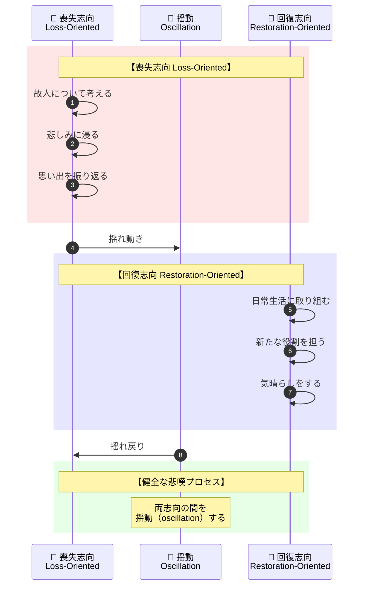

**両モデルの対応関係:**

| 二重過程モデル | 統合的モーニングワーク |
|--------------|---------------------|
| 喪失志向（Loss-Oriented） | グリーフワーク（内面に向かう） |
| 回復志向（Restoration-Oriented） | リアリティワーク（外界に向かう） |
| 揺動（Oscillation） | 両作業の統合・往復 |

---

## 第4部：発達的視点からの悲嘆理解

### 「いないいないバア」と分離不安

本書は、悲嘆の理解に**発達心理学的視点**を導入しています。その象徴的な分析が「いないいないバア」です。

**「いないいないバア」の発達的意義:**

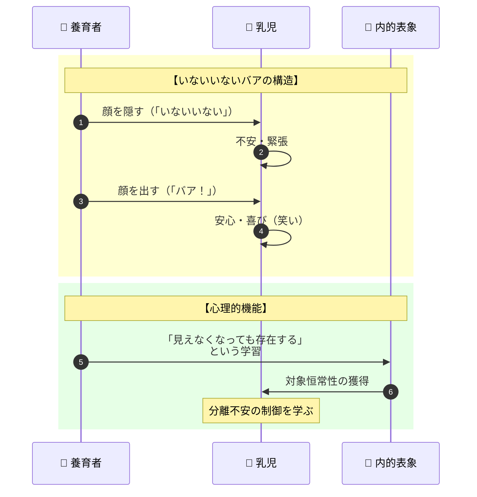

**悲嘆との関連:**

乳児期の「いないいないバア」は、**分離不安を安全に体験し、制御する力を育む**遊びです。養育者が「いない」状態から「いる」状態に戻ることで、乳児は「見えなくなっても存在し続ける」という**対象恒常性**を学びます。

しかし、**死別**においては、この「バア！」の瞬間が永遠に訪れません。

> 「永遠に帰ってこない『いないいない』——それが死別体験の本質である」

### アベイラビリティ（availability）概念

本書は、ボウルビィの愛着理論における**アベイラビリティ（availability：利用可能性）**概念を悲嘆理解に応用しています。

**アベイラビリティの3要素:**

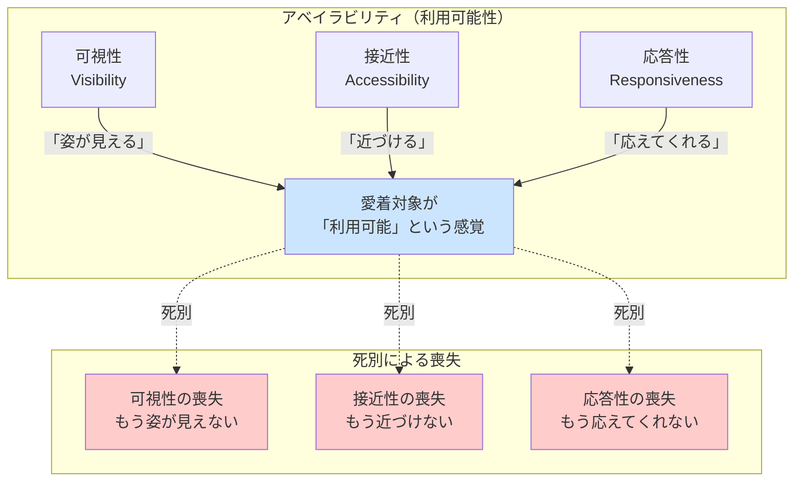

**悲嘆における「継続する絆」の意義:**

死別によってアベイラビリティの3要素はすべて失われます。しかし、**内在化された故人の表象**によって、**心理的なアベイラビリティ**は維持できます。

| アベイラビリティの要素 | 物理的喪失 | 心理的維持の形 |
|----------------------|----------|---------------|
| 可視性 | 姿が見えない | 写真、思い出の中のイメージ |
| 接近性 | 近づけない | 墓参り、故人ゆかりの場所への訪問 |
| 応答性 | 応えてくれない | 内在化された「故人の声」、想像上の対話 |

---

## 理論の全体構造図解

### 悲嘆プロセスの統合モデル

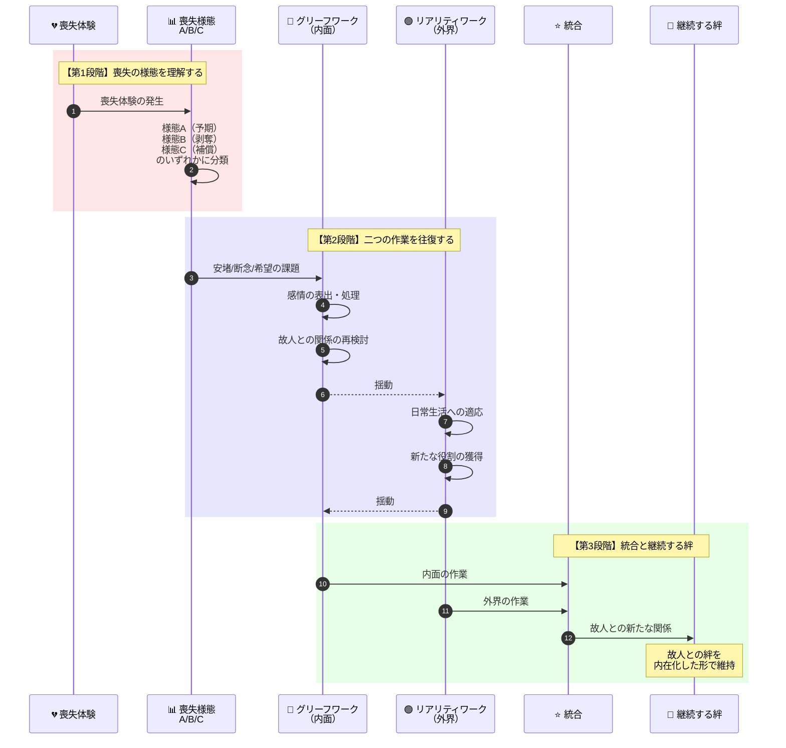

### 理論的位置づけの整理

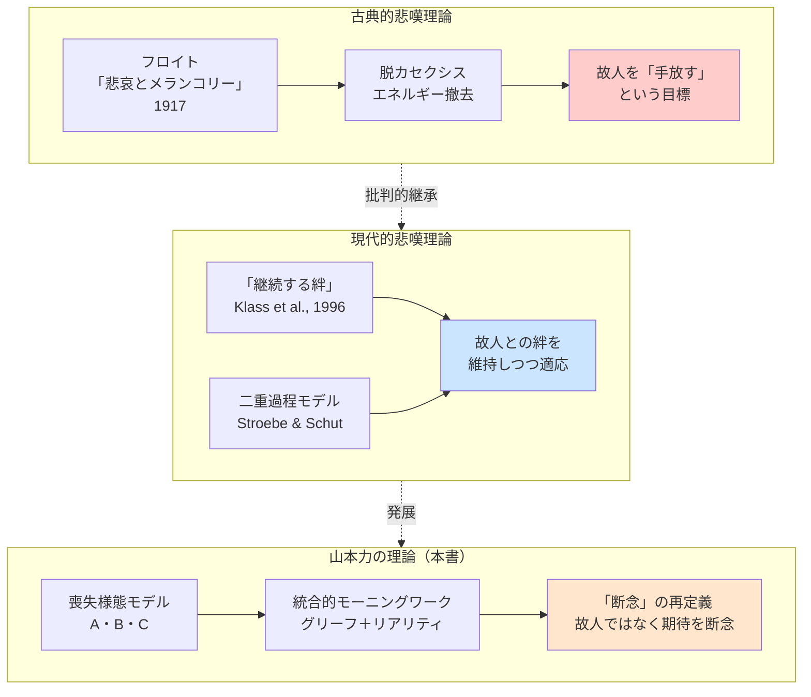

---

## 理論のサマリー表

| 理論的論点 | フロイト的立場 | 「継続する絆」的立場 | 本書（山本）の立場 |
|-----------|--------------|-------------------|------------------|
| **悲嘆の目標** | 脱カセクシス（故人を手放す） | 絆の継続 | 絆を継続しつつ、期待・夢を断念する |
| **故人との関係** | 撤去すべきもの | 変容し継続するもの | 内在化し、新たな形で維持するもの |
| **回復の指標** | 新たな対象への投資 | 故人との新たな関係 | グリーフとリアリティの統合 |
| **「断念」の意味** | 故人そのものを諦める | （この概念を批判） | 故人に託した欲求・期待を断念する |
| **臨床的含意** | 故人から距離を取る支援 | 絆の維持を認める支援 | 様態に応じた課題（安堵/断念/希望）への支援 |

---

## 臨床的応用のポイント

### 喪失様態別の臨床的アプローチ

| 様態 | 課題 | 臨床的アプローチ |
|------|------|----------------|
| **A：予期の様態** | 安堵の課題 | 「安堵してもよい」という許可を与える。介護者としての労をねぎらう。罪悪感の正常化 |
| **B：剥奪の様態** | 断念の課題 | 故人に託していた期待・夢を明確化する。故人そのものではなく、その期待を断念する支援 |
| **C：補償の様態** | 希望の課題 | 故人なしでも幸福になれることを許容する支援。複雑な感情（安堵と罪悪感）の両方を認める |

### 「断念」を支援する際の留意点

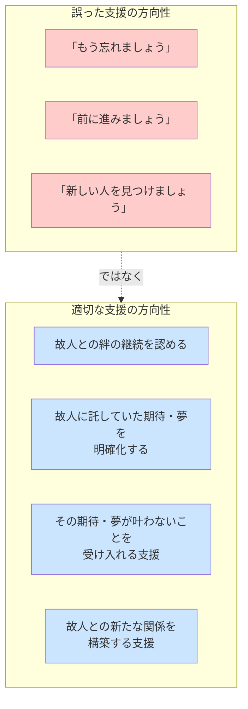

---

## この理論が問いかけるもの

『喪失と悲嘆の心理臨床学』は、単なる悲嘆カウンセリングの技法書ではありません。この理論は私たちに問いかけます：

- **「悲嘆からの回復とは何か」** - 故人を「忘れる」ことが回復なのか、それとも異なる形で関係を続けることが回復なのか
- **「断念するものは何か」** - 私たちが本当に手放すべきは、故人そのものではなく、故人に託していた自分の願望ではないか
- **「絆は死で終わるのか」** - 物理的な死は関係の終わりを意味するのか、それとも関係は変容して続くのか

本書は、悲嘆を「乗り越える」ものではなく、「共に生きる」ものとして捉える視点を提供しています。

---

## 参考文献・出典

**本書:**
- 山本力『喪失と悲嘆の心理臨床学』誠信書房、2014年

**本書で参照される主要文献:**
- Freud, S. (1917). *Trauer und Melancholie*（悲哀とメランコリー）
- Klass, D., Silverman, P. R., & Nickman, S. L. (Eds.). (1996). *Continuing Bonds: New Understandings of Grief*. Taylor & Francis.
- Stroebe, M., & Schut, H. (1999). The dual process model of coping with bereavement. *Death Studies*, 23, 197-224.

---

**本ガイド作成の手法**: 理論構造のリバースエンジニアリング（学術書から理論的枠組み・概念構造・論証の流れを抽出する分析手法）を使用しています。
