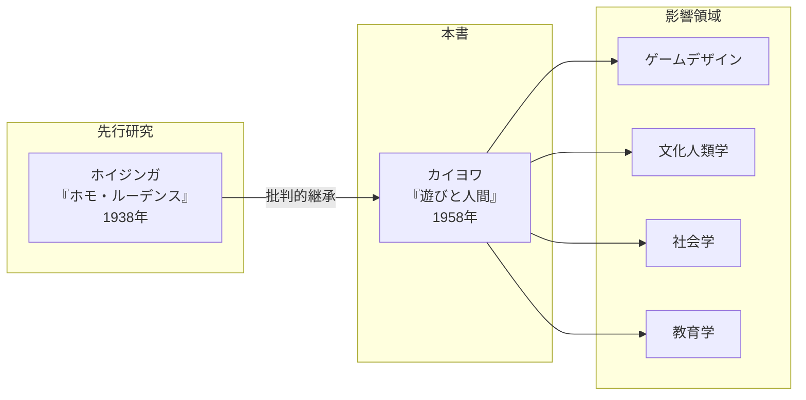
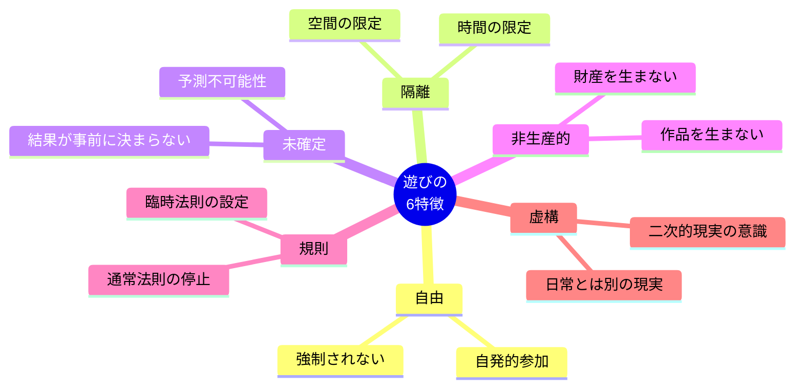
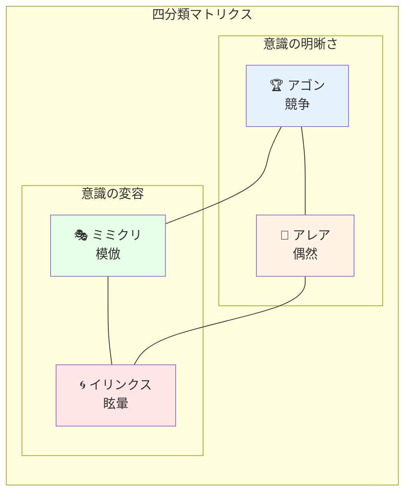
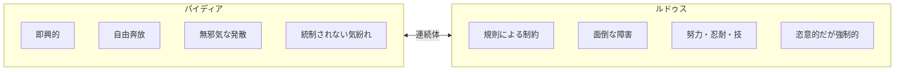
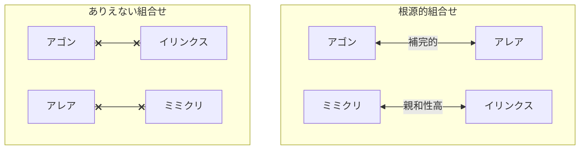
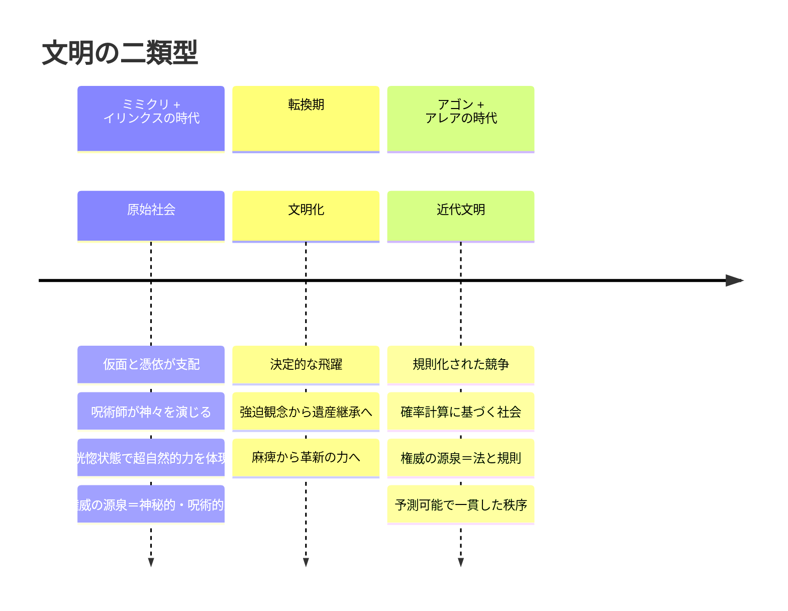
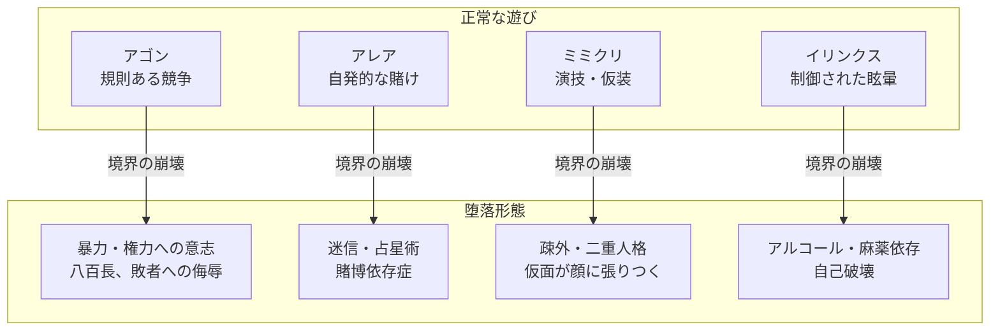
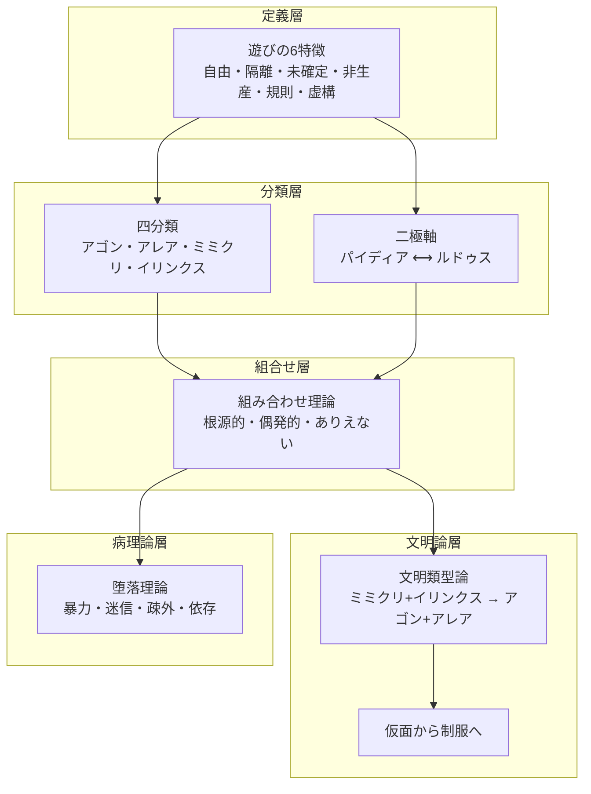
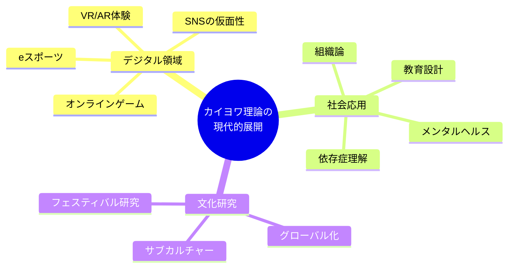

# 『遊びと人間』完全解説ガイド
## ロジェ・カイヨワの遊戯理論 - 理論構造マップ

---

## 1. 本書の位置づけ



### ホイジンガとの関係

| 項目 | ホイジンガ『ホモ・ルーデンス』 | カイヨワ『遊びと人間』 |
|------|------------------------------|----------------------|
| 中心命題 | 文化は遊びの中で始まった | 遊びは文明の根幹を形成する普遍的原理 |
| 分析対象 | 規則のある競争の遊び（偏り） | 遊び全般の体系的分類 |
| 方法論 | 文化史的アプローチ | 社会学的・構造主義的アプローチ |
| 批判点 | - | 偶然・眩暈の遊びを軽視 |

---

## 2. 遊びの定義：6つの本質的特徴

カイヨワは遊びを以下の6つの特徴で定義する：



### 6特徴の詳細表

| 特徴 | 内容 | 破綻するとどうなるか |
|------|------|---------------------|
| **自由** | 遊戯者が強制されない | 労働・義務となる |
| **隔離** | 明確な時間と空間に制限 | 日常生活を侵食する |
| **未確定** | 結果が事前に決まらない | 興味を失う（八百長） |
| **非生産的** | 財産も作品も生まない | 経済活動となる |
| **規則** | 独自の法則を設定 | 混沌・無秩序となる |
| **虚構** | 日常とは別の現実意識 | 現実との区別がつかなくなる |

---

## 3. 遊びの四分類（コア理論）



**マトリクスの読み方:**
- **横軸**: 個人の努力に依存（アゴン・ミミクリ） ⟷ 外部要因に依存（アレア・イリンクス）
- **縦軸**: 意識の明晰さ（アゴン・アレア） ⟷ 意識の変容（ミミクリ・イリンクス）

### 3.1 アゴン（Agon）- 競争の遊び

```
語源：ギリシア語「闘争・競技」
```

| 項目 | 内容 |
|------|------|
| **定義** | 人為的に平等なチャンスが与えられた状況での闘争・競争 |
| **本質的原理** | 開始時のチャンスの平等 |
| **必要な能力** | 速さ、忍耐力、体力、記憶力、技術、器用さ |
| **遊戯者の態度** | 自分だけを頼りにする、個人の責任を引き受ける |
| **具体例** | スポーツ全般、チェス、将棋、対戦ゲーム、クロスワードパズル |

### 3.2 アレア（Alea）- 偶然の遊び

```
語源：ラテン語「サイコロ」
```

| 項目 | 内容 |
|------|------|
| **定義** | 遊戯者の力の及ばぬ独立の決定（運命）に基づく遊び |
| **本質的原理** | 偶然の気紛れが唯一の原動力 |
| **否定されるもの** | 勤勉、忍耐、器用、資格、専門的能力 |
| **遊戯者の態度** | 完全に受動的、意志を放棄、運命に身を委ねる |
| **具体例** | サイコロ、ルーレット、宝くじ、バカラ、コイン投げ |

> 「すぐれて人間的な遊び」 - 抽象的思考と予見能力を必要とするため、動物や幼児には重要性が低い

### 3.3 ミミクリ（Mimicry）- 模倣・変装の遊び

```
語源：英語「擬態」（生物学用語）
```

| 項目 | 内容 |
|------|------|
| **定義** | 自分が他者・他物であると信じ、演じる遊び |
| **本質的原理** | 人格を一時的に忘れ、偽装し、別の人格をよそおう |
| **核心** | 見物人を欺くことは本質的問題ではない |
| **仮面の機能** | 社会的性格を覆い隠し、真実の人格を解放する |
| **具体例** | 演劇、ごっこ遊び、仮装、カーニバル、映画鑑賞（同一化） |

### 3.4 イリンクス（Ilinx）- 眩暈の遊び

```
語源：ギリシア語「渦巻き」
```

| 項目 | 内容 |
|------|------|
| **定義** | 知覚の安定を一時的に破壊し、意識をパニック状態に陥れる遊び |
| **目的** | 痙攣、失神状態、茫然自失への到達 |
| **本質** | 有無を言わせず乱暴に現実を消滅させる |
| **生理的効果** | 器官の混乱と惑乱の状態を自ら生じさせる |
| **具体例** | ブランコ、メリーゴーラウンド、ジェットコースター、スキー、登山 |

---

## 4. パイディア - ルドゥス軸

すべての遊びは、この二つの極の間のどこかに位置づけられる：



### 四分類 × パイディア-ルドゥス軸

|  | パイディア（自由奔放） | → | → | ルドゥス（規則的） |
|--|----------------------|---|---|-------------------|
| **アゴン** | 競走、レスリング | ボクシング、陸上 | サッカー、チェス | フェンシング |
| **アレア** | コイン投げ | じゃんけん | ルーレット | 富くじ |
| **ミミクリ** | 子供の物真似 | ごっこ遊び | 仮面・仮装 | 演劇 |
| **イリンクス** | 子供の回転遊び | ブランコ | メリーゴーラウンド | 空中サーカス、スキー |

---

## 5. 遊びの組み合わせ理論

### 5.1 組み合わせマトリクス



### 5.2 組み合わせの詳細

| 組み合わせ | 性質 | 具体例 | 説明 |
|-----------|------|--------|------|
| **アゴン + アレア** | 根源的（補完的） | ブリッジ、ポーカー、競馬賭博 | 技量と運の絶妙なバランス |
| **ミミクリ + イリンクス** | 根源的（親和的） | シャーマニズム、カーニバル、祭礼 | 模擬が眩暈に行きつく |
| アゴン + ミミクリ | 偶発的 | スポーツ観戦（選手への同一化） | 観客体験 |
| アレア + ミミクリ | 偶発的 | 占い、星占い | 運命への信仰 |
| **アゴン + イリンクス** | ありえない | - | 規則と眩暈は両立しない |
| **アレア + ミミクリ** | ありえない | - | 装う技術と運命への服従は無関係 |

---

## 6. 文明類型論：歴史的転換



### 「仮面」から「制服」への転換

| 項目 | 仮面（ミミクリ+イリンクス型） | 制服（アゴン+アレア型） |
|------|----------------------------|----------------------|
| **権威の象徴** | 仮面 | 制服 |
| **顔の扱い** | 隠す | 露出する |
| **権威の性質** | 気まぐれ、恐怖を与える | 公平、不動の規則 |
| **正統性の根拠** | 神秘的・呪術的力 | 法と規則 |
| **予測可能性** | 予測不可能、恣意的 | 予測可能、一貫性 |
| **維持の手段** | 恐怖 | 合理性 |

> 「相容れない秩序の保持を託されている両者の、一方は顔をかくし他方は顔を顕示しているのである」

---

## 7. 遊びの「堕落」- 社会病理論

遊びが本来の領域を逸脱し、現実生活を侵食するとき、それは社会的病理となる：



### 堕落の詳細分析

| 範疇 | 正常な遊び | 堕落形態 | 現代的例 |
|------|-----------|---------|---------|
| **アゴン** | 規則ある競争 | 暴力、権力への意志、詭計 | スポーツの八百長、勝利への過度の執着 |
| **アレア** | 自発的な賭け | 迷信、運命論、賭博依存 | ギャンブル依存症、占いへの過度の依存 |
| **ミミクリ** | 演技・仮装 | 疎外、人格分裂、現実との乖離 | SNS上の仮想人格への没入、スターへの過度の同一化 |
| **イリンクス** | 制御された眩暈 | 麻薬、アルコール依存、破滅願望 | 薬物依存、スリル追求の過激化 |

> **堕落の本質**: 遊びの「隔離された純粋空間」という前提が破壊されること

---

## 8. 理論の全体構造図



---

## 9. 批判的考察と限界

### 9.1 理論的限界

| 批判点 | 内容 | 現代的課題 |
|--------|------|-----------|
| **複合性の問題** | 四分類の網羅性と相互排他性 | ビデオゲームは全要素を複合的に含む |
| **デジタル技術** | 1958年当時は想定外 | VR/AR、オンラインゲームへの適用 |
| **文化的普遍性** | 西洋中心の事例 | 非西洋社会の遊びの多様性 |
| **ジェンダー視点** | 暗黙の男性中心的想定 | 女性の遊びの特殊性の欠如 |

### 9.2 現代的拡張の可能性



---

## 10. 実践への応用

### 10.1 ゲームデザインへの応用

| 要素 | 設計指針 |
|------|---------|
| **競争（アゴン）** | 開始時のチャンス平等を確保、能力差にはハンディキャップ |
| **偶然（アレア）** | 技量と運のバランス、純粋な運だけでは持続しない |
| **模倣（ミミクリ）** | 幻覚を破る行為を防ぐ、没入環境の設計 |
| **眩暈（イリンクス）** | 安全性の確保、制御された環境で |

### 10.2 教育・組織への応用

| 領域 | 応用方法 |
|------|---------|
| **教育** | ゲーミフィケーション（アゴン）、ロールプレイ学習（ミミクリ） |
| **組織** | チームビルディング（アゴン+ミミクリ）、イノベーション促進（パイディア的環境） |
| **メンタルヘルス** | 遊びの「隔離」維持、依存症予防のための境界設計 |

### 10.3 依存症予防への示唆

健全な遊びの条件：
1. **隔離**: 日常生活から適切に分離されていること
2. **自由**: 強制されないこと
3. **非生産的**: 利益を目的としないこと

> これらの条件が崩れるとき、遊びは病理へと転化する

---

## 11. 本書の核心的洞察

> 「遊びは、こうした均衡を人々に思いつかせ、あるいは確認するのである。規則は万人によって自発的に守られ、何人をも依怙ひいきしない、そういう自律的純粋社会のイメージを、遊びはたえず与えつづけている」

この一節は、民主主義社会の理念が遊びの構造に内在していることを示唆する。

> 「人間の行動は、人がそれを本能と混乱と野蛮な暴力とから解き放とうとするとき、はじめて人間の行動となる」

---

## 12. 書誌情報

| 項目 | 内容 |
|------|------|
| **書名** | 遊びと人間 |
| **原題** | Les jeux et les hommes: Le masque et le vertige |
| **著者** | ロジェ・カイヨワ（Roger Caillois, 1913-1978） |
| **訳者** | 多田道太郎・塚崎幹夫 |
| **原著出版** | 1958年（フランス） |
| **日本語版** | 1970年（講談社）、1990年（講談社学術文庫） |

---

## 付録：クイックリファレンス

### 遊びの四分類 早見表

| 分類 | 語源 | 核心 | 代表例 |
|------|------|------|--------|
| **アゴン** | ギリシア語「闘争」 | 競争・能力の証明 | スポーツ、チェス |
| **アレア** | ラテン語「サイコロ」 | 偶然・運命への委託 | 宝くじ、ルーレット |
| **ミミクリ** | 英語「擬態」 | 模倣・別人格の体験 | 演劇、ごっこ遊び |
| **イリンクス** | ギリシア語「渦巻き」 | 眩暈・意識の変容 | ジェットコースター |

### 組み合わせ相性 早見表

|  | アゴン | アレア | ミミクリ | イリンクス |
|--|--------|--------|----------|------------|
| **アゴン** | - | 補完的 | 偶発的 | 不可 |
| **アレア** | 補完的 | - | 不可 | 偶発的 |
| **ミミクリ** | 偶発的 | 不可 | - | 親和的 |
| **イリンクス** | 不可 | 偶発的 | 親和的 | - |

---

*本ガイドは、ロジェ・カイヨワ『遊びと人間』（1958年）の理論構造を図解・整理したものです。*
