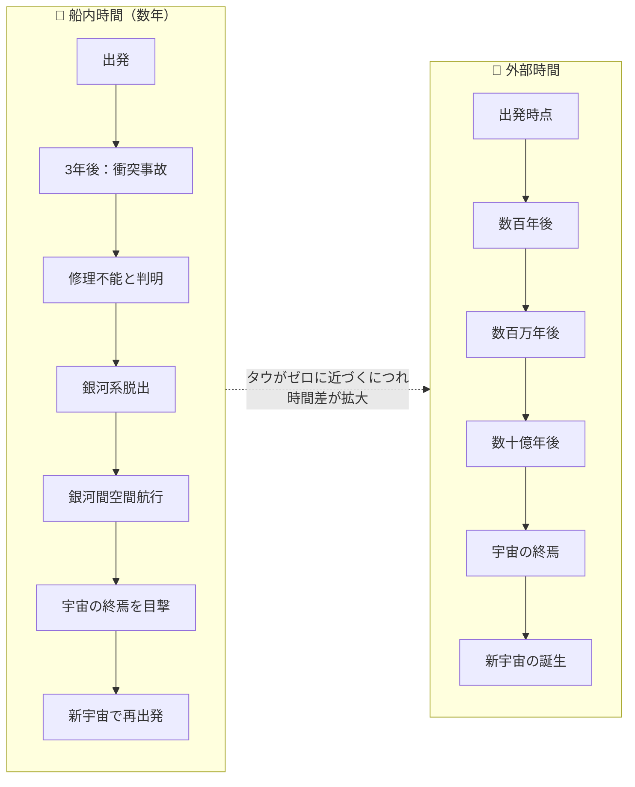
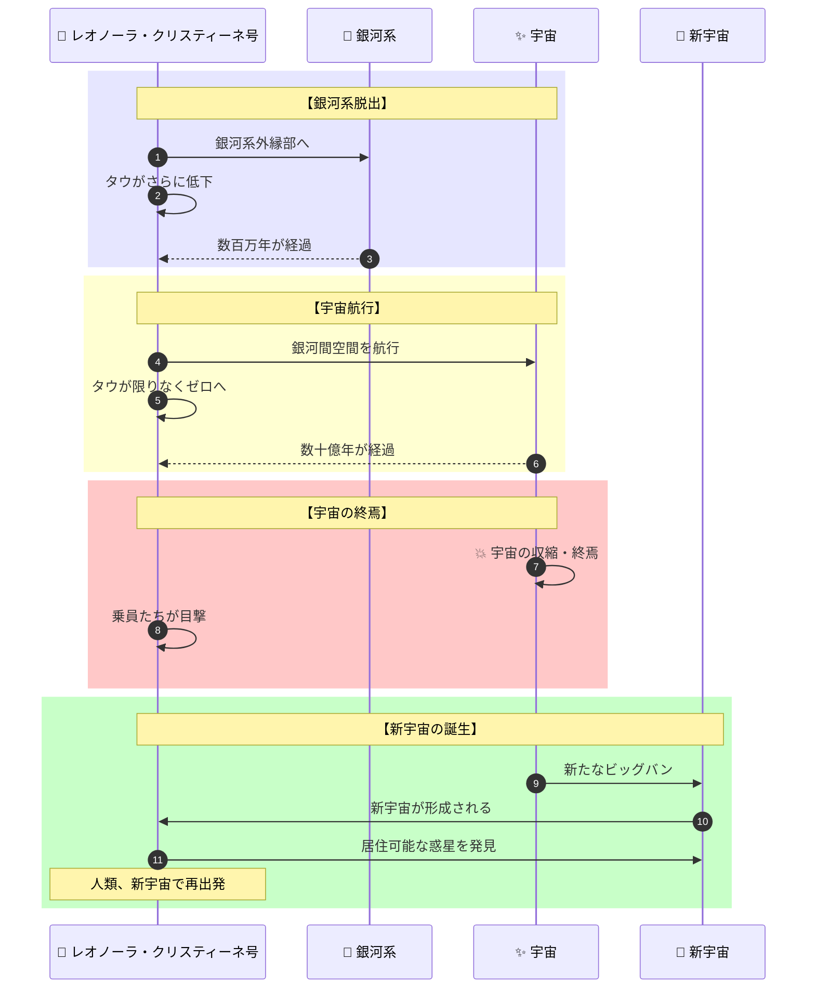
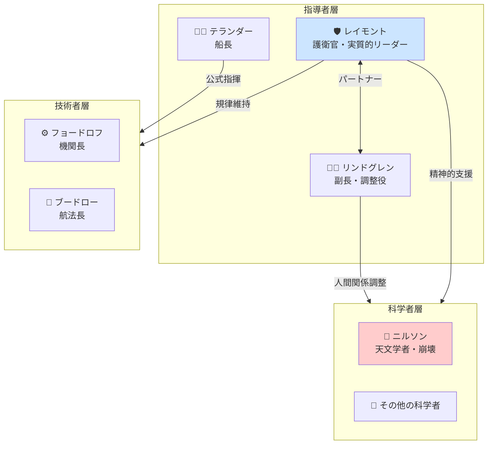
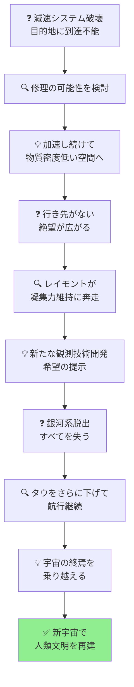

# 『タウ・ゼロ』完全ストーリーガイド

**本ガイドの目的**: 小説を読んでいない人でも、上から順番に読むだけで物語の全体像を完全に理解できることを目指しています。

---

## はじめに：この物語は何についての話か

『タウ・ゼロ』は、**「光速に近づく宇宙船が減速できなくなったとき、乗員たちはどう生き延びるか」というSF的危機を、50人の男女が極限状況で協力しながら乗り越えていくハードSF**です。

物語は次のような状況から始まります：

> 「核戦争後、スウェーデンをリーダー国として文明は復興し、人類は32光年彼方のおとめ座ベータ星第三惑星を目指して恒星船〈レオノーラ・クリスティーネ号〉を飛び立たせた」

しかし航行3年後、宇宙船は生まれたばかりの小星雲と衝突し、**バサード・エンジンの減速システムが破壊されてしまう**。亜光速で飛び続ける船を止めることができなくなった乗員たちは、文字通り宇宙の果てまで飛び続けるしかなくなります。

そして最終的に彼らが目撃するのは、**宇宙そのものの終焉と再生**という壮大なスケールの光景です。

---

## 登場人物紹介

### 〈レオノーラ・クリスティーネ号〉主要乗員

| 人物 | 役職・専門 | 役割 |
|-----|----------|------|
| **チャールズ・レイモント（カール）** | 護衛官、南極大陸コロニー生まれ | 事実上の精神的リーダー。厳格な規律の執行者として振る舞いながら、乗員の凝集力を維持する |
| **イングリッド・リンドグレン** | 副長、スウェーデン人 | 船の管理部門を担当。レイモントのパートナーとなり、人間関係の調整役を担う |
| **ラーズ・テランダー** | 船長、恒星間飛行のベテラン | 公式の指揮官。危機に際して冷静な判断を下す |
| **ボリス・フョードロフ** | 機関長、ロシア人 | エンジンの技術的問題に対処する |
| **エロフ・ニルソン** | 天文学者、スウェーデン人 | 科学的な計算から絶望に沈み、精神的に崩壊していく |

### その他の乗員

| 人物 | 役職・専門 | 説明 |
|-----|----------|------|
| **ノーバート・ウィリアムズ** | 化学者、アメリカ人 | 科学者チームの一員 |
| **チェン・アイリン** | 惑星学者、中国人 | 新天地探索の専門家 |
| **エマ・グラスゴールド** | 分子生物学者、イスラエル人 | 生命科学の専門家 |
| **ジェーン・サドラー** | バイオ技術者、カナダ人 | 生命維持システムを担当 |
| **オーギュスト・ブードロー** | 航法長、フランス人 | 航行計算を担当 |

---

## 重要用語解説

物語を理解するために必要な用語を、登場順に解説します。

### 科学・技術用語

| 用語 | 説明 |
|-----|------|
| **タウ（τ）** | 船内時間と外部時間の比率を示す相対論的パラメータ。光速に近づくにつれてタウはゼロに近づき、外部では何百万年が過ぎても船内ではわずかな時間しか経過しない |
| **バサード・エンジン** | 星間物質（水素など）を収集して核融合燃料として使う推進システム。減速にも加速にも使える |
| **スクープ・フィールド（収集場）** | バサード・エンジンが星間物質を集めるための電磁場ネット |
| **時間遅延効果** | アインシュタインの特殊相対性理論に基づく効果。光速に近づくほど、船内の時間の進み方が外部より遅くなる |

### 場所・天体

| 用語 | 説明 |
|-----|------|
| **おとめ座ベータ星第三惑星** | 〈レオノーラ・クリスティーネ号〉の当初の目的地。地球から32光年の距離にある |
| **ミレス彫刻公園** | 物語冒頭でレイモントとリンドグレンが訪れるスウェーデンの公園。カール・ミレスの彫刻が並ぶ |
| **小星雲** | 航行3年後に衝突する、生まれたばかりの星雲。この衝突が悲劇の発端となる |

### 社会・組織

| 用語 | 説明 |
|-----|------|
| **監察機構** | 核戦争後に設立された世界警察軍。スウェーデンが主導している |
| **〈誓約〉** | 核戦争後の包括的武装解除と世界秩序維持のための国際的合意 |

---

## 物語の時系列

この物語は**船内時間**と**外部時間**という2つの時間軸が存在します。タウがゼロに近づくにつれ、この2つの時間差は指数関数的に拡大していきます。

---

## ストーリー詳細（章ごとのあらすじ）

### 序章：出発前のスウェーデン

**場面**: スウェーデン、ミレス彫刻公園

核戦争後、スウェーデンをリーダー国として世界は復興していた。護衛官チャールズ・レイモントと副長イングリッド・リンドグレンは、出発を前にミレス彫刻公園で時間を過ごす。

レイモントは南極大陸の貧困層出身で、暴動鎮圧で功績を上げて出世した男。リンドグレンはスウェーデンの名門出身で、子供の頃から星への憧れを持っていた。

二人の対照的な背景が、物語を通じて重要な意味を持つことになる。

> 「まるでどれも生きていて、星々をめざしているみたい。逆にわたしたちがあとに残され、年老いていく感じだわ」

**この章で示される伏線**:
- レイモントの厳格で実務的な性格
- リンドグレンのロマンチシズムと人間関係調整能力
- スウェーデン主導の世界秩序への微妙な緊張

---

### 第一部：航行と衝突

**場面**: 〈レオノーラ・クリスティーネ号〉船内、航行3年後

50人の乗員を乗せた恒星船は、32光年彼方のおとめ座ベータ星を目指して順調に航行していた。船内では新たな人間関係が形成され、小さなコミュニティとして機能していた。

しかし航行3年後、**生まれたばかりの小星雲**と衝突する。

**衝突の結果**:
1. **バサード・エンジンの減速システムが破壊** - エンジンは作動するが、減速ができなくなった
2. **修理不能と判明** - 船外活動では修理できない損傷
3. **加速し続けるしかない** - 減速できないため、さらに加速して物質密度の低い宇宙空間を探すしかなくなる

**ここで生じる絶望的状況**:

> 「われわれは宇宙を永遠に飛び続けるしかない」

天文学者ニルソンは科学的な計算から希望のなさを導き出し、絶望に沈んでいく。

---

### 第二部：社会の維持

**場面**: 〈レオノーラ・クリスティーネ号〉船内

絶望的な状況の中、レイモントは乗員たちの精神的凝集力を維持するために奔走する。

**レイモントの戦略**:
- 表向きは厳格な規律の執行者として振る舞う
- 裏では密かに協力者を増やし、希望を持たせる
- ニルソンのような崩壊しかけた者を支える

リンドグレンはレイモントのパートナーとして、人間関係の調整役を担う。二人の協力関係は、閉鎖空間での極限状況を乗り越える鍵となる。

**ニルソンの崩壊**:

天文学者ニルソンは、科学的知識ゆえに絶望の深さを誰よりも理解していた。彼は徐々に精神的に崩壊していく。この描写は、知識人の脆弱性と、社会的承認への根源的な欲求を浮き彫りにしている。

---

### 第三部：銀河系脱出

**場面**: 銀河系外縁部、そして銀河間空間

船はタウをさらにゼロに近づけながら加速を続け、ついに**銀河系を脱出**する。

外部では何百万年もの時間が過ぎていたが、船内ではまだ数年しか経っていない。乗員たちは、地球も太陽系も、知っていたすべての文明がもはや存在しないことを悟る。

**新たな希望**:

レイモントは絶望的な状況の中から、新たな観測技術の開発という希望を提示する。同じ科学的知識を用いても、絶望を導き出すことも、希望を見出すこともできる——この対比が物語の核心となる。

---

### 第四部：宇宙の終焉と再生

**場面**: 宇宙の果て

船はさらに加速を続け、タウは限りなくゼロに近づく。外部では何十億年もの時間が過ぎ、ついに**宇宙そのものの終焉**を目撃する。

**結末**:

宇宙の終焉と再生（新たなビッグバン）の後、乗員たちは新しい宇宙で居住可能な惑星を発見する。彼らは人類文明を新たに始める決意をする。

---

## 最終結論：希望と意志の物語

『タウ・ゼロ』は、絶望的な状況においても人間が希望を持ち続けることの意味を問う物語です。

### 科学と人間性の両立

ポール・アンダースンは、相対性理論という物理学の根幹をなす理論を物語の骨格とし、そこに人間の希望と絶望、愛と孤独を織り込みました。

**科学的知識の二面性**:
- ニルソンは科学的知識から絶望を導き出した
- レイモントは同じ知識から希望を見出した
- 重要なのは知識そのものではなく、それをどう活用するかという人間の意志

### 極限状況でのリーダーシップ

レイモントのアプローチは、公式の権威と非公式の影響力を組み合わせ、集団の凝集力を維持することの重要性を示しています。

**「タウ・ゼロ」とは、時間が停止する究極の状態を指しますが、同時に「すべてを失った後でも、ゼロから始められる」という希望のメタファーでもあるのです。**

---

## 物語の構造図解（読後の振り返り用）

### 登場人物の役割と関係

### 危機克服のプロセス

---

## 章別サマリー表

| 章 | 主な出来事 | 明らかになる事実 | 新たな危機 |
|----|-----------|----------------|---------|
| **序章** | レイモントとリンドグレンの出会い | 二人の対照的な背景 | - |
| **第一部** | 小星雲との衝突 | 減速システム破壊、修理不能 | 目的地に到達不能 |
| **第二部** | 乗員の精神的危機 | レイモントのリーダーシップ | ニルソンの崩壊 |
| **第三部** | 銀河系脱出 | 地球・太陽系は遥か過去に | すべてを失う |
| **第四部** | 宇宙の終焉と再生 | 新宇宙の誕生 | （解決） |

---

## この物語が問いかけるもの

『タウ・ゼロ』は、単なるハードSFではありません。この物語は私たちに問いかけます：

- **「科学的知識はどう使うべきか」** - 同じ知識から絶望も希望も導ける
- **「極限状況で人間はどう振る舞うべきか」** - 社会の凝集力をいかに維持するか
- **「すべてを失った後でも、なぜ希望を持つべきか」** - ゼロからの再出発の可能性

宇宙の無限大に直面したとき、人間はいかに振る舞うべきか。アンダースンの回答は、科学と人文の両方を踏まえた深い洞察に満ちています。

---

**本ガイド作成の手法**: 物語構造のリバースエンジニアリング（完成した作品からプロット・人物関係・テーマを抽出する分析手法）を使用しています。
