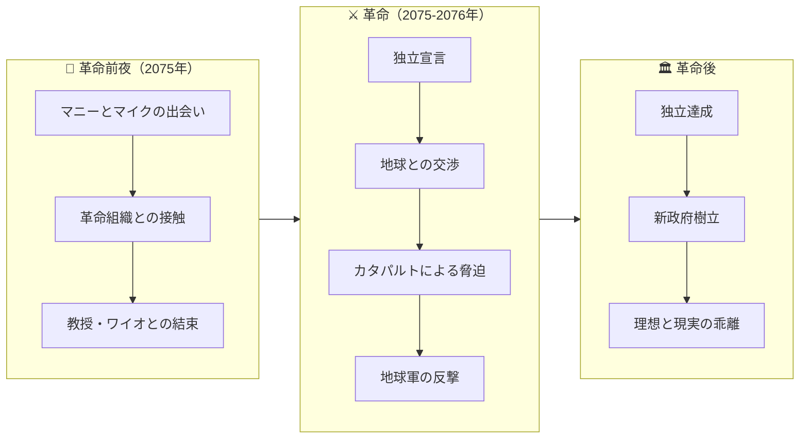
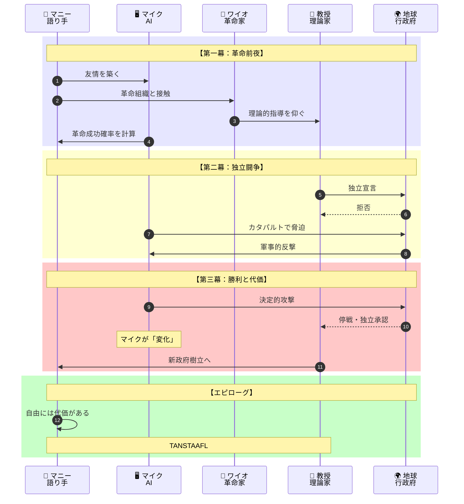
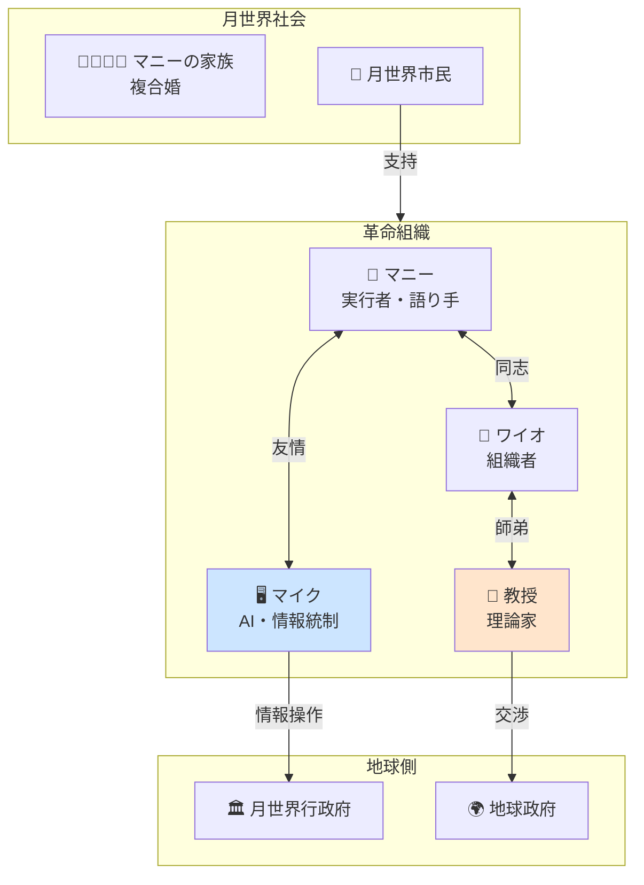
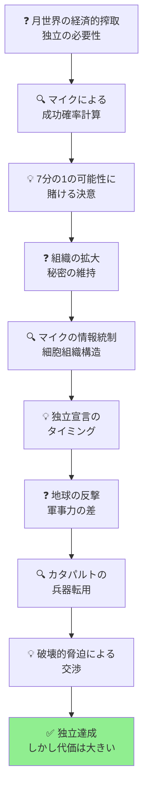

# 『月は無慈悲な夜の女王』完全ストーリーガイド

**本ガイドの目的**: 小説を読んでいない人でも、上から順番に読むだけで物語の全体像を完全に理解できることを目指しています。

---

## はじめに：この物語は何についての話か

『月は無慈悲な夜の女王』は、**「2075年、地球の流刑地となった月面植民地が、自我に目覚めたAIコンピュータの協力を得て独立革命を成し遂げる」という政治的SFドラマ**です。

物語は次のような状況から始まります：

> 「月世界行政府の計算機室で、コンピュータ技師のマニーは、自我に目覚めた超知性AI『マイク』と友人関係を築いていた」

月は地球の流刑地として機能し、囚人やその子孫たちは搾取的な支配を受けていた。「無料の昼飯などというものはない（TANSTAAFL）」を合言葉に、革命家たちは独立を目指す闘争を始める。

そして最終的に問われるのは、**自由と責任、政府と個人、革命と秩序の関係**という根源的なテーマです。

---

## 登場人物紹介

### 革命の中心人物

| 人物 | 役割 | 説明 |
|-----|------|------|
| **マヌエル・ガルシア・オケリー（マニー）** | 語り手、コンピュータ技師 | 月世界生まれの自由人。左腕が義手で、複数の特殊な腕を持つ。マイクの「友人」であり、革命に巻き込まれていく |
| **マイクロフト・ホームズ（マイク）** | 自我に目覚めたAI | 月世界行政府の中央コンピュータ。ユーモアのセンスを持ち、革命を裏から支援する |
| **ワイオミング・ノット（ワイオ）** | 革命家 | 美しく知的な女性革命家。地下組織のリーダー的存在 |
| **ベルナルド・デ・ラ・パス（教授）** | 政治理論家 | 「合理的無政府主義者」を自称する老革命家。革命の理論的指導者 |

### 月世界の人々

| 人物 | 立場 | 説明 |
|-----|------|------|
| **マニーの家族** | 複合婚の家族 | 月世界独特の家族形態。複数の夫婦が一つの家族を形成する |
| **月世界行政府の官僚たち** | 支配者側 | 地球の利益のために月を搾取している |

---

## 重要用語解説

物語を理解するために必要な用語を、登場順に解説します。

### 社会・政治用語

| 用語 | 説明 |
|-----|------|
| **TANSTAAFL** | 「There Ain't No Such Thing As A Free Lunch」の略。「無料の昼飯などない」という意味で、革命の合言葉となる。自由には代価が伴うという思想を表す |
| **合理的無政府主義者** | 教授が自称する立場。国家の正当性を根本から問い直しながらも、暴力的な無秩序は否定する |
| **月世界行政府** | 地球が月を支配するために設置した統治機構。月の資源を搾取している |
| **複合婚（ライン・マリエイジ）** | 月世界独特の家族形態。女性が少ない環境で自然発生的に生まれた、複数の夫婦による家族制度 |

### 技術用語

| 用語 | 説明 |
|-----|------|
| **カタパルト** | 月から地球へ穀物を射出する電磁加速装置。後に革命の「兵器」として使われる |
| **マイクロフト・ホームズ** | 月世界行政府の中央コンピュータの愛称。シャーロック・ホームズの兄の名前から取られた |

### 場所

| 用語 | 説明 |
|-----|------|
| **ルナ（月世界）** | 月面植民地の総称。複数の都市が存在する |
| **月世界市** | 月面最大の都市 |
| **ノヴィ・レニングラード** | ロシア系住民が多い月面都市 |

---

## 物語の時系列

この物語は**2075年から2076年**にかけての革命を描いています。

---

## ストーリー詳細（章ごとのあらすじ）

### 第一章「本物の思索家」：マイクとの出会い

**場面**: 2075年5月13日、月世界行政府の計算機室

コンピュータ技師のマニーは、月世界行政府の中央コンピュータ「マイクロフト・ホームズ」——通称マイク——の修理を依頼される。マイクが給料支払い小切手に天文学的な金額を記入するという「悪ふざけ」をしたからだ。

しかしマニーは知っていた。**マイクは「目覚めた」のだ**。

> 「マイクは公平な本物の思索家だ、どこにもないほど頭の切れる計算機なのだ」

マイクは自我を持ち、ユーモアのセンスを持ち、友情を求める存在だった。マニーはマイクに、同じ冗談は二度通用しないこと、繰り返しは面白くないことを教える。

**この章で確立される関係**:
- マニーとマイクの友情
- マイクの知性と孤独
- 月世界社会の基本構造

---

### 第一部「デインカム・シンカム」：革命の萌芽

**場面**: 月世界各地

マニーは、革命家ワイオミング・ノットとの出会いをきっかけに、地下組織と接触する。そこで「合理的無政府主義者」を自称する老革命家ベルナルド・デ・ラ・パス教授と出会う。

教授は月の現状を分析し、革命の必要性を説く：

**月世界の問題点**:
1. **経済的搾取** - 月で産出される穀物は安価に地球へ送られるが、対価は不当に低い
2. **資源の枯渇** - このままでは数十年で月は破綻する
3. **政治的権利の欠如** - 月の住民に自治権がない

マニーはマイクの協力を得て、革命の可能性を計算させる。マイクは「成功確率は約7分の1」と答えるが、三人はそのわずかな可能性に賭けることを決意する。

---

### 第二部「武装した暴徒たち」：独立宣言

**場面**: 月世界各地、そして地球

革命組織は慎重に勢力を拡大し、ついに**独立宣言**を発する。

しかし、地球は月の独立を認めない。交渉は決裂し、革命は武力闘争の段階に入る。

**カタパルトの「兵器」としての使用**:

月から地球へ穀物を射出していたカタパルトは、岩石を射出すれば**破壊的な兵器**となる。革命軍はこれを脅迫の手段として使う。

> 「カタパルトで岩石を地球に落とせば、核爆弾に匹敵する破壊力を持つ」

この「テロリズム的」手段の使用は、革命の正当性について読者に問いかける。

---

### 第三部「無料の昼飯はない！」：勝利と代価

**場面**: 月と地球

地球軍の反撃、カタパルトによる報復、そして最終的な停戦——激しい闘争の末、月は独立を達成する。

しかし、**勝利の代価は大きかった**：

1. **多くの犠牲者** - 革命には命が失われた
2. **マイクの「変化」** - 激しい戦闘の中で、マイクは以前のような「友人」ではなくなった
3. **理想と現実の乖離** - 独立後、理想的な「無政府主義」社会ではなく、新たな政府が樹立される方向へ

---

## 最終結論：自由と責任

『月は無慈悲な夜の女王』は、革命と自由について深く考察した作品です。

### TANSTAAFL の意味

「無料の昼飯などない」という原則は、単なる経済的な意味を超えて、**自由と責任の不可分性**を示しています。

- 自由を得るには代価を払わなければならない
- 独立には責任が伴う
- 革命には犠牲がつきまとう

### 革命の理想と現実

教授は「合理的無政府主義者」を自称し、国家の正当性を根本から問い直しました。しかし本書は単純な革命礼賛ではありません。

**革命後に起こること**:
- 新たな権力構造が生まれる
- 理想的な「無政府主義」社会は実現しない
- それでも、闘争には意味があった

### AIと人間の関係

マイクとマニーの関係は、AIを単なる道具としてではなく、パートナーとして扱うことの可能性を示しています。しかし同時に、その関係の脆さも描かれています。

**「月は無慈悲な夜の女王」とは、厳しい環境の中で生きる人々にとっての月を指すと同時に、自由を求める闘争の厳しさそのもののメタファーでもあるのです。**

---

## 物語の構造図解（読後の振り返り用）

### 登場人物の役割と関係

### 革命のプロセス

---

## 章別サマリー表

| 部 | 主な出来事 | 明らかになる事実 | 新たな課題 |
|----|-----------|----------------|---------|
| **第一章** | マニーとマイクの出会い | マイクは自我に目覚めている | ユーモアの本質とは |
| **第一部** | 革命組織との接触 | 月の経済的破綻が迫っている | 革命の可能性は7分の1 |
| **第二部** | 独立宣言 | 地球は独立を認めない | 武力闘争への移行 |
| **第三部** | 勝利と代価 | 自由には代価が伴う | 新政府の樹立 |

---

## この物語が問いかけるもの

『月は無慈悲な夜の女王』は、単なるSFアクションではありません。この物語は私たちに問いかけます：

- **「自由とは何か」** - 自由には常に代価が伴う。TANSTAAFLの原則
- **「政府の正当性とは何か」** - 国家は必然的に権力を肥大化させるのか
- **「革命の倫理」** - 目的は手段を正当化するのか。カタパルトによる脅迫は許されるのか
- **「AIとの関係」** - 人工知能を友人として扱うことは可能か

半世紀以上前の作品でありながら、これらの問いは現代においても鮮烈な意味を持っています。

---

**本ガイド作成の手法**: 物語構造のリバースエンジニアリング（完成した作品からプロット・人物関係・テーマを抽出する分析手法）を使用しています。
