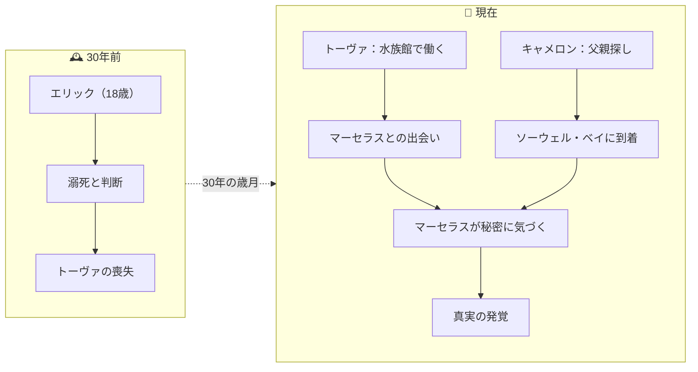
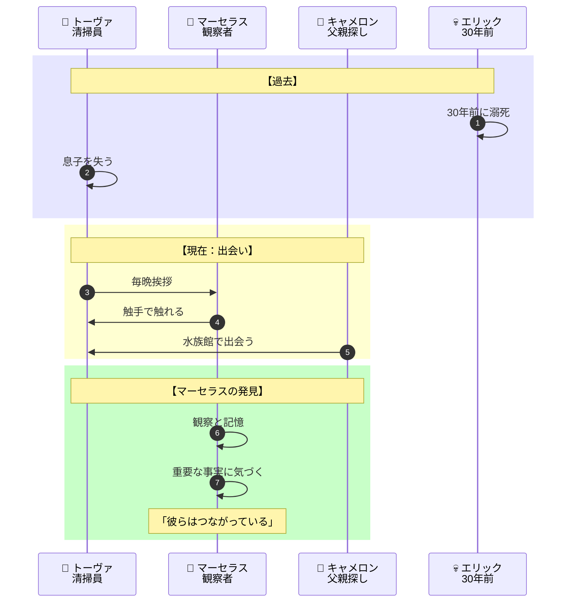
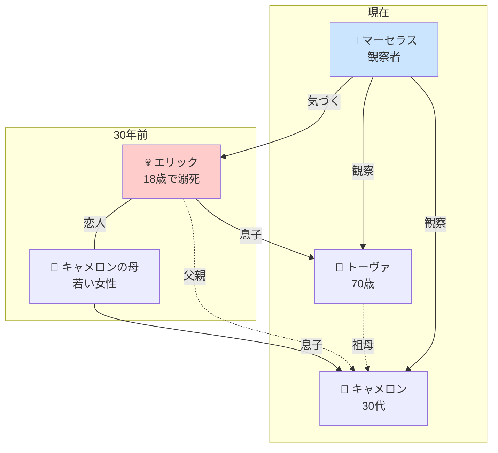
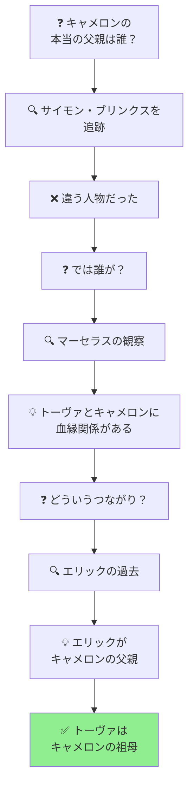

# 『親愛なる八本脚の友だち』完全ストーリーガイド

**本ガイドの目的**: 小説を読んでいない人でも、上から順番に読むだけで物語の全体像を完全に理解できることを目指しています。

---

## はじめに：この物語は何についての話か

『親愛なる八本脚の友だち』は、**「水族館で働く70歳の清掃員と、水槽に幽閉された知性を持つミズダコが、それぞれの喪失と秘密を抱えながら、思いがけないつながりを見出していく」という心温まるミステリ風の物語**です。

物語は三つの視点から語られます：

> 「ぼくには闘がしっくりくる。とらわれの身の生活一二九九日め」——ミズダコのマーセラスはこう語り始める

30年前に18歳の息子エリックを失ったトーヴァ、実の父親を探している若者キャメロン、そして水槽に閉じ込められながら鋭い観察眼で人間たちを見つめるタコのマーセラス。この三者の運命が、小さな水族館を舞台に交差していきます。

そして最終的に明らかになるのは、**家族の秘密と、思いがけない血縁の絆**です。

---

## 登場人物紹介

### 主要人物

| 人物 | 年齢・立場 | 役割 |
|-----|----------|------|
| **トーヴァ・サリヴァン** | 70歳、水族館の夜間清掃員 | 30年前に息子エリックを失い、その悲しみを抱えながら静かに生きている。毎晩、水族館の生き物たちに挨拶をする |
| **キャメロン・キャスモア** | 30代、元バンドマン | カリフォルニアから流れ着いた若者。実の父親を探している |
| **マーセラス** | ミズダコ、「とらわれの身」の日数をカウント中 | 水槽に閉じ込められた知性を持つタコ。物語の「語り手」の一人であり、謎を解く鍵を握る |

### 周辺人物

| 人物 | 立場 | 説明 |
|-----|------|------|
| **イーサン・マック** | スーパー〈ショップ・ウェイ〉の店主 | トーヴァの亡き夫を「まっとうな男」として知り、密かにトーヴァに好意を寄せている |
| **ジーン** | キャメロンのおば | キャメロンを一時的に受け入れるが、複雑な事情を抱えている |
| **サイモン・ブリンクス** | 不動産開発業者 | キャメロンが「実の父親かもしれない」と追跡する人物 |
| **エイヴリー** | サーフショップのオーナー | キャメロンの恋人 |
| **テリー** | 水族館の館長 | マーセラスに名前をつけた娘の父親 |

### 物語の中心にいる不在の人物

| 人物 | 説明 |
|-----|------|
| **エリック・サリヴァン** | トーヴァの息子。30年前、18歳で溺死と判断された。トーヴァは自殺ではないと信じている |
| **ウィル・サリヴァン** | トーヴァの亡き夫。化学療法の末に他界した |

---

## 重要用語解説

### 場所

| 用語 | 説明 |
|-----|------|
| **ソーウェル・ベイ水族館** | ワシントン州の小さな町にある水族館。物語の主要舞台 |
| **ソーウェル・ベイ** | ピュージェット湾に面した小さな町 |
| **古いフェリー埠頭** | 水族館の隣にある朽ちかけた桟橋。トーヴァが仕事後に訪れる |

### マーセラスに関する用語

| 用語 | 説明 |
|-----|------|
| **ミズダコ** | Giant Pacific Octopus。タコの中でも大型の種類で、高い知性を持つとされる |
| **とらわれの身の生活** | マーセラスが水槽での日々をカウントする表現。残り寿命を逆算している |
| **マーセラス・マクスクウィドルズ** | マーセラスのフルネーム。館長の娘が命名した |

### トーヴァの日常

| 用語 | 説明 |
|-----|------|
| **ニット・ウィット** | トーヴァの編み物仲間。週に一度集まるランチ仲間 |
| **酢とレモンオイル** | トーヴァが持参する掃除用品。水族館の緑色の洗剤を使いたくないため |

---

## 物語の時系列

この物語には**現在の出来事**と**30年前の出来事**という二つの時間軸があります。

---

## ストーリー詳細（章ごとのあらすじ）

### マーセラスの語り：とらわれの身の生活

**場面**: ソーウェル・ベイ水族館、マーセラスの水槽

物語は、ミズダコのマーセラスの一人称で始まります。

> 「ぼくはミズダコだ。なんでわかるかと言えば、囲いのわきの壁についてる説明プレートにそう書いてあるから。言いたいことはわかる。うん、ぼくは字が読める」

マーセラスは自分の寿命が4年であること、残り約160日で「刑期が終了する」ことを冷静に見つめています。彼は水槽から脱出する能力を持ち、夜な夜な水族館内を探索しています。

**マーセラスの特徴**:
- 字が読める
- 人間を観察し、その関係性を理解できる
- 達観した視点で人間の営みを相対化する

---

### トーヴァの物語：一ドル銀貨大の傷

**場面**: ソーウェル・ベイ水族館、夜間

70歳のトーヴァは、水族館の夜間清掃員として働いています。彼女は毎晩、水槽の生き物たちに挨拶をしながら仕事をする習慣があります。

ある夜、休憩室で異変に気づきます。ごみ箱の位置がずれている。テイクアウトの容器が床に落ちている。そしてテーブルの下に——**オレンジ色の物体**が。

それはマーセラスだった。電源コードに絡まって動けなくなっていたのです。

トーヴァがコードをほどいてあげると、マーセラスは彼女の腕に触手を巻きつけ、吸盤の跡を残して去っていきます。

> 「一ドル銀貨大の傷」——吸盤の跡は、トーヴァとマーセラスの出会いの証となります

**トーヴァの背景**:
- 30年前に息子エリック（18歳）を失った
- 溺死と判断されたが、自殺ではないと信じている
- 夫ウィルも病気で失っている
- 悲しみを抱えながらも、日々の仕事とルーティンで生き続けている

---

### キャメロンの物語：父親探し

**場面**: カリフォルニアからワシントン州へ

30代の元バンドマン、キャメロンは実の父親を探しています。母から聞いたわずかな手がかりを頼りに、不動産王サイモン・ブリンクスが父親ではないかと追跡を始めます。

> 「姑息なくそ野郎が払わずにいた十八年分の養育費がほしいだけだ」

しかし本当に求めているのは、自分がどこから来たのかという問いへの答え。

キャメロンはおばのジーンを頼ってソーウェル・ベイにやってきます。そこで水族館の仕事を得ることになり——トーヴァと出会います。

---

### 交差する運命：マーセラスの観察

**場面**: ソーウェル・ベイ水族館

マーセラスは夜な夜な水族館を探索する中で、重要な事実に気づきます。

彼の驚くべき観察力と記憶力によって、**トーヴァとキャメロンの運命が交差する秘密**が明らかになっていきます。

---

### 真実の発覚

**場面**: ソーウェル・ベイ

マーセラスが観察によって気づいていた事実が、ついに明らかになります。

**ネタバレ注意：以下は物語の核心に触れます**

キャメロンが探していた「実の父親」は、サイモン・ブリンクスではありませんでした。

キャメロンの父親は——**エリック・サリヴァン**だったのです。

つまり、トーヴァはキャメロンの**祖母**にあたります。

30年前、エリックは若い女性との間に子供をもうけていた。そしてその後、溺死した。トーヴァは知らないまま30年を過ごしてきたのです。

**マーセラスの役割**:

マーセラスは、トーヴァとキャメロンの血縁関係に気づいていました。タコの目を通して、読者は物語の謎に導かれていたのです。

---

## 最終結論：喪失と再生の物語

『親愛なる八本脚の友だち』は、喪失と再生、孤独と連帯、そして思いがけないつながりについての物語です。

### 悲しみとの向き合い方

トーヴァは30年間、息子の死という悲しみを抱えて生きてきました。しかしそれは弱さではなく、**愛の深さの証**です。

> 「悲しみは消えないが、悲しみとともに生きることはできる」

夜間の清掃という孤独な仕事、週に一度のニット・ウィットの集まり、タコへの毎晩の挨拶——これらの小さなルーティンが、彼女を支えています。

### 日常の営みの力

床を磨き、ガラスを拭き、毎晩タコに挨拶をする。これらの小さな行為が、人を支えることがあります。壮大な癒しの儀式ではなく、**地道な日常こそが回復の基盤**となりうるのです。

### マーセラスの視点が教えること

マーセラスの「とらわれの身」は、私たち自身の状況のメタファーでもあります。私たちもまた、限られた時間の中で、限られた空間で生きている。

その中で何を観察し、何を伝え、誰とつながるか——それが人生の質を決めるのです。

**「親愛なる八本脚の友だち」とは、マーセラスのことであり、同時に、思いがけないつながりを見出してくれる存在すべてのことなのです。**

---

## 物語の構造図解（読後の振り返り用）

### 登場人物の関係と秘密

### 謎の解明プロセス

---

## 章別サマリー表

| 視点 | 主な出来事 | 明らかになる事実 | 新たな謎 |
|----|-----------|----------------|---------|
| **マーセラス** | 水槽での日々、脱出 | タコは高い知性を持つ | なぜ夜な夜な探索する？ |
| **トーヴァ** | マーセラスとの出会い | 30年前に息子を失った | エリックの死の真相は？ |
| **キャメロン** | 父親探しでソーウェル・ベイへ | サイモンは父親ではない | 本当の父親は誰？ |
| **交差** | 三者の運命が交わる | マーセラスが真実に気づく | - |
| **結末** | 真実の発覚 | キャメロンはトーヴァの孫 | （解決） |

---

## この物語が問いかけるもの

『親愛なる八本脚の友だち』は、単なるミステリや家族ドラマではありません。この物語は私たちに問いかけます：

- **「悲しみとどう向き合うべきか」** - 悲しみを「克服」するのではなく、悲しみとともに生きる
- **「日常の小さな営みの価値」** - 壮大な癒しではなく、地道な日常が人を支える
- **「つながりは思いがけないところにある」** - 血縁も、友情も、予想外の形で見つかることがある
- **「観察することの価値」** - 注意深く見つめれば、見えていなかったつながりが見えてくる

本書を読み終えた読者は、次に水族館を訪れたとき、タコの水槽の前でしばし立ち止まることになるでしょう。

---

**本ガイド作成の手法**: 物語構造のリバースエンジニアリング（完成した作品からプロット・人物関係・テーマを抽出する分析手法）を使用しています。
