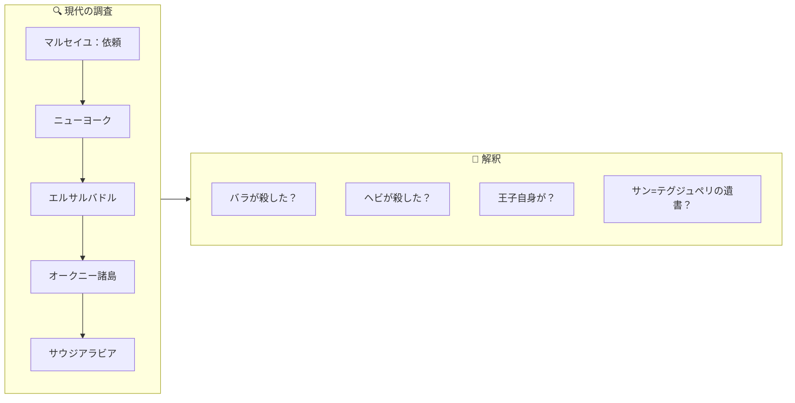
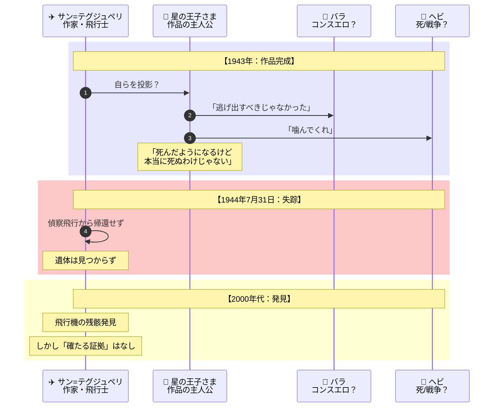
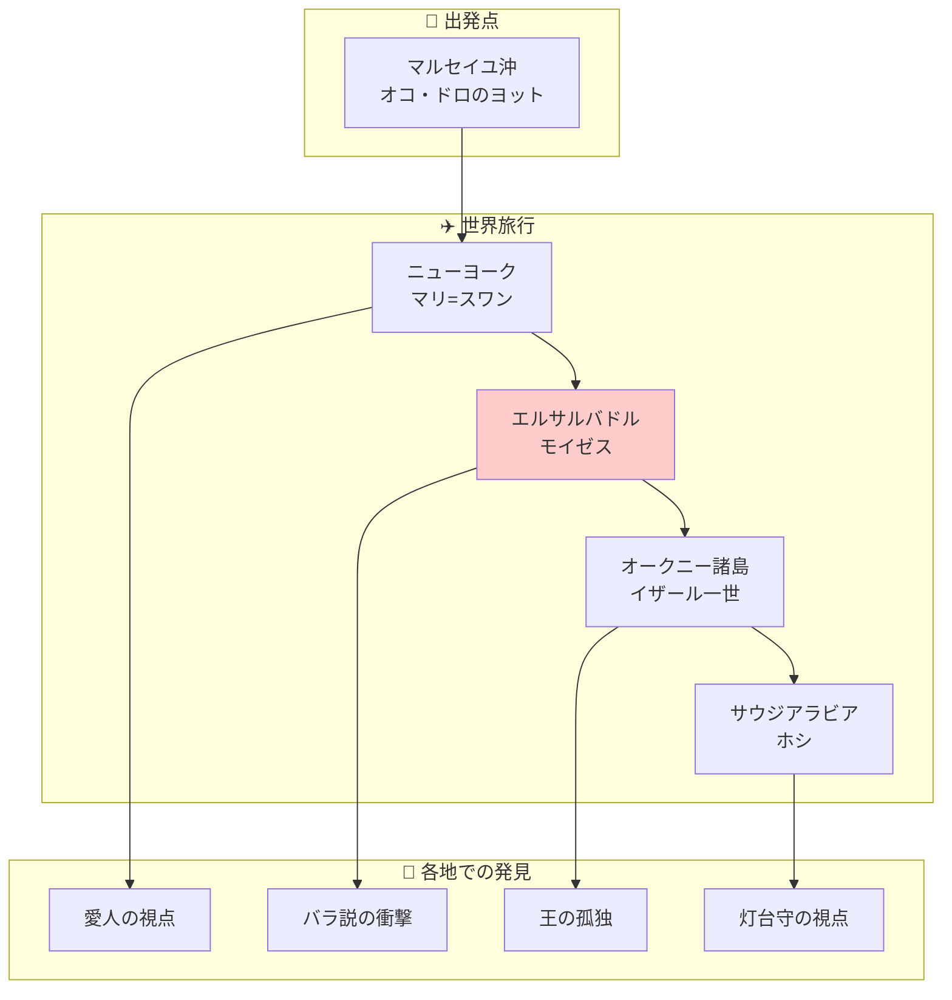
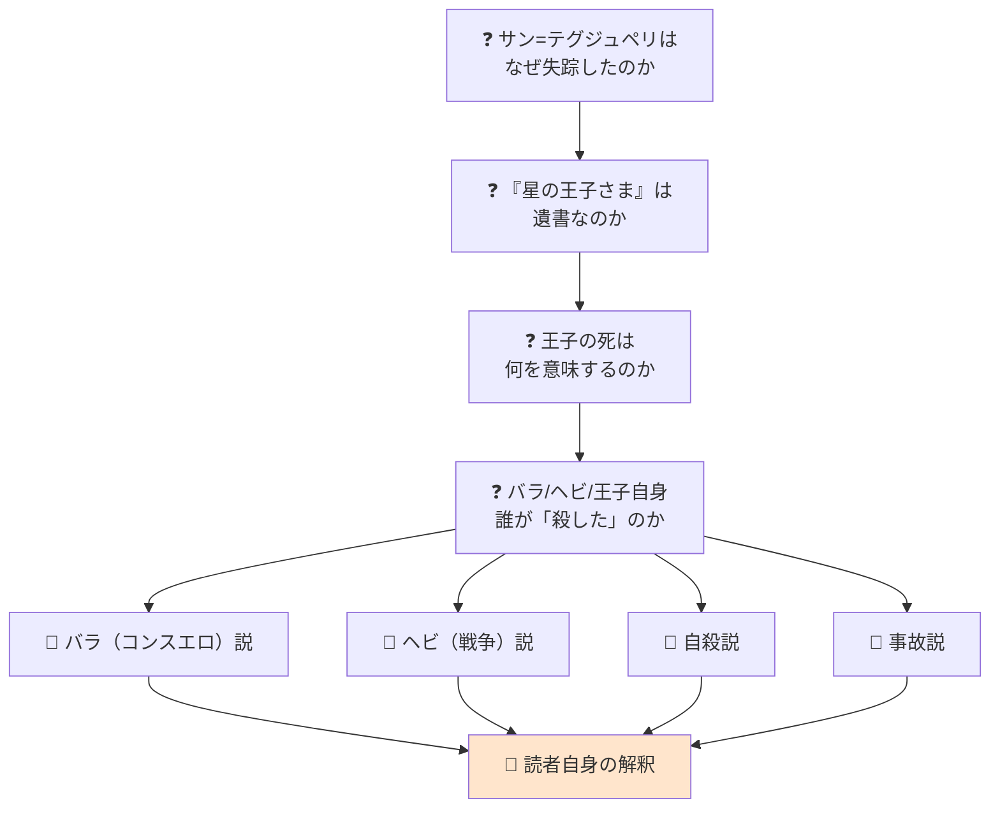

# 『誰が星の王子さまを殺したのか？』完全ストーリーガイド

**本ガイドの目的**: 小説を読んでいない人でも、上から順番に読むだけで物語の全体像を完全に理解できることを目指しています。

---

## はじめに：この物語は何についての話か

『誰が星の王子さまを殺したのか？』は、**「サン=テグジュペリの失踪と『星の王子さま』に描かれた王子の死には驚くべき類似点がある——この謎を追う探偵たちが、世界中の『星の王子さま』愛好家を訪ねながら真実に迫る」という文学ミステリ**です。

物語は次のような問いかけから始まります：

> 「もしこの短い物語が、彼の遺書だったとしたら？ もしサン=テグジュペリが『星の王子さま』のなかで、行方不明の秘密を明かしているとしたら？」

1944年7月31日、サン=テグジュペリは偵察飛行任務のためコルシカ島を飛び立ち、二度と帰ることはなかった。彼の搭乗機と思しき残骸は発見されたが、遺体は見つかっていない。

そして最終的に問われるのは、**「誰が星の王子さまを殺したのか」という文学的・伝記的謎への多様な解釈**です。

---

## 登場人物紹介

### 現代の調査員

| 人物 | 役割 | 説明 |
|-----|------|------|
| **ヌヴァン・ル・ファウ** | 飛行機整備士 | 古い飛行機の専門家。オコ・ドロの依頼で調査に参加 |
| **ヴェロニック** | ヌヴァンの妻 | 調査に協力し、著作権問題などを調べる |
| **アンディ（オンディーヌ）** | 探偵社の研修生 | フォックス・カンパニー探偵社所属。ヌヴァンとともに世界中を巡る |

### クラブ612のメンバー

| 人物 | 所在地 | 役割 |
|-----|-------|------|
| **オコ・ドロ** | マルセイユ沖のヨット | カメルーン人ビジネスマン。調査を依頼した依頼人 |
| **マリ=スワン** | ニューヨーク | 老婦人。サン=テグジュペリのニューヨーク時代を知る |
| **モイゼス・コチャヴ** | エルサルバドル | 酒飲み。コンスエロの故郷で暮らす。衝撃的な解釈を提示 |
| **イザール一世** | オークニー諸島 | アーミニア自治王国の王を自称 |
| **ホシ** | サウジアラビア・ジッダ | 灯台で働く日本人 |
| **地理学者** | 不明 | クラブ612の創設者 |

### サン=テグジュペリ関係者（歴史上の人物）

| 人物 | 関係 | 説明 |
|-----|------|------|
| **アントワーヌ・ド・サン=テグジュペリ** | 作家・飛行士 | 『星の王子さま』の著者。1944年に失踪 |
| **コンスエロ・ド・サン=テグジュペリ** | 妻 | エルサルバドル出身。「バラ」のモデルとされる |
| **マリ・ド・サン=テグジュペリ** | 母 | アントワーヌの母親 |
| **シルヴィア・ハミルトン** | 愛人 | ニューヨーク時代のアメリカ人ジャーナリスト |
| **ネリ・ド・ヴォギュエ** | 愛人 | パリ時代の愛人。偽名で伝記を執筆 |

---

## 重要用語解説

### 作品・文献

| 用語 | 説明 |
|-----|------|
| **『星の王子さま』** | サン=テグジュペリが1943年に完成させた童話。世界で1億7千万部を売り上げ、聖書に次いで最も多く翻訳された本 |
| **クラブ612** | 『星の王子さま』愛好家の秘密結社。「612」は王子の故郷である小惑星B612に由来 |
| **小惑星B612** | 王子が住んでいた小さな惑星。『星の王子さま』の物語の出発点 |

### 歴史的事実

| 用語 | 説明 |
|-----|------|
| **1944年7月31日** | サン=テグジュペリが偵察飛行任務で飛び立ち、失踪した日 |
| **P38ライトニング** | サン=テグジュペリが搭乗していたアメリカ製双発機 |
| **コルシカ島ボルゴ** | サン=テグジュペリが最後に飛び立った基地 |
| **リウ島沖** | 飛行機の残骸が発見された地中海の海域 |

### 物語のキーワード

| 用語 | 説明 |
|-----|------|
| **バラ** | 『星の王子さま』に登場する花。コンスエロのメタファーとされる |
| **ヘビ** | 王子を噛んで「殺した」存在。戦争のメタファー？ |
| **キツネ** | 王子に「飼いならす」ことの意味を教える。友情のメタファー |
| **パーカー51** | 発見された万年筆。サン=テグジュペリの遺品の可能性 |

---

## 物語の構造

この物語は**二重構造**になっています：

1. **現代の調査** - ヌヴァンとアンディがクラブ612のメンバーを訪ねる旅
2. **『星の王子さま』の再解釈** - 各メンバーが異なる「犯人説」を唱える

---

## ストーリー詳細（章ごとのあらすじ）

### 序章：ビジネスマンの島

**場面**: マルセイユ沖、ソルミウ入江

飛行機整備士のヌヴァンは、カメルーン人ビジネスマン、オコ・ドロから連絡を受けます。オコの豪華ヨット「島のダイヤモンド号」に乗り込んだヌヴァンは、錆びた金属片を見せられます。

それは**P38ライトニング機の残骸**——サン=テグジュペリが1944年に搭乗して失踪した飛行機と同型機でした。

さらに決定的な証拠が：**パーカー51の万年筆**。

> 「一九四四年七月三十一日、アントワーヌ・ド・サン=テグジュペリは南仏沿岸沖のどこかで、P38ライトニング機に乗ったまま消息を絶ちました」

オコはヌヴァンに、この万年筆がサン=テグジュペリの遺品であるかどうかを確かめる調査を依頼します。

---

### 調査の始まり：クラブ612

**場面**: 世界各地

オコは「クラブ612」という秘密結社のメンバーでした。612とは、『星の王子さま』で王子が住んでいた小惑星B612にちなんだ数字です。

ヌヴァンと探偵社の研修生アンディは、クラブ612のメンバーを訪ねる世界旅行に出発します。各メンバーは『星の王子さま』の熱狂的な愛好家であり、同時にサン=テグジュペリの失踪について独自の「犯人説」を持っていました。

**クラブ612メンバーの「犯人説」**:

| メンバー | 所在地 | 犯人説 |
|---------|-------|-------|
| オコ・ドロ | マルセイユ沖 | ビジネスマン的視点——著作権と利権 |
| マリ=スワン | ニューヨーク | 愛人シルヴィアの視点 |
| モイゼス | エルサルバドル | バラ（コンスエロ）説 |
| イザール一世 | オークニー諸島 | 王としての孤独 |
| ホシ | サウジアラビア | 灯台守の視点 |

---

### エルサルバドルでの衝撃：バラ（コンスエロ）説

**場面**: エルサルバドル、コンスエロの故郷

酒飲みのモイゼスは、クラブ612のメンバーの中でも最も衝撃的な解釈を提示します。

> 「バラが王子を殺しただって？ 問題外だ」「話が逆だからさ」

モイゼスによれば、コンスエロを捨てたのはサン=テグジュペリのほうなのです。

> 「王子がバラを捨てたみたいにね。それでバラは死んでしまった！」

物語の中で、王子は「ぼくは逃げ出すべきじゃなかった」「ぼくは幼すぎて、花を愛してやれなかった」と後悔します。しかしモイゼスによれば、これは責任逃れの言い訳にすぎません。

サン=テグジュペリは遺書も、続編も、コンスエロへの献辞も残さずに姿を消した——**「卑怯者の自分と正面からむき合うのが怖かったから！」**

---

### 著作権という「現実」

**場面**: 調査の過程で

ヌヴァンの妻ヴェロニックが調べ上げたデータは、『星の王子さま』をめぐる経済的現実を浮き彫りにします。

**『星の王子さま』の経済的価値**:
- 世界で1億7千万部を売り上げ
- 聖書に次いで最も多く翻訳された本
- 関連商品（ぬいぐるみ、香水、腕時計、ゲーム）が膨大な収益を生む
- 遺族は「二派に分かれてぶつかり合った」

**著作権延長の問題**:

フランスでは戦死者の著作権延長規定があり、サン=テグジュペリが「フランスのために戦死した」とされる限り、著作権は延長されます。

> もし彼の死が戦死ではないと判明したら——著作権は切れ、莫大な利権構造が崩壊する

文学的・伝記的関心と経済的利害が複雑に絡み合う構図が、本書には描かれています。

---

### 『星の王子さま』を遺書として読む

**場面**: 調査の核心

ビュッシの最も大胆な提案は、『星の王子さま』をサン=テグジュペリの「遺書」として読むことです。

**類似点**:
- 王子は物語の中でヘビに噛まれて「死んだようになる」
- サン=テグジュペリもまた、姿を消した
- 王子は自分を「脱ぎ捨てられた古い殻」にすぎないと表現する

> 「ぼくは死んだようになるけど、本当に死ぬわけじゃないんだ」——作家は読者に何かを伝えようとしていたのではないか

---

## 最終結論：謎は解けたのか？

『誰が星の王子さまを殺したのか？』は、最終的な「答え」を提供しません。

ビュッシ自身が序文で述べているように：

> 「謎解きのピースはあなたの手の内にある。あなたも推理ゲームに加わって、自分なりの解答を示すことができる」

### 複数の解釈

| 解釈 | 説明 |
|-----|------|
| **バラ（コンスエロ）が殺した** | 愛の重荷、責任からの逃避 |
| **ヘビ（戦争）が殺した** | 第二次世界大戦、飛行任務 |
| **王子自身（自殺）** | 意図的な死、遺書としての作品 |
| **誰も殺していない** | 事故、あるいは神秘 |

### 文学ミステリとしての意義

本書の独創性は、**推理小説の形式を借りて文学研究を行う**という手法にあります。読者は探偵役の二人とともに世界を旅し、証拠を集め、推理を重ねていきます。

このアプローチによって、サン=テグジュペリの生涯と作品が立体的に浮かび上がってきます。

**「誰が星の王子さまを殺したのか」という問いは、最終的には「『星の王子さま』とは何か」「サン=テグジュペリとは誰だったのか」という問いに変容していくのです。**

---

## 物語の構造図解（読後の振り返り用）

### 調査の旅路

### 謎の多層構造

---

## 章別サマリー表

| 場所 | 主な出来事 | 提示される「犯人説」 | 新たな視点 |
|----|-----------|-----------------|---------|
| **マルセイユ沖** | 調査の依頼、万年筆の発見 | 経済的利権の視点 | クラブ612の存在 |
| **ニューヨーク** | マリ=スワンとの対話 | 愛人シルヴィアの視点 | サン=テグジュペリの恋愛関係 |
| **エルサルバドル** | モイゼスの衝撃的解釈 | バラ（コンスエロ）説 | 「話が逆」という視点転換 |
| **オークニー諸島** | イザール一世との対話 | 王の孤独 | 権力と孤独 |
| **サウジアラビア** | ホシとの対話 | 灯台守の視点 | 砂漠と孤独 |

---

## この物語が問いかけるもの

『誰が星の王子さまを殺したのか？』は、単なるミステリではありません。この物語は私たちに問いかけます：

- **「作品と作家の関係」** - 作品を作家の人生から読み解くことの可能性と限界
- **「テクストの多層性」** - 童話として読まれてきた作品に隠された意味
- **「文学と経済」** - 芸術作品が巨大なビジネスとなるとき何が起こるか
- **「真実の複数性」** - 歴史的事実に対する複数の解釈が共存しうること

本書を読んだ後、読者は『星の王子さま』を本棚から取り出すことになるでしょう。そして、あの愛らしい物語を、これまでとは少し違った目で読むことになります。

---

## 付録：『星の王子さま』を読んでいない方へ

本書を十分に楽しむためには『星の王子さま』を読んでいることが望ましいですが、必須ではありません。ビュッシ自身が序文で述べているように：

> 「もしかしたらあなたは、『星の王子さま』を読んだことがないかもしれない。あるいは遥か昔に読んだきりで、よく覚えていないかもしれない。でも心配ご無用。本書に登場する二人の捜査員の導きに従えばいい」

**『星の王子さま』の基本プロット**:
1. 砂漠に不時着した飛行士が、小惑星B612から来た王子と出会う
2. 王子は自分の星にいたバラ（花）のことを語る
3. 王子はさまざまな惑星を旅し、奇妙な大人たちに出会う
4. 最後に王子はヘビに噛まれて「死んだようになる」
5. 飛行士は王子との別れを経験する

---

**本ガイド作成の手法**: 物語構造のリバースエンジニアリング（完成した作品からプロット・人物関係・テーマを抽出する分析手法）を使用しています。
