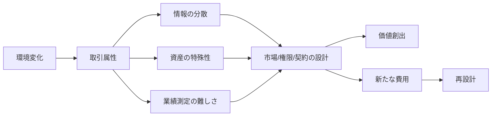
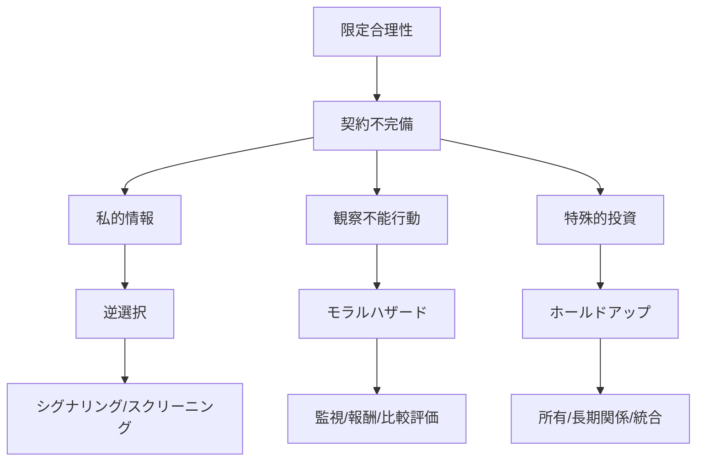

# 圧縮読本：『組織の経済学』

> **ジャンル**: D（学術書・理論寄り教科書） | **圧縮比**: 本文のみ約1.24%（`structure-map.md` と併せて約2.03%／原文 `source.txt` 比） | **推定読了時間**: 45〜55分  
> **原著**: ポール・ミルグロム／ジョン・ロバーツ、NTT出版、1997年初版（2001年第9刷表記）

原著は、組織を「価格が自動で配分する世界の補完物」ではなく、「価格だけでは解けないコーディネーションと動機づけの問題に対する制度的な解答」として捉える。
したがって本書の中心線は、企業論、契約論、人的資源論、ファイナンス論、組織進化論を一つの連続した地図に畳み込むことにある。
読むときのコツは、各章を別テーマとして追うのではなく、次の繰り返しで見ることだ。
問題は何か。
なぜ市場だけでは足りないのか。
どの制度がどの費用を下げ、どの新しい費用を生むのか。
その制度はどんな条件で逆機能するのか。
後半の雇用・報酬・金融・企業境界は、前半の「限定合理性」「私的情報」「レント」「所有」の応用編として読むと全体が締まる。

## 読書ナビゲーション

1. まず第2章で「効率性」「コーディネーション」「動機づけ」「取引費用」の座標軸を押さえる。
2. 第3章と第4章で、価格が強い局面と、計画や権限が必要な局面を見分ける。
3. 第5章から第8章で、情報の非対称性と契約不完備性がどんな歪みを生むかを理解する。
4. 第9章で所有権がなぜ残余コントロール権の配分問題になるかを確認する。
5. 第10章から第13章で、雇用・昇進・報酬が単なる人事慣行ではなく情報設計だと捉える。
6. 第14章と第15章で、投資評価の古典理論と、現実の資本構造・支配権問題を切り分ける。
7. 第16章で企業境界を、市場対統合の二択ではなく多様なガバナンス設計として読む。
8. 第17章で、補完性が制度変化を雪だるま式に増幅する動学を読む。

## コアフレームワーク

### 1. 組織問題の基本式

| 論点 | 典型問題 | 代表的解法 | 副作用 |
| --- | --- | --- | --- |
| コーディネーション | 何を、いつ、どの仕様で動かすか | 価格、計画、権限、ルーチン | 遅延、硬直化、過少適応 |
| 動機づけ | 誰が努力し、誰が責任を取るか | 所有、報酬、昇進、監視、評判 | リスク転嫁、政治化、短期志向 |
| 情報 | 誰が何を知り、何を隠せるか | シグナリング、スクリーニング、比較評価 | 操作、選抜の歪み |
| 所有 | 残余決定権を誰が持つか | 私有、共同所有、統合、提携 | ホールドアップ、共有地悲劇 |
| 境界 | 市場か統合か、または中間形態か | フランチャイズ、系列、協同組合、JV | 管理コスト、信頼依存 |

### 2. 価格が強い世界、価格では足りない世界

価格システムは、標準化された財、比較可能な品質、多数の参加者、低い測定費用の下では圧倒的に強い。
しかし、設計変更が頻繁で、属性が多く、特殊的投資が大きく、交渉が長期化する局面では、価格は十分な命令文にならない。
そのとき企業は、計画、権限、移転価格、比較業績評価、長期関係、評判、所有権配分を組み合わせて代替する。
本書は「市場か組織か」を二分法ではなく、「価格の届く範囲と届かない範囲の境界設計」として扱う。

### 3. 契約不完備性の連鎖

限定合理性がある。
将来の状態を全部書けない。
観察できない行動がある。
観察できても立証できない。
すると契約は完備にならない。
完備でない契約では、事後交渉、ホールドアップ、モラルハザード、逆選択が生じる。
ここで重要なのが、所有、評判、昇進、繰り返し取引、保証金、金融構造などの補完的メカニズムである。

### 4. レントとインフルエンスの政治経済学

組織は価値創出装置であると同時に、レント配分装置でもある。
レントが大きく、配分権限が集中し、基準が曖昧なほど、情報操作、ロビー活動、嫉妬、平等圧力、部門政治が強くなる。
大企業の弱点は規模そのものというより、レントの総額と再配分余地の増大である。
そのため、分権化、責任一元化、比較業績評価、法的境界の維持が重要になる。

### 5. 後半部を貫く統一視角

雇用政策は人的資本と保険の設計である。
昇進制度は配分とインセンティブの二重機能を持つ。
報酬制度は努力だけでなく自己選択も設計する。
資本構造は税や金利だけでなく、経営者と投資家の行動を変える。
企業境界は技術ではなく、取引属性と政治コストで決まる。
制度変化は単発ではなく、補完性によって束になって進む。

## 章別エッセンス

### 第1章 組織は重要か

- 本書は、企業や市場や国家を抽象的な箱としてではなく、具体的な組織形態として捉えるところから始まる。
- ハドソンベイ社、フォード、GM、トヨタなどの歴史的エピソードは、組織差が成果差を生むことを示す導入である。
- 同じ技術や同じ市場条件でも、情報の流れ方と権限の配り方が違えば成果は変わる。
- 組織論の焦点は、誰が何を知り、誰が何を決め、誰が何で動くかである。
- ここで早くも、コーディネーションと動機づけという二大問題が提示される。
- 組織は単に資源を束ねる器ではなく、分散した知識を行動へ変える装置として描かれる。
- 歴史的発展は偶然ではなく、交通・通信・市場拡大に応じた制度適応として理解される。
- 市場の拡大は大企業を生み、大企業は新しい管理技術を必要とした。
- その意味で組織の進化は技術進歩と補完的である。
- 本章は、後の理論章を抽象的定理の集合にしないための現実感覚を与える。
- また、経営学と経済学をつなぐために、理論が現実の組織差を説明できるかが問われる。
- 以後の章はすべて、「なぜ組織形態が違うのか」「その違いが何を節約し何を悪化させるのか」を答える試みになる。

### 第2章 経済組織と効率性

- 効率性はパレート最適の言葉で導入されるが、本書はただちに現実の組織問題へ接続する。
- 経済組織の課題は、価値最大化を実現しつつ、コーディネーションと動機づけを両立させることだと整理される。
- コースの定理は、取引費用がなければ所有権配分にかかわらず効率化できると述べる。
- しかし現実には交渉費用、測定費用、情報費用、契約執行費用がある。
- そこで企業と市場の境界は、どの取引費用をどちらが低く処理できるかで決まる。
- 本章で取引費用アプローチの基本語彙が揃う。
- 取引の属性として、特殊性、頻度、複雑性、不確実性、連結性、測定困難性が重視される。
- 標準的な財なら市場が強いが、属性が増えると価格だけでは十分な指令にならない。
- 一方で企業内でも、価格を置き換えたから問題が消えるわけではなく、移転価格や監視や政治コストが生じる。
- ここで「制度は常に代替費用つき」という本書の姿勢が明確になる。
- 効率性原理は、存続する制度は何らかの適応的理由を持つという作業仮説として提示される。
- ただしそれは現状肯定ではなく、どの条件で制度が崩れるかを問う出発点でもある。

### 第3章 コーディネーションと動機づけにおける価格の役割

- 新古典派市場モデルでは、価格が需要と供給を整合させる。
- 厚生経済学の基本定理は、競争均衡が効率的である可能性を示す。
- ただしその成立には完備市場、完全情報、外部性の不在など強い条件が必要である。
- 本章の肝は、価格が情報圧縮装置として優れている点である。
- 個々人が全体像を知らなくても、価格変化に反応するだけで資源配分が動く。
- この意味で価格システムは情報効率的である。
- しかし規模の経済、外部性、市場欠落、サーチやマッチング問題があると市場は失敗する。
- 企業内部の移転価格は、市場価格があればそれを参照するのが効率的だが、内部政治が入ると歪む。
- 二重マージンの萌芽もここで現れる。
- 標準財と競争的外部市場がある領域では、内部化より外部調達が優位になりやすい。
- 逆に価格で言い尽くせない設計問題では、別の仕組みが必要になる。
- 第4章への橋として、本章は「価格の強さ」と「価格の限界」を同時に見せる。

### 第4章 計画と行動のコーディネーション

- この章では、価格ではなく計画、ルーチン、権限、組織設計が前面に出る。
- デザイン属性の概念は、最適決定に必要な情報が誰の手元にも直接そろわない状況を指す。
- 新製品開発、複雑な製造、補完的投資では、個々の局所判断を価格だけで整合させにくい。
- 補完性が強いほど、一部の改善が他の改善を呼ぶため、全体設計が重要になる。
- 逆に補完性の組み合わせを外すと、部分最適の積み重ねでも全体性能が落ちる。
- ラッキー・ゴールドスターや現代製造戦略の例は、組織編成が技術成果を左右することを示す。
- この章で「デザイン問題」と「連結性」の考え方が深まる。
- 同時に、権限配分は単に命令の問題ではなく、情報が最も厚い場所に裁量を置く問題だとわかる。
- しかし裁量拡大はコントロール低下を伴うので、分権化には補完的な評価制度が要る。
- 事業部制の論理もここで準備される。
- 本章は、組織は固定的な箱ではなく、補完性を束ねる設計物であると読者に教える。
- 最終章の制度進化論も、この補完性の視点を土台にしている。

### 第5章 限定合理性と私的情報

- 契約が完備でない最大の理由として、限定合理性が正面から扱われる。
- 将来状態の列挙不能、言語化不能、立証不能が契約の穴を生む。
- そこへ私的情報が重なると、契約前の逆選択と契約後の交渉問題が発生する。
- 自己のタイプを知る側は、相手に不利な条件で参加しやすくなる。
- 逆選択への対応として、シグナリングとスクリーニングが導入される。
- シグナリングでは、低品質者が模倣しにくい行動を高品質者が選ぶ。
- スクリーニングでは、相手にメニューを示し、自己選択させる。
- ホールドアップ問題もこの章で骨格が明確になる。
- 特殊的投資を行った後では、投資者は交渉で不利になり、過少投資が起こる。
- したがって重要なのは、投資前の段階で将来の再交渉問題をどう抑えるかである。
- ここから所有権論、長期関係、保証、評判の議論へつながる。
- 本章は本書全体の「契約不完備性の源泉」を与える中核章である。

### 第6章 モラル・ハザードと業績インセンティブ

- モラル・ハザードは、望ましい行動が観察しにくいときに起きる契約後の機会主義である。
- 典型例は従業員の怠慢、保険加入後の注意低下、遠隔拠点での販売努力の不足である。
- これに対して企業は、監視、保証金、インセンティブ報酬、解雇脅威を組み合わせる。
- ただし監視は費用がかかり、強い成果連動はリスク移転を伴う。
- よって最適設計は、観察技術、リスク回避度、努力の限界生産力に依存する。
- 複数業務があると、測れる業務だけに努力が偏る。
- そこで均等報酬原理が重要になる。
- 監視の設計は行動を直接変えるだけでなく、何が重視されるかという文化的信号にもなる。
- 不正行為や背任は、制度的な監視穴と報酬構造の歪みから生じやすい。
- また、金融契約や公共制度にもモラル・ハザードは現れる。
- したがって本章の理論は雇用論に限らず、保険、金融、ガバナンスに横断的に効く。
- 第7章では、これをリスク分担と同時に考える必要があることが示される。

### 第7章 リスク・シェアリングとインセンティブ契約

- 良い契約は努力を引き出したいが、強すぎる成果連動はリスクをエージェントに押しつける。
- ここで確実性同値額、リスクプレミアム、危険回避度が重要になる。
- インフォーマティブ原理は、測定誤差を減らす変数は報酬に組み込むべきだと述べる。
- インセンティブ強度原理は、努力の生産性が高く測定誤差が小さく危険回避が弱いほど強い報酬連動が望ましいと示す。
- モニタリング強度原理は、強いインセンティブを採るなら測定精度を高める投資も増やすべきだと示す。
- 均等報酬原理は、複数業務があるなら限界報酬をそろえないと努力配分が歪むことを示す。
- ラチェット効果は、今頑張ると明日の基準が上がるため、今日の努力が抑制される問題である。
- したがって動学的な契約では、今期の評価が来期の基準にどう影響するかが重要になる。
- 個人別、職種別、時点別に同じ制度が効くとは限らない。
- 本章は契約理論の操作盤を与える章であり、後の報酬・昇進・経営者報酬論の基礎になる。
- 一見数理的だが、現場では「何を測り、何に連動させ、どの程度変動させるか」の判断そのものである。
- 第12章と第13章は、この章の応用事例として読むと理解しやすい。

### 第8章 レントと効率性

- レントは資源を引き寄せる最低収益を超える部分であり、組織の動機づけと統治に二面性を持つ。
- 効率性賃金は、高い賃金で失うものを作り、規律や努力を引き出す典型例である。
- 評判もまた、将来失う準レントを担保に行動を律する仕組みとして機能する。
- しかしレントがあるところには、獲得競争と配分政治も生まれる。
- インフルエンス活動は、価値創出ではなく再配分を狙って情報操作やロビー活動を行う。
- 組織が大きく、賞金が大きく、選抜基準が曖昧なほどコストは増える。
- ここで公平性や平等圧力も純粋な道徳問題ではなく、政治コストの源として扱われる。
- 破産法第11条の再建、企業文化、内部政治などもこの文脈で説明される。
- 評判は万能ではなく、終局問題や複雑な品質の場面では弱い。
- だからこそ法制度、所有、監視、昇進ルールが補完的に必要になる。
- 本章は「高賃金」「文化」「忠誠」が感傷ではなく、レント設計の問題だと見せる。
- 同時にレントが大きすぎると腐敗が始まるという、組織の逆説も教える。

### 第9章 所有と財産権

- 所有とは物の占有だけでなく、残余コントロール権と残余利益請求権の配分である。
- 契約が不完備である以上、書かれていない事態を誰が決めるかが重要になる。
- 共有地の悲劇は、権利が曖昧で個々人が便益の全部を取れず費用の全部も負わないときに起きる。
- 漁業、水資源、天然資源、公共財が主要例として扱われる。
- コースの定理は権利が明確で取引費用が低ければ交渉で調整できる可能性を示す。
- しかし現実には交渉不能、権利不明確、測定不能、政治制約がある。
- そのため所有権は単なる分配問題ではなく、投資インセンティブの基盤になる。
- 特殊的資産を持つ側にどこまで権利を与えるかで、投資水準が変わる。
- 私有財産の倫理も触れられるが、本書の主眼は道徳論より制度効果にある。
- 共同所有や国家所有が有効に働く条件も、監視と目標整合の設計次第だと示される。
- 後の雇用、パートナーシップ、協同組合、非営利組織の理解もこの章が土台である。
- 企業境界論では、この章の所有論がそのままホールドアップ対策の議論に流れ込む。

### 第10章 雇用政策と人的資源のマネジメント

- 古典的労働市場理論は賃金と雇用量を価格調整で説明するが、現実の長期雇用には足りない。
- 雇用関係は、保険、人的資本投資、評判、内部ルールを含む関係的契約として描かれる。
- 企業特殊的人的資本が大きいほど、長期雇用の利点は大きい。
- 採用段階では逆選択があり、学歴、訓練、見習い、試用期間がシグナルやスクリーニングになる。
- 人材引き止めには、後払い報酬、昇進機会、福利厚生、訓練投資が用いられる。
- 日本の雇用慣行は、長期雇用、社内訓練、企業内移動、年齢賃金プロファイルの組み合わせで説明される。
- これは外部労働市場の薄さと補完的に成立している。
- 差別問題も、市場の偏見だけでなく情報不足や統計的推論との関係で扱われる。
- 労働者の移動可能性が高い場合と低い場合で、最適政策は変わる。
- 企業は単に人を買うのではなく、能力と忠誠の共同生産を行う。
- そのため人的資源政策は費用項目ではなく、制度設計そのものになる。
- 第11章では、この長期関係が内部労働市場と昇進設計へ接続される。

### 第11章 内部労働市場、職務配置、昇進

- 内部労働市場は、外部市場価格の代わりに社内ルールで配置、昇進、報酬を決める仕組みである。
- 入口制限、キャリアラダー、長期評価、職務ローテーションが特徴となる。
- 昇進には二つの役割がある。
- 一つは適材適所の配置。
- もう一つは過去の努力に対するインセンティブ報酬。
- この二つはしばしば衝突する。
- 最もよく働いた人が必ずしも次の職務に最適とは限らないからである。
- ここでピーターの法則、トーナメント、比較業績評価が登場する。
- 昇進差を大きくすると努力は高まるが、協力は損なわれ、政治化も進みうる。
- テニュアやアップ・オア・アウトのような制度は、この配置とインセンティブの組み合わせとして読める。
- 職務配置は情報の厚い現場と、全社的な評価の必要をどう両立させるかの設計問題である。
- 本章は、人事制度が単なる慣習ではなく、測定困難な能力を扱う情報メカニズムであることを示す。

### 第12章 報酬と動機づけ

- 報酬の形態は、固定給、出来高給、歩合、目標管理、主観評価、相対評価、グループ報酬など多様である。
- 重要なのは、どの制度がどの行動を強くし、どの行動を弱くするかである。
- 出来高給は測定しやすい単純作業では強い。
- しかし品質、協力、長期学習、顧客関係のような多面的業務では偏りを生む。
- そこで主観評価や管理者裁量が必要になるが、そのぶんえこひいきや政治も入りやすい。
- 契約メニューは自己選択を引き出し、生産性が高い者に可変給を選ばせる。
- 職務デザインと報酬は分離できず、何を測るかが何を仕事とみなすかを決める。
- プロフィットシェアリングやゲインシェアリングは、チーム生産の局面で用いられる。
- ただし全社利益連動は、自分の努力が全体に埋もれるので弱いインセンティブになりやすい。
- 逆に局所利益だけを見ると部門最適が起こる。
- よって報酬設計は、業績測定単位の設計そのものでもある。
- 本章は実務的含意が濃く、「何に払うか」は「何を組織が本気で求めるか」の宣言だとわかる。

### 第13章 経営者および管理者の報酬

- 経営者報酬は、世間的関心の高さとは裏腹に、測定困難性が極端に高い領域である。
- CEOの業績は景気、産業環境、資本市場、先任者の遺産に強く左右される。
- それでも株式、オプション、ボーナス、退職金、ゴールデンハンドカフなどが組み合わされる。
- 本章は、CEO報酬の水準そのものより、感応度の低さに注目する。
- 保有株式が少なければ、企業価値への感応度は弱く、帝国拡張や役得追求が起きやすい。
- 逆に強すぎる株価連動は、短期株価への迎合や過大リスクを促す恐れがある。
- 中間管理職についても、リスクを取らせたいが破綻は避けたいという緊張がある。
- 国際比較では、日本、米国、欧州で水準も構造もかなり異なる。
- 重要なのは、報酬単体ではなく、所有、取締役会、資本市場、昇進市場と組み合わせて見ることだ。
- 経営者報酬はガバナンスの代用品にも補完物にもなる。
- 本章の論点は第15章の金融構造論と直結しており、資本構造の変化は経営者行動も変える。
- よってCEO報酬の評価は「高いか低いか」ではなく、「何を誘発しているか」で判断すべきだとわかる。

### 第14章 投資とファイナンスの古典的理論

- この章は古典的金融経済学の整理であり、実務で最も使われる道具箱を与える。
- 純現在価値は、期待キャッシュフローを資本コストで割り引いて投資判断する基本原理である。
- フィッシャーの分離定理は、完全資本市場なら投資判断と消費選好を切り分けられると示す。
- モジリアーニ=ミラー定理は、税や摩擦がなければ資本構成や配当政策は企業価値を変えないとする。
- CAPMは、分散可能な個別リスクではなく、ベータで測るシステマティックリスクだけが価格づけられると述べる。
- 効率的市場仮説は、公開情報が価格に織り込まれる度合いに応じて弱型、準強型、強型に分かれる。
- この古典理論は現実の摩擦を無視するが、何が本質的摩擦かを見分ける基準として強力である。
- 本章は「基準線」を提供する章であり、後の第15章はその基準線からのズレを説明する。
- 株価を用いた業績評価がなぜ一定の合理性を持つかもここで説明される。
- 同時に、古典理論だけでは経営者インセンティブや所有移転の問題は説明しきれないことも明示される。
- したがって本章は完結ではなく、現代理論への入口である。
- 実務的には、投資評価の型を身につけつつ、その前提が崩れる場面を意識して読むべき章である。

### 第15章 金融構造、所有、コーポレート・コントロール

- 本章は、1980年代の買収、LBO、ジャンクボンド、スピンオフ、バストアップを背景に始まる。
- 問いは、株式と負債の違いが本当に意味を持つのか、なぜ支配権移転が頻発したのかである。
- フリーキャッシュフローが大きい企業では、経営者が過剰投資や帝国拡張に走る誘因がある。
- 負債は返済義務と破産リスクによって、その余剰を吐き出させる「ハード」な規律として働く。
- ただし負債増加は、株主と債権者の利害対立、過大リスク、過少投資、債務超過を生む。
- したがって最適金融構造は、規律効果と歪みの均衡になる。
- 所有の集中は監視インセンティブを高めるが、少数者支配や私的利益の収奪も招きうる。
- テイクオーバー市場は無能経営を懲らしめる可能性がある一方、約束違反や短期解体の危険もある。
- ポイズンピル、グリーンメール、超多数決、委任状争奪戦などは、支配権防衛の制度として論じられる。
- 国際比較では、日本やドイツのメインバンク、相互持合い、友好的移転が米英と対照される。
- ここでの重要点は、金融商品が単なる請求権の束ではなく、行動を変える統治装置だということだ。
- 本章はファイナンスを統治論へ引き戻し、本書前半のインセンティブ理論と合流させる。

### 第16章 企業の境界と構造

- 第16章は本書の総合編であり、垂直境界と水平範囲を一つの地図にまとめる。
- 市場調達の長所は、競争、所有者インセンティブ、規模と範囲の経済、コア・コンピテンスの活用にある。
- 垂直統合の長所は、コーディネーション改善、特殊的投資の保護、二重マージン回避、独占歪みの緩和にある。
- ただし統合後にも移転価格争い、部門政治、平等圧力、技術停滞が起こりうる。
- ローム、EDS、IBMの事例は、補完性目当ての統合が文化衝突とインセンティブ弱化で失敗しうることを示す。
- 協同組合は独占対抗や共同購買には効くが、所有分散ゆえに監視不足と内部政治を抱える。
- フランチャイズは、店主の強い所有者インセンティブと本部のブランド統制を組み合わせる中間形態である。
- 日本の自動車サプライヤー・システムは、比較業績評価、複社発注、長期関係、サプライヤー連合会で市場と統合の長所を折衷する。
- 水平拡張では、規模・範囲の経済とコア・コンピテンスが成功条件になる。
- しかし大組織化は情報の劣化、管理層の追加、株価情報の混濁、インフルエンス・コスト増大を招く。
- 企業提携と系列は、完全統合より弱い結合で補完資源を組み合わせる試みとして理解される。
- 本章の帰結は、企業境界は技術的必然ではなく、取引属性と政治費用の比較による可変的設計だという点にある。

### 第17章 経営・経済システムの進化

- 最終章は静学分析を動学へ開き、制度変化のメカニズムを論じる。
- 中心概念は補完性であり、一つの改革が他の改革を呼び、成功が模倣を促し、模倣が新技術を誘発する。
- その結果、組織変化は雪だるま式に広がる。
- 製造技術、通信技術、輸送技術の進歩は、企業境界と国際競争の条件を大きく変える。
- グローバリゼーションは、資金、技術、人材、ブランドの移動を加速させ、企業に新しい組織実験を迫る。
- 同時に、所有形態、資本市場、コーポレート・コントロールも変化し続ける。
- 人的資源面では、高齢化、女性就労、教育問題、熟練不足が制度再設計を促す。
- 東欧やソ連の体制転換では、整合的な制度束から別の制度束への移行がいかに難しいかが論じられる。
- ここで本書は、改革を部品交換ではなくシステム変態として捉える。
- 旧体制と新体制の混合は、補完性の欠如ゆえに最悪の中間状態を生みやすい。
- 最後に、経済学は現実の組織研究と結びつくことで初めて十分に有用になると結ばれる。
- 本書全体は、制度を抽象理論に還元せず、しかし逸話にも溺れないための橋として完結する。

## 原文から拾うべき引用

> 「ビジネス組織は過去150年間に大きな変化を遂げてきた。」

> 「企業をその製品によってとらえるという考え方は, 静学的な条件のもとですら、 あまり意味がない。」

> 「それよりも、 事業の機会に応じて、 コントロールの下にある資源を活用する組織として企業をとらえたほうがよい。」

> 「これらの変化は根深く、 同時進行している。」

これら4行だけでも、本書の射程は見える。
組織は静止物ではなく、制度束として変化する。
企業は製品ではなく、資源と権限の編成として理解すべきである。
金融構造は請求権の違いではなく、規律の違いを生む。
そして変化は単発ではなく、補完的に連動する。

## 批判的視点

本書の強さは、経営慣行を「文化」や「精神論」で済ませず、情報・権限・レント・所有の問題へ翻訳する点にある。
同時に限界もある。
第一に、デジタル・プラットフォーム、アルゴリズム管理、データ独占のような今日的論点は当然まだ薄い。
第二に、価値最大化を基準線に据えるため、権力や正義の問題は制度効果の従属変数として扱われやすい。
第三に、日本企業論は1990年代初頭までの制度環境に強く依存しており、その後の金融化や労働市場流動化を読者が補う必要がある。
それでも、なぜ制度が補完的に固着し、なぜ部分改革が失敗しやすいかを説明する力は現在でも非常に強い。

## 重要用語

| 用語 | 圧縮定義 | 読みどころ |
| --- | --- | --- |
| 限定合理性 | 将来を全部書けず計算しきれないこと | 契約不完備の根 |
| 私的情報 | 一方だけが知る重要情報 | 逆選択とシグナルの起点 |
| モラル・ハザード | 契約後の観察しにくい機会主義 | 監視と報酬設計の理由 |
| ホールドアップ | 特殊的投資後の再交渉で弱くなること | 所有と長期関係の理由 |
| レント | 必要最低限を超える収益 | 規律にも政治にもなる |
| インフルエンス・コスト | 再配分を狙う政治的活動の費用 | 大組織の見えにくい病 |
| 残余コントロール権 | 書かれていない事態を決める権限 | 所有論の核心 |
| 二重マージン | 川上川下がそれぞれ上乗せする歪み | 垂直統合の理由 |
| 比較業績評価 | 横並び比較で個人を評価する方法 | サプライヤー管理や昇進に有効 |
| ラチェット効果 | 今の好成績が未来の基準引上げを招くこと | 動学契約の落とし穴 |
| フリーキャッシュフロー | 採算投資後に残る余剰資金 | 第15章の規律問題 |
| 補完性 | 一方の改善が他方の価値を上げる関係 | 最終章の進化論の核 |

## 実務に引き寄せるチェックリスト

- その仕事は価格で十分に指示できるか、それとも仕様協議が本体か。
- 特殊的投資を誰が行い、事後交渉で誰が弱くなるか。
- 評価できる成果だけを報酬化して、重要だが測れない行動を壊していないか。
- 部門ごとの最適化が全社価値を毀損していないか。
- 高い報酬や厚い福利厚生は、単なるコストか、それとも規律装置か。
- 資本構造は節税だけでなく、経営者の行動をどう変えているか。
- 買収や統合は補完性の獲得か、単なる規模拡大か。
- 共同事業や提携で学習した相手が将来の競争者になるリスクをどう見るか。
- 改革は単発で入れても回るか、それとも補完的な制度束が必要か。

## 典型的な落とし穴

- 市場失敗を見るとすぐ統合が正しいと思い込むこと。
- 強いインセンティブが常に良いと思い、リスク移転コストを忘れること。
- 所有集中が監視を強める一方で私的利益収奪も強める点を見落とすこと。
- 日本型、米国型を静的な成功モデルとして神話化すること。
- 数式上の効率性と、制度移行の実装可能性を混同すること。
- 一つの成功慣行を単独で輸入し、補完制度を入れずに失敗すること。

## 横断ケース・コラム

### GM・EDS・ローム

補完能力の取り込みを狙った買収でも、報酬体系と文化と権限配分が崩れると価値が壊れる。
「大企業が小企業の企業家精神を所有すれば自動的に使える」という幻想を、本書は繰り返し退ける。

### マクドナルド型フランチャイズ

本部のブランド統制と加盟店の所有者インセンティブを両立させる好例である。
ただし本部の権力が強すぎれば、加盟店側の特殊的投資が痩せる。

### トヨタのサプライヤー管理

市場と統合の中間形態として最も示唆的である。
比較業績評価、複社発注、長期関係、設計参加、サプライヤー連合会が、特殊的投資保護と競争圧力を同時に実現する。

### 東欧・ソ連の体制移行

制度は部品ではなく束であり、整合した新制度が立つ前の中間状態が最も脆いことを教える。
この章は企業改革にもそのまま効く。

## 原典への橋

再読するなら、第2章、第5章、第7章、第9章、第15章、第16章、第17章の順がよい。
第2章で座標軸を作る。
第5章で契約不完備と私的情報を押さえる。
第7章でインセンティブ契約の原理を掴む。
第9章で所有論を置く。
第15章でファイナンスを統治として読み替える。
第16章で境界問題に戻る。
第17章で動学化する。
この順に戻ると、本書の前半と後半が一本につながる。

## 構造マップ簡表

| 部 | 章 | 役割 | キー概念 |
| --- | --- | --- | --- |
| 導入 | 1 | なぜ組織差が重要かを示す | 歴史、企業差、問題設定 |
| 基礎理論 | 2-4 | 効率性、価格、設計問題の土台 | 取引費用、価格、補完性 |
| 契約理論 | 5-8 | 情報・インセンティブ・レント | 逆選択、MH、リスク、レント |
| 所有 | 9 | 財産権と残余決定権 | 所有、共有地、投資保護 |
| 人事 | 10-13 | 雇用、昇進、報酬、経営者報酬 | 人的資本、内部労働市場、トーナメント |
| 金融 | 14-15 | 投資評価と支配権問題 | NPV、MM、CAPM、負債規律 |
| 境界と進化 | 16-17 | 企業範囲と制度変化 | 統合、提携、系列、補完的進化 |

この本の圧縮一句を置くならこうなる。
市場は情報を圧縮する。
企業は関係を編成する。
契約は穴だらけである。
所有はその穴の処理権を配る。
報酬は努力だけでなく注意の向きを変える。
金融は金集めではなく統治の形式である。
組織は単独で進化せず、補完性の束として変化する。
