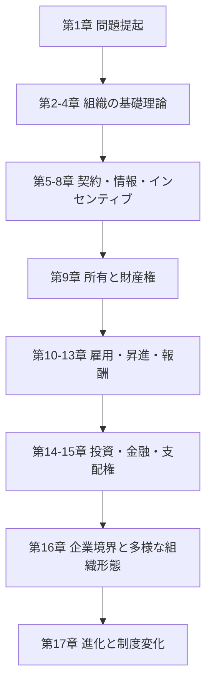
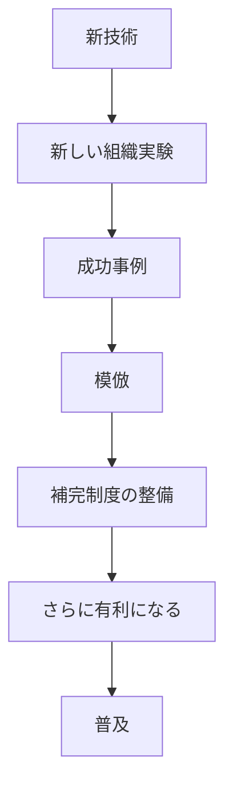

# structure-map: 組織の経済学

## 1. 全体の骨格

本書の流れは、単なる章の直列ではない。
前半で「組織問題の一般理論」を置き、
中盤で「契約・所有・人的資源」に展開し、
後半で「金融・企業境界・制度進化」へ拡張する。

## 2. 章ごとの役割マップ

| 章 | 中心問題 | メカニズム | 代表例 | 次章への橋 |
| --- | --- | --- | --- | --- |
| 1 | なぜ組織差が重要か | 歴史比較 | ハドソンベイ、フォード、GM、トヨタ | 理論化の必要 |
| 2 | 経済組織と効率性 | 取引費用、価値最大化 | コースの定理 | 価格の役割へ |
| 3 | 市場価格は何を解くか | 情報効率、競争均衡 | 市場価格、移転価格 | 価格の限界へ |
| 4 | 価格で足りない時どうするか | 補完性、計画、権限 | デザイン問題、現代製造戦略 | 契約不完備へ |
| 5 | なぜ契約は穴だらけか | 限定合理性、私的情報 | 逆選択、シグナル | モラルハザードへ |
| 6 | 契約後に何が崩れるか | 観察不能行動 | モラルハザード、監視 | リスク配分へ |
| 7 | 強い報酬はなぜ難しいか | リスク分担と努力誘因 | 情報原理、ラチェット | レントと政治へ |
| 8 | なぜ内部政治が起きるか | レント、評判、インフルエンス | 効率性賃金、企業文化 | 所有論へ |
| 9 | 誰が最後に決めるのか | 残余コントロール権 | 共有地悲劇、財産権 | 雇用関係へ |
| 10 | 長期雇用はなぜあるか | 関係的契約、人的資本 | 日本型雇用、採用 | 内部労働市場へ |
| 11 | 昇進は何をしているか | 配置とインセンティブの両立 | トーナメント、テニュア | 報酬設計へ |
| 12 | 何に賃金を払うべきか | 成果測定と自己選択 | 出来高、歩合、利益分配 | 経営者報酬へ |
| 13 | 経営者をどう動かすか | 所有、株価連動、裁量 | CEO報酬、オプション | 金融構造へ |
| 14 | 投資判断の基準は何か | NPV、MM、CAPM | 古典的金融理論 | 現実の金融摩擦へ |
| 15 | 金融構造は行動をどう変えるか | 負債規律、支配権市場 | LBO、買収、防衛策 | 企業境界へ |
| 16 | 企業はどこまで広がるべきか | 市場・統合・中間形態比較 | フランチャイズ、系列、協同組合 | 制度進化へ |
| 17 | 組織はどう変わるか | 補完性、模倣、制度変態 | グローバル化、体制移行 | 全体総括 |

## 3. 前半理論の因果連鎖

### 3-1. 価格から組織へ

1. 市場価格は標準化された取引を効率化する。
2. しかし複雑な設計と特殊的投資では価格情報だけでは不十分になる。
3. そこで企業内の計画、権限、ルーチン、移転価格が必要になる。
4. ただし企業内には監視費用と政治費用が持ち込まれる。
5. よって「市場か組織か」は万能解ではなく比較問題になる。

### 3-2. 契約から所有へ

1. 限定合理性がある。
2. 契約は完備にならない。
3. 私的情報と観察不能行動がある。
4. 逆選択とモラル・ハザードが生じる。
5. 特殊的投資があるとホールドアップが起きる。
6. その穴を埋めるために所有、評判、長期関係、保証金、昇進が必要になる。

## 4. 後半部の論理地図

### 4-1. 雇用から報酬へ

雇用関係は単発の売買ではなく、保険と育成を含む長期契約として理解される。
内部労働市場が成立すると、昇進は配置とインセンティブを同時に担う。
すると報酬は、現在の成果だけでなく将来の地位や参加制約も含む設計になる。
その最終形が経営者報酬であり、所有と資本市場と結びついてガバナンス問題になる。

### 4-2. 金融から境界へ

1. 第14章は、摩擦のない世界のベンチマークを与える。
2. 第15章は、現実には金融構造が行動と支配権を変えることを示す。
3. 第16章は、その支配権問題を企業境界へ広げる。
4. つまり本書では、ファイナンス論と企業論は別分野ではない。
5. どちらも「誰が決め、誰が残余を受け、誰が規律されるか」を問う同じ問題系に属する。

## 5. 中間形態の比較表

| 形態 | 何を解くか | 何が残るか | 向く条件 |
| --- | --- | --- | --- |
| 市場取引 | 競争による低コスト調達 | 特殊的投資保護が弱い | 標準財、測定容易 |
| 垂直統合 | コーディネーション、投資保護 | 部門政治、移転価格問題 | 高い特殊性、設計連動 |
| フランチャイズ | ブランド統制と店主誘因の両立 | 本部によるホールドアップ | 標準化されたサービス網 |
| 協同組合 | 独占対抗、共同購買 | 監視不足、内部対立 | 会員が比較的同質 |
| 日本型サプライヤー関係 | 長期協働と競争圧力の両立 | 信頼依存、慣行維持コスト | 複雑部品、継続改善 |
| 系列・提携 | 補完資源の柔軟な結合 | 学習流出、境界曖昧化 | 技術融合、国際展開 |

## 6. 第16章の内部構成マップ

### 垂直的境界

- 市場調達の利点
- 垂直統合の利点
- 協同組合
- フランチャイズ制小売業
- 日本の自動車サプライヤー関係

### 水平的範囲

- コア・コンピテンスによる拡張
- 規模と範囲の経済
- 情報劣化
- インフルエンス・コスト
- 合併にともなう文化衝突

### 企業提携

- 相手の補完資源を借りる
- 共同学習と共同投資
- 将来の競争相手を育てる危険
- 系列は緩い本部を持つ準事業部制として読める

## 7. 第17章のダイナミクス

この章では、組織変化が単なる最適化ではなく、経路依存と模倣を含む進化過程だと示される。
また、東欧・ソ連の体制移行を通じて、整合的制度束の一部だけを移植しても機能しにくいことが強調される。
この視点は、企業変革にもそのまま当てはまる。

## 8. 原著再訪の優先順位

### 最短再読ルート

1. 第2章
2. 第5章
3. 第7章
4. 第9章
5. 第15章
6. 第16章
7. 第17章

### 実務寄り再読ルート

1. 第10章
2. 第11章
3. 第12章
4. 第13章
5. 第15章
6. 第16章

### 組織設計寄り再読ルート

1. 第3章
2. 第4章
3. 第8章
4. 第16章
5. 第17章

## 9. 一文要約の束

第2章は「何が費用か」を決める章。
第5章は「なぜ契約が閉じないか」を決める章。
第7章は「報酬をどこまで尖らせられるか」を決める章。
第9章は「最後に誰が決めるか」を決める章。
第10章から第13章は「人をどう残し、動かし、選ぶか」を決める章。
第14章と第15章は「金の集め方がなぜ統治になるか」を決める章。
第16章は「企業はどこまで抱えるべきか」を決める章。
第17章は「制度はどう増殖し、どう壊れるか」を決める章。

## 10. この本の設計思想

この本の最終的な設計思想は次の通りである。
市場は強い。
しかし市場は万能ではない。
企業は必要だ。
しかし企業も万能ではない。
だから現実の組織は、市場、権限、契約、所有、評判、金融、文化を混ぜながら中間形態を発明し続ける。
その発明の論理を、経済学の言葉で一冊通して説明したのが本書である。

## 11. 横断テーマ索引

### 11-1. コーディネーションはどこで深まるか

| 論点 | 最初に立つ章 | 深まる章 | 実務的な読み替え |
| --- | --- | --- | --- |
| 価格による調整 | 3 | 14, 16 | 市場価格、資本市場、外部調達 |
| 計画と設計 | 4 | 16, 17 | 新製品開発、複雑案件、標準化 |
| 権限配分 | 4 | 11, 16 | 分権化、現場裁量、本部統制 |
| 移転価格 | 3 | 16 | 事業部間取引、部門間政治 |
| 補完性 | 4 | 12, 16, 17 | 制度束、改革パッケージ |
| ルーチン | 4 | 16, 17 | オペレーション標準、文化、再現性 |

### 11-2. 動機づけはどこで深まるか

| 論点 | 主要章 | 何が問われるか |
| --- | --- | --- |
| 逆選択 | 5, 10, 12 | 参加前に相手の質をどう見抜くか |
| モラル・ハザード | 6, 12, 15 | 契約後にどう怠慢や私益追求を抑えるか |
| リスク分担 | 7, 10, 12, 13 | 強い誘因と保険をどう両立するか |
| 評判 | 8, 10, 16 | 契約で書けない行動をどう支えるか |
| 昇進 | 11, 13 | 配置と報酬の二重機能をどう設計するか |
| 所有 | 9, 13, 15 | 決定権と残余利益をどう結びつけるか |

## 12. ケースアトラス

### 歴史的企業

| 企業・事例 | 使われ方 | 教訓 |
| --- | --- | --- |
| フォード | 流れ作業と集権 | 大量生産は標準化を要求する |
| GM | 事業部制と多角化 | 分権化と本部統制のバランス |
| シアーズ | 範囲拡大と限界 | 関連性の薄い多角化の脆さ |
| ハドソンベイ社 | 初期の組織問題 | 長距離取引と権限の難しさ |

### 契約・インセンティブ

| 企業・事例 | 使われ方 | 教訓 |
| --- | --- | --- |
| リンカーンエレクトリック | 業績給の代表例 | 単純な成功神話ではなく補完制度が必要 |
| ソロモン・ブラザーズ | 報酬制度と暴走 | 強い金銭誘因の副作用 |
| ベルサウス | 後払い報酬 | 離職抑制の設計 |
| 効率性賃金の諸例 | 高賃金の機能 | 高賃金は厚遇ではなく規律装置になりうる |

### 境界・提携

| 企業・事例 | 使われ方 | 教訓 |
| --- | --- | --- |
| ローム | 補完能力と販売体制 | 中間形態から内部化へ移る条件 |
| IBM-ローム | 文化衝突 | 買収しても企業家精神は保存されにくい |
| GM-EDS | 規律と嫉妬 | 補完性目当ての統合が内部政治を呼ぶ |
| NUMMI | 短期提携による学習 | 合弁は所有より学習に向く場合がある |
| 三菱とIBM | 販売提携 | 補完資源が一致すれば緩い結合で足りる |
| トヨタの複社発注 | 長期関係と競争の両立 | 中間形態の傑作例 |

## 13. 概念の再登場マップ

### 13-1. 「特殊的資産」はどこに再登場するか

第5章ではホールドアップの原因として出る。
第9章では所有権配分の論拠になる。
第10章では企業特殊的人的資本として出る。
第16章では垂直統合、フランチャイズ、日本型サプライヤー関係の判断軸になる。
つまり特殊性は、一度きりの契約論の語ではなく、本書全体の境界判断語である。

### 13-2. 「比較業績評価」はどこに再登場するか

第7章ではノイズ除去の手段として出る。
第11章では昇進やトーナメントの公平性問題に出る。
第16章ではトヨタのサプライヤー管理の中核原理として出る。
この再登場は、社内人事と社外取引が同じ情報問題を共有していることを示す。

### 13-3. 「評判」はどこに再登場するか

第8章では契約執行の代替として立つ。
第10章では雇用関係の安定装置になる。
第16章ではフランチャイズのブランド価値と、日本型長期取引の信頼基盤になる。
評判は非公式制度だが、法制度や所有権と競合ではなく補完関係にある。

## 14. 組織デザインの判断表

| 状況 | 優先すべきもの | 避けたい失敗 |
| --- | --- | --- |
| 標準化された大量取引 | 市場競争、価格、外部調達 | 不要な内製化 |
| 頻繁な仕様変更 | 長期関係、共同設計、権限調整 | 毎回の再入札 |
| 高い特殊的投資 | 所有権保護、関係継続、統合検討 | 事後交渉依存 |
| 多面的で測りにくい仕事 | 主観評価、昇進、文化的規範 | 指標だけの管理 |
| フリーキャッシュフロー過多 | 負債規律、配当、監視強化 | 帝国建設 |
| 文化差の大きい買収 | 法的分離、限定統合、段階統合 | 一気通貫の完全吸収 |

## 15. 前半と後半の対応関係

| 前半の理論章 | 後半での応用先 | 対応の意味 |
| --- | --- | --- |
| 第2章 取引費用 | 第16章 企業境界 | 市場と統合の比較原理 |
| 第3章 価格システム | 第14章 資本市場 | 価格が持つ情報圧縮力 |
| 第4章 補完性 | 第17章 進化論 | 改革が束で進む理由 |
| 第5章 私的情報 | 第10章 採用、第15章 資金調達 | タイプの見抜きとシグナル |
| 第6章 モラル・ハザード | 第12章 報酬、第15章 ガバナンス | 契約後の逸脱抑制 |
| 第7章 リスクと誘因 | 第13章 経営者報酬 | 変動報酬の限界 |
| 第8章 レントと政治 | 第16章 合併失敗 | 大組織の内部政治 |
| 第9章 所有 | 第15章 支配権、第16章 統合 | 残余決定権の帰属 |

## 16. 精読ポイント

### 理論で詰まりやすい箇所

- 第3章の価格理論は、完全市場の条件と現実の差を意識しながら読む。
- 第7章は原理の暗記ではなく、どの変数が強い誘因を正当化するかで読む。
- 第14章は金融理論を絶対視せず、「どの摩擦をゼロにしているか」を確認しながら読む。

### 事例で読み飛ばしてはいけない箇所

- IBM-ロームは補完性獲得と文化破壊が同時に起きる例として重要。
- トヨタのサプライヤー・システムは本書の中間形態論の頂点。
- 東欧・ソ連の移行論は企業改革にも使えるため、最終章でも軽視しないほうがよい。

## 17. 圧縮結論

本書は、企業論の本でありながら、実際には次の問いを一貫して扱っている。
誰が知っているか。
誰が決めるか。
誰が残余を取るか。
誰が失敗コストを負うか。
制度は、その四つの配分の仕方にすぎない。
市場、企業、提携、協同組合、フランチャイズ、系列、国家体制までを同じ文法で比較できる点が、本書の最大の強みである。

## 18. 章間リンク集

### 第2章から第3章へ

効率性を語るだけでは不十分で、誰がその効率性をどう実現するかが必要になる。
その答えの第一候補が価格システムである。
だから第3章は、単なる市場礼賛ではなく、第2章の抽象的効率概念を実装する第一の制度として置かれている。

### 第3章から第4章へ

価格が万能なら第4章は不要である。
第4章が存在すること自体が、本書の立場表明になっている。
つまり、組織論は市場の失敗の残余論ではなく、複雑性と補完性が本質である領域を正面から扱う独立分野だ、という宣言である。

### 第5章から第9章へ

契約が不完備であるなら、最後に物をいうのは所有である。
第9章の所有論は、契約理論の補論ではなく、契約理論の帰結である。
何を誰が所有するかとは、書けなかった事態で誰が勝つかを決めることだからである。

### 第10章から第13章へ

人的資源の章群は、採用、配置、報酬を別々の機能として切り離していない。
採用は将来の配置と報酬を前提に行われ、
配置は将来の昇進インセンティブを前提に行われ、
報酬は採用時の自己選択を前提に組まれる。
この連鎖を見失うと、個別施策の善し悪しだけを論じて終わる。

### 第14章から第15章へ

第14章は、摩擦のない金融理論の整然さを示す。
第15章は、その整然さが現実ではどこで崩れ、どの崩れ方が行動変容を生むかを示す。
したがって第15章は第14章の否定ではなく、前提条件の剥ぎ取りである。

### 第16章から第17章へ

第16章は境界の比較静学であり、第17章はその比較静学が時系列でどう動くかを扱う。
企業が市場から統合へ、統合から提携へ、提携から再編へと移るのは、単に好みが変わるからではなく、技術・制度・国際環境の補完関係が変わるからである。
この意味で第17章は終章であると同時に、第16章の動学版でもある。

## 19. 用途別の読み筋

### 経営者向け

- 第4章で補完性を見る。
- 第7章で評価制度の副作用を見る。
- 第12章で報酬の設計余地を見る。
- 第16章で統合か提携かの判断軸を得る。

### 人事責任者向け

- 第10章で雇用関係を保険として読む。
- 第11章で昇進が情報装置だと理解する。
- 第12章で測れる成果と測れない成果の配分問題を見る。
- 第13章で上位管理職に同じ論理がどう拡張されるか確認する。

### CFO・経営企画向け

- 第14章で古典理論の基準線を押さえる。
- 第15章で負債規律と支配権移転の論理を読む。
- 第16章で金融構造が境界設計にどう接続するかを見る。

### 研究者・学生向け

- 第2章と第5章で前提を押さえる。
- 第7章で理論原理を覚える。
- 第9章で所有論へ接続する。
- 第17章で制度進化論へ開く。

## 20. 最終メモ

本書は「企業とは何か」という問いに対し、単一の定義を返さない。
代わりに、
企業は価格で処理しきれない調整を引き受ける装置であり、
契約で書ききれない余白を処理する装置であり、
レント配分と内部政治を必ず伴う装置であり、
金融構造や所有構造によって性格を変える装置であり、
技術と制度の補完性の中で絶えず変化する装置だ、
という複層的な答えを返す。
この複層性を保ったまま読み切ることが、この本を圧縮しても薄くしないための最重要ポイントである。

## 21. 論点早見表

| すぐ答えたい問い | 当たる章 |
| --- | --- |
| 市場はいつ強いか | 2, 3 |
| 価格で足りないのはどんな時か | 4 |
| 契約はなぜ穴だらけか | 5 |
| 怠慢や逸脱はどう抑えるか | 6, 7 |
| 高賃金や文化は何のためにあるか | 8 |
| 所有権はなぜ重要か | 9 |
| 長期雇用はなぜ成立するか | 10 |
| 昇進は何を報いているのか | 11 |
| どんな報酬制度を選ぶべきか | 12 |
| CEO報酬は何で決まるのか | 13 |
| 投資判断の基準は何か | 14 |
| 負債と株式の違いは何か | 15 |
| 統合、提携、外注をどう選ぶか | 16 |
| 制度はどう変化し広がるか | 17 |

この早見表の使い方は単純である。
悩みが「価格の問題」なら第3章へ戻る。
悩みが「情報の問題」なら第5章と第7章へ戻る。
悩みが「人事の問題」なら第10章から第13章へ戻る。
悩みが「企業境界の問題」なら第16章へ戻る。
悩みが「改革が進まない問題」なら第17章へ戻る。
本書はその往復読みに最も耐える。
章間の往復が理解を深くする。
再読向き。
強い。
。
