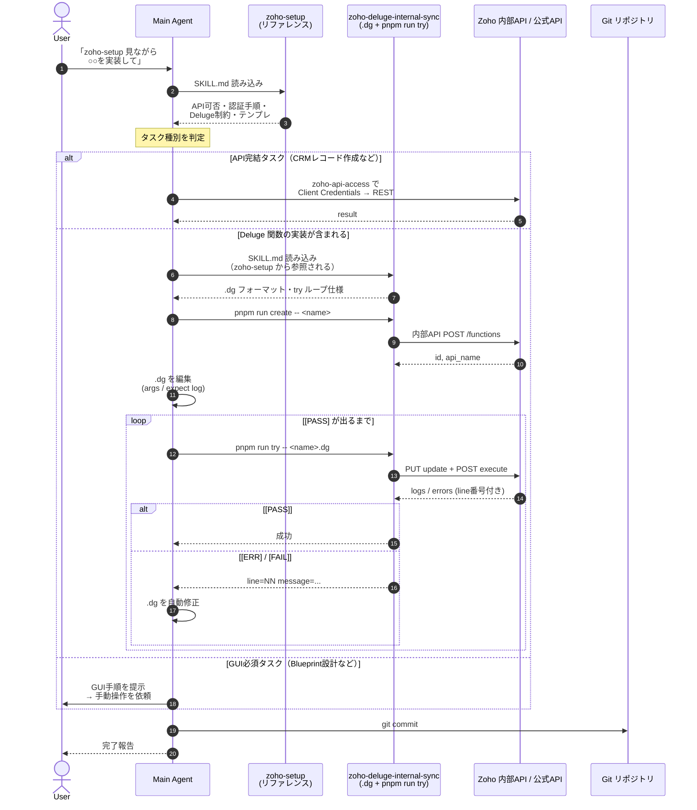
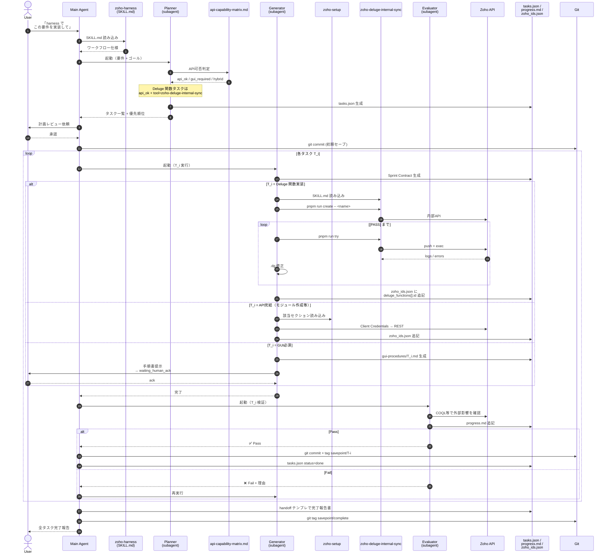
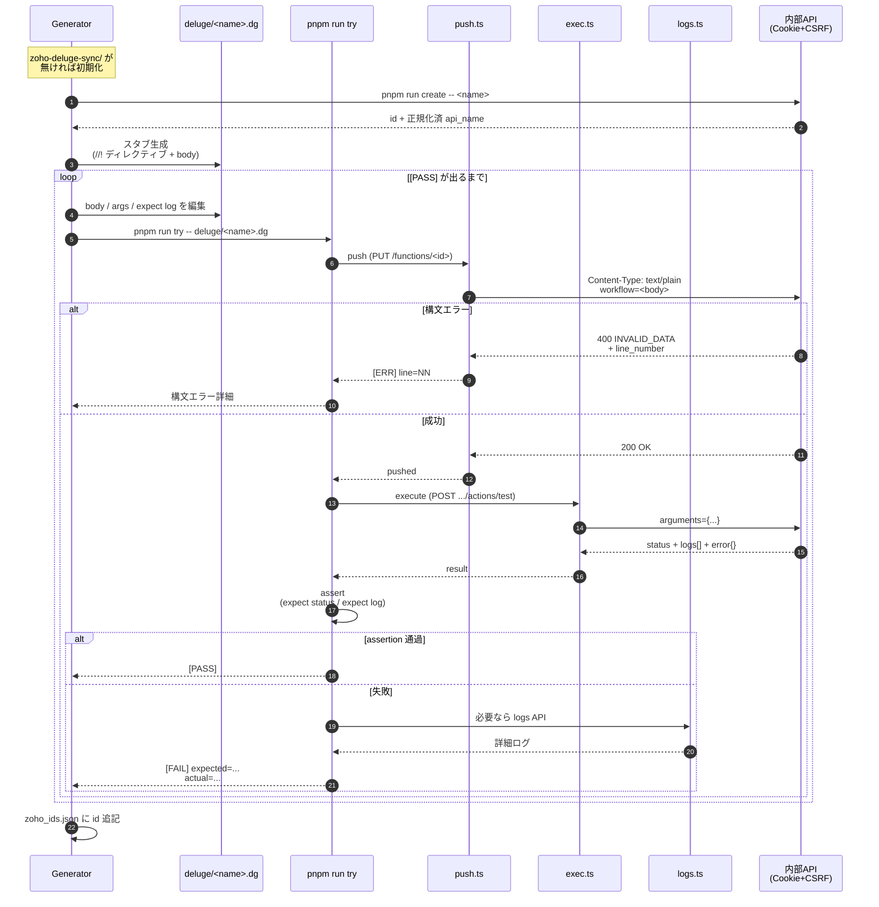
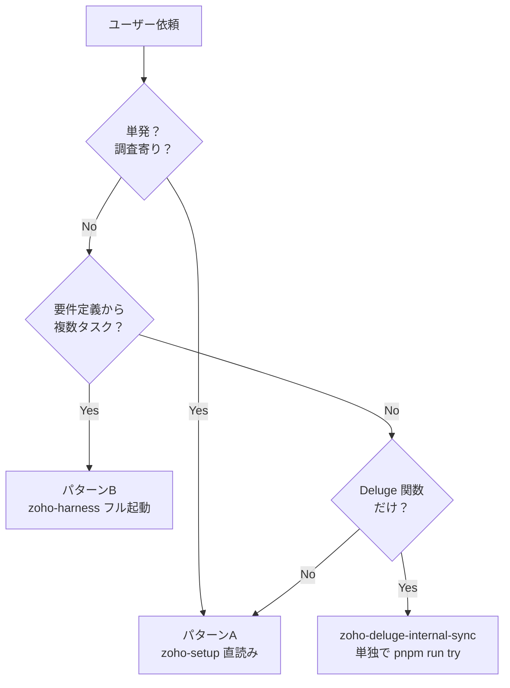

＃ Zoho 実装フロー — zoho-setup / zoho-harness 起動時のシーケンス

「Zsetup を見ながらやって」「Harness で進めて」と依頼されたときに、内部で
何がどの順番で動くのかをシーケンス図で整理したもの。

スキル間の役割分担:

| スキル | 担当 |
|---|---|
| `zoho-setup` | 個別サービスの **技術リファレンス**（CRM/Creator/Books/...の API 仕様、Deluge 制約、認証手順） |
| `zoho-harness` | **オーケストレーション**（タスク分解 → 実装 → 検証 → セーブポイント） |
| `zoho-deluge-internal-sync` | Deluge 関数の **CRUD + 実行 + ログ取得** を内部 API + `pnpm run try` で完全自動化 |
| `zoho-api-access` | 公式 REST API（Client Credentials Flow）の認証ヘルパー |

---

## パターン A: 「zoho-setup を見ながらやって」と言われたとき

軽量フロー。Planner / Evaluator は介在せず、Main Agent が直接リファレンスを読みながら実装する。
**単発タスク**・**調査寄り**・**短時間で終わる作業**向け。

**特徴**:
- Planner / Evaluator は呼ばない（Main が直接判断）
- Sprint Contract / tasks.json は作らない
- 軽い・速い／ただし複数タスクの統制は弱い

---

## パターン B: 「zoho-harness で進めて」と言われたとき

フルオーケストレーション。複数タスク・要件定義から一気通貫で実装する場合に使用。
**Planner / Generator / Evaluator** の 3 サブエージェントが順次起動し、状態は
`tasks.json` / `progress.md` / `next.md` / `artifacts/zoho_ids.{env}.json` に永続化される。

**特徴**:
- Planner が **api-capability-matrix.md** を見て Deluge タスクを `api_ok` と判定
  → Generator が `zoho-deluge-internal-sync` を呼び出す
- Evaluator が独立コンテキストで **3 レベル検証**（Record / Field / Workflow）
- 各タスク完了で git tag による **セーブポイント**
- 割り込み発生時は handoff テンプレで状態を退避 → 別セッションで復帰可能

---

## パターン C: パターン B の中で Deluge 関数タスクだけを抜き出した詳細

Generator の中で `pnpm run try` がどう回るかを詳しく見たいとき用。

---

## どちらを使うか — 判断フロー

| ケース | 使うパターン |
|---|---|
| 「CRM のフィールド1個追加して」 | A（zoho-setup 直読み） |
| 「この Lead → Contact 関数を作って」 | C（Deluge スキル単独） |
| 「業務フロー全体を要件定義から実装して」 | B（harness フル起動） |
| 「Books の請求書 API の仕様教えて」 | A の調査モード |
| 「先週中断したやつの続き」 | B（harness が tasks.json から復帰） |

---

## 状態ファイル早見表（パターン B のみ）

| ファイル | 生成者 | 用途 |
|---|---|---|
| `tasks.json` | Planner | タスクキュー・進捗 |
| `progress.md` | 全エージェント（追記） | 作業ログ |
| `next.md` | 直前エージェント | 次アクション |
| `contracts/sprint-T{id}.md` | Planner | 着手前合意 |
| `gui-procedures/T{id}-*.md` | Generator | GUI手順書（gui_required時） |
| `artifacts/zoho_ids.{env}.json` | Generator | 作成済みリソースID（含 deluge_functions） |
