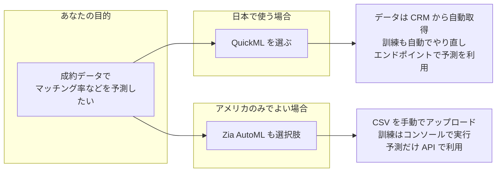
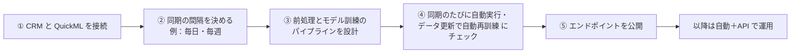

# Zoho Catalyst AutoML 成約データ学習リサーチ

**依頼元**: 宮村佳祐 → 泉田幸太郎  
**日付**: 2026-02-09  
**目的**: 成約データの学習・教師データ／成功データの格納・分析に [Zoho Catalyst AutoML](https://catalyst.zoho.com/automl.html) を利用できるか調査する。

---

## 用語の整理：ここで言う AutoML とは / QuickML との違い

本リサーチで「AutoML」と言っているのは、**Zoho Catalyst の「Zia Services」に含まれる「Zia AutoML」**（Catalyst Zia AutoML）のことです。QuickML とは**別のサービス**です。

| 観点 | **Zia AutoML**（本リサーチの対象） | **QuickML** |
|------|-----------------------------------|-------------|
| **場所** | Catalyst コンソール → **Zia Services** → AutoML | Catalyst コンソール → **QuickML** |
| **制御の度合い** | **最小限**。アルゴリズム選択・前処理・モデル管理は Zia が自動で実施 | **手動で細かく制御**。前処理・変換、アルゴリズム選択、パイプライン設計をノーコードで自分で組む |
| **データ投入** | CSV を File Store から選択 or 直接アップロード | データコネクタ（Zoho CRM 等）やファイルアップロードでデータセットをインポート |
| **モデル作成** | データセット＋ターゲット列指定 → 「Train Model」で一括訓練 | パイプライン（Data Pipeline / ML Pipeline）をビルダーで組み、実行してモデル作成 |
| **主な対象** | ML 未経験者・とにかく手軽に予測したい場合 | データエンジニア・ML チーム（設計の自由度が欲しい場合） |
| **API** | 訓練はコンソールのみ。**予測のみ** API/SDK で呼び出し可能 | エンドポイントを開発/本番で発行し、REST API や SDK で呼び出し |

- **AutoML** = 複雑な訓練プロセスに**関与せず**、データを渡せば予測モデルが得られる「自動化」型。
- **QuickML** = 前処理・アルゴリズム・パイプラインを**自分で選んで**、構築〜デプロイ〜監視まで一通りやる「制御重視」型。

車の価格予測チュートリアル（Upload Dataset など）は **QuickML** のドキュメントであり、本リサーチで扱った「CSV → ターゲット指定 → Train Model → 予測API」の流れは **Zia AutoML** のものです。混同しないよう、成約データ学習の文脈では「**Zia AutoML**」と明示してあります。

---

## 結論（サマリ）

| 項目 | 可否 | 備考 |
|------|------|------|
| 学習データの格納 | ✅ 可能 | CSVで格納。File Store または直接アップロード |
| 教師データ・成功データの分析 | ✅ 可能 | ターゲット列＝「予測したい結果」（成約有無・金額等）、それ以外＝特徴量として学習に利用 |
| モデル作成・訓練 | ⚠️ コンソールのみ | **APIでは不可**。Catalyst コンソールでデータセット選択→ターゲット指定→訓練まで実施 |
| 予測（Prediction） | ✅ API/SDK対応 | 訓練済みモデルIDでアプリから予測呼び出し可能 |
| データセンター制限 | ⚠️ 要確認 | **EU / AU / IN / CA では AutoML 非提供**。US のみの可能性あり |

**成約データを「教師データ＋成功データ」として扱うことは可能。**  
データをCSVで用意し、コンソールでモデルを作成・訓練し、アプリ側では予測APIのみ呼び出す運用が現実的。

---

## 図で見る流れ（非エンジニア向け）

以下は、仕組みを直感的に理解するための図です。

### 図1：Zia AutoML と QuickML、どちらを選ぶか



- **QuickML** = 日本（JP）でも使える。データを CRM に書けばあとは自動で取り込み・訓練まで回る。
- **Zia AutoML** = 地域制限あり（US 等）。データは CSV で都度アップロード、訓練は画面操作が必要。

---

### 図2：成約データの「教師データ」と「成功データ」の関係

```mermaid
flowchart LR
  subgraph 元データの例
    direction TB
    T1[地域]
    T2[条件・担当者など]
    T3[成約したか・成約金額]
  end

  subgraph 教師データ（ヒント）
    T1
    T2
  end

  subgraph 成功データ（正解）
    T3
  end

  教師データ --> M[機械学習モデル]
  成功データ --> M
  M --> Y[予測結果\n例：この案件は成約しそう 80%]
```

- **教師データ** = 地域・条件・担当者など「ヒントになる情報」。モデルがこれを見てパターンを学ぶ。
- **成功データ** = 「成約したか」「成約金額」など「正解」。モデルは「ヒントと正解」の対応を学習し、新しい案件の予測をする。

---

### 図3：QuickML で「ほぼ GUI なし」になる流れ（初回設定後）

```mermaid
flowchart TB
  subgraph 日々の業務（ここだけ人が触る）
    U[成約・案件データを\nCRM に登録・更新]
  end

  subgraph 自動で動く部分
    S[QuickML が定期で\nCRM からデータを取得]
    P[前処理・モデル訓練を自動実行]
    E[予測用のエンドポイントが更新される]
  end

  subgraph アプリ側の自動化
    API[紹介メール送信・\nマッチング率表示など]
  end

  U -->|同期間隔ごと| S
  S --> P
  P --> E
  E -->|API で呼び出し| API
```

| 段階 | 誰が何をするか |
|------|----------------|
| **日々の業務** | いつも通り CRM に成約・案件を登録するだけ。 |
| **自動で動く** | QuickML が決まった間隔でデータを取り、前処理・モデル訓練まで自動で実行。 |
| **アプリ側** | 予測エンドポイントを API で呼び、紹介メール送信やマッチング率表示に使う。 |

初回だけ「CRM と QuickML の接続」「パイプラインの設計」「エンドポイントの公開」を画面で設定すれば、あとは上記の流れで自動化されます。

---

### 図4：初回設定でやること（1回だけ）



- ①〜⑤ は QuickML の画面で一度だけ行う設定です。
- 設定後は、図3の「自動で動く部分」と「アプリ側の自動化」だけで運用できます。

---

## 1. 学習データの格納

### 1.1 データ形式

- **形式**: **CSV のみ**
- **アップロード方法**:
  1. **PCから直接アップロード** → その際、Catalyst の **File Store** のいずれかのフォルダに保存する必要あり
  2. **既存の File Store 内の CSV を選択**（事前に別手段でアップロードしておく）

### 1.2 サイズ・ストレージ

- PCからのアップロード: **ファイルサイズ上限なし**（ドキュメント記載）
- 保存先は File Store のため、**File Store の容量制限**が適用される  
  - 開発環境: 1 GB/プロジェクト  
  - 本番: 上限なし（ドキュメント上）
- File Store への CSV アップロードは **REST API / SDK（Python, Node 等）で可能**（Upload File in a Folder 等）。  
  → **成約データを定期エクスポート → API で File Store に CSV を上げる**といった自動化は可能。

### 1.3 成約データの扱い

- 成約履歴（案件・担当者・地域・条件・成約有無・成約金額 など）を **1レコード1件** の形で CSV にまとめれば、そのまま「学習データ」として格納できる。
- このCSVを AutoML の「データセット」としてコンソールで選択し、モデル訓練に使う。

---

## 2. 教師データ・成功データの分析（ターゲット列の考え方）

AutoML では「**ターゲット列（Target）**」＝予測したい列を1つ選ぶ。これが「成功データ／結果」に相当する。

### 2.1 ターゲットに選べる型

- **数値（Numerical）** → **回帰（Regression）** モデル  
  - 例: 成約金額、成約確率スコア
- **カテゴリ（Binary / Multi-class）** → **分類（Classification）** モデル  
  - 二値: 成約/未成約、紹介した/していない など  
  - 多値: 成約ランク、紹介ステータス など

※ 日付・文字列のみの列はターゲットに不可（特徴量としては日付は利用可）。

### 2.2 教師データ・成功データの対応

- **成功データ（成約データ）**  
  → ターゲット列に「成約有無」「成約金額」などを設定すれば、その列が「正解ラベル／正解値」として扱われる。
- **教師データ（特徴量）**  
  → ターゲット以外の列（地域、条件、担当者属性、案件属性など）がそのまま「入力特徴」として学習に使われる。  
  - 列の選択・除外はコンソールで可能（欠損率・ターゲットとの相関などを見て除外推奨）。

つまり、**「教師データ（特徴）」＋「成功データ（成約結果）」を1つのCSVにまとめ、ターゲット列だけ成約関連にすれば、そのまま分析可能。**

### 2.3 訓練の仕組み

- データの **80% で訓練**、**20% で検証**（自動）。
- ターゲット列の型に応じて、回帰／二値分類／多値分類のいずれかが自動選択される。
- 訓練後、**評価レポート**（精度・F1・Precision/Recall、回帰の場合は RMSE/MAE 等）と **Feature Importance** が確認できる。

---

## 3. モデル作成・訓練はコンソールのみ（API 不可）

公式ドキュメントより:

- **モデルの作成・設定・訓練は Catalyst コンソールでしか行えない。**
- 「Create, configure, or train a model using APIs」は **できない** と明記されている。

### 運用イメージ

1. **データ準備**: 成約データを CSV にまとめる（手動エクスポート or バッチで File Store にアップロード）。
2. **コンソール作業**:  
   Zia Services → AutoML → Create Model →  
   データセット（CSV）選択 → ターゲット列選択 → 学習に使う列選択 → Train Model。
3. **アプリ側**: 訓練完了後、発行される **Model ID** を使って、**予測のみ** API/SDK で実行。

成約データが更新されたら、**新しいCSVで同じ手順で「新しいモデル」を訓練**し、気に入ったモデルを本番の Model ID として使う、という運用になる。

---

## 4. 予測（Prediction）は API / SDK で利用可能

訓練済みモデルに対しては、アプリから **予測だけ** API/SDK で呼び出せる。

### 4.1 利用方法

- **REST API**: Project ID と Model ID を指定し、入力列を JSON で送る。
- **SDK**: Java, Node.js, Python, Android, iOS, Flutter などで `Zia` の AutoML メソッドを利用。

例（Python）:

```python
zia = app.zia()
result = zia.auto_ml(
    modelId,
    {
        "column_1": "value1",
        "column_2": "value2",
        # モデルが要求する全列をキー・値で渡す
    },
)
```

- 分類モデル: クラスごとの確率（％）などが返る。
- 回帰モデル: 予測値（1数値）が返る。

### 4.2 注意

- 入力は「訓練時に使った列」と整合している必要がある。
- 未指定の列は Zia がデフォルトで埋めるが、**精度に影響**するため、可能な限りすべて渡すことが推奨されている。

---

## 5. データセンター制限（EU / AU / IN / CA）

- ドキュメントには **「AutoML is currently unavailable in EU, AU, IN, and CA data centers」** とあり、**US のみ** で利用可能な可能性が高い。
- 日本や EU など他リージョンの Catalyst プロジェクトでは、利用前に Catalyst のデータセンターと AutoML 提供状況の確認が必要。

---

## 6. EL-DH 様フィードバックとの接続（マッチング率・紹介メール導線）

- **マッチング率の背景・率が高い理由をテキストで表示**  
  - AutoML の **Feature Importance** や評価レポートをアプリ側で参照する公式APIは、ドキュメント上は明示されていない。  
  - コンソールで確認した内容を別ストア（Data Store 等）に書き出し、ウィジェットで表示するような**間接的な導線**は検討の余地あり（泉田さん案の「リオスさんでやったレポート出力」と同様の考え方）。
- **紹介メール送信までの導線・紹介したかどうかの確認**  
  - 予測結果（マッチング率など）をトリガーに、**メール送信やCRM更新**は、AutoML の外の実装（Catalyst 関数＋Zoho CRM / メールAPI 等）で対応可能。  
  - 「紹介したかどうか」は CRM のフィールドや別テーブルで管理し、成約データに「紹介有無」を列として含めれば、次の学習で「紹介有無」をターゲットにしたモデルも作れる（教師データ・成功データの拡張）。

---

## 7. 成功データ・教師データの自動投入と GUI 最小化（QuickML）

**「成功データ・教師データを自動でここに書き込む」「GUI の Catalyst 操作をなくす」** は、**QuickML** を使うとかなり実現できます。Zia AutoML はデータ投入もモデル訓練もコンソール依存が大きいため、以下は QuickML 前提です。

### 7.1 データの「自動で書き込む」の意味

QuickML には **「QuickML に直接 API で行を追加する」** ような API はありません。代わりに、

- **データの置き場所** = **Zoho CRM** または **Catalyst Data Store**（あるいは Zoho Creator 等のコネクタ対応ソース）
- **書き込み** = いつも通り **CRM に成約・案件データを登録・更新**する（ワークフロー／Catalyst 関数／手動など）
- **QuickML 側** = **データコネクタ**でそのソースを指定し、**Periodic Sync（定期同期）** を有効にする

と、**指定した間隔で QuickML が自動的にデータを取りにいく**形になります。  
つまり「成功データ・教師データを自動でここ（QuickML）に書き込む」= **CRM や Data Store に書き、QuickML が同期で取りに来る**運用にすると、GUI で CSV アップロードする必要はなくなります。

### 7.2 自動化の流れ（Periodic Sync の公式仕様）

公式ドキュメント [Periodic Sync](https://docs.catalyst.zoho.com/en/quickml/help/periodic-sync) より:

| 段階 | 内容 | 自動化の有無 |
|------|------|--------------|
| **1. データソース** | Zoho CRM / Catalyst Data Store / Creator 等をデータコネクタで接続 | 初回のみ GUI で接続設定 |
| **2. 同期間隔** | **Sync Frequency** で日次・週次・月次・年次、または 6 時間〜23:59 時間のカスタム間隔を指定 | ✅ **定期で自動同期** |
| **3. Data Pipeline** | 同期済みデータを前処理するパイプラインを作成 | 初回のみ GUI で設計。オプション **「Execute pipeline after periodic sync」** を有効にすると **同期のたびにパイプラインが自動実行** |
| **4. ML Pipeline** | 前処理済みデータでモデルを訓練するパイプラインを作成 | 初回のみ GUI で設計。オプション **「Retrain model when the dataset is updated」** を有効にすると **データ更新時にモデルを自動再訓練** |
| **5. エンドポイント** | 訓練済みモデルを本番公開 | 初回のみ GUI で作成。以降は **REST API / SDK で呼び出し** → 紹介メール・CRM 更新などはこちらで自動化 |

このように、**初回の「コネクタ・パイプライン・エンドポイント」の設計だけ GUI** で行い、その後は

- 成功データ・教師データ → **CRM / Data Store に書き足すだけ**（既存の業務フロー or API で自動化可）
- データの取り込み → **Periodic Sync で自動**
- 前処理・モデル再訓練 → **「同期後にパイプライン実行」「データ更新時に再訓練」で自動**
- 予測の利用 → **エンドポイントを API で呼ぶ**（完全に自動化可能）

となるため、**日常運用で Catalyst の GUI を触る必要はほぼなくなります**。

### 7.3 まとめ：GUI がなくなるのはどこまでか

| 操作 | GUI が必要なタイミング |
|------|------------------------|
| 成功データ・教師データの「書き込み」 | **不要**。CRM / Data Store に書けば QuickML が同期で取得。 |
| データの QuickML への取り込み | **不要**（Periodic Sync で自動）。 |
| 前処理・モデル訓練 | **不要**（オプション有効で自動実行・自動再訓練）。 |
| 予測の利用（紹介メール・マッチング率表示など） | **不要**（エンドポイントを API で呼ぶ）。 |
| **データコネクタの初回設定・パイプラインの初回設計・エンドポイントの初回作成** | **必要**（一度やっておけば、あとは自動＋API で完結）。 |

**ベストに近い形** = 初回だけ QuickML の GUI で「データソース接続 → 同期間隔 → Data/ML パイプライン（上記オプション ON）→ エンドポイント公開」を設定し、以降は CRM / Data Store に成約データを書き足す運用と、エンドポイント呼び出しの自動化だけで回す、という形です。

---

## 8. 参照リンク

| 内容 | URL |
|------|-----|
| AutoML 概要 | https://catalyst.zoho.com/automl.html |
| 実装手順（データセット〜訓練〜予測） | https://docs.catalyst.zoho.com/en/zia-services/help/automl/implementation |
| キーコンセプト（モデル型・ターゲット・評価） | https://docs.catalyst.zoho.com/en/zia-services/help/automl/key_concepts |
| API リファレンス（認証・リクエスト形式含む） | https://docs.catalyst.zoho.com/en/api/code-reference/zia-services/automl |
| Python SDK（Zia AutoML） | https://docs.catalyst.zoho.com/en/sdk/python/v1/zia-services/automl |
| File Store（Upload File in a Folder） | https://docs.catalyst.zoho.com/en/api/code-reference/cloud-scale/file-store/upload-file-in-a-folder |
| QuickML データコネクタ（Zoho Apps） | https://docs.catalyst.zoho.com/en/quickml/help/data-connectors/zoho-apps/ |
| QuickML Periodic Sync | https://docs.catalyst.zoho.com/en/quickml/help/periodic-sync |

---

## 9. 次のアクション案

1. **PoC**: 成約データのサンプルCSVを用意し、Catalyst コンソールでモデルを1本作成→予測APIでマッチング率相当の出力を確認する。
2. **データフロー（Zia AutoML の場合）**: CRM → 成約データ抽出 → CSV 生成 → File Store アップロード（手動 or Catalyst 関数）の流れを設計する。
3. **データフロー（QuickML の場合）**: CRM または Data Store をデータコネクタで接続 → Periodic Sync 設定 → 「Execute pipeline after periodic sync」「Retrain model when the dataset is updated」を有効化し、成功データ・教師データの追加は CRM/Data Store に書くだけの運用を設計する。
4. **リージョン**: 利用予定の Catalyst プロジェクトが US 以外の場合は Zia AutoML が使えないため、**QuickML**（JP 等で利用可）を前提に検討する。
5. **紹介導線・レポート**: マッチング率の理由表示・紹介メール・紹介有無の管理は、予測エンドポイントと連携する形で CRM / Catalyst 関数側で設計する。

以上。
