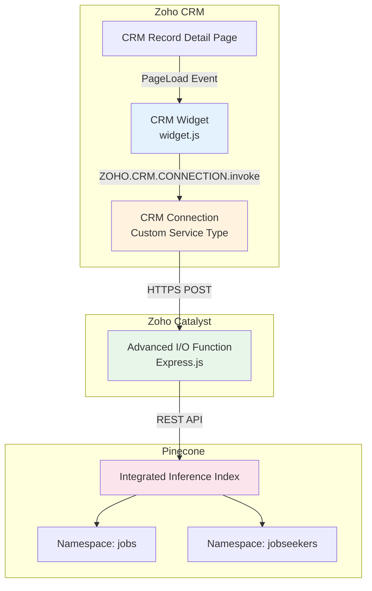
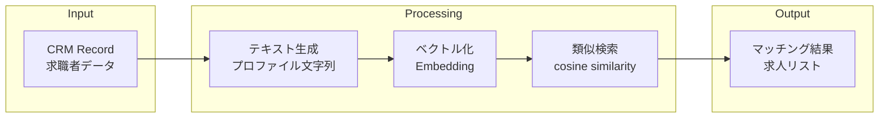
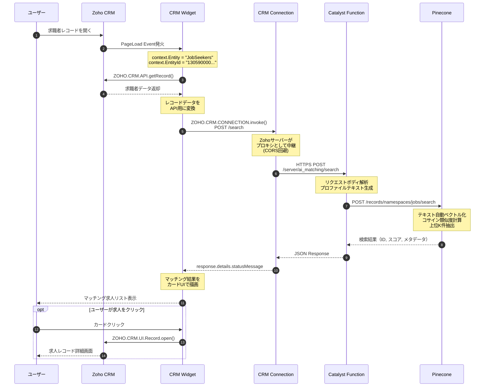
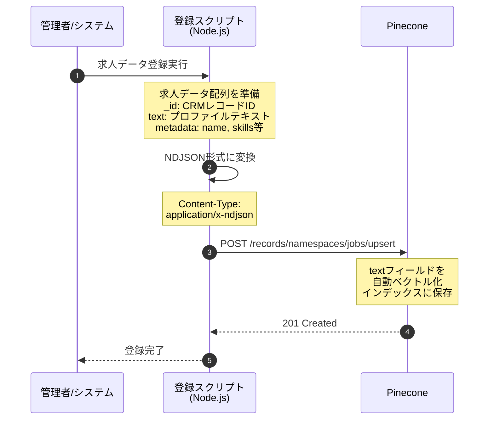
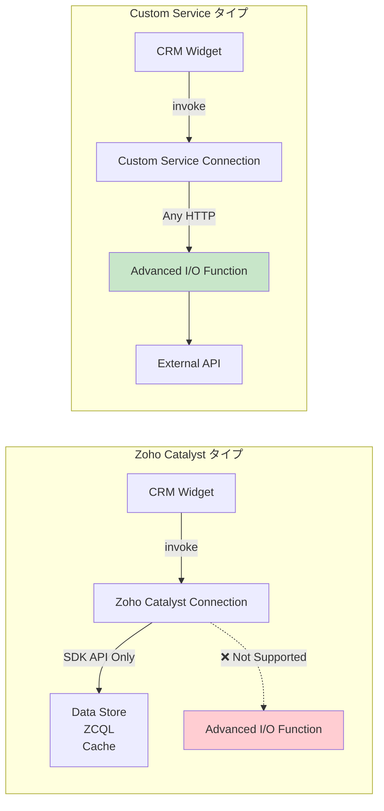
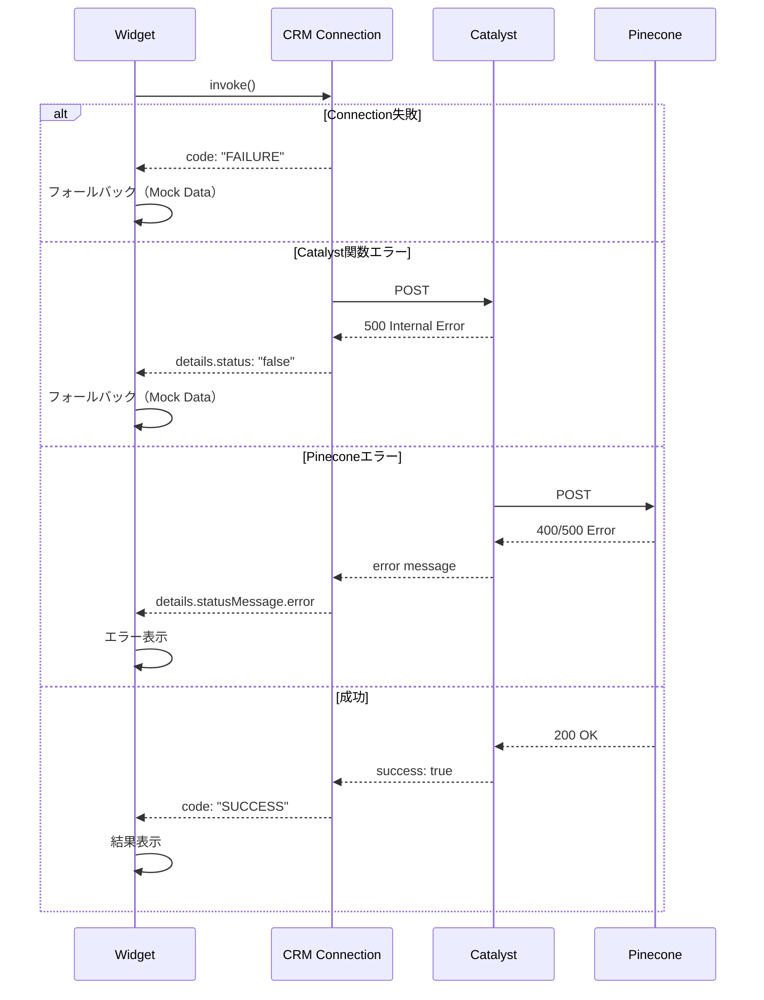

# CRM × AI マッチングシステム アーキテクチャ仕様書

## 1. システム概要

### 1.1 目的
Zoho CRM上で求職者レコードを表示した際に、Pineconeベクトルデータベースを用いたセマンティック検索により、最適な求人をリアルタイムでマッチング・表示するシステム。

### 1.2 主要コンポーネント

| コンポーネント | 技術 | 役割 |
|---------------|------|------|
| CRM Widget | JavaScript + Zoho JS SDK | UI表示、ユーザーインタラクション |
| CRM Connection | Zoho CRM Connection (Custom Service) | APIプロキシ、CORS回避 |
| Catalyst Function | Node.js + Express.js | ビジネスロジック、API中継 |
| Pinecone | Integrated Inference | ベクトル化、類似検索 |

---

## 2. アーキテクチャ図

### 2.1 コンポーネント構成



### 2.2 データフロー概要



---

## 3. シーケンス図

### 3.1 マッチング検索フロー



### 3.2 データ登録フロー（Upsert）



---

## 4. データ構造

### 4.1 CRM → Catalyst リクエスト

```json
{
  "record_id": "13059000001662463",
  "record": {
    "name": "鈴木一郎",
    "skills": "Java, Spring Boot, MySQL, AWS",
    "experience_years": 7,
    "desired_position": "テックリード",
    "desired_location": "大阪",
    "desired_salary": 800,
    "self_pr": "大規模システムの設計・開発経験が豊富..."
  },
  "record_type": "jobseeker",
  "top_k": 5
}
```

### 4.2 Catalyst → Pinecone 検索リクエスト

```json
{
  "query": {
    "inputs": {
      "text": "氏名: 鈴木一郎\nスキル: Java, Spring Boot, MySQL, AWS\n経験年数: 7年\n希望職種: テックリード\n希望勤務地: 大阪\n希望年収: 800万円\n自己PR: 大規模システムの設計..."
    },
    "top_k": 5
  },
  "fields": ["type", "name", "skills", "location", "salary", "position"]
}
```

### 4.3 Pinecone → Catalyst 検索レスポンス

```json
{
  "result": {
    "hits": [
      {
        "_id": "13059000001662476",
        "_score": 0.87,
        "fields": {
          "type": "job",
          "name": "テックリード",
          "skills": "Java, Spring Boot, MySQL, AWS",
          "location": "大阪",
          "salary": "700-1000",
          "position": "テックリード"
        }
      },
      {
        "_id": "13059000001662474",
        "_score": 0.72,
        "fields": {
          "type": "job",
          "name": "シニアバックエンドエンジニア",
          "skills": "Python, AWS, Kubernetes, Go",
          "location": "東京（リモート可）",
          "salary": "600-900",
          "position": "バックエンドエンジニア"
        }
      }
    ]
  }
}
```

### 4.4 Catalyst → Widget レスポンス

```json
{
  "success": true,
  "record_id": "13059000001662463",
  "matches": [
    {
      "id": "13059000001662476",
      "score": 87.0,
      "metadata": {
        "type": "job",
        "name": "テックリード",
        "skills": "Java, Spring Boot, MySQL, AWS",
        "location": "大阪",
        "salary": "700-1000",
        "position": "テックリード"
      }
    }
  ]
}
```

### 4.5 CRM Connection レスポンス構造

```json
{
  "code": "SUCCESS",
  "details": {
    "statusMessage": {
      "success": true,
      "record_id": "13059000001662463",
      "matches": [...]
    },
    "status": "true"
  },
  "message": "Connection invoked successfully",
  "status": "success"
}
```

**注意**: Catalyst関数のレスポンスは `response.details.statusMessage` に格納される

---

## 5. Pinecone データ構造

### 5.1 Namespace設計

| Namespace | 内容 | 検索元 |
|-----------|------|--------|
| `jobs` | 求人データ | 求職者から検索 |
| `jobseekers` | 求職者データ | 求人から検索 |

### 5.2 レコードフォーマット（NDJSON）

```
{"_id":"13059000001662474","text":"求人タイトル: シニアバックエンドエンジニア 必要スキル: Python, AWS...","type":"job","name":"シニアバックエンドエンジニア","skills":"Python, AWS, Kubernetes, Go","location":"東京（リモート可）","salary":"600-900","position":"バックエンドエンジニア"}
{"_id":"13059000001662475","text":"求人タイトル: フロントエンドエンジニア...","type":"job","name":"フロントエンドエンジニア",...}
```

### 5.3 フィールド定義

| フィールド | 型 | 用途 |
|-----------|-----|------|
| `_id` | string | CRMレコードID（必須） |
| `text` | string | Embedding対象テキスト（必須） |
| `type` | string | "job" or "jobseeker" |
| `name` | string | 求人名または氏名 |
| `skills` | string | スキルセット |
| `location` | string | 勤務地/希望勤務地 |
| `salary` | string | 年収範囲/希望年収 |
| `position` | string | 職種 |

---

## 6. CRM Connection 詳細

### 6.1 Connection種別の違い



### 6.2 Custom Service Connection 設定

| 設定項目 | 値 | 説明 |
|---------|-----|------|
| Service Name | `catalyst_matching_api` | 任意の識別名 |
| Service URL | `https://{project}.development.catalystserverless.jp` | Catalyst関数のベースURL |
| Auth Type | API Key | 認証方式 |
| Param Type | Header | APIキーの送信方法 |
| Param Key | `X-Api-Key` | ヘッダー名 |
| Param Value | (任意の値) | Catalyst側がoptionalなら何でもOK |

---

## 7. エラーハンドリング

### 7.1 エラーフロー



---

## 8. セキュリティ考慮事項

### 8.1 認証・認可

| レイヤー | 認証方式 | 備考 |
|---------|---------|------|
| CRM Widget | Zoho Session | CRMにログイン済みのユーザーのみアクセス可 |
| CRM Connection | OAuth 2.0 | Zohoが自動管理 |
| Catalyst Function | Optional | CRM Connection経由のため追加認証不要 |
| Pinecone | API Key | 環境変数で管理 |

### 8.2 データ保護

- Pinecone API KeyはCatalyst環境変数に保存（コードに含めない）
- CRMレコードIDのみPineconeに保存（個人情報は最小限）
- HTTPS通信により転送中のデータを暗号化

---

## 9. パフォーマンス特性

| 処理 | 想定時間 | 備考 |
|------|---------|------|
| Widget初期化 | ~500ms | JS SDK読み込み |
| CRMレコード取得 | ~200ms | ZOHO.CRM.API |
| Connection呼び出し | ~300ms | プロキシオーバーヘッド |
| Catalyst処理 | ~100ms | テキスト生成 |
| Pinecone検索 | ~200ms | ベクトル化+検索 |
| **合計** | **~1.3s** | 初回表示まで |

---

## 10. 今後の拡張ポイント

1. **自動同期**: CRMワークフローでレコード作成時にPinecone登録
2. **双方向検索**: 求人側からも求職者を検索
3. **フィルタリング**: 勤務地・年収範囲でのフィルタ
4. **履歴管理**: マッチング履歴の記録・分析
5. **本番デプロイ**: Catalyst Production環境への移行

---

*作成日: 2026-02-01*
*バージョン: 1.0*
